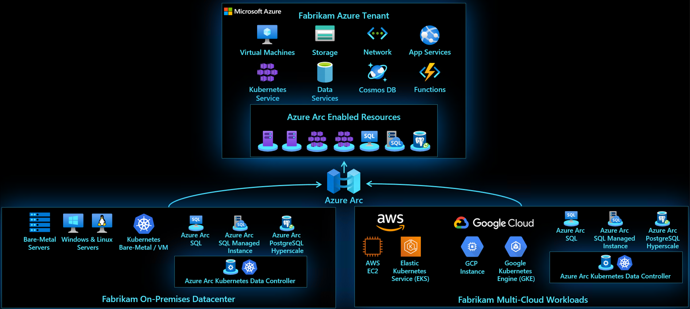

# Azure Arc Overview

For customers who want to simplify complex and distributed environments across on-premises, edge and multicloud, [Azure Arc](https://azure.microsoft.com/en-us/services/azure-arc/) enables deployment of Azure services anywhere and extends Azure management to any infrastructure.

* **Organize and govern across environments** - Get databases, Kubernetes clusters, and servers sprawling across on-premises, edge and multicloud environments under control by centrally organizing and governing from a single place.

* **Manage Kubernetes Apps at scale** - Deploy and manage Kubernetes applications across environments using DevOps techniques. Ensure that applications are deployed and configured from source control consistently.

* **Run data services anywhere** - Get automated patching, upgrades, security and scale on-demand across on-premises, edge and multicloud environments for your data estate.

# Azure Arc Story Time

Fabrikam Global Manufacturing runs workloads on different hardware, across on-premises datacenters, multiple public clouds, with Microsoft Azure being the main one as well as IoT workloads deployed on the edge. Workloads include very diverse services and are based on either virtual machines, managed Platforms-as-a-Service (PaaS) services as well as container-based applications. 
 
As mentioned, Fabrkam’s R&D teams are well-invested in containerized workloads for their modernized applications and as a result, they are using Kubernetes as their container orchestration platform, deployed both as a self-managed Kubernetes in their on-premises environments as well as a managed Kubernetes deployments in the cloud.

As part of their cloud-native practices with Azure being it’s main hyper-scale cloud, Fabrkam’s  operations teams are standardized and taking advantage of Azure Resource Manager (ARM) capabilities such as (but not limited to) tagging, Azure Monitoring for VMs and containers, logging and telemetry, policy and government, Desired State Configuration (DSC), Update Management, Change Tracking, Inventory management,etc. 

These practices and techniques are already well established for Azure-based workloads Fabrkam are using such as Azure VMs, Azure Kubernetes Service (AKS), Azure SQL, and many more. In order to take advantage of these well-established practices, Fabrkam are using Azure Arc to extend the ARM API’s to project and manage it’s workloads deployed outside of Azure. Once onboarded, Azure Arc projects resources as first-class citizens in Azure which can then take advantage of ARM capabilities mentioned above. In addition, they are able to guarantee Kubernetes deployments and app consistency through GitOps-based configuration for their Kubernetes clusters in Azure, other clouds and on-premises. 
 
With Azure Arc, Fabrikam are able to project resources and register them into Azure Resource Manager independently of where they run, so they have a single control plane and extend those cloud-native operations and governance beyond Azure.

  

# Azure Arc "Jumpstart"

The following guides will walk you trough on how to demo and get started with Azure Arc. They are designed with a "zero to hero" approach in mind and with much automation as possible. The goal is for you to have a working Azure Arc demo environment spined-up in no time so you can focus on showing the core values of the solution.

**Disclaimer: The intention for this repo is to focus on the core Azure Arc capabilities. deployment scenarios, use-cases and ease of use. It does not focus on Azure best-practices or the other tech and OSS project being leveraged in the guides and code.**

## Azure Arc for Servers
The below deployment options are focusing on Azure Arc for Servers. It is designed to quickly spin up a server that is ready to be projected in Azure Arc and for you to start playing with it. 

**Note: For a list of supported operating systems and Azure regions, please visit the official [Azure Arc docs](https://docs.microsoft.com/en-us/azure/azure-arc/servers/overview).**

#### General

* [Connect an existing Linux server to Azure Arc](azure_arc_servers_jumpstart/docs/onboard_server_linux.md)

* [Connect an existing Windows machine to Azure Arc](azure_arc_servers_jumpstart/docs/onboard_server_win.md)

#### Vagrant

* [Deploy a local Ubuntu VM and connect it to Azure Arc using Vagrant](azure_arc_servers_jumpstart/docs/local_vagrant_ubuntu.md)

* [Deploy a local Windows 10 VM and connect it to Azure Arc using Vagrant](azure_arc_servers_jumpstart/docs/local_vagrant_windows.md)

#### Amazon Web Services (AWS)

* [Deploy an AWS EC2, Ubuntu VM and connect it to Azure Arc using Terraform](azure_arc_servers_jumpstart/docs/aws_terraform_ubuntu.md)

* [Deploy an AWS Amazon Linux 2 VM and connect it to Azure Arc using Terraform](azure_arc_servers_jumpstart/docs/aws_terraform_al2.md)

#### Google Cloud Platform (GCP)

* [Deploy a GCP, Ubuntu VM and connect it to Azure Arc using Terraform](azure_arc_servers_jumpstart/docs/gcp_terraform_ubuntu.md)

* [Deploy a GCP, Windows Server VM and connect it to Azure Arc using Terraform](azure_arc_servers_jumpstart/docs/gcp_terraform_windows.md)

#### VMware

* [Deploy a VMware vSphere, Ubuntu Server VM and connect it to Azure Arc using Terraform](azure_arc_servers_jumpstart/docs/vmware_terraform_ubuntu.md)

* [Deploy a VMware vSphere, Windows Server VM and connect it to Azure Arc using Terraform](azure_arc_servers_jumpstart/docs/vmware_terraform_winsrv.md)

#### Azure Arc for Servers - Day-2 Scenarios & Use-Cases

* [Tagging and querying server inventory across multiple clouds using Resource Graph Explorer](azure_arc_servers_jumpstart/docs/arc_inventory_tagging.md)

* [Deploying Microsoft Monitoring Agent Extension (MMA) to Azure Arc Linux and Windows VMs using Extension Management](azure_arc_servers_jumpstart/docs/arc_vm_extension_mma_arm.md)

* [Deploying Custom Script Extension to Azure Arc Linux and Windows VMs using Extension Management](azure_arc_servers_jumpstart/docs/arc_vm_extension_customscript_arm.md)

* [Deploying Microsoft Monitoring Agent Extension (MMA) to Azure Arc Linux and Windows VMs using Azure Policies](azure_arc_servers_jumpstart/docs/arc_policies_mma.md)

## Azure Arc for Kubernetes

The below deployment options are focusing on Azure Arc for Kubernetes. It is designed to quickly spin up a Kubernetes cluster that is ready to be projected in Azure Arc and for you to start playing with. 

#### General

* [Connect an existing Kubernetes cluster to Azure Arc](azure_arc_k8s_jumpstart/docs/onboard_k8s.md)

#### Azure Kubernetes Service (AKS)

* [Deploy AKS cluster and connect it to Azure Arc using Azure ARM template](azure_arc_k8s_jumpstart/docs/aks_arm_template.md)

* [Deploy AKS cluster and connect it to Azure Arc using Terraform](azure_arc_k8s_jumpstart/docs/aks_terraform.md)

#### Amazon Elastic Kubernetes Service (EKS)

* [Deploy EKS cluster and connect it to Azure Arc using Terraform](azure_arc_k8s_jumpstart/docs/eks_terraform.md)

#### Google Kubernetes Engine (GKE)

* [Deploy GKE cluster and connect it to Azure Arc using Terraform](azure_arc_k8s_jumpstart/docs/gke_terraform.md)

#### Rancher k3s

* [Deploy Rancher k3s on an Azure VM and connect it to Azure Arc using Azure ARM template](azure_arc_k8s_jumpstart/docs/rancher_k3s_azure_arm_template.md)

* [Deploy Rancher k3s on an Azure VM and connect it to Azure Arc using Terraform](azure_arc_k8s_jumpstart/docs/rancher_k3s_azure_terraform.md)

* [Deploy Rancher k3s on a VMware vSphere VM and connect it to Azure Arc using Terraform](azure_arc_k8s_jumpstart/docs/rancher_k3s_vmware_terraform.md)

#### Azure Red Hat OpenShift V4
* [Deploy Azure Redhat Openshift Cluster and connect it to Azure Arc using automation](azure_arc_k8s_jumpstart/docs/aro_script.md)

#### Azure Arc for Kubernetes - Day-2 Scenarios & Use-Cases

* [Deploy GitOps configurations and perform basic GitOps flow on AKS as an Azure Arc Connected Cluster](azure_arc_k8s_jumpstart/docs/aks_gitops.md)

* [Integrate Azure Monitor for Containers with AKS as an Azure Arc Connected Cluster](azure_arc_k8s_jumpstart/docs/aks_monitor.md)

* [Apply GitOps configurations on AKS as an Azure Arc Connected Cluster using Azure Policy for Kubernetes ](azure_arc_k8s_jumpstart/docs/aks_policy.md)

* [Deploy GitOps configurations and perform basic GitOps flow on GKE as an Azure Arc Connected Cluster](azure_arc_k8s_jumpstart/docs/gke_gitops.md)

* [Integrate Azure Monitor for Containers with GKE as an Azure Arc Connected Cluster](azure_arc_k8s_jumpstart/docs/gke_monitor.md)

* [Apply GitOps configurations on GKE as an Azure Arc Connected Cluster using Azure Policy for Kubernetes ](azure_arc_k8s_jumpstart/docs/gke_policy.md)

# Roadmap

Up-to-date roadmap for the Azure Arc scenarios to be covered can be found under [this repository GitHub Project](https://github.com/microsoft/azure_arc/projects/1).

# Contributing

This project welcomes contributions and suggestions.  Most contributions require you to agree to a
Contributor License Agreement (CLA) declaring that you have the right to, and actually do, grant us
the rights to use your contribution. For details, visit https://cla.opensource.microsoft.com.

When you submit a pull request, a CLA bot will automatically determine whether you need to provide
a CLA and decorate the PR appropriately (e.g., status check, comment). Simply follow the instructions
provided by the bot. You will only need to do this once across all repos using our CLA.

This project has adopted the [Microsoft Open Source Code of Conduct](https://opensource.microsoft.com/codeofconduct/).
For more information see the [Code of Conduct FAQ](https://opensource.microsoft.com/codeofconduct/faq/) or
contact [opencode@microsoft.com](mailto:opencode@microsoft.com) with any additional questions or comments.

Before contributing code, please see the [CONTRIBUTING](CONTRIBUTING.md) guide.

Issues, PRs and Feature Request have their own templates. Please fill out the whole template.

# Legal Notices

Microsoft and any contributors grant you a license to the Microsoft documentation and other content
in this repository under the [Creative Commons Attribution 4.0 International Public License](https://creativecommons.org/licenses/by/4.0/legalcode),
see the [LICENSE](LICENSE) file, and grant you a license to any code in the repository under the [MIT License](https://opensource.org/licenses/MIT), see the
[LICENSE-CODE](LICENSE-CODE) file.

Microsoft, Windows, Microsoft Azure and/or other Microsoft products and services referenced in the documentation
may be either trademarks or registered trademarks of Microsoft in the United States and/or other countries.
The licenses for this project do not grant you rights to use any Microsoft names, logos, or trademarks.
Microsoft's general trademark guidelines can be found at http://go.microsoft.com/fwlink/?LinkID=254653.

Privacy information can be found at https://privacy.microsoft.com/en-us/

Microsoft and any contributors reserve all other rights, whether under their respective copyrights, patents,
or trademarks, whether by implication, estoppel or otherwise.