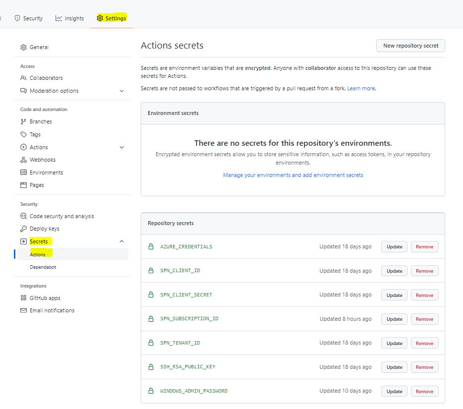
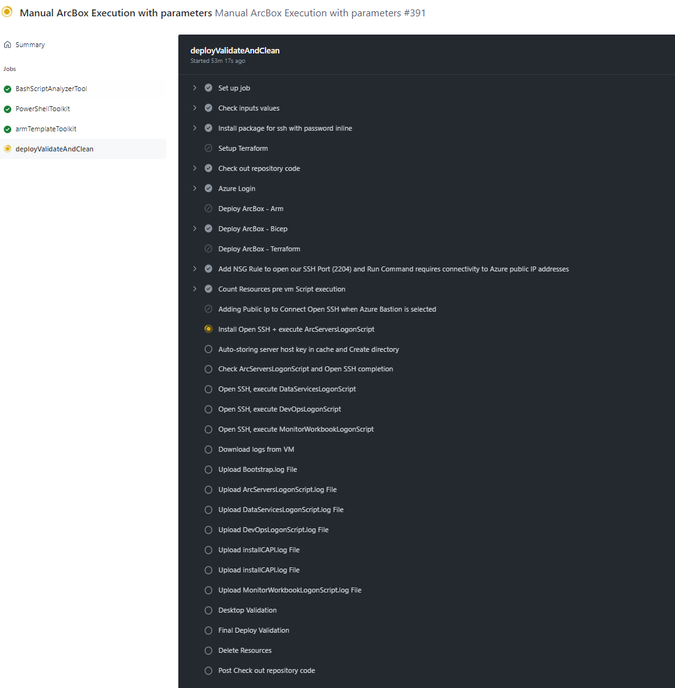
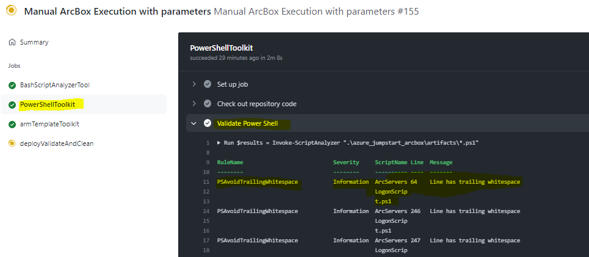
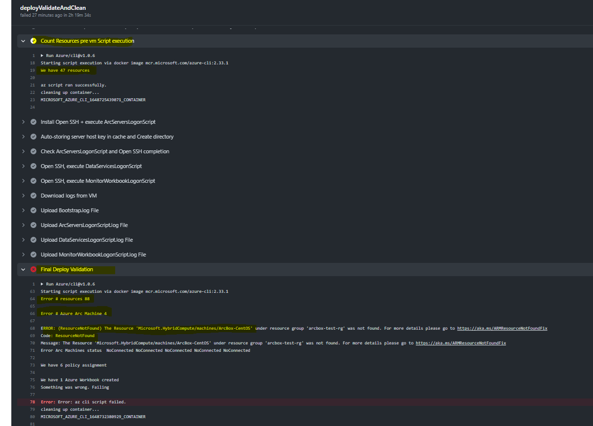
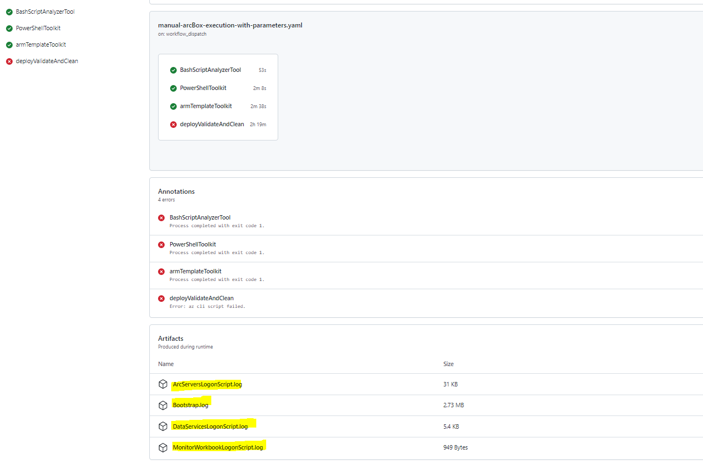

# ArcBox automatic deploy and test

The goal is to provide automation to deploy and test of the arc box scenarios.  
We decided to use [GitHub Actions](https://docs.github.com/actions).

The workflow is a manual one, you need to execute it when you consider it is proper.

## Prepare the repo

You need to have enough permission on the repo, it is true when you work on your own fork.  
First you need to create a sequence of secrets.



AZURE_CREDENTIALS is needed for the [Azure Login GitHub Action](https://github.com/marketplace/actions/azure-login#configure-deployment-credentials).  
The other variables are the secret variables defined on [Azure Arc Box deploys](https://azurearcjumpstart.io/azure_jumpstart_arcbox/).  
AZURE_CREDENTIALS Example (--sdk-auth is important):

```azurecli
az ad sp create-for-rbac -n "jumpstartArcBox" --role "User Access Administrator" --scopes /subscriptions/xxx --sdk-auth
```

See possible roles on [Azure Arc Box deploys](https://azurearcjumpstart.io/azure_jumpstart_arcbox/).

The complete json result must be inside the AZURE_CREDENTIALS secret

```json
{
  "clientId": "xxx",
  "clientSecret": "xxxx",
  "subscriptionId": "xxxx",
  "tenantId": "xxxx",
  "activeDirectoryEndpointUrl": "https://login.microsoftonline.com",
  "resourceManagerEndpointUrl": "https://management.azure.com/",
  "activeDirectoryGraphResourceId": "https://graph.windows.net/",
  "sqlManagementEndpointUrl": "https://management.core.windows.net:8443/",
  "galleryEndpointUrl": "https://gallery.azure.com/",
  "managementEndpointUrl": "https://management.core.windows.net/"
}
```

You can complete the following variables based on the same output: SPN_CLIENT_ID, SPN_CLIENT_SECRET,SPN_SUBSCRIPTION_ID, SPN_TENANT_ID.

_Note:_ The resources will be created using this account

You need to define SSH_RSA_PUBLIC_KEY (look here [Azure Arc Box deploys](https://azurearcjumpstart.io/azure_jumpstart_arcbox/) how to do it), and WINDOWS_ADMIN_PASSWORD (Any valid Azure VM password)

## Execute the workflow

We are ready, we need to go to the Action Tab and select our workflow (Manual ArcBox Execution with parameters)


Selecting **Run Workflow**, the parameters will be present.

- The first parameter is which workflow definition we are you going to use
- Flavor to be executed, so far Full, ITPro or DevOps
- Kind of deploy: ARM, Bicep or Terraform
- Which branch you are going to use to read the scripts
- Resource group name
- Location
- Name of log analytic
- Your public IP v4
- Windows VM admin username
- Choice if you like to deploy Bastion to connect to the client VM

Then you could follow the execution, and on each step there is information about what is going on.


On the file DeployTestParameters.json are defined the parameters which every flavor has to reach

## Information Generated

We take a look to the quality of the code

- Bash script by **shellcheck**
- Powershell script by **Invoke-ScriptAnalyzer**
- Arm template validation and we are generating arm from bicep script by **ARM-TTK and Pester**  
  The validations are configure to continue on error, then they will be always succeed, but you will be able to see the recommendations.




On the deploy workflow there are deploy validation that you could check



After finishing the logs from inside the vm are available



## Declaimer

We need to execute 4 script inside the VM on a full deploy to simulate what it happens at LogOn:

- ArcServersLogonScript.ps1, this script is block when execute using OpenSSH, but when we run it using [Widows Run Command](https://docs.microsoft.com/azure/virtual-machines/windows/run-command) it works.
- DataServicesLogonScript.ps1, this script is block when execute using [Widows Run Command](https://docs.microsoft.com/azure/virtual-machines/windows/run-command), so we installed and use OpenSSH to execute it
- DevOpsLogonScript.ps1, is executed using OpenSSH.
- MonitorWorkbookLogonScript.ps1, execute in both approaches.

After the incorporation of some security polices to the subscription, the [Widows Run Command](https://docs.microsoft.com/azure/virtual-machines/windows/run-command) start to fail randomly, the failure is described on the note:

"To function correctly, Run Command requires connectivity (port 443) to Azure public IP addresses. If the extension doesn't have access to these endpoints, **the scripts might run successfully but not return the results**. If you're blocking traffic on the virtual machine, you can use service tags to allow traffic to Azure public IP addresses by using the AzureCloud tag."

We were able to check from the log that the command execute correctly, but the azure cli command finish with timeout at 90 min.  

The ITPro flavor usually works and the Full flavor usually fails. We spouse it is related to the time that the police spent before applying to ClientVM. On ITPro scenario the deploy finish as soon the ClientVM finish, and not in the another case.

We added a kind or "continue on error", and we check a file generated that indicate the script finished the execution. Then it will succeed even after time out. The only secondary effect is the time increase.

[Open SSH](https://docs.microsoft.com/windows-server/administration/openssh/openssh_install_firstuse) is installed using [Widows Run Command](https://docs.microsoft.com/azure/virtual-machines/windows/run-command), and for subscription security polices was moved to port 2204
