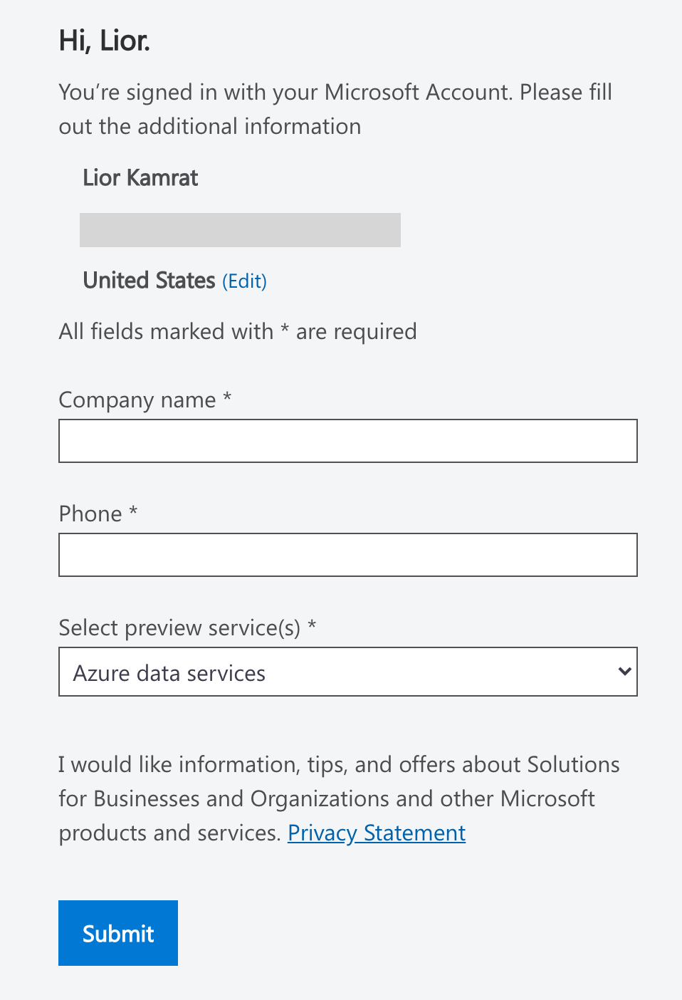

# Azure Arc Data Controller Vanilla Deployment on AKS (ARM Template)

The following README will guide you on how to deploy a "Ready to Go" environment so you can start using Azure Arc Data Services and deploy resource on [Azure Kubernetes Service (AKS)](https://docs.microsoft.com/en-us/azure/aks/intro-kubernetes) cluster, deployed with [Azure ARM Template](https://docs.microsoft.com/en-us/azure/azure-resource-manager/templates/overview). 

By the end of this guide, you will have an AKS cluster deployed with an Azure Arc Data Controller and a Microsoft Windows Server 2019 (Datacenter) Azure VM, installed & pre-configured with all the required tools needed to work with Azure Arc Data Services.

# Prerequisites

* **Currently, Azure Arc Data Services is in Private Preview. In order for you to go trough this guide you are required to have your [Azure subscription whitelisted](https://azure.microsoft.com/en-us/services/azure-arc/hybrid-data-services/#faq). As part of you submitting a request to join, you will also get an invite to join the [Private Preview GitHub Repository](https://github.com/microsoft/Azure-data-services-on-Azure-Arc) which we will be using later on in this guide.**

    **If you already registered to Private Preview, you can skip this step.**

    

* Clone this repo

* [Install or update Azure CLI](https://docs.microsoft.com/en-us/cli/azure/install-azure-cli?view=azure-cli-latest). **Azure CLI should be running version 2.7** or later. Use ```az --version``` to check your current installed version.

* [Generate SSH Key](https://docs.microsoft.com/en-us/azure/virtual-machines/linux/create-ssh-keys-detailed) (or use existing ssh key).

* Create Azure Service Principal (SP)   

    In order for you to deploy the AKS cluster using the ARM template, Azure Service Principal assigned with the "Contributor" role is required. To create it, login to your Azure account run the below command (this can also be done in [Azure Cloud Shell](https://shell.azure.com/)). 

    ```bash
    az login
    az ad sp create-for-rbac -n "<Unique SP Name>" --role contributor
    ```

    For example:

    ```az ad sp create-for-rbac -n "http://AzureArcData" --role contributor```

    Output should look like this:

    ```
    {
    "appId": "XXXXXXXXXXXXXXXXXXXXXXXXXXXX",
    "displayName": "AzureArcData",
    "name": "http://AzureArcData",
    "password": "XXXXXXXXXXXXXXXXXXXXXXXXXXXX",
    "tenant": "XXXXXXXXXXXXXXXXXXXXXXXXXXXX"
    }
    ```
    
    **Note**: It is optional but highly recommended to scope the SP to a specific [Azure subscription and Resource Group](https://docs.microsoft.com/en-us/cli/azure/ad/sp?view=azure-cli-latest) 

# Deployment 

As mentioned, this deployment will leverage ARM templates. You will deploy a single template, responsible on deploying AKS. Once AKS deployment has finished, the template will then automatically execute another template which will deploy the Windows Server Azure VM followed by the Azure Arc Data Controller deployment on the AKS cluster. 

* Before deploying the ARM template, login to Azure using AZ CLI with the ```az login`` command. To determine which AKS Kubernetes versions are available in your region use the below Azure CLI command.

    ```bash
    az aks get-versions -l "<Your Azure Region>"
    ```

* The deployment is using the ARM template parameters file. Before initiating the deployment, edit the [*azuredeploy.parameters.json*](../aks/arm_template/azuredeploy.parameters.json) file located in your local cloned repository folder.


"clusterName" - AKS cluster name
        "dnsPrefix" - 
    "value": "<AKS unique DNS prefix>"

 "nodeAdminUsername" - 
    "value": "<AKS Node Username>"

"sshRSAPublicKey" - 
    "value": "<Your ssh public key>"

"servicePrincipalClientId" - 
    "value": "<Your Azure Service Principle name>"

"servicePrincipalClientSecret" - 
    "value": "<Your Azure Service Principle password>"

"kubernetesVersion" - 
    "value": "<Kubernetes Version, e.g. 1.17.4>"

"adminUsername" - 
    "value": "<Client Windows VM admin username>"

"adminPassword" - 
    "value": "<Client Windows VM admin password>"

"vmSize" - 
    "value": "<Client Windows VM size>"

"tenantId" - 
    "value": "<Azure tenant ID>"

"resourceGroup" - 
    "value": "<Azure Resource Group>"

"AZDATA_USERNAME" - 
    "value": "<Azure Arc Data Controller admin username>"

"AZDATA_PASSWORD" - 
    "value": "<Azure Arc Data Controller admin password>"

"ACCEPT_EULA" - 
    "value": "yes"   

"DOCKER_USERNAME" - 
    "value": "<Azure Arc Data - Private Preview Docker Registry username>"

"DOCKER_PASSWORD" - 
    "value": "<Azure Arc Data - Private Preview Docker Registry password>"

"ARC_DC_NAME" - 
    "value": "<Azure Arc Data Controller name (will be used for k8s namespace as well)>"

"ARC_DC_SUBSCRIPTION" - 
    "value": "<Azure Arc Data Controller Azure subscription ID>"

"ARC_DC_REGION" - 
    "value": "eastus"