# Azure PostgreSQL Hyperscale Deployment on AKS (ARM Template)

The following README will guide you on how to deploy a "Ready to Go" environment so you can start using Azure Arc Data Services with Azure PostgreSQL Hyperscale (Citus) deployed on [Azure Kubernetes Service (AKS)](https://docs.microsoft.com/en-us/azure/aks/intro-kubernetes) cluster, using [Azure ARM Template](https://docs.microsoft.com/en-us/azure/azure-resource-manager/templates/overview). 

By the end of this guide, you will have an AKS cluster deployed with an Azure Arc Data Controller, Azure PostgreSQL Hyperscale with a sample database and a Microsoft Windows Server 2019 (Datacenter) Azure VM, installed & pre-configured with all the required tools needed to work with Azure Arc Data Services.

# Prerequisites

* **Currently, Azure Arc Data Services is in Private Preview. In order for you to go trough this guide you are required to have your [Azure subscription whitelisted](https://azure.microsoft.com/en-us/services/azure-arc/hybrid-data-services/#faq). As part of you submitting a request to join, you will also get an invite to join the [Private Preview GitHub Repository](https://github.com/microsoft/Azure-data-services-on-Azure-Arc) which we will be using later on in this guide.**

    **If you already registered to Private Preview, you can skip this prerequisite.**

    

* Clone this repo

    ```terminal
    git clone https://github.com/microsoft/azure_arc.git
    ```
    
* [Install or update Azure CLI](https://docs.microsoft.com/en-us/cli/azure/install-azure-cli?view=azure-cli-latest). **Azure CLI should be running version 2.7** or later. Use ```az --version``` to check your current installed version.

* [Generate SSH Key](https://docs.microsoft.com/en-us/azure/virtual-machines/linux/create-ssh-keys-detailed) (or use existing ssh key).

* Create Azure Service Principal (SP)   

    In order for you to deploy the AKS cluster using the ARM template, Azure Service Principal assigned with the "Contributor" role is required. To create it, login to your Azure account run the below command (this can also be done in [Azure Cloud Shell](https://shell.azure.com/)). 

    ```bash
    az login
    az ad sp create-for-rbac -n "<Unique SP Name>" --role contributor
    ```

    For example:

    ```az ad sp create-for-rbac -n "http://AzureArcData" --role contributor```

    Output should look like this:

    ```
    {
    "appId": "XXXXXXXXXXXXXXXXXXXXXXXXXXXX",
    "displayName": "AzureArcData",
    "name": "http://AzureArcData",
    "password": "XXXXXXXXXXXXXXXXXXXXXXXXXXXX",
    "tenant": "XXXXXXXXXXXXXXXXXXXXXXXXXXXX"
    }
    ```
    
    **Note**: It is optional but highly recommended to scope the SP to a specific [Azure subscription and Resource Group](https://docs.microsoft.com/en-us/cli/azure/ad/sp?view=azure-cli-latest) 

# Automation Flow

For you to get familiar with the automation and deployment flow, below is an explanation.
 
- User is editing the ARM template parameters file (1-time edit). These params values are being used throughout the deployment.

- Main ARM template will deploy AKS.

- Once AKS deployment has finished, the main ARM template will call a secondary ARM template which is depended on a successful AKS deployment.

- Secondary ARM template will deploy a client Windows Server 2019 VM.

- As part of the Windows Server 2019 VM deployment, there are 2 scripts executions; First script (ClientTools.ps1) at deployment runtime using the ARM *"CustomScriptExtention"* module and a second script (LogonScript.ps1) on user first logon to Windows.

    - Runtime script will:
        - Inject user params values (from bullet point #1) to be used in both runtime and logon script
        - Install the required tools – az cli, az cli Powershell module, kubernetes-cli (Chocolaty packages)
        - Download & install the Azure Data Studio (Insiders) & azdata cli
        - Download the Azure Data Studio Azure Data CLI, Azure Arc & PostgreSQL extensions
        - Download the *Postgres_Cleanup* and *Postgres_Deploy* Powershell scripts
        - Create the Postgres Connectivity script
        - Create the logon script
        - Create the Windows schedule task to run the logon script at first login
        - Disable Windows Server Manager from running at login

    - Logon script will:
        - Create the *LogonScript.log* file
        - Retrieve the AKS credentials & create the *kubeconfig* file in user Windows profile
        - Create the *azdata* config file in user Windows profile
        - Install the Azure Data Studio Azure Data CLI, Azure Arc & PostgreSQL extensions
        - Create the Azure Data Studio desktop shortcut
        - Open another Powershell session which will execute a command to watch the deployed Azure Arc Data Controller and PostgreSQL Kubernetes pods
        - Deploy the Arc Data Controller using the user params values
        - Deploy Azure Postgres server group **(with 5 workers)** on the AKS cluster
        - Creating Postgres connectivity details using the SQL Connectivity script
        - Unregister the logon script Windows schedule task so it will not run after first login

# Deployment 

As mentioned, this deployment will leverage ARM templates. You will deploy a single template, responsible on deploying AKS. Once AKS deployment has finished, the template will then automatically execute another template which will deploy the Windows Server Azure VM followed by the Azure Arc Data Controller deployment and Azure Postgres on the AKS cluster. 

* Before deploying the ARM template, login to Azure using AZ CLI with the ```az login``` command. To determine which AKS Kubernetes versions are available in your region use the below Azure CLI command.

    ```bash
    az aks get-versions -l "<Your Azure Region>"
    ```

* The deployment is using the ARM template parameters file. Before initiating the deployment, edit the [*azuredeploy.parameters.json*](../aks/arm_template/postgres_hs/azuredeploy.parameters.json) file located in your local cloned repository folder. An example parameters file is located [here](../aks/arm_template/postgres_hs/azuredeploy.parameters.example.json).

    - *clusterName* - AKS cluster name

    - *dnsPrefix* - AKS unique DNS prefix

    - *nodeAdminUsername* - AKS Node Username

    - *sshRSAPublicKey* - Your ssh public key

    - *servicePrincipalClientId* - Your Azure Service Principle name

    - *servicePrincipalClientSecret* - Your Azure Service Principle password

    - *kubernetesVersion* - AKS Kubernetes Version (See previous prerequisite)

    - *adminUsername* - Client Windows VM admin username

    - *adminPassword* - Client Windows VM admin password

    - *vmSize* - Client Windows VM size

    - *tenantId* - Azure tenant ID

    - *resourceGroup* - Azure Resource Group where all the resources get deploy

    - *AZDATA_USERNAME* - Azure Arc Data Controller admin username

    - *AZDATA_PASSWORD* - Azure Arc Data Controller admin password and the PostgreSQL password (The password must be at least 8 characters long and contain characters from three of the following four sets: uppercase letters, lowercase letters, numbers, and symbols.)

    - *ACCEPT_EULA* - "yes" **Do not change**

    - *REGISTRY_USERNAME* - Azure Arc Data - Private Preview Container Registry username (See note below)

    - *REGISTRY_PASSWORD* - Azure Arc Data - Private Preview Container Registry password (See note below)

    - *ARC_DC_NAME* - Azure Arc Data Controller name. The name must consist of lowercase alphanumeric characters or '-', and must start and end with a alphanumeric character (This name will be used for k8s namespace as well).

    - *ARC_DC_SUBSCRIPTION* - Azure Arc Data Controller Azure subscription ID

    - *ARC_DC_REGION* - Azure location where the Azure Arc Data Controller resource will be created in Azure (Currently, supported regions supported are eastus, eastus2, centralus, westus2, westeurope, southeastasia)

    - *POSTGRES_NAME* - PostgreSQL Hyperscale server group name to be deployed on the Kubernetes cluster. Names must be 10 characters or fewer in length and conform to DNS naming conventions.

    - *POSTGRES_WORKER_NODE_COUNT* - PostgreSQL Hyperscale server group number of workers

    - *POSTGRES_DATASIZE* - PostgreSQL Hyperscale size of data volumes in MB (Recommended to use at least 1GB (1024 MB)).

    - *POSTGRES_SERVICE_TYPE* - Kubernetes service type i.e ClusterIP/LoadBalancer/NodePort. As AKS supports Load Balancers, leave configured with *LoadBalancer*.

    **Note: Currently, the REGISTRY_USERNAME / REGISTRY_PASSWORD values can only be found in the Azure Arc Data Services [Private Preview repository](https://github.com/microsoft/Azure-data-services-on-Azure-Arc/blob/master/scenarios-new/002-create-data-controller.md).**

 * To deploy the ARM template, navigate to the local cloned [deployment folder](../aks/arm_template/postgres_hs) and run the below command:

    ```bash
    az group create --name <Name of the Azure Resource Group> --location <Azure Region>
    az deployment group create \
    --resource-group <Name of the Azure Resource Group> \
    --name <The name of this deployment> \
    --template-uri https://raw.githubusercontent.com/microsoft/azure_arc/master/azure_arc_data_jumpstart/aks/arm_template/postgres_hs/azuredeploy.json \
    --parameters <The *azuredeploy.parameters.json* parameters file location>
    ```

    **Note: Make sure that you are using the same Azure Resource Group name as the one you've just used in the *azuredeploy.parameters.json* file** 

    For example:

    ```bash
    az group create --name Arc-Data-Postgres-Demo --location "East US"
    az deployment group create \
    --resource-group Arc-Data-Postgres-Demo \
    --name arcdatapostgresdemo \
    --template-uri https://raw.githubusercontent.com/microsoft/azure_arc/master/azure_arc_data_jumpstart/aks/arm_template/postgres_hs/azuredeploy.json \
    --parameters azuredeploy.parameters.json
    ```

    **Note: Deployment time of the Azure Resource (AKS + Windows VM) can take ~25-30min long**

* Once Azure resources has been provisioned, you will be able to see it in Azure portal. 

    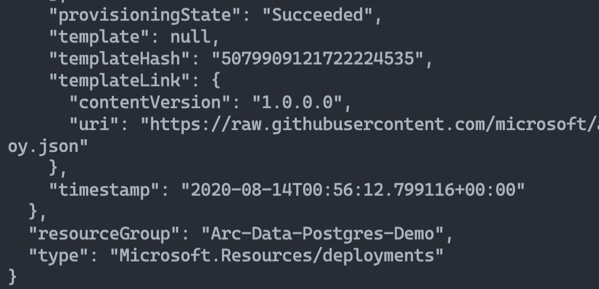

    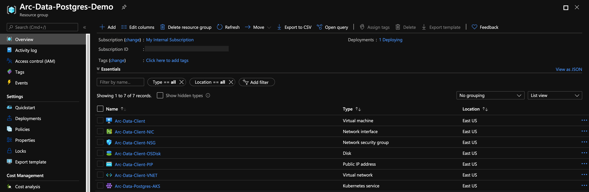

# Windows Login & Post Deployment

Now that both the AKS cluster and the Windows Server client VM are created, it is time to login the Client VM. 

* Using it's public IP, RDP to the **Client VM**

    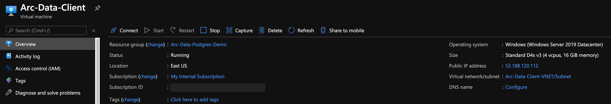

* At first login, as mentioned in the "Automation Flow" section, a logon script will get executed. This script was created as part of the automated deployment process. 

    Let the script to run it's course and **do not close** the Powershell session, this will be done for you once completed. You will notice that the Azure Arc Data Controller gets deployed on the AKS cluster. **The logon script run time is 10-15min long**.  

    Once the script will finish it's run, the logon script Powershell session will be closed and the Azure Arc Data Controller and an Azure Postgres Hyperscale (and a sample DB) will be deployed on the AKS cluster and be ready to use. 

    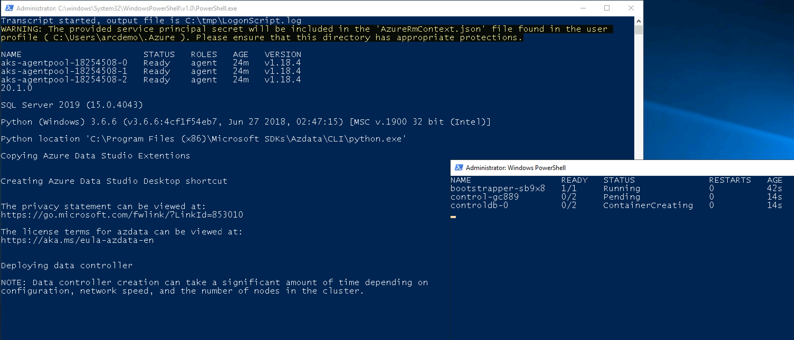

    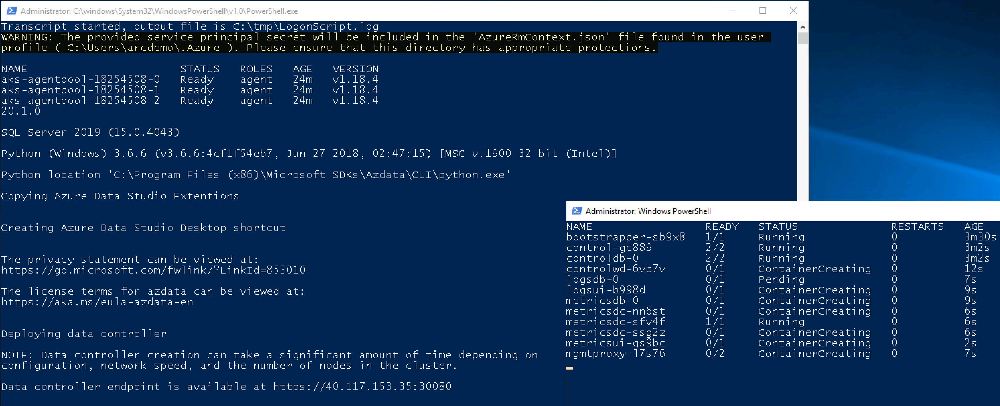    

    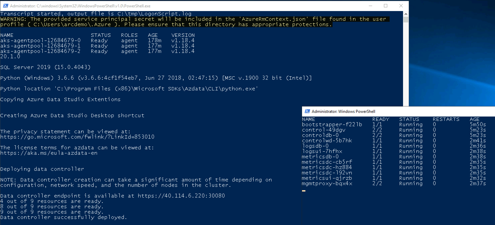

    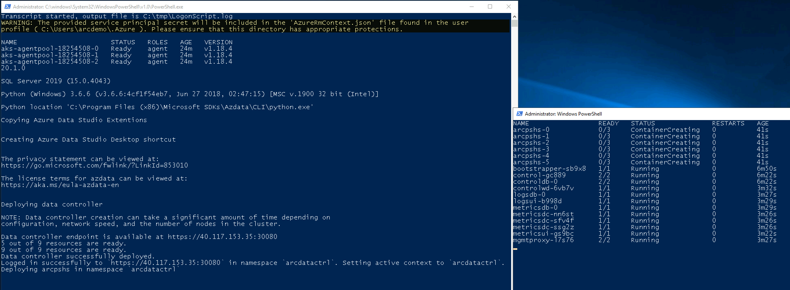

    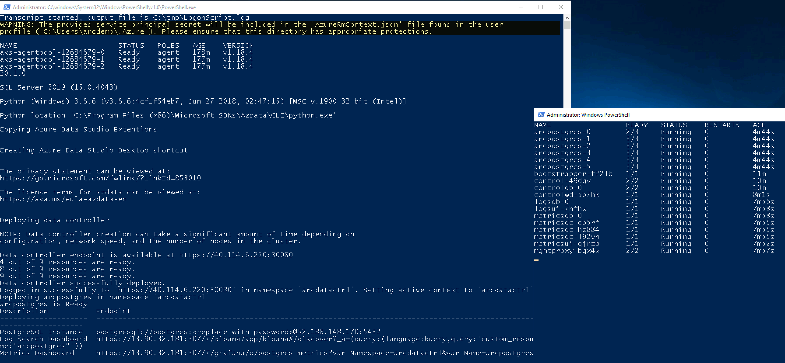

* Another tool automatically deployed is Azure Data Studio (Insiders Build) along with the *Azure Data CLI*, the *Azure Arc* and the *PostgreSQL* extensions. At the end of the logon script run, Azure Data Studio will automatically be open and connected to the Azure Postgres Hyperscale server with the sample DB.

    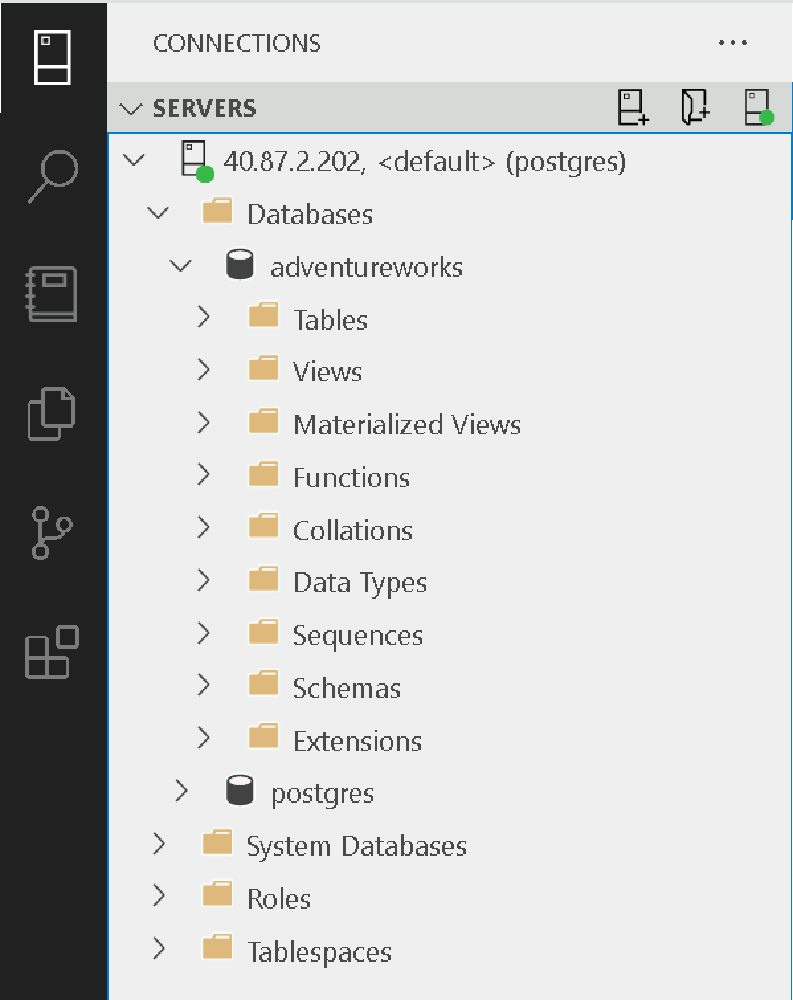

    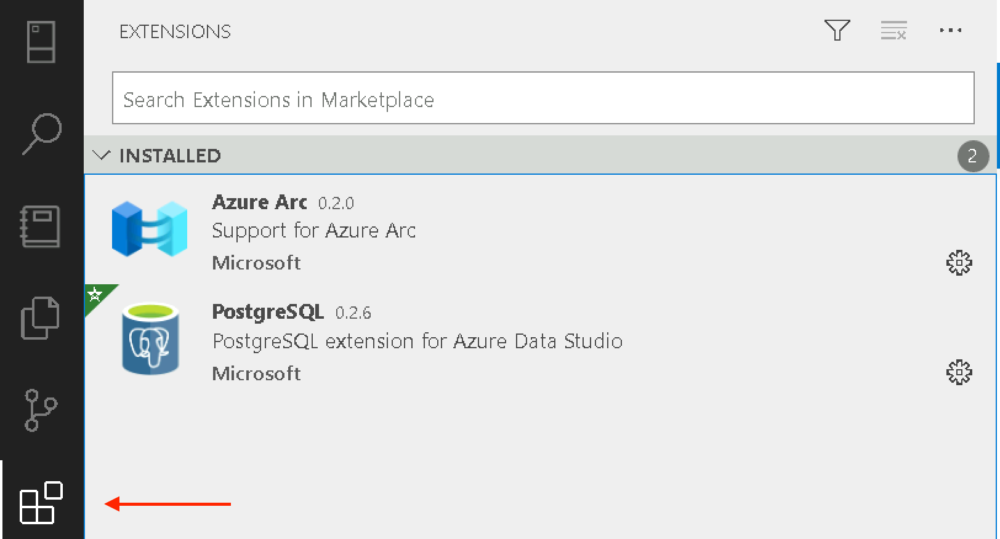

* (Optional) In Powershell, login to the Data Controller and check it's health using the below commands.

    ```powershell
    azdata login --namespace $env:ARC_DC_NAME

    azdata arc dc status show
    ```

    

# Cleanup

* To delete the Azure Arc Data Controller and all of it's Kubernetes resources as well as Postgres Hyperscale, run the *Postgres_Cleanup.ps1* Powershell script located in *C:\tmp* on the Windows Client VM. At the end of it's run, the script will close all Powershell sessions. **The Cleanup script run time is 5-10min long**.

    

    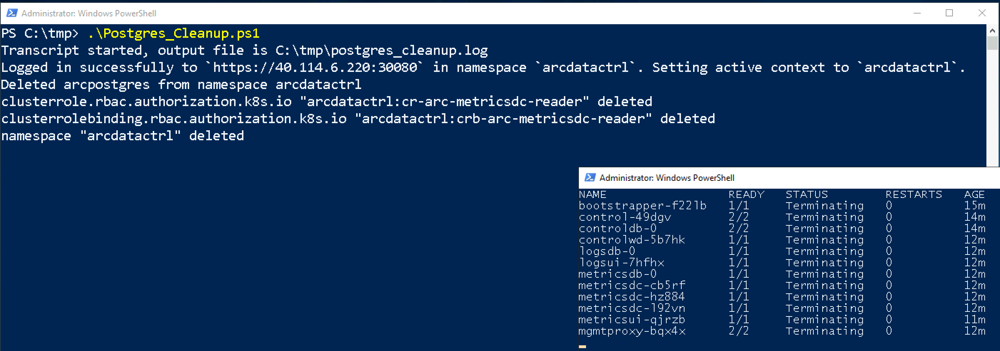

* If you want to delete the entire environment, simply delete the deployment Resource Group from the Azure portal.

    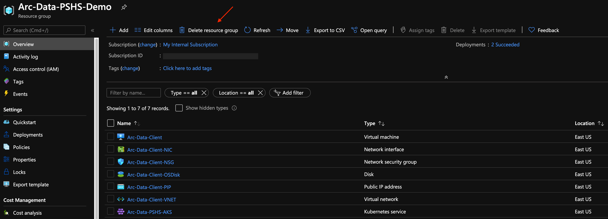

# Re-Deploy Azure Arc Data Controller & Postgres

In case you deleted the Azure Arc Data Controller and Postgres Hyperscale from the Kubernetes cluster, you can re-deploy it by running the *Postgres_Deploy.ps1* Powershell script located in *C:\tmp* on the Windows Client VM. **The Deploy script run time is approximately 15min long**.

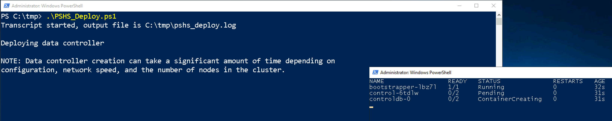

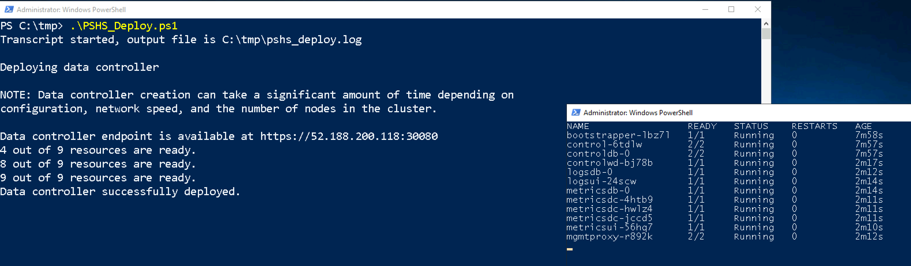

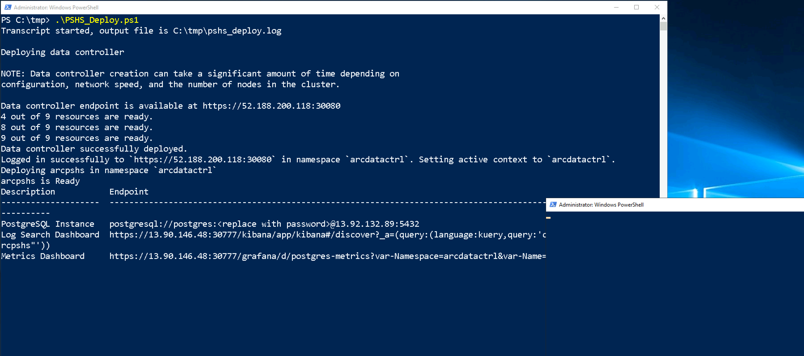

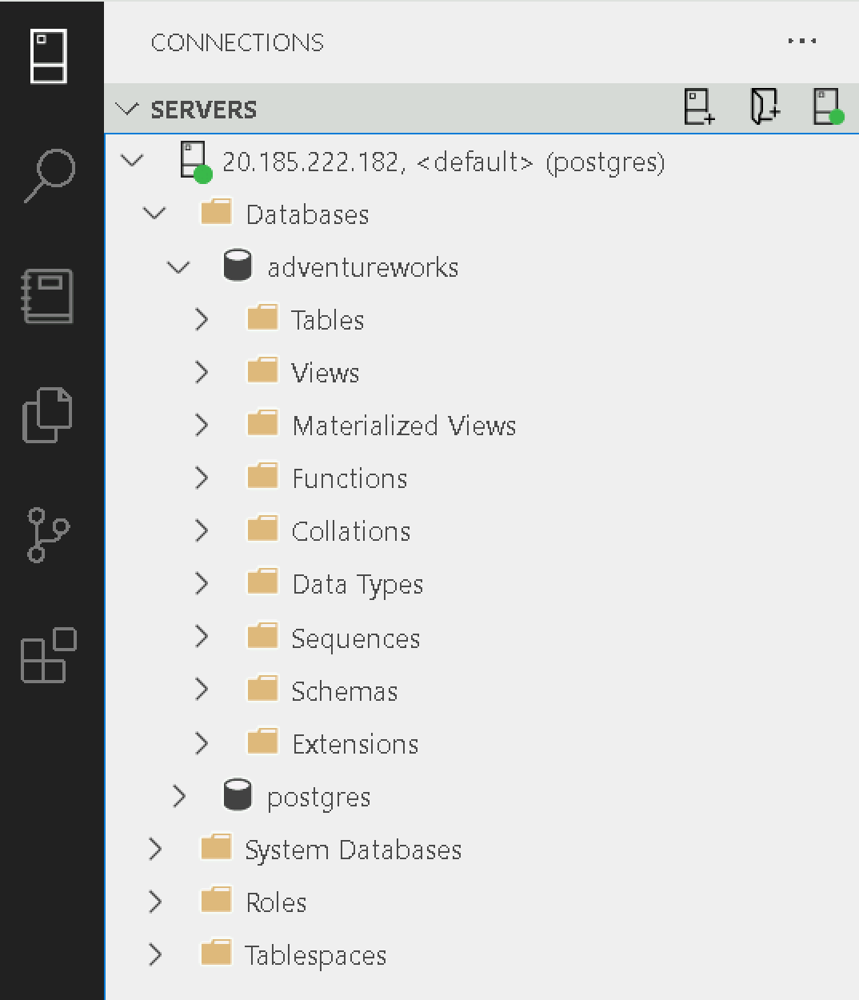