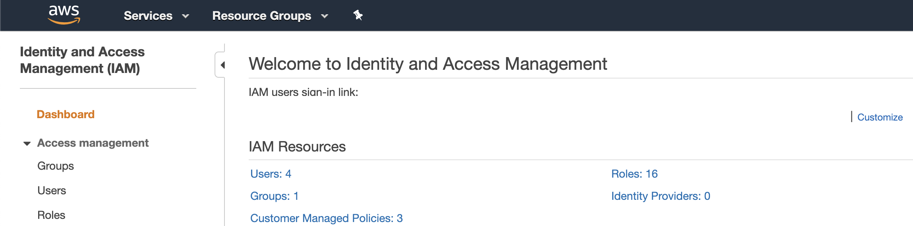
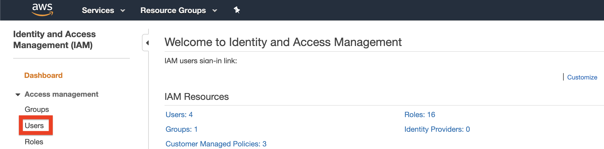
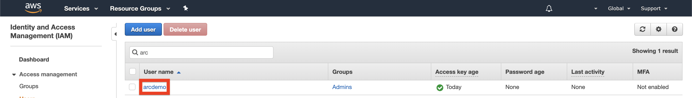
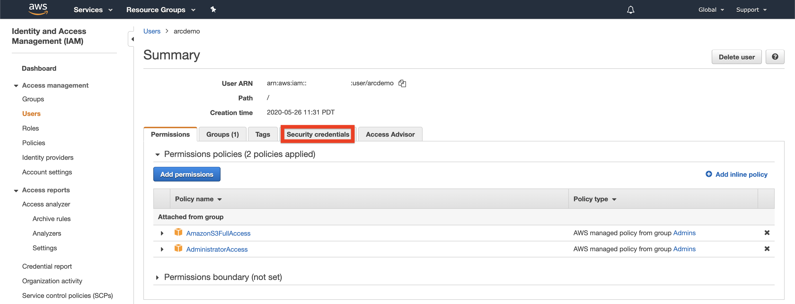
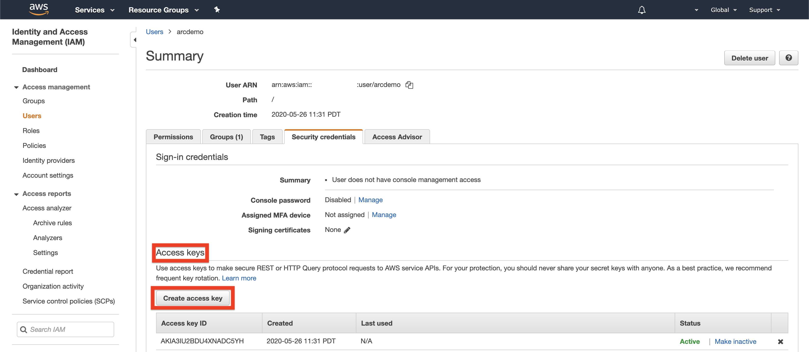
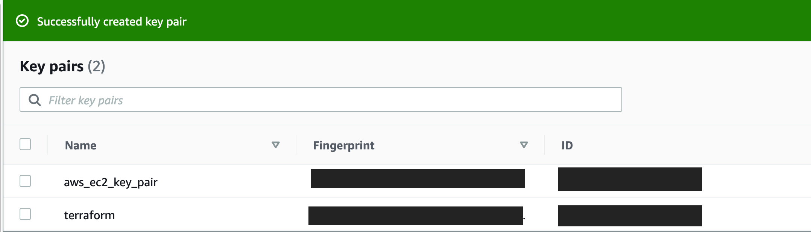
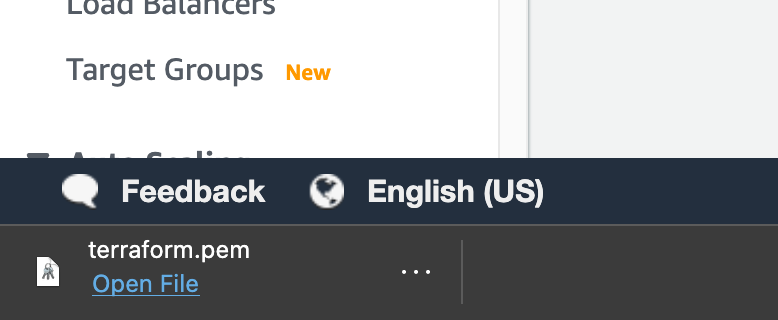
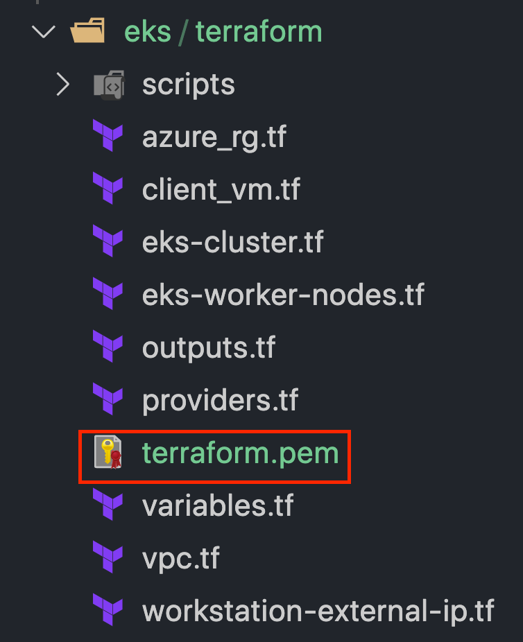

# Azure Arc Data Controller Vanilla Deployment on EKS (Terraform)

The following README will guide you on how to deploy a "Ready to Go" environment so you can start using Azure Arc Data Services and deploy Azure data services on [Elastic Kubernetes Service (EKS)](https://aws.amazon.com/eks/) cluster, using [Terraform](https://www.terraform.io/). 

By the end of this guide, you will have an EKS cluster deployed with an Azure Arc Data Controller and a Microsoft Windows Server 2019 (Datacenter) AWS EC2 instance VM, installed & pre-configured with all the required tools needed to work with Azure Arc Data Services.

# Prerequisites

* **Currently, Azure Arc Data Services is in Private Preview. In order for you to go trough this guide you are required to have your [Azure subscription whitelisted](https://azure.microsoft.com/en-us/services/azure-arc/hybrid-data-services/#faq). As part of you submitting a request to join, you will also get an invite to join the [Private Preview GitHub Repository](https://github.com/microsoft/Azure-data-services-on-Azure-Arc) which we will be using later on in this guide.**

    **If you already registered to Private Preview, you can skip this prerequisite.**

    

* Clone this repo

    ```terminal
    git clone https://github.com/microsoft/azure_arc.git
    ```

* [Install AWS IAM Authenticator](https://docs.aws.amazon.com/eks/latest/userguide/install-aws-iam-authenticator.html)

* [Install or update Azure CLI](https://docs.microsoft.com/en-us/cli/azure/install-azure-cli?view=azure-cli-latest). **Azure CLI should be running version 2.7** or later. Use ```az --version``` to check your current installed version.

* [Create a free Amazon Web Service's account](https://aws.amazon.com/free/)

* [Install Terraform >=0.12](https://learn.hashicorp.com/terraform/getting-started/install.html)

* Create Azure Service Principal (SP)   

    To connect a Kubernetes cluster to Azure Arc, Azure Service Principal assigned with the "Contributor" role is required. To create it, login to your Azure account run the below command (this can also be done in [Azure Cloud Shell](https://shell.azure.com/)).

    ```bash
    az login
    az ad sp create-for-rbac -n "<Unique SP Name>" --role contributor
    ```

    For example:

    ```az ad sp create-for-rbac -n "http://AzureArcK8s" --role contributor```

    Output should look like this:

    ```
    {
    "appId": "XXXXXXXXXXXXXXXXXXXXXXXXXXXX",
    "displayName": "AzureArcK8s",
    "name": "http://AzureArcK8s",
    "password": "XXXXXXXXXXXXXXXXXXXXXXXXXXXX",
    "tenant": "XXXXXXXXXXXXXXXXXXXXXXXXXXXX"
    }
    ```
    
    **Note**: It is optional but highly recommended to scope the SP to a specific [Azure subscription and Resource Group](https://docs.microsoft.com/en-us/cli/azure/ad/sp?view=azure-cli-latest)

* Create AWS User IAM Key. An access key grants programmatic access to your resources which we will be using later on in this guide. 

  1. Navigate to the [IAM Access page](https://console.aws.amazon.com/iam/home#/home).

    

  2. Select the **Users** from the side menu.

    
    
  3. Select the **User** you want to create the access key for. 

   

  4. Select ***Security credentials** of the **User** selected. 

   

  5. Under **Access Keys** select **Create Access Keys**, this will download the

  

  6. In the popup window it will show you the ***Access key ID*** and ***Secret access key***. Save both of these values to configure the **Terraform plan** variables later.

  

* In order to open a RDP session to the Windows Client EC2 instance, an EC2 Key Pair is required. From the *Services* menu, click on *"EC2"*, enter the *Key Pairs* settings from the left sidebar (under the *Network & Security* section) and click on *"Create key pair"* (top-right corner) to create a new key pair.

  

  

  

* Provide a meaningful name, for example *terraform*, and click on *"Create key pair"* which will then automatically download the created *pem* file.

  

  

    

* Copy the downloaded *pem* file to where the terraform binaries are located (in your cloned repository directory).

  

# Automation Flow

For you to get familiar with the automation and deployment flow, below is an explanation.
 
- User is editing and exporting Terraform runtime environment variables, AKA *TF_VAR* (1-time edit). The variables values are being used throughout the deployment.

- User deploys the Terraform plan which will deploy the EKS cluster and the EC2 Windows Client instance. 

- In addition, the plan will copy the EKS *kubeconfig* file as well as the *configmap.yml* file (which is responsible for having the EKS nodes communicate with the cluster control plane) on to the Windows instance.

- As part of the Windows Server 2019 VM deployment, there are 3 scripts executions:

  1. *azure_arc.ps1* script will be created automatically at the Terraform plan runtime and is responsible on injecting the *TF_VAR* variables values on to the Windows instance which will then be used in both the *ClientTools* and the *LogonScript* scripts.

  2. *ClientTools.ps1* script will run at the Terraform plan runtime Runtime and will:
    - Create the *ClientTools.log* file  
    - Install the required tools – az cli, az cli Powershell module, kubernetes-cli, aws-iam-authenticator (Chocolaty packages)
    - Download & install the Azure Data Studio (Insiders) & azdata cli
    - Download the Azure Data Studio Arc & PostgreSQL extensions
    - Apply the *configmap.yml* file on the EKS cluster
    - Create the *azdata* config file in user Windows profile
    - Install the Azure Data Studio Arc & PostgreSQL extensions
    - Create the Azure Data Studio desktop shortcut    
    - Download the *DC_Cleanup* and *DC_Deploy* Powershell scripts
    - Create the logon script
    - Create the Windows schedule task to run the logon script at first login

  3. *LogonScript.ps1* script will run on user first logon to Windows and will:
    - Create the *LogonScript.log* file
    - Open another Powershell session which will execute a command to watch the deployed Azure Arc Data Controller Kubernetes pods
    - Deploy the Arc Data Controller using the *TF_VAR* variables values
    - Unregister the logon script Windows schedule task so it will not run after first login