# Azure Arc Data Controller Vanilla Deployment on GKE (Terraform)

The following README will guide you on how to deploy a "Ready to Go" environment so you can start using Azure Arc Data Services and deploy Azure data services on a [Google Kubernetes Engine (GKE)](https://cloud.google.com/kubernetes-engine) cluster, using [Terraform](https://www.terraform.io/). 

By the end of this guide, you will have a GKE cluster deployed with an Azure Arc Data Controller and a Microsoft Windows Server 2019 (Datacenter) GKE compute instance VM, installed & pre-configured with all the required tools needed to work with Azure Arc Data Services.

# Deployment TL;DR

  - Create a Google Cloud Platform (GCP) project and IAM Role
  - Create & download AWS Key Pair
  - Clone this repository
  - Edit *TF_VAR* variables values
  - *terraform init*
  - *terraform apply*
  - EKS cleanup
  - *terraform destroy*

# Prerequisites

* **Currently, Azure Arc Data Services is in Private Preview. In order for you to go trough this guide you are required to have your [Azure subscription whitelisted](https://azure.microsoft.com/en-us/services/azure-arc/hybrid-data-services/#faq). As part of you submitting a request to join, you will also get an invite to join the [Private Preview GitHub Repository](https://github.com/microsoft/Azure-data-services-on-Azure-Arc) which we will be using later on in this guide.**

    **If you already registered to Private Preview, you can skip this prerequisite.**

    

* Clone this repo

    ```terminal
    git clone https://github.com/microsoft/azure_arc.git
    ```

* [Install or update Azure CLI](https://docs.microsoft.com/en-us/cli/azure/install-azure-cli?view=azure-cli-latest). **Azure CLI should be running version 2.7** or later. Use ```az --version``` to check your current installed version.

* [Create a free Google Cloud account](https://cloud.google.com/free)

* [Install Terraform >=0.12](https://learn.hashicorp.com/terraform/getting-started/install.html)

* Create Azure Service Principal (SP)

    To connect a Kubernetes cluster to Azure Arc, Azure Service Principal assigned with the "Contributor" role is required. To create it, login to your Azure account run the below command (this can also be done in [Azure Cloud Shell](https://shell.azure.com/)).

    ```bash
    az login
    az ad sp create-for-rbac -n "<Unique SP Name>" --role contributor
    ```

    For example:

    ```az ad sp create-for-rbac -n "http://AzureArcK8s" --role contributor```

    Output should look like this:

    ```
    {
    "appId": "XXXXXXXXXXXXXXXXXXXXXXXXXXXX",
    "displayName": "AzureArcK8s",
    "name": "http://AzureArcK8s",
    "password": "XXXXXXXXXXXXXXXXXXXXXXXXXXXX",
    "tenant": "XXXXXXXXXXXXXXXXXXXXXXXXXXXX"
    }
    ```
    
    **Note**: It is optional but highly recommended to scope the SP to a specific [Azure subscription and Resource Group](https://docs.microsoft.com/en-us/cli/azure/ad/sp?view=azure-cli-latest)

* Create a new GCP Project, IAM Role & Service Account

In order to deploy resources in GCP, we will create a new GCP Project as well as a service account to allow Terraform to authenticate against GCP APIs and run the plan to deploy resources.

  * Browse to https://console.cloud.google.com/ and login with your Google Cloud account. Once logged in, [create a new project](https://cloud.google.com/resource-manager/docs/creating-managing-projects) named "Azure Arc Demo". After creating it, be sure to copy down the project id as it is usually different then the project name.

      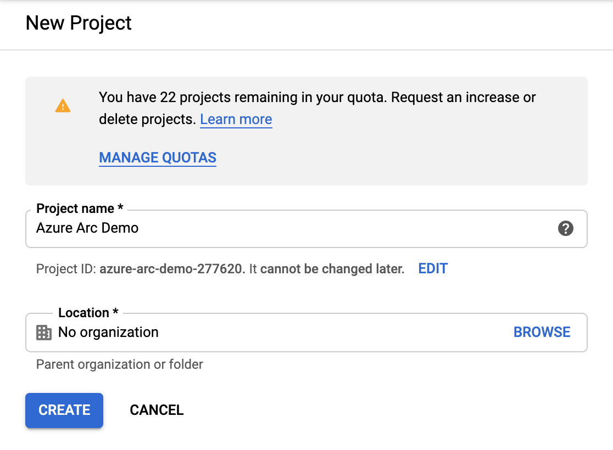

      

      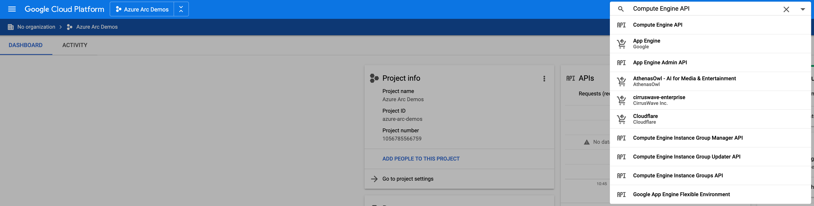

  * Enable the Compute Engine API for the project, create a project Owner service account credentials and download the private key JSON file and copy the file to the directory where Terraform files are located. Change the JSON file name (for example *account.json*). The Terraform plan will be using the credentials stored in this file to authenticate against your GCP project.   

      

      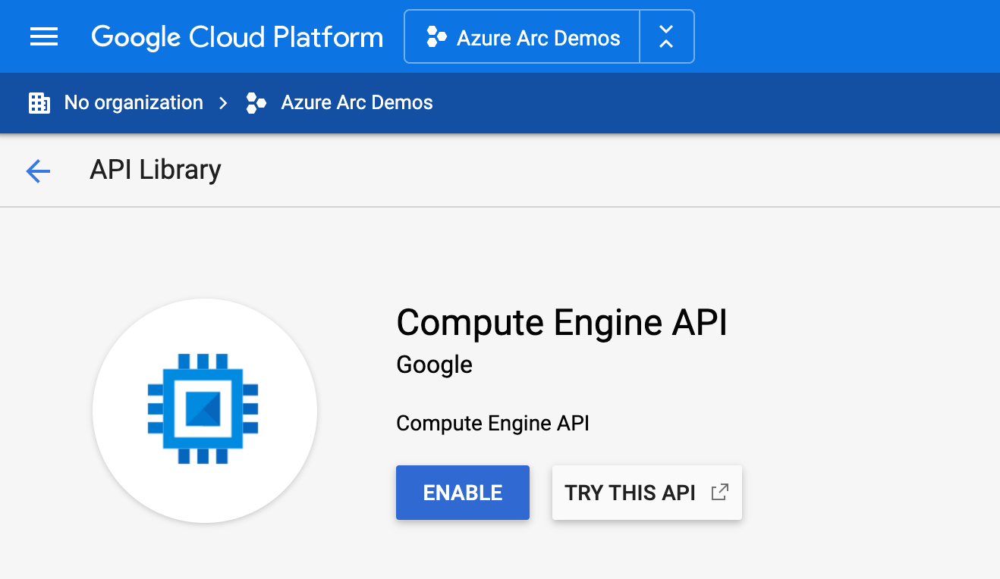

      

      

      

      

      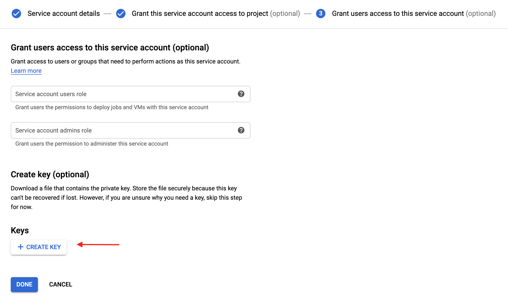

      

      

      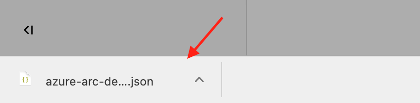

      

      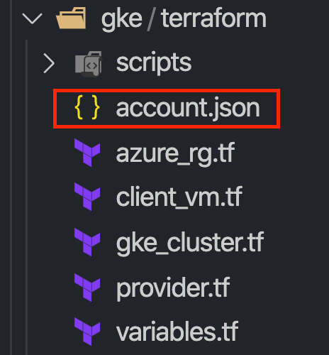

      

  * Enable the Compute Engine API for the project

      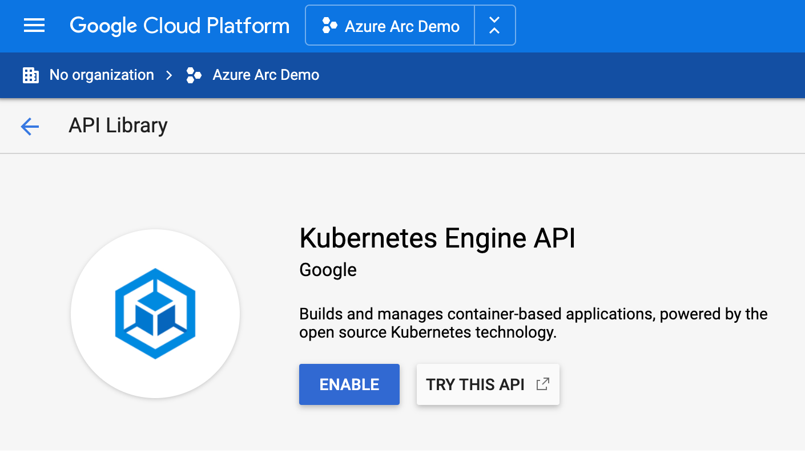

      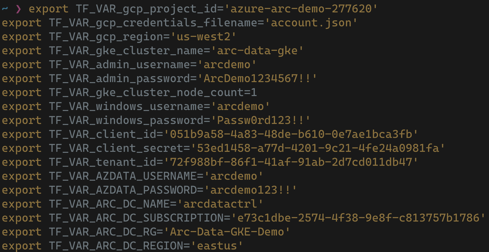


# Automation Flow

For you to get familiar with the automation and deployment flow, below is an explanation.
 
- User is editing and exporting Terraform runtime environment variables, AKA *TF_VAR* (1-time edit). The variables values are being used throughout the deployment.

- User deploys the Terraform plan which will deploy the EKS cluster and the EC2 Windows Client instance as well as an Azure Resource Group. The Azure Resource Group is required to host the Azure Arc services you will be able to deploy such as Azure SQL Managed Instance and PostgresSQL Hyperscale. 

- In addition, the plan will copy the EKS *kubeconfig* file as well as the *configmap.yml* file (which is responsible for having the EKS nodes communicate with the cluster control plane) on to the Windows instance.

- As part of the Windows Server 2019 VM deployment, there are 3 scripts executions:

  1. *azure_arc.ps1* script will be created automatically as part of the Terraform plan runtime and is responsible on injecting the *TF_VAR* variables values on to the Windows instance which will then be used in both the *ClientTools* and the *LogonScript* scripts.

  2. *ClientTools.ps1* script will run at the Terraform plan runtime Runtime and will:
      - Create the *ClientTools.log* file  
      - Install the required tools – az cli, az cli Powershell module, kubernetes-cli, aws-iam-authenticator (Chocolaty packages)
      - Download & install the Azure Data Studio (Insiders) & azdata cli
      - Download the Azure Data Studio Arc & PostgreSQL extensions
      - Apply the *configmap.yml* file on the EKS cluster
      - Create the *azdata* config file in user Windows profile
      - Install the Azure Data Studio Arc & PostgreSQL extensions
      - Create the Azure Data Studio desktop shortcut    
      - Download the *DC_Cleanup* and *DC_Deploy* Powershell scripts
      - Create the logon script
      - Create the Windows schedule task to run the logon script at first login

  3. *LogonScript.ps1* script will run on user first logon to Windows and will:
      - Create the *LogonScript.log* file
      - Open another Powershell session which will execute a command to watch the deployed Azure Arc Data Controller Kubernetes pods
      - Deploy the Arc Data Controller using the *TF_VAR* variables values
      - Unregister the logon script Windows schedule task so it will not run after first login

# Deployment

As mentioned, the Terraform plan will deploy an EKS cluster and an EC2 Windows Server 2019 Client instance.

* Before running the Terraform plan, edit the below *TF_VAR* values and export it (simply copy/paste it after you finished edit these). An example *TF_VAR* shell script file is located [here](../eks/terraform/example/TF_VAR_example.sh)

  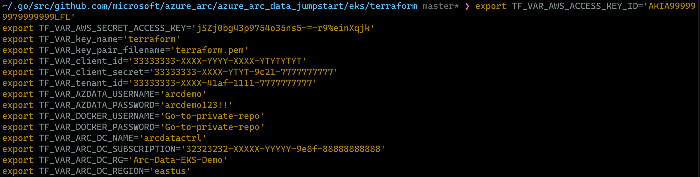

  - export TF_VAR_AWS_ACCESS_KEY_ID='Your AWS Access Key ID (Created in the prerequisites section)'

  - export TF_VAR_AWS_SECRET_ACCESS_KEY='Your AWS Secret Key (Created in the prerequisites section)'

  - export TF_VAR_key_name='Your AWS Key Pair name (Created in the prerequisites section)'

  - export TF_VAR_key_pair_filename='Your AWS Key Pair *.pem filename (Created in the prerequisites section)'

  - export TF_VAR_client_id='Your Azure Service Principle name'

  - export TF_VAR_client_secret='Your Azure Service Principle password'

  - export TF_VAR_tenant_id='Your Azure tenant ID'

  - export TF_VAR_AZDATA_USERNAME='Azure Arc Data Controller admin username'

  - export TF_VAR_AZDATA_PASSWORD='Azure Arc Data Controller admin password (The password must be at least 8 characters long and contain characters from three of the following four sets: uppercase letters, lowercase letters, numbers, and symbols)'

  - export TF_VAR_DOCKER_USERNAME='Azure Arc Data - Private Preview Docker Registry username' (See note below)

  - export TF_VAR_DOCKER_PASSWORD='Azure Arc Data - Private Preview Docker Registry password' (See note below)

  - export TF_VAR_ARC_DC_NAME='Azure Arc Data Controller name (The name must consist of lowercase alphanumeric characters or '-', and must start and end with a alphanumeric character (This name will be used for k8s namespace as well)'

  - export TF_VAR_ARC_DC_SUBSCRIPTION='Azure Arc Data Controller Azure subscription ID'

  - export TF_VAR_ARC_DC_RG='Azure Resource Group where all future Azure Arc resources will be deployed'

  - export TF_VAR_ARC_DC_REGION='Azure location where the Azure Arc Data Controller resource will be created in Azure (Currently, supported regions supported are eastus, eastus2, centralus, westus2, westeurope, southeastasia)'

  **Note: Currently, the DOCKER_USERNAME / DOCKER_PASSWORD values can only be found in the Azure Arc Data Services [Private Preview repository](https://github.com/microsoft/Azure-data-services-on-Azure-Arc/blob/master/scenarios/002-create-data-controller.md).**

* Navigate to the folder that has Terraform binaries.

  ```bash
  cd azure_arc_data_jumpstart/eks/terraform
  ```

* Run the ```terraform init``` command which is used to initialize a working directory containing Terraform configuration files and load the required Terraform providers.

  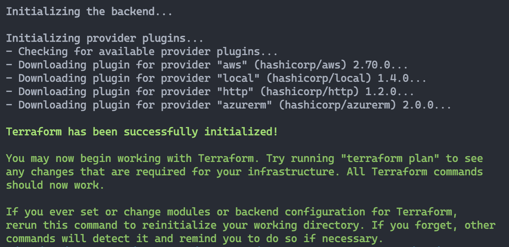

* (Optional but recommended) Run the ```terraform plan``` command to make sure everything is configured properly.

  

* Run the ```terraform apply --auto-approve``` command and wait for the plan to finish. **Runtime for deploying all the AWS resources for this plan is ~30min.**

* Once completed, the plan will output a decrypted password for your Windows Client instance. Before connecting to the Client instance, you can review the EKS cluster and the EC2 instances created. Notice how 3 instances were created; 2 EKS nodes and the Client instance.

  

  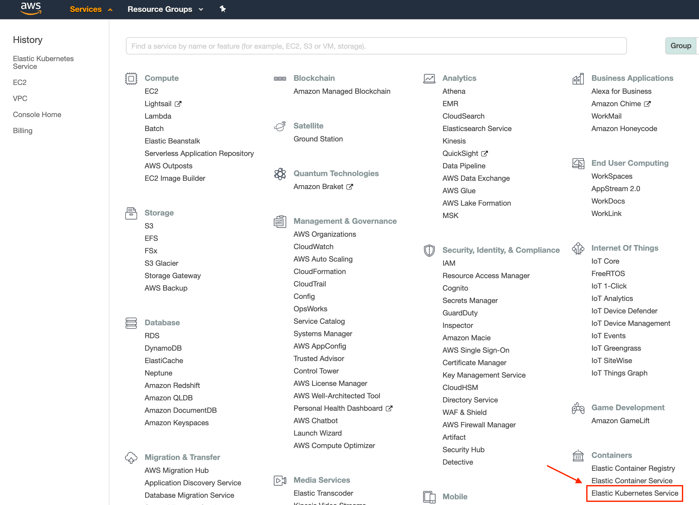

  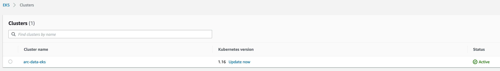

  

  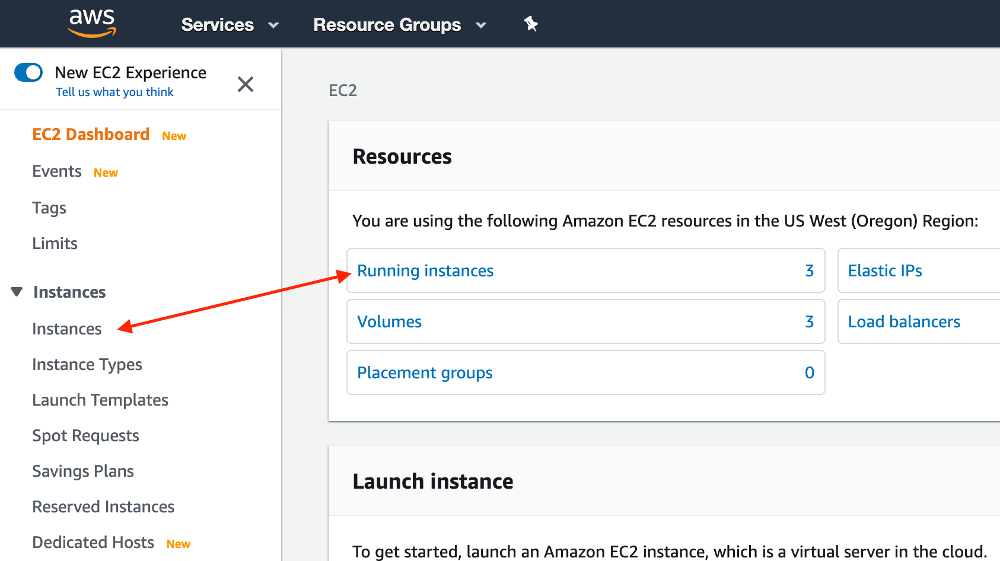

  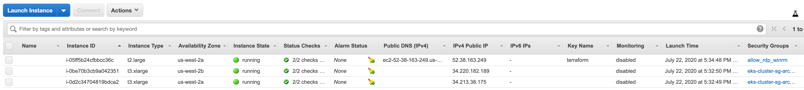

* In the Azure Portal, a new empty Azure Resource Group was created. As mentioned, this Resource Group will be used for Azure Arc Data Service you will be deploying in the future.

  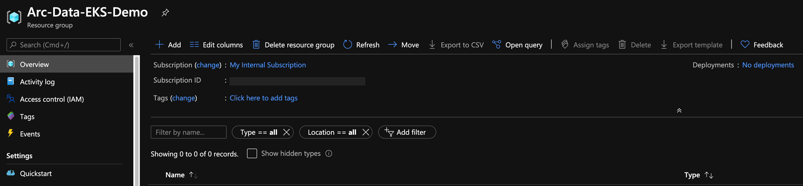

# Windows Login & Post Deployment

Now that both the EKS cluster and the Windows Server Client instance are created, it is time to login to the Client VM.

* Select the Windows instance, click *"Connect"* and download the Remote Desktop file.

  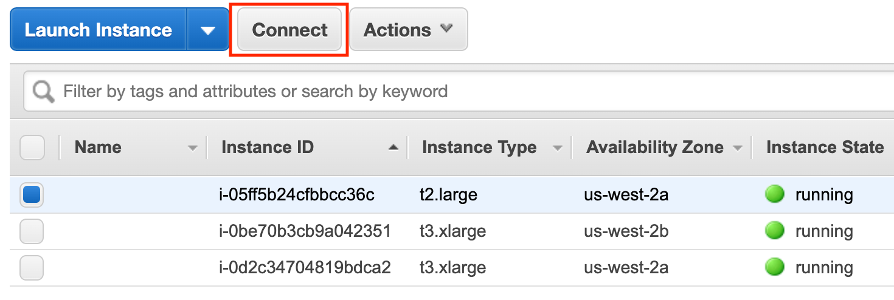

  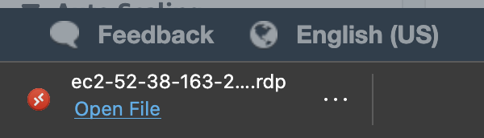

  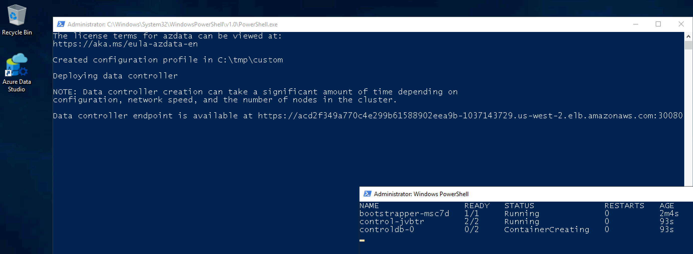

* Using the decrypted password, RDP the Windows instance. In case you need to get the password later, use the ```terraform output``` command to re-present the plan output. 

* At first login, as mentioned in the "Automation Flow" section, a logon script will get executed. This script was created as part of the automated deployment process. 

    Let the script to run it's course and **do not close** the Powershell session, this will be done for you once completed. You will notice that the Azure Arc Data Controller gets deployed on the EKS cluster. **The logon script run time is approximately 10min long**.

    Once the script will finish it's run, the logon script Powershell session will be closed and the Azure Arc Data Controller will be deployed on the EKS cluster and be ready to use.

  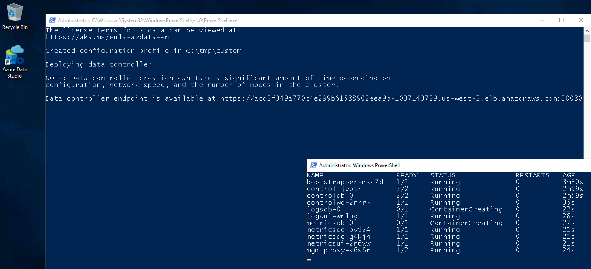

  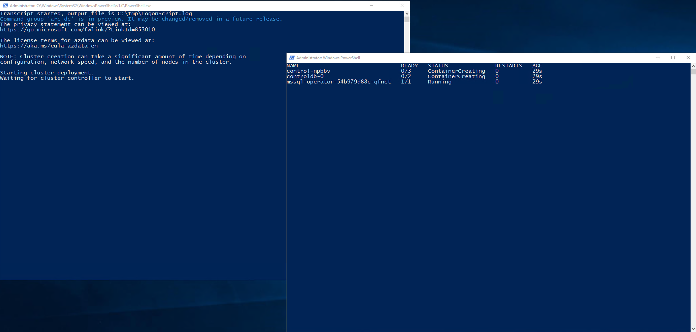

  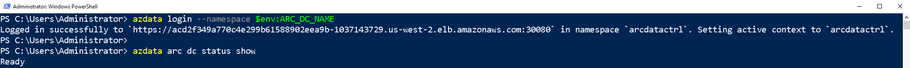

      

* Using Powershell, login to the Data Controller and check it's health using the below commands.

    ```powershell
    azdata login -n $env:ARC_DC_NAME
    azdata arc dc status show
    ```

  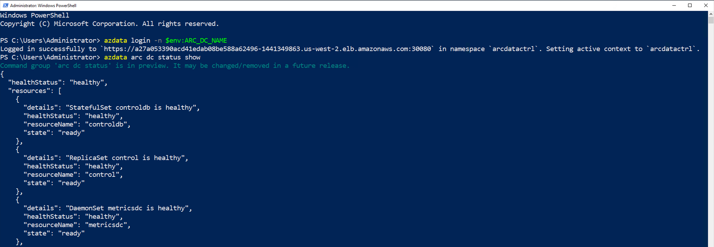

* Another tool automatically deployed is Azure Data Studio (Insiders Build) along with the *Azure Arc* and the *PostgreSQL* extensions. Using the Desktop shortcut created for you, open Azure Data Studio and click the Extensions settings to see both extensions. 

  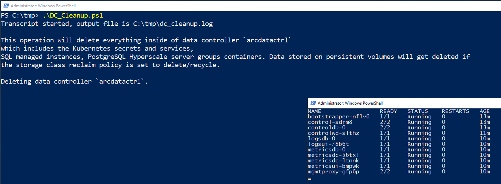

  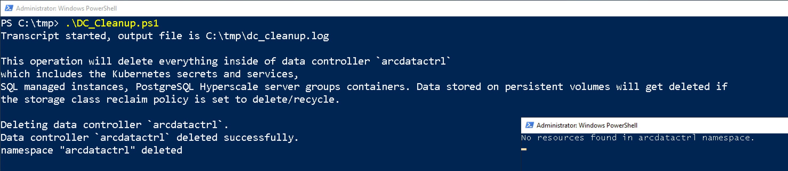

# Cleanup

* To delete the Azure Arc Data Controller and all of it's Kubernetes resources, run the *DC_Cleanup.ps1* Powershell script located in *C:\tmp* on the Windows Client instance. At the end of it's run, the script will close all Powershell sessions. **The Cleanup script run time is ~2-3min long**.

  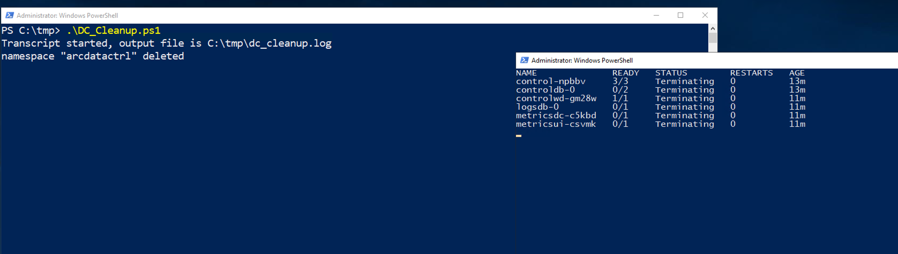

  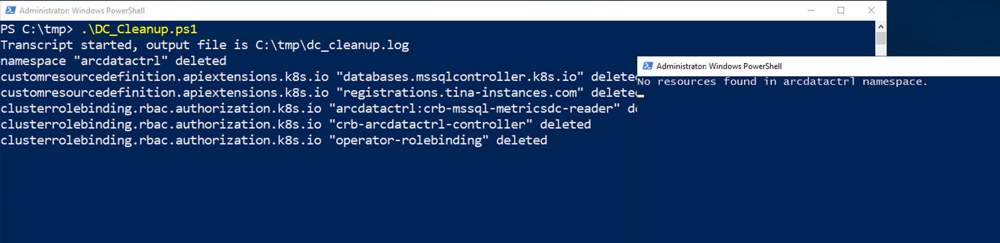

# Re-Deploy Azure Arc Data Controller

In case you deleted the Azure Arc Data Controller from the EKS cluster, you can re-deploy it by running the *DC_Deploy.ps1* Powershell script located in *C:\tmp* on the Windows Client instance. **The Deploy script run time is approximately ~3-4min long** 

  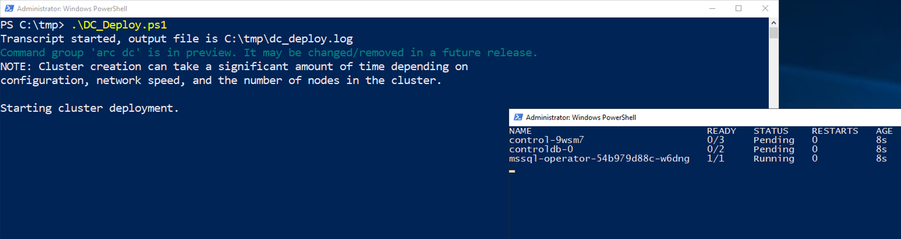

  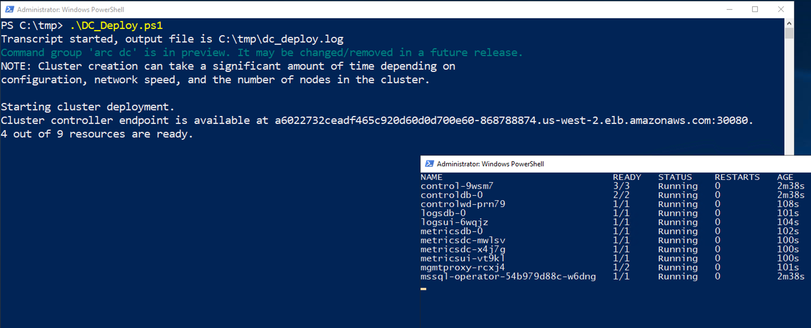 

# Delete the deployment

To completely delete the environment, follow the below steps:

  1. on the Windows Client instance, run the *DC_Cleanup.ps1* Powershell script.

  2. Run the ```terraform destroy --auto-approve``` which will delete the AWS resources as well the Azure Resource Group. **The *terraform destroy* run time is approximately ~8-9min long** 

  

  

  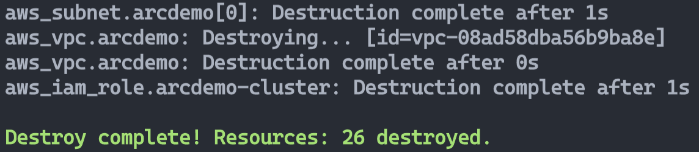