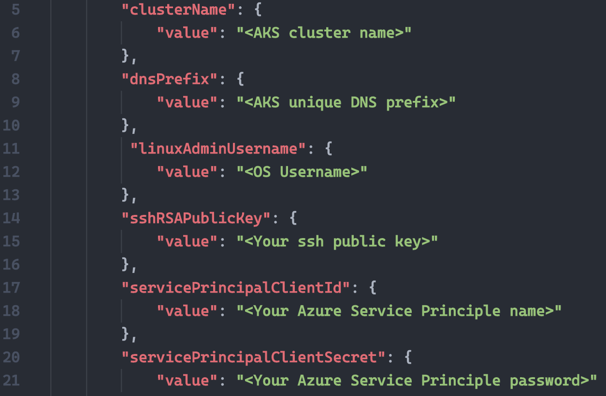
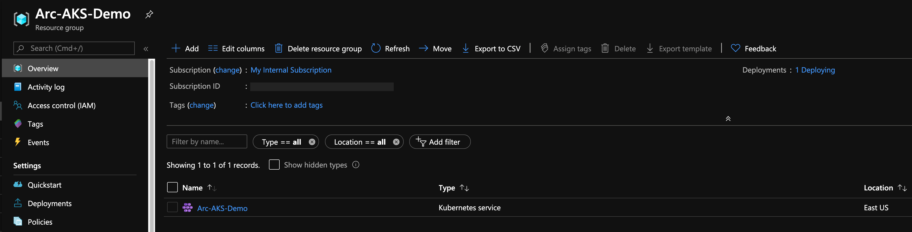
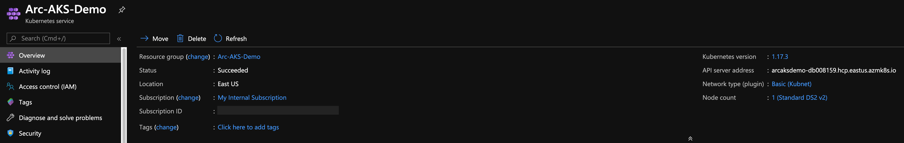
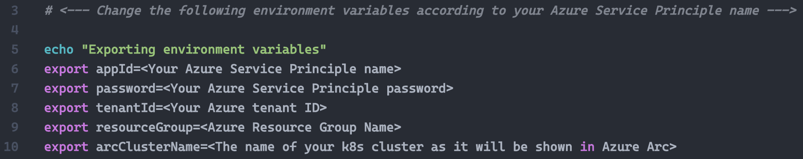
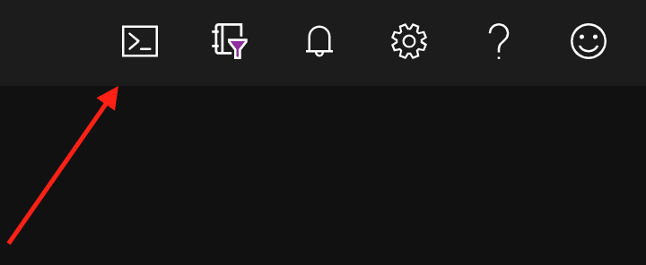
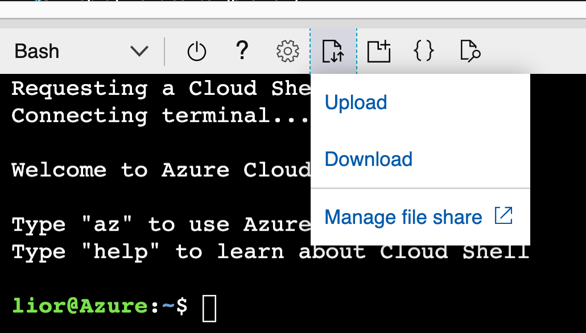
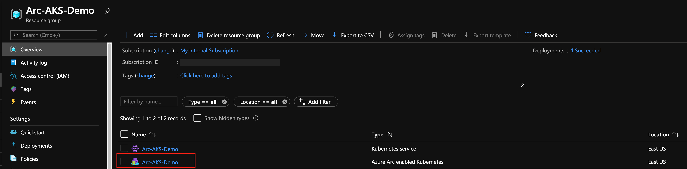
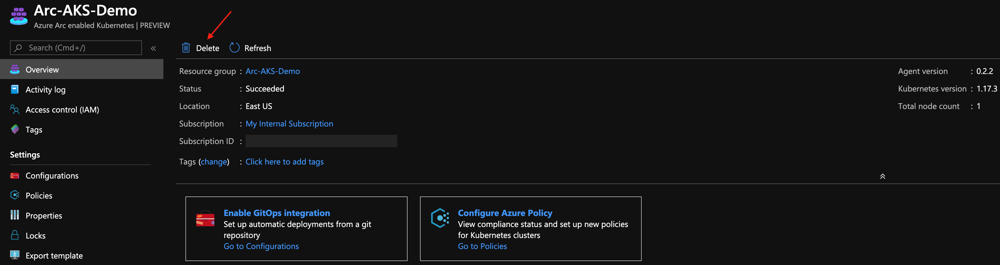

# Overview

The following README will guide you on how to use the provided [Azure ARM Template](https://docs.microsoft.com/en-us/azure/azure-resource-manager/templates/overview) to deploy an [Azure Kubernetes Service (AKS)](https://docs.microsoft.com/en-us/azure/aks/intro-kubernetes) cluster and connected it as an Azure Arc cluster resource.

# Prerequisites

* Clone this repo

    ```terminal
    git clone https://github.com/microsoft/azure_arc.git
    ```
    
* [Install or update Azure CLI](https://docs.microsoft.com/en-us/cli/azure/install-azure-cli?view=azure-cli-latest). **Azure CLI should be running version 2.7** or later. Use ```az --version``` to check your current installed version.

* [Generate SSH Key](https://docs.microsoft.com/en-us/azure/virtual-machines/linux/create-ssh-keys-detailed) (or use existing ssh key).

* Create Azure Service Principal (SP)   

    To connect a Kubernetes cluster to Azure Arc, Azure Service Principal assigned with the "Contributor" role is required. To create it, login to your Azure account run the below command (this can also be done in [Azure Cloud Shell](https://shell.azure.com/)). 

    ```bash
    az login
    az ad sp create-for-rbac -n "<Unique SP Name>" --role contributor
    ```

    For example:

    ```az ad sp create-for-rbac -n "http://AzureArcK8s" --role contributor```

    Output should look like this:

    ```
    {
    "appId": "XXXXXXXXXXXXXXXXXXXXXXXXXXXX",
    "displayName": "AzureArcK8s",
    "name": "http://AzureArcK8s",
    "password": "XXXXXXXXXXXXXXXXXXXXXXXXXXXX",
    "tenant": "XXXXXXXXXXXXXXXXXXXXXXXXXXXX"
    }
    ```
    
    **Note**: It is optional but highly recommended to scope the SP to a specific [Azure subscription and Resource Group](https://docs.microsoft.com/en-us/cli/azure/ad/sp?view=azure-cli-latest) 

* Enable subscription for two providers for Azure Arc enabled Kubernetes. Registration is an asynchronous process, and registration may take approximately 10 minutes.

  ```bash
  az provider register --namespace Microsoft.Kubernetes
  Registering is still on-going. You can monitor using 'az provider show -n Microsoft.Kubernetes'

  az provider register --namespace Microsoft.KubernetesConfiguration
  Registering is still on-going. You can monitor using 'az provider show -n Microsoft.KubernetesConfiguration'
  ```
  You can monitor the registration process with the following commands:
  ```bash
  az provider show -n Microsoft.Kubernetes -o table
 
  az provider show -n Microsoft.KubernetesConfiguration -o table
  ```

# Deployment

Before deploying the ARM template, determine which AKS Kubernetes versions are available in your region using the below Azure CLI command.

```az aks get-versions -l "<Your Azure Region>"```

The deployment is using the template parameters file. Before initiating the deployment, edit the [*azuredeploy.parameters.json*](../aks/arm_template/azuredeploy.parameters.json) file to match your environment and using one of the available Kubernetes Versions from the previous step. 



To deploy the ARM template, navigate to the [deployment folder](../aks/arm_template) and run the below command:

```bash
az group create --name <Name of the Azure Resource Group> --location <Azure Region>
az deployment group create \
--resource-group <Name of the Azure Resource Group> \
--name <The name of this deployment> \
--template-uri https://raw.githubusercontent.com/microsoft/azure_arc/master/azure_arc_k8s_jumpstart/aks/arm_template/azuredeploy.json \
--parameters <The *azuredeploy.parameters.json* parameters file location>
```

For example:

```bash
az group create --name Arc-AKS-Demo --location "East US"
az deployment group create \
--resource-group Arc-AKS-Demo \
--name arcaksdemo01 \
--template-uri https://raw.githubusercontent.com/microsoft/azure_arc/master/azure_arc_k8s_jumpstart/aks/arm_template/azuredeploy.json \
--parameters azuredeploy.parameters.json
```

Once the ARM template deployment is completed, a new AKS cluster in a new Azure Resource Group is created. 





# Connecting to Azure Arc

* Now that you have a running AKS cluster, edit the environment variables section in the included [az_connect_aks](../aks/arm_template/scripts/az_connect_aks.sh) shell script.



* In order to keep your local environment clean and untouched, we will use [Azure Cloud Shell](https://docs.microsoft.com/en-us/azure/cloud-shell/overview) (located in the top-right corner in the Azure portal) to run the *az_connect_aks* shell script against the AKS cluster. **Make sure Cloud Shell is configured to use Bash.**



* After editing the environment variables in the [*az_connect_aks*](../aks/arm_template/scripts/az_connect_aks.sh) shell script to match your parameters, save the file and then upload it to the Cloud Shell environment and run it using the ```. ./az_connect_aks.sh``` command.

**Note**: The extra dot is due to the script having an *export* function and needs to have the vars exported in the same shell session as the other commands. 




* Once the script run has finished, the AKS cluster will be projected as a new Azure Arc cluster resource.





# Delete the deployment

The most straightforward way is to delete the Azure Arc cluster resource via the Azure Portal, just select the cluster and delete it. 



If you want to nuke the entire environment, run the below commands.

```az deployment group delete --name <Deployment name> --resource-group <Azure Resource Group Name>```

```az group delete --name <Azure Resource Group Name> --yes```

For example:

```az deployment group delete --name arcaksdemo01 --resource-group Arc-AKS-Demo```

```az group delete --name Arc-AKS-Demo --yes```
