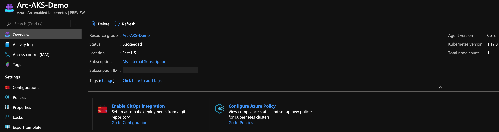

# Overview

The following README will guide you on how to create GitOps configuration on an Azure Kubernetes Service (AKS) cluster which is projected an Azure Arc connected cluster resource.

In this guide, you will deploy & attach GitOps configuration to your cluster which will also include deploying an "Hello World" Azure Arc web application on your Kubernetes cluster. By doing so, you will be able to make real-time changes to the application and show how the GitOps flow effect it. 

**Note: This guide assumes you already deployed an AKS cluster and connected it to Azure Arc. If you haven't, this repository offers you a way to do so in an automated fashion using either [ARM Template](aks_arm_template.md) or [Terraform](aks_terraform.md).**

# Prerequisites

* Clone this repo

* Clone the ["Hello Arc"](https://github.com/likamrat/hello_arc) demo application repository. 

* (Optional) Install the "Tab Auto Refresh" extension for your browser. This will help you to show the real-time changes on the application in an automated way. 

    * [Microsoft Edge](https://microsoftedge.microsoft.com/addons/detail/odiofbnciojkpogljollobmhplkhmofe)

    * [Google Chrome](https://chrome.google.com/webstore/detail/tab-auto-refresh/jaioibhbkffompljnnipmpkeafhpicpd?hl=en)

    * [Mozilla Firefox](https://addons.mozilla.org/en-US/firefox/addon/tab-auto-refresh/)

* As mentioned, this guide starts at the point where you already deployed and connected AKS to Azure Arc.

    

    

* [Install or update Azure CLI](https://docs.microsoft.com/en-us/cli/azure/install-azure-cli?view=azure-cli-latest). Azure CLI should be running version 2.6.0 or later. Use ```az --version``` to check your current installed version.

* Create Azure Service Principal (SP)   

    To connect a Kubernetes cluster to Azure Arc, Azure Service Principal assigned with the "Contributor" role is required. To create it, login to your Azure account run the following command:

    ```bash
    az login
    az ad sp create-for-rbac -n "<Unique SP Name>" --skip-assignment
    ```

    For example:

    ```az ad sp create-for-rbac -n "http://AzureArcK8s" --skip-assignment```

    Output should look like this:
    ```terminal
    {
    "appId": "XXXXXXXXXXXXXXXXXXXXXXXXXXXX",
    "displayName": "AzureArcK8s",
    "name": "http://AzureArcK8s",
    "password": "XXXXXXXXXXXXXXXXXXXXXXXXXXXX",
    "tenant": "XXXXXXXXXXXXXXXXXXXXXXXXXXXX"
    }
    ```

    Then, assign a the "Contributor" role to the SP you've just created.

    ```az role assignment create --assignee "<Unique SP Name>" --role contributor```
    
    **Note**: It is optional but highly recommended to scope the SP to a specific [Azure subscription and Resource Group](https://docs.microsoft.com/en-us/cli/azure/ad/sp?view=azure-cli-latest) 

# Azure Arc Kubernetes GitOps Configuration & The "Hello Arc" Application

* In order to keep your local environment clean and untouched, we will use [Azure Cloud Shell](https://docs.microsoft.com/en-us/azure/cloud-shell/overview) (located in the top-right corner in the Azure portal) to run the *az_connect_aks* shell script against the AKS cluster. **Make sure Cloud Shell is configured to use Bash.**


* Edit the environment variables in the [*az_k8sconfig_aks*](../aks/gitops/az_k8sconfig_aks.sh) shell script to match your parameters, upload it to the Cloud Shell environment and run it using the ```. ./az_k8sconfig_aks.sh``` command.

The script will:

- Login to your Azure subscription using the SPN credentials
- Retrieve the cluster credentials (KUBECONFIG)
- Will use Helm to deploy NGINX ingress controller
- Create the GitOps configurations and deploy the Flux operator and Memcached on the Azure Arc connected cluster
- Deploy the ["Hello Arc"](https://github.com/likamrat/hello_arc) application along side an Ingress rule to make it available from outside the cluster. 

**Note**: The extra dot is due to the script has an *export* function and needs to have the vars exported in the same shell session as the rest of the commands. 


