# Overview

The following README will guide you on how to use the provided [Terraform](https://www.terraform.io/) plan to deploy an [Azure Kubernetes Service (AKS)](https://docs.microsoft.com/en-us/azure/aks/intro-kubernetes) cluster and connected it as an Azure Arc cluster resource.

# Prerequisites

* Clone this repo

    ```terminal
    git clone https://github.com/microsoft/azure_arc.git
    ```
    
* [Install or update Azure CLI](https://docs.microsoft.com/en-us/cli/azure/install-azure-cli?view=azure-cli-latest). **Azure CLI should be running version 2.7** or later. Use ```az --version``` to check your current installed version.

* [Install Terraform >=0.12](https://learn.hashicorp.com/terraform/getting-started/install.html)

* Create Azure Service Principal (SP)   

    To connect a Kubernetes cluster to Azure Arc, Azure Service Principal assigned with the "Contributor" role is required. To create it, login to your Azure account run the below command (this can also be done in [Azure Cloud Shell](https://shell.azure.com/)).

    ```bash
    az login
    az ad sp create-for-rbac -n "<Unique SP Name>" --role contributor
    ```

    For example:

    ```az ad sp create-for-rbac -n "http://AzureArcK8s" --role contributor```

    Output should look like this:

    ```
    {
    "appId": "XXXXXXXXXXXXXXXXXXXXXXXXXXXX",
    "displayName": "AzureArcK8s",
    "name": "http://AzureArcK8s",
    "password": "XXXXXXXXXXXXXXXXXXXXXXXXXXXX",
    "tenant": "XXXXXXXXXXXXXXXXXXXXXXXXXXXX"
    }
    ```
    
    **Note**: It is optional but highly recommended to scope the SP to a specific [Azure subscription and Resource Group](https://docs.microsoft.com/en-us/cli/azure/ad/sp?view=azure-cli-latest) 

* Enable subscription for two providers for Azure Arc enabled Kubernetes<br> 
  Registration is an asynchronous process, and registration may take approximately 10 minutes.
  ```bash
  az provider register --namespace Microsoft.Kubernetes
  Registering is still on-going. You can monitor using 'az provider show -n Microsoft.Kubernetes'

  az provider register --namespace Microsoft.KubernetesConfiguration
  Registering is still on-going. You can monitor using 'az provider show -n Microsoft.KubernetesConfiguration'
  ```
  You can monitor the registration process with the following commands:
  ```bash
  az provider show -n Microsoft.Kubernetes -o table
 
  az provider show -n Microsoft.KubernetesConfiguration -o table
  ```

# Deployment

The only thing you need to do before executing the Terraform plan is to export the environment variables which will be used by the plan. This is based on the Azure Service Principle you've just created and your subscription.  

In addition, validate that the AKS Kubernetes version is available in your region using the below Azure CLI command.

```az aks get-versions -l "<Your Azure Region>"```

In case the AKS service is not available in your region, you can change the AKS Kubernetes version in the [*variables.tf*](../aks/terraform/variables.tf) file by searching for *kubernetes_version*.

* Export the environment variables needed for the Terraform plan.

    ```export TF_VAR_client_id=<Your Azure Service Principal App ID>```   
    ```export TF_VAR_client_secret=<Your Azure Service Principal App Password>```

* Run the ```terraform init``` command which will download the Terraform AzureRM provider.

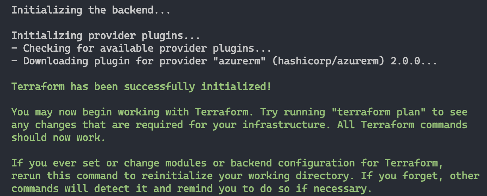

* Run the ```terraform apply --auto-approve``` command and wait for the plan to finish. 

Once the Terraform deployment is completed, a new AKS cluster in a new Azure Resource Group is created. 

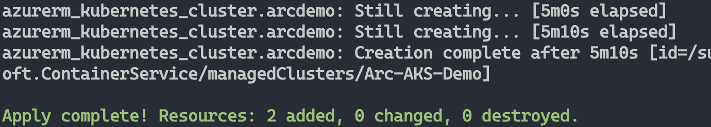

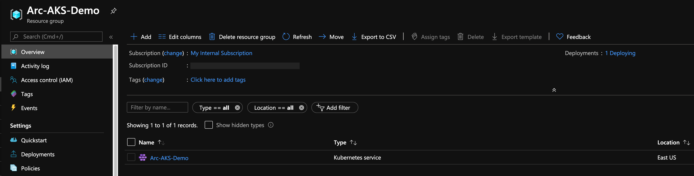


* Now that you have a running AKS cluster, edit the environment variables section in the included [az_connect_aks](../aks/terraform/scripts/az_connect_aks.sh) shell script.

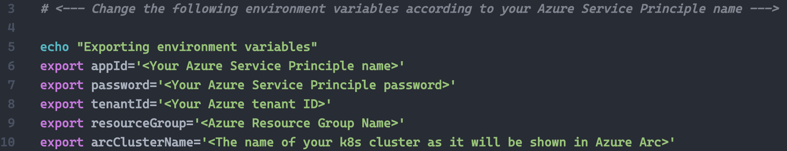

* In order to keep your local environment clean and untouched, we will use [Azure Cloud Shell](https://docs.microsoft.com/en-us/azure/cloud-shell/overview) (located in the top-right corner in the Azure portal) to run the *az_connect_aks* shell script against the AKS cluster. **Make sure Cloud Shell is configured to use Bash.** 


* Edit the environment variables in the [*az_connect_aks*](../aks/terraform/scripts/az_connect_aks.sh) shell script to match your parameters, upload it to the Cloud Shell environment and run it using the ```. ./az_connect_aks.sh``` command.

**Note**: The extra dot is due to the script has an *export* function and needs to have the vars exported in the same shell session as the rest of the commands. 

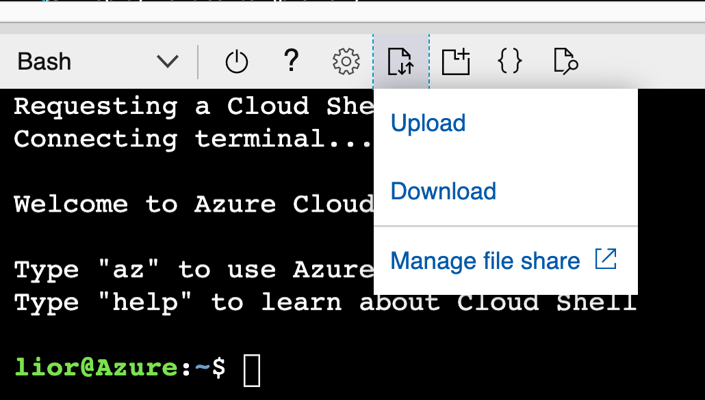

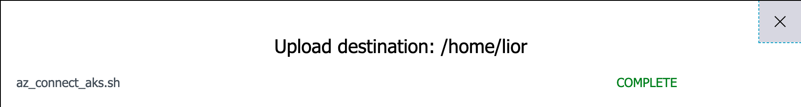

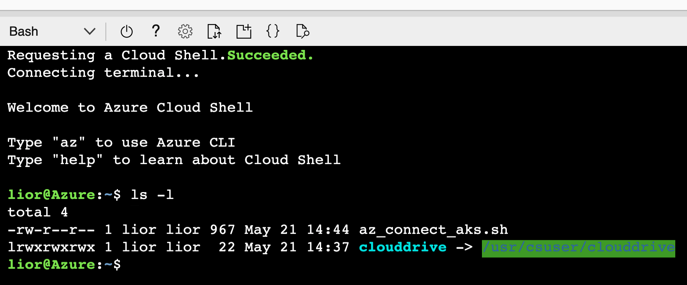

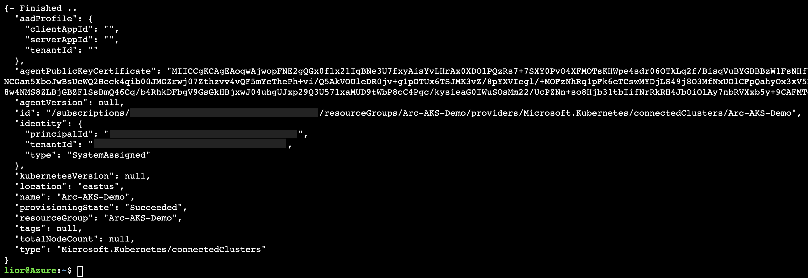

* Once the script run has finished, the AKS cluster will be projected as a new Azure Arc cluster resource.


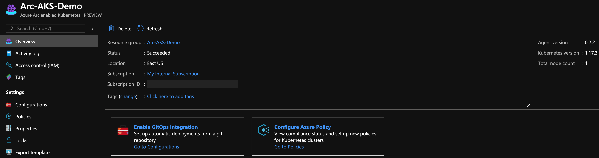

# Delete the deployment

The most straightforward way is to delete the Azure Arc cluster resource via the Azure Portal, just select the cluster and delete it. 

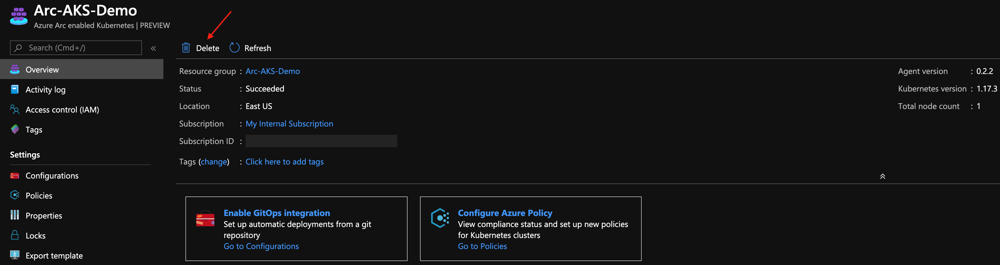

If you want to nuke the entire environment, delete both the AKS and the AKS resources Resource Groups or run the ```terraform destroy -auto-approve``` command.

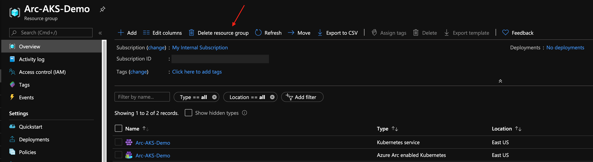

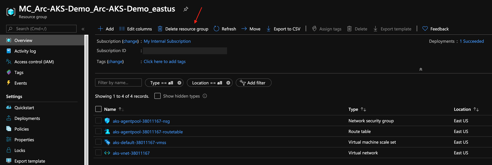
