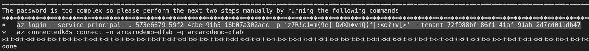
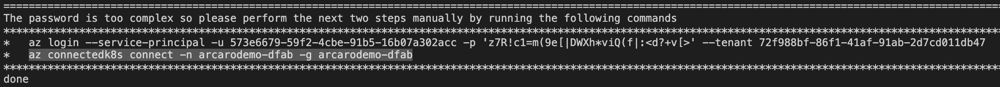
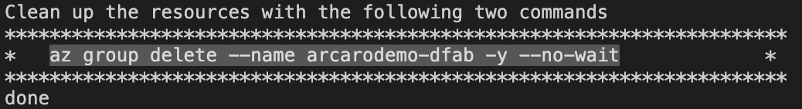
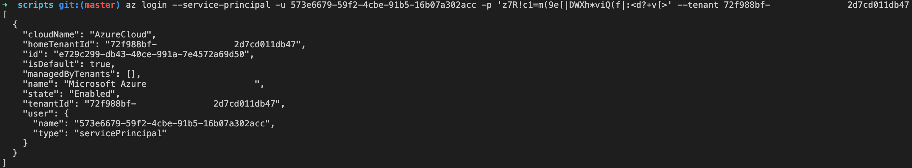
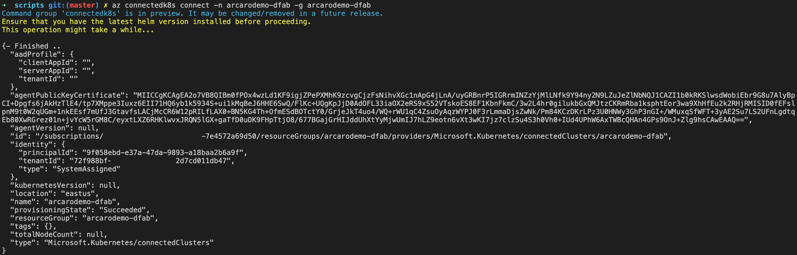
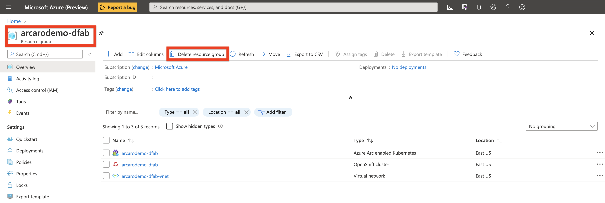

# Overview

The following README will guide you on how to use the Azure CLI to deploy an Azure Red Hat OpenShift 4 cluster connected it as an Azure Arc cluster resource.

# Prerequisites

* [Install or update Azure CLI](https://docs.microsoft.com/en-us/cli/azure/install-azure-cli?view=azure-cli-latest). Azure CLI should be running version 2.6.0 or later. Use ```az --version``` to check your current installed version.


# Deployment
There are two sets of resources that will be deployed, first is the Azure RedHat Openshift Container cluster. Second is the Azure Arc Kubernetes resource that will connect the ```aro``` cluster to Azure Arc.

The deployment of all resources is going to be done via Azure CLI.


  * Log into Azure CLI.
    ```bash
    az login
    ```

  * Run the following automation script:
    ```bash
    wget -O - https://tinyurl.com/y85vpku9 | bash
    ```
  
    This script will perform the following tasks:
      *  Set the approprite environment variables
      *  Ensure providers are registered
      *  Ensure ```az``` extensions are added
      *  Install the ```oc``` command line, ```helm```, and ```kubectl```
      *  Deploy Azure Resource Group
      *  Deploy Azure VNet and appropriate Subnets
      *  Deploy Azure Red Hat OpenShift Cluster
      *  Create an Azure Service Principal
      *  Give two commands to finish the deployment of Azure ARC for Kubernetes
      *  One command to clean up deployed resources
  
  * Finish deployment by running the two suggested commands:
    

    


    **Note** The command to clean up the deployed resources as well:
    <br>
    This command will be used to clean up resources at the end.

  * Log in to Service prinipal from the suggested command earlier:
     <br>
  * Run the command to deploy the Azure ARC for Kubernetes resource
  
     <br>


  * Upon completion, you will have the following resources deployed in the resource group:
    *  Azure Arc enabled Kubernetes
    *  OpenShift cluster<br><br>

    

# Delete the deployment

In Azure, the most straightforward way is to delete the cluster or the Resource Group via the Azure Portal or through the CLI.

Use the command provided earlier to delete the resource group.

  <br><br>
  