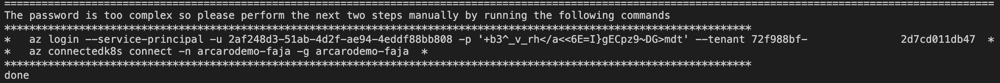
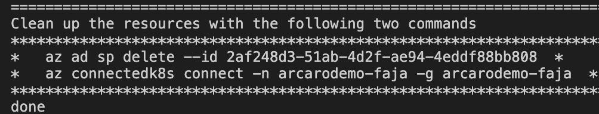
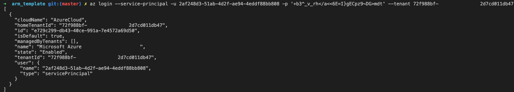
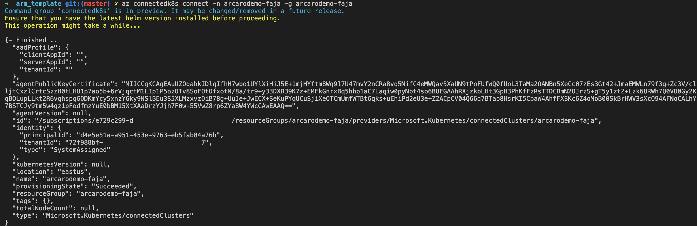
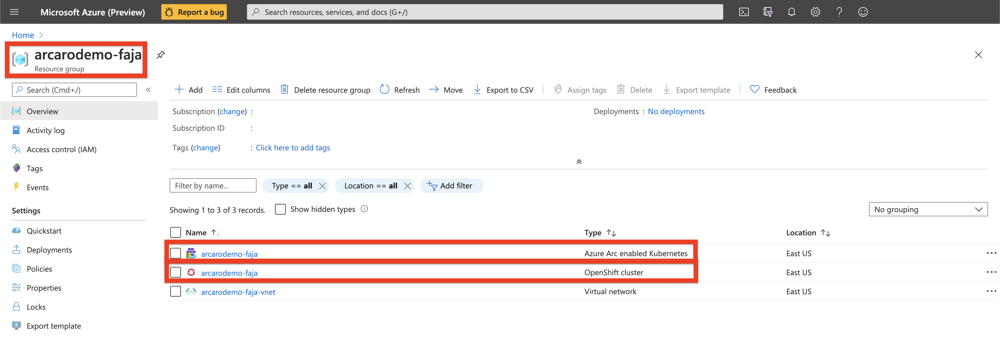

# Overview

The following README will guide you on how to use the Azure CLI to deploy an Azure Red Hat OpenShift 4 cluster connected it as an Azure Arc cluster resource.

# Deployment
There are two sets of resources that will be deployed, first is the Azure RedHat Openshift Container cluster. Second is the Azure Arc Kubernetes resource that will connect the ```aro``` cluster to Azure Arc.

The deployment of all resources is going to be done via Azure CLI.


  * Log into Azure CLI.
    ```bash
    az login
    ```
  

  * Run the following automation script:
    ```bash
    wget -O - https://tinyurl.com/y85vpku9 | bash
    ```
  
    This script will perform the following tasks:
      *  Set the approprite environment variables
      *  Ensure providers are registered
      *  Ensure ```az``` extensions are added
      *  Install the ```oc``` command line, ```helm```, and ```kubectl```
      *  Deploy Azure Resource Group
      *  Deploy Azure VNet and appropriate Subnets
      *  Deploy Azure Red Hat OpenShift Cluster
      *  Create an Azure Service Principal
      *  Give two commands to finish the deployment of Azure ARC for Kubernetes
      *  Give two commands to clean up deployed resources
  
  * Finish deployment by running the two suggested commands:
    

    **Note** The two commands to clean up the deployed resources as well:
    <br>
    These commands will be used to clean up resources at the end.

  * Log in to Service prinipal from the suggested command earlier:
     <br>
  * Run the command to deploy the Azure ARC for Kubernetes resource
  
     <br>


  * Upon completion, you will have the following resources deployed in the resource group:
    *  Azure Arc enabled Kubernetes
    *  OpenShift cluster<br><br>

    

# Delete the deployment

In Azure, the most straightforward way is to delete the cluster or the Resource Group via the Azure Portal or through the CLI.

```bash
az group delete --name $RESOURCEGROUP
```
  