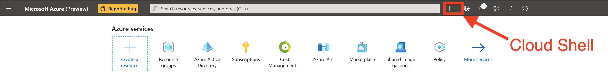
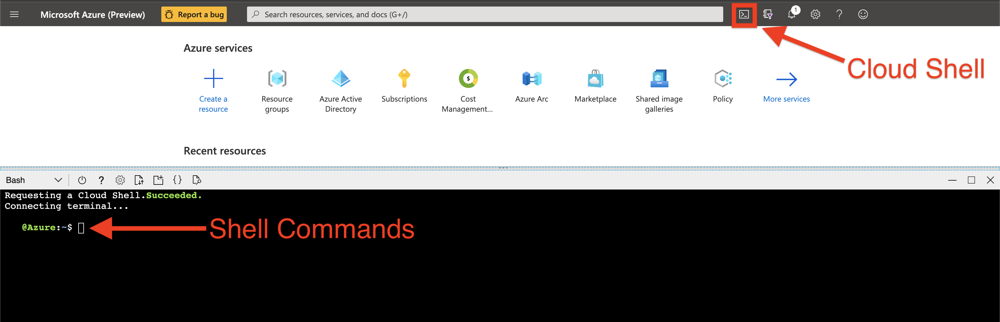
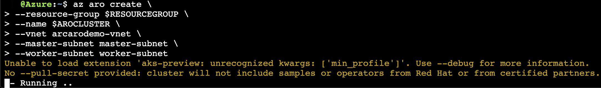
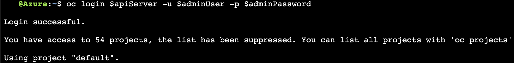
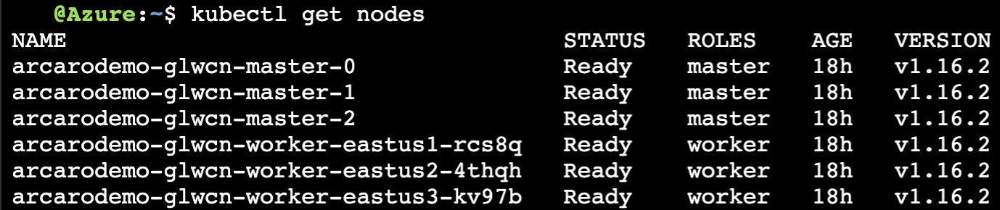
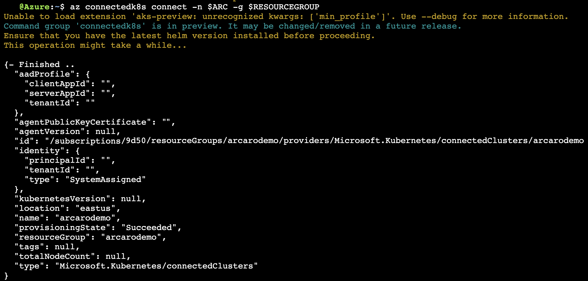
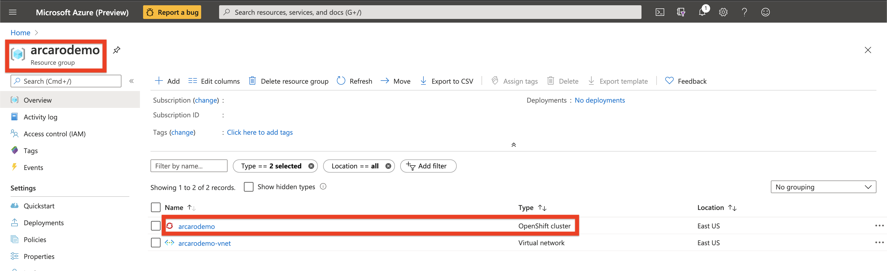

# Overview

The following is a guide on how to use the Azure Cloud Shell to deploy an [Azure Red Hat OpenShift](https://azure.microsoft.com/en-us/services/openshift/) 4 cluster and have it as a connected Azure Arc Kubernetes resource.

# Prerequisite 
Ensure the user logging into Azure portal as admin or co-admin rights to be able to create service principals and/or assign policies to those service principals.

# Deployment
There are two sets of resources that will be deployed, first is the Azure RedHat Openshift Container cluster. Second is the Azure Arc Kubernetes resource that will connect the ```aro``` cluster to Azure Arc.

The deployment of all resources is going to be done via Azure Cloud Shell.


  * Log into Azure Cloud Shell.

    <br>

  * Run the following script:
    ```bash
    wget -O - https://raw.githubusercontent.com/microsoft/azure_arc/master/azure_arc_k8s_jumpstart/aro/run.sh | bash
    ```
  
    This script will perform the following tasks:
      *  Deploy the following Resources:
         *  Azure Container Instance
         * Azure VNet
         * Azure Redhat OpenShift (```aro```) cluster
         * Azure Arc K8s connected resource
      *  Ensure required providers are registered
    
    When the script is finished copy the **device login code**
    
    <br>
  
  * To start creating resources first log into [Azure device login page](https://microsoft.com/devicelogin) and authenticate your credentials and that code copied earlier.
  
    <br>
    
  * Close the Cloud Shell and navigate to the Resource Group

    <br>

    <br>

  *  To track progress navigate to the logs of the container by selecting **Containers** under **Settings** and then selecting **Logs**. This deployment can take upto ***50 mins***.

      <br>

  * Upon completion, the following resources will be deployed in the resource group:
    *  Azure Arc enabled Kubernetes
    *  OpenShift cluster
    *  Azure VNet<br><br>

    

# Delete the deployment

The way to delete all the resources deployed is by deleting the resource group. This will delete the managed resource group as well that was created for Azure Redhat OpenShift cluster.

