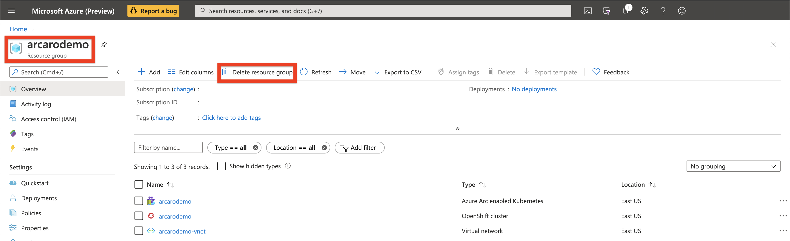

# Overview

The following README will guide you on how to use the Azure CLI to deploy an Azure Red Hat OpenShift 4 cluster connected it as an Azure Arc cluster resource.

# Prerequisites

* Create Azure Service Principal (SP) **(This can be done in Cloud Shell as well)**

    To connect the EKS cluster to Azure Arc, Azure Service Principal is required and can be created by:


    ```
    az login

    az ad sp create-for-rbac -n "http://AzureArcK8s" --role contributor
    ``` 

    Output should look like this:
    ```
    {
       "appId": "XXXXXXXXXXXXXXXXXXXXXXXXXXXX",
       "displayName": "AzureArcK8s",
       "name": "http://AzureArcK8s",
       "password": "XXXXXXXXXXXXXXXXXXXXXXXXXXXX",
       "tenant": "XXXXXXXXXXXXXXXXXXXXXXXXXXXX"
    }
    ```
    **Note**: It is optional but highly recommended to scope the SP to a specific [Azure subscription and Resource Group](https://docs.microsoft.com/en-us/cli/azure/ad/sp?view=azure-cli-latest) 

* Enable subscription for the three providers: <br>
   * Two for Azure Arc enabled Kubernetes
   * One for RedHat OpenShift clusters

  Registration is an asynchronous process, and registration may take approximately 10 minutes.

  ```bash
  az provider register --namespace Microsoft.Kubernetes
  Registering is still on-going. You can monitor using 'az provider show -n Microsoft.Kubernetes'

  az provider register --namespace Microsoft.KubernetesConfiguration
  Registering is still on-going. You can monitor using 'az provider show -n Microsoft.KubernetesConfiguration'

  az provider register -namespace Microsoft.RedHatOpenShift
    Registering is still on-going. You can monitor using 'az provider show -n Microsoft.RedHatOpenShift
  ```
  You can monitor the registration process with the following commands:
  ```bash
  az provider show -n Microsoft.Kubernetes -o table
 
  az provider show -n Microsoft.KubernetesConfiguration -o table

  az provider show -n Microsoft.RedHatOpenShift -o table
  ```

* Install the ***connectedk8s***, ***k8sconfiguration*** and ***aro*** extension, which helps you deploy an Azure RedHat Openshift cluster and connect it to Arc Kubernetes cluster service.

  ```bash
  az extension add --name connectedk8s
  az extension add --name k8sconfiguration
  az extension add --name aro --index https://az.aroapp.io/stable
  ```

# Deployment
There are two sets of resources that will be deployed, first is the Azure RedHat Openshift Container cluster. Second is the Azure Arc Kubernetes resource that will connect the ```aro``` cluster to Azure Arc.

The deployment of all resources is going to be performed on Azure Cloud Shell.

  * Log into Azure Cloud Shell
  


  * Set the following variables to help run the preceeding commands.
    ```bash
    LOCATION=eastus                 # the location of your cluster
    RESOURCEGROUP=arcarodemo        # the name of the resource group where you want to create your cluster
    AROCLUSTER=arcarodemo           # the name of your Openshift Container cluster
    ARC=arcarodemo                  # the name of the Arc Kubernetes resource
    ```
  * Create a resource group
    ```bash
    az group create --name $RESOURCEGROUP --location $LOCATION
    ```
    The following example output shows the resource group created successfully:
    ```bash
    {
      "id": "/subscriptions/<guid>/resourceGroups/arcarodemo",
      "location": "eastus",
      "managedBy": null,
      "name": "arcarodemo",
      "properties": {
          "provisioningState": "Succeeded"
      },
      "tags": null
    }
    ```

  * **Create a virtual network**<br>
    Azure Red Hat OpenShift clusters running OpenShift 4 require a virtual network with two empty subnets, for the master and worker nodes.

    Create a new virtual network in the same resource group you created earlier.
    ```bash
    az network vnet create --resource-group $RESOURCEGROUP --name arcarodemo-vnet --address-prefixes 10.0.0.0/22
    ```
    The following example output shows the virtual network created successfully:
    ```bash
    {
      "newVNet": {
          "addressSpace": {
          "addressPrefixes": [
              "10.0.0.0/22"
          ]
          },
          "id": "/subscriptions/<guid>/resourceGroups/arcarodemo/providers/Microsoft.Network/virtualNetworks/arcarodemo-vnet",
          "location": "eastus",
          "name": "arcarodemo-vnet",
          "provisioningState": "Succeeded",
          "resourceGroup": "arcarodemo",
          "type": "Microsoft.Network/virtualNetworks"
      }
    }
    ```
  * Add an empty subnet for the master nodes.
    ```bash
    az network vnet subnet create \
    --resource-group $RESOURCEGROUP \
    --vnet-name arcarodemo-vnet \
    --name master-subnet \
    --address-prefixes 10.0.0.0/23 \
    --service-endpoints Microsoft.ContainerRegistry
    ```

  * Add an empty subnet for the worker nodes.
    ```bash
    az network vnet subnet create \
    --resource-group $RESOURCEGROUP \
    --vnet-name arcarodemo-vnet \
    --name worker-subnet \
    --address-prefixes 10.0.2.0/23 \
    --service-endpoints Microsoft.ContainerRegistry
    ```
  * [Disable subnet private endpoint policies](https://docs.microsoft.com/en-us/azure/private-link/disable-private-link-service-network-policy) on the master subnet. This is required to be able to connect and manage the cluster.
    ```bash
    az network vnet subnet update \
    --name master-subnet \
    --resource-group $RESOURCEGROUP \
    --vnet-name arcarodemo-vnet \
    --disable-private-link-service-network-policies true
    ```
  * Create the Openshift Container Cluster:
    ```bash
    az aro create \
    --resource-group $RESOURCEGROUP \
    --name $AROCLUSTER \
    --vnet arcarodemo-vnet \
    --master-subnet master-subnet \
    --worker-subnet worker-subnet
    ```
    

  * Finish Deploying ARO Cluster:<br>

    

    

# Connecting to Azure Arc

Now that you have a running ```aro``` cluster, lets connect the ARO cluster to Azure Arc by:<br>

  * Install ```oc``` command-line in Cloud Shell.
    ```bash
    cd ~
    wget https://mirror.openshift.com/pub/openshift-v4/clients/ocp/latest/openshift-client-linux.tar.gz

    mkdir openshift
    tar -zxvf openshift-client-linux.tar.gz -C openshift
    echo 'export PATH=$PATH:~/openshift' >> ~/.bashrc && source ~/.bashrc
    ```
  * Fetch ```oc``` admin credentials to log into Openshift cluster command line.
    ```bash
    adminUser=$(az aro list-credentials --name $AROCLUSTER --resource-group $RESOURCEGROUP --query kubeadminUsername -o tsv)
    adminPassword=$(az aro list-credentials --name $AROCLUSTER --resource-group $RESOURCEGROUP --query kubeadminPassword -o tsv)
    ```
  *  Retrieve the API server's address:
      ```bash
      apiServer=$(az aro show -g $RESOURCEGROUP -n $AROCLUSTER --query apiserverProfile.url -o tsv)
      ```
    
  * Log into via ```oc``` command line
    ```bash
    oc login $apiServer -u $adminUser -p $adminPassword
    ```
    Output:
    
  
  * Verify ```kubeconfig``` was pupulated:
    ```bash
    kubectl get nodes -o wide
    ```
    Output:<br>
    


  * Login to previously created [***Service Principal***](#prerequisites) <br>
    ```bash
    az login --service-principal -u mySpnClientId -p mySpnClientSecret --tenant myTenantID
    ```

  * Deploy Arc binaries using Azure CLI:
    ```bash
    az connectedk8s connect -n $ARC -g $RESOURCEGROUP
    ```
    Output:<br>
    
    


  * Upon completion, you will have your Arc Kubernetes Resource in the the same resource group. <br>

    

# Delete the deployment

In Azure, the most straightforward way is to delete the cluster or the Resource Group via the Azure Portal or through the CLI.

```bash
az group delete --name $RESOURCEGROUP
```
  