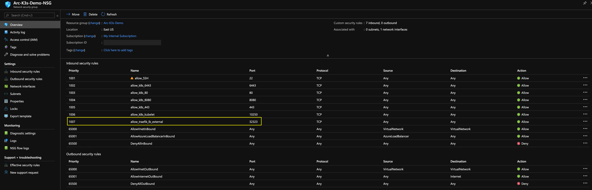
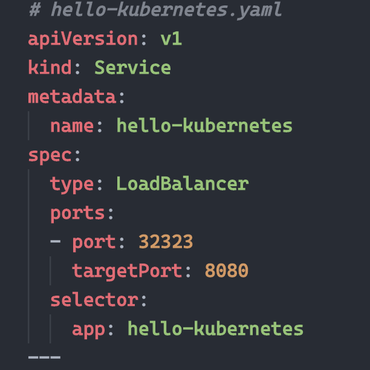

# Overview

The following README will guide you on how to use the provided Azure ARM template to deploy a "Ready to Go" virtual machine installed with single-master Rancher K3s Kubernetes cluster and connected it as an Azure Arc cluster resource.

# Prerequisites

* Clone or fork this repo.

* To deploy the ARM template, Azure CLI is required. To install it, follow the official Azure [document](https://docs.microsoft.com/en-us/cli/azure/install-azure-cli?view=azure-cli-latest).

### Create Azure Service Principal (SP)   
To connect the K3s cluster installed on the VM to Azure Arc, Azure Service Principal assigned with the "Contributor" role is required. To create it, login to your Azure account run the following command:

```az login``

```az ad sp create-for-rbac -n "http://AzureArc" --role contributor```

Output should look like this:

    ```
    {
    "appId": "aedXXXXXXXXXXXXXXXXXXac661",
    "displayName": "AzureArcK8s",
    "name": "http://AzureArcK8s",
    "password": "b54XXXXXXXXXXXXXXXXXb2338e",
    "tenant": "72f98XXXXXXXXXXXXXXXXX11db47"
    }
    ```

**Note**: It is optional but highly recommended to scope the SP to a specific [Azure subscription and Resource Group](https://docs.microsoft.com/en-us/cli/azure/ad/sp?view=azure-cli-latest)

# Deployment 

The deployment is using the template parameters file. Before initiating the deployment, edit the [*azuredeploy.parameters.json*](../azure/arm_template/azuredeploy.parameters.json) file to include the OS username and password as well as the appId, password and tenant generated from the service principal creation.  

## If you cloned this repo

If you cloned this repository and made these changes locally, run the below command:

```az group create --name <Name of the Azure Resource Group> --location <Azure Region>```   
```az deployment group create \```   
```--resource-group <Name of the Azure Resource Group> \```   
```--name <The name of this deployment> \```   
```--template-file <The *azuredeploy.json* template file location> \```   
```--parameters <The *azuredeploy.parameters.json* parameters file location>```

For example and to make it easy for you, ```cd``` to the directory of the ARM template json files and run the command and wait for it to finish.. 

```az group create --name Arc-K3s-Demo --location "East US"```   
```az deployment group create \```   
```--resource-group Arc-K3s-Demo \```   
```--name arck3sdemo01 \```   
```--template-file azuredeploy.json \```   
```--parameters azuredeploy.parameters.json```

## If you forked this repo

If you forked this repository and you are pushing the changes to the forked repo, run the below command and wait for it to finish.

```az group create --name Arc-K3s-Demo --location "East US"```   
```az deployment group create \```   
```--resource-group Arc-K3s-Demo \```   
```--name arck3sdemo01 \```   
```--template-uri <The *azuredeploy.json* template file location in your GitHub repo> \```   
```--parameters <The *azuredeploy.parameters.json* template file location in your GitHub repo>```

For example:

```az group create --name Arc-K3s-Demo --location "East US"```   
```az deployment group create \```   
```--resource-group Arc-K3s-Demo \```   
```--name arck3sdemo01 \```   
```--template-uri https://raw.githubusercontent.com/likamrat/azure_arc/master/azure_arc_k8s_jumpstart/azure/arm_template/azuredeploy.json \```   
```--parameters https://raw.githubusercontent.com/likamrat/azure_arc/master/azure_arc_k8s_jumpstart/azure/arm_template/azuredeploy.parameters.json```


# Connecting to Azure Arc

**Note:** The VM bootstrap includes the log in process to Azure as well deploying the needed Azure Arc CLI extensions - no action items on you there!

* SSH to the VM using the created Azure Public IP and your username/password.

  

* Check the cluster is up and running using the ```kubectl get nodes -o wide```

  

* Using the Azure Service Principle you've created, run the below command to connect the cluster to Azure Arc.

    ```az connectedk8s connect --name <Name of your cluster as it will be shown in Azure> --resource-group <Azure Resource Group Name> --onboarding-spn-id 40bc3876-dfe9-46fa-8210-7ecf757e127f --onboarding-spn-secret e15fa6e6-f453-42e9-b024-746f1379ce59```

    For example:

    ```az connectedk8s connect --name arck3sdemo --resource-group Arc-K3s-Demo --onboarding-spn-id 40bc3876-dfe9-46fa-8210-7ecf757e127f --onboarding-spn-secret e15fa6e6-f453-42e9-b024-746f1379ce59```

  

  

  

# K3s External Access

Traefik is the (default) ingress controller for k3s and uses port 80. To test external access to k3s cluster, an "*hello-world*" deployment was for you and it is included in the *home* directory [(credit)](https://github.com/paulbouwer/hello-kubernetes). 

* Since port 80 is taken by Traefik [(read more about here)](https://github.com/rancher/k3s/issues/436), the deployment LoadBalancer was changed to use port 32323 along side with the matching Azure Network Security Group (NSG). 

  

  

  To deploy it, use the ```kubectl apply -f hello-kubernetes.yaml``` command. Run ```kubectl get pods``` and ```kubectl get svc``` to check that the pods and the service has been created. 

  

  

  

* In your browser, enter the *cluster_public_ip:3232* which will bring up the *hello-world* application.

  

# Delete the deployment

The most straightforward to delete the cluster is via the Azure Portal, just select cluster and delete it. 


If you want to nuke the entire environment, just delete the Azure Resource Group. 

