# Overview

The following README will guide you on how to use the provided [Terraform](https://www.terraform.io/) plan to deploy a "Ready to Go" virtual machine installed with single-master Rancher K3s Kubernetes cluster and connected it as an Azure Arc cluster resource.

# Prerequisites

* Clone this repo

* [Install Terraform >=0.12](https://learn.hashicorp.com/terraform/getting-started/install.html)

### Create Azure Service Principal (SP)   

* To connect the K3s cluster installed on the VM to Azure Arc, Azure Service Principal assigned with the "Contributor" role is required. To create it, login to your Azure account run the following command:

    ```az login```

    ```az ad sp create-for-rbac -n "http://AzureArc" --role contributor```

    Output should look like this:

    ```
    {
    "appId": "aedXXXXXXXXXXXXXXXXXXac661",
    "displayName": "AzureArcK8s",
    "name": "http://AzureArcK8s",
    "password": "b54XXXXXXXXXXXXXXXXXb2338e",
    "tenant": "72f98XXXXXXXXXXXXXXXXX11db47"
    }
    ```

    **Note**: It is optional but highly recommended to scope the SP to a specific [Azure subscription and Resource Group](https://docs.microsoft.com/en-us/cli/azure/ad/sp?view=azure-cli-latest)

* The Terraform plan execute a script on the VM OS to install all the needed artifacts as well to inject environment variables. Edit the ***scripts/vars.sh*** to match the Azure Service Principle you've just created. 

# Deployment

The only thing you need to do before executing the Terraform plan is to export the environment variables which will be used by the plan. This is based on the Azure Service Principle you've just created and your subscription.  

* Retrieve your Azure Subscription ID using the ```az account list``` command.

* Export the environment variables

    ```export TF_VAR_subscription_id=<Your Azure Subscription ID>```   
    ```export TF_VAR_client_id=<Your Azure Service Principal App ID>```   
    ```export TF_VAR_client_secret=<Your Azure Service Principal App Password>```   
    ```export TF_VAR_tenant_id=<Your Azure Service Principal Tenant ID>```

* Run the ```terraform init``` command which will download the Terraform AzureRM provider.

    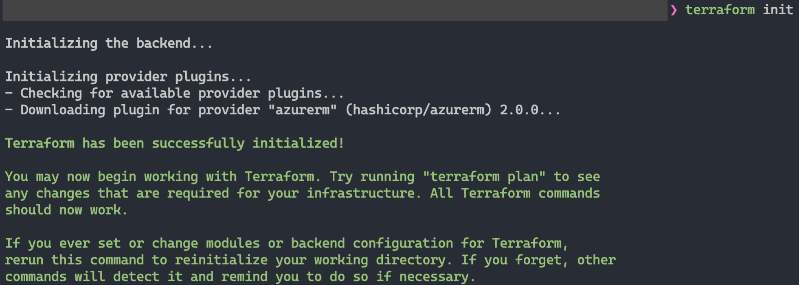

* Run the ```terraform apply --auto-approve``` command and wait for the plan to finish.

    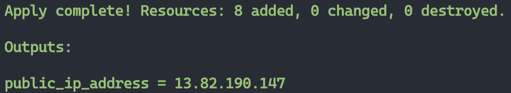   

    

# Connecting to Azure Arc

**Note:** The VM bootstrap includes the log in process to Azure as well deploying the needed Azure Arc CLI extensions - no action items on you there!

* SSH to the VM using the created Azure Public IP and your username/password.

    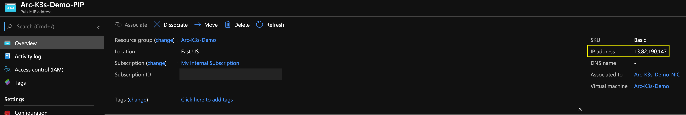

* Check the cluster is up and running using the ```kubectl get nodes -o wide```

    

* Using the Azure Service Principle you've created, run the below command to connect the cluster to Azure Arc.

    ```az connectedk8s connect --name <Name of your cluster as it will be shown in Azure> --resource-group <Azure Resource Group Name>```

    For example:

    ```az connectedk8s connect --name arck3sdemo --resource-group Arc-K3s-Demo```

    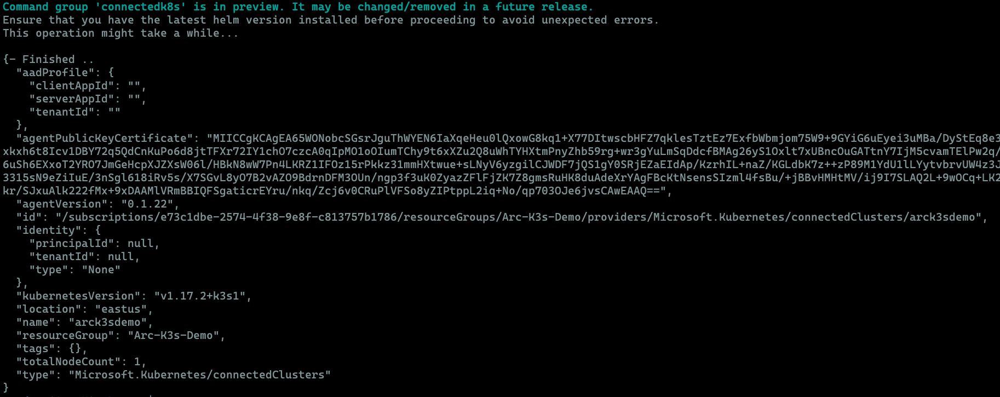   

    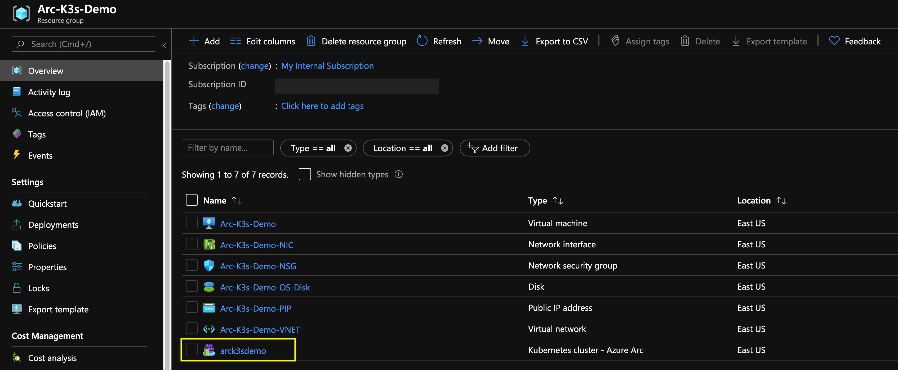

    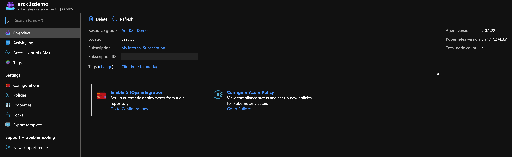

# K3s External Access

Traefik is the (default) ingress controller for k3s and uses port 80. To test external access to k3s cluster, an "*hello-world*" deployment was [made available](../azure/terraform/deployment/hello-kubernetes.yaml) for you and it is included in the *home* directory [(credit)](https://github.com/paulbouwer/hello-kubernetes). 

* Since port 80 is taken by Traefik [(read more about here)](https://github.com/rancher/k3s/issues/436), the deployment LoadBalancer was changed to use port 32323 along side with the matching Azure Network Security Group (NSG).

    

    

    To deploy it, use the ```kubectl apply -f hello-kubernetes.yaml``` command. Run ```kubectl get pods``` and ```kubectl get svc``` to check that the pods and the service has been created. 

    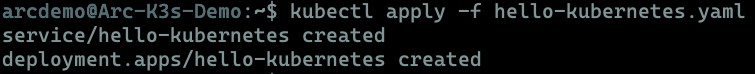

    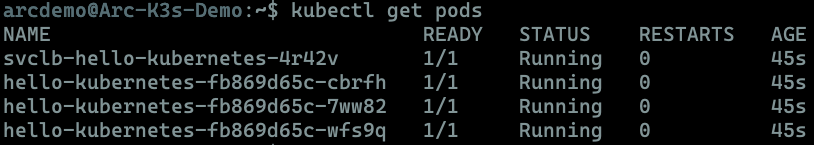

    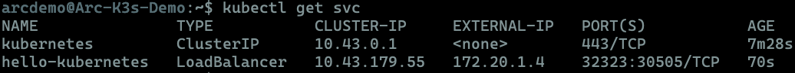

* In your browser, enter the *cluster_public_ip:3232* which will bring up the *hello-world* application.

    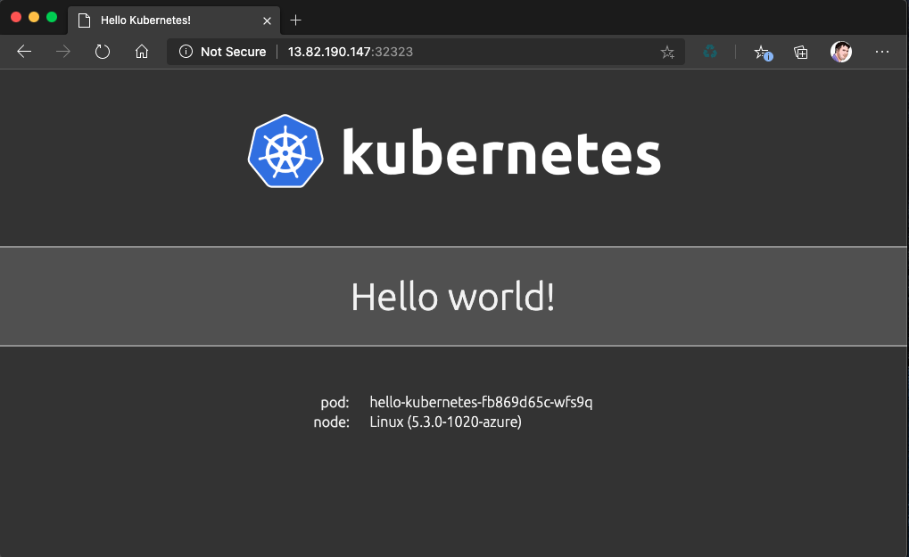

# Delete the deployment

The most straightforward to delete the cluster is via the Azure Portal, just select cluster and delete it. 


If you want to nuke the entire environment, just delete the Azure Resource Group or alternatively, you can use the ```terraform destroy --auto-approve``` command.

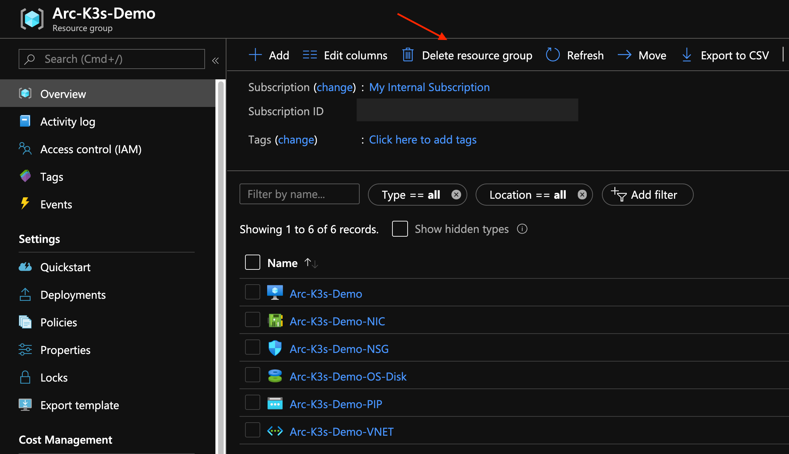

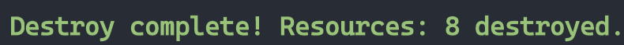