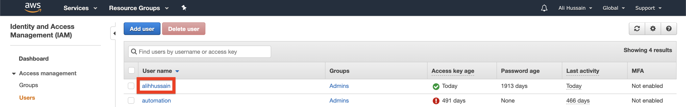
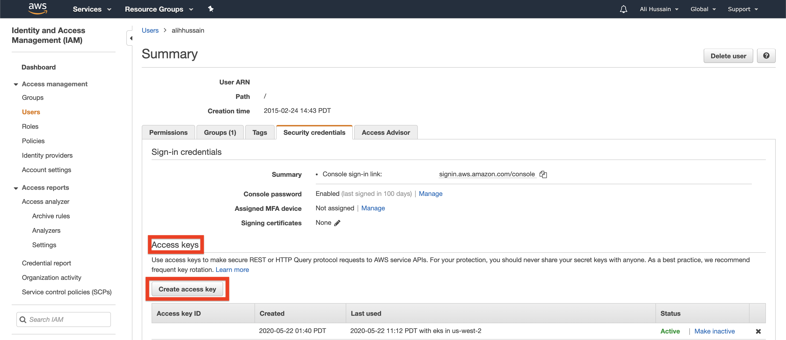
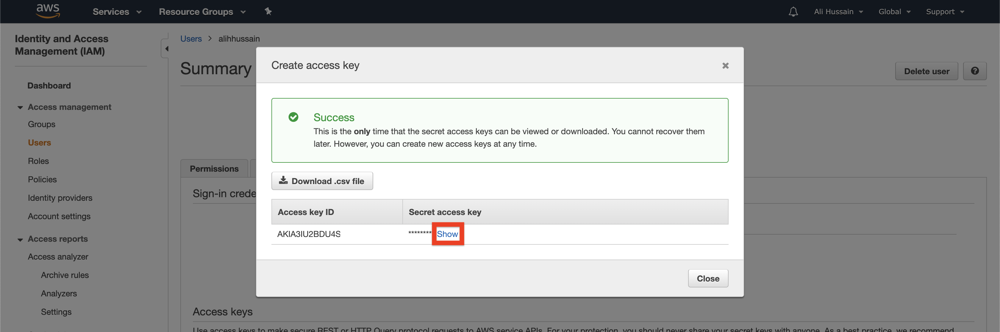
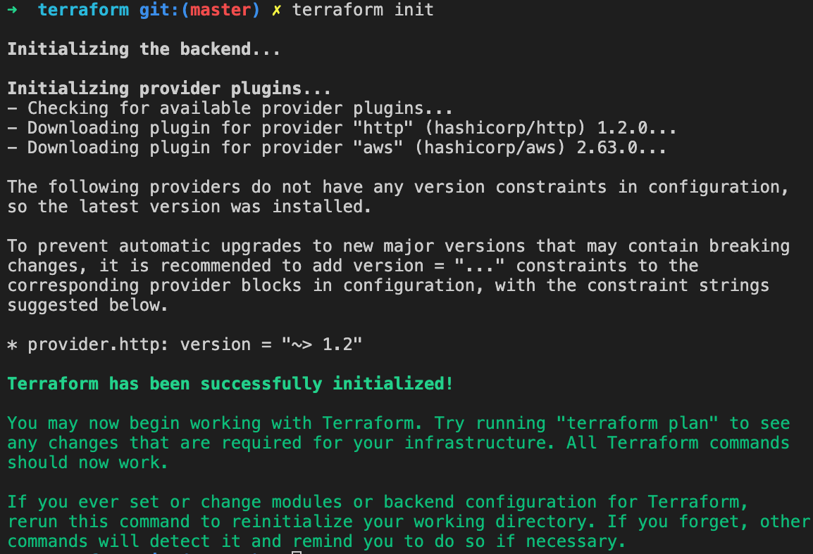
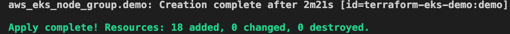
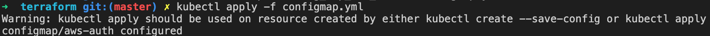
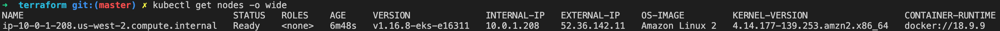
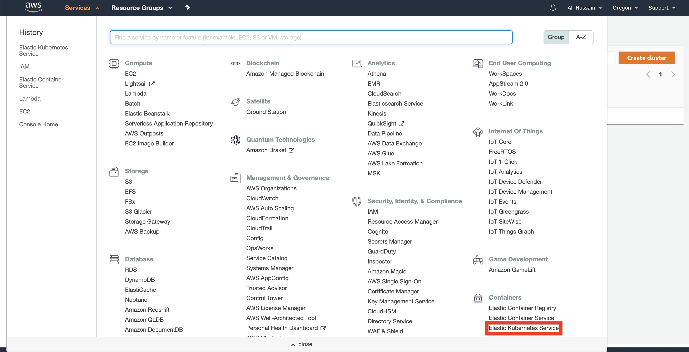
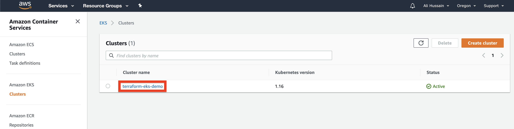
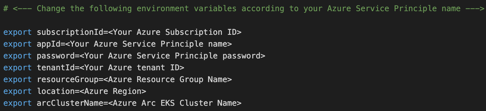

# Overview

The following README will guide you on how to use the provided [Terraform](https://www.terraform.io/) plan to deploy an Amazon Web Services (AWS) [Kubernetes Engine cluster](https://aws.amazon.com/eks/) and connected it as an Azure Arc cluster resource.

# Prerequisites

### Install AWS CLI
  * **[MAC]** Use the package manager ```homebrew``` to install the AWS CLI.
  ```bash
  $ brew install awscli
  ```
  * **[PC]** Use the package manager ```Chocolatey``` to install the AWS CLI.
  ```powershell
  $ choco install awscli
  ```

### Install **wget** package (required for the eks module)
  * **[MAC]** Use the package manager ```homebrew``` to install the AWS CLI.
  ```bash
  $ brew install wget
  ```
  * **[PC]** Use the package manager ```Chocolatey``` to install the AWS CLI.
  ```powershell
  $ choco install wget
  ```

### Install AWS IAM Authenticator
  * **[MAC]** Use the package manager ```homebrew``` to install the AWS CLI.
  ```bash
  $ brew install aws-iam-authenticator
  ```
  * **[PC]** Use the package manager ```Chocolatey``` to install the AWS CLI.
  ```powershell
  $ choco install aws-iam-authenticator
  ```

### [Install or update Azure CLI](https://docs.microsoft.com/en-us/cli/azure/install-azure-cli?view=azure-cli-latest). 
* Azure CLI should be running version 2.6.0 or later. Use ```az --version``` to check your current installed version.
### [Create a free Amazon Web Service's account](https://aws.amazon.com/free/)

### [Install Terraform >=0.12](https://learn.hashicorp.com/terraform/getting-started/install.html)

### Create Azure Service Principal (SP)   

    To connect the EKS cluster to Azure Arc, Azure Service Principal assigned with the "Contributor" role is required. To create it, login to your Azure account run the following command:

    ```az login```

    ```az ad sp create-for-rbac -n "http://AzureArcK8s" --role contributor```

    Output should look like this:
    ```
    {
    "appId": "XXXXXXXXXXXXXXXXXXXXXXXXXXXX",
    "displayName": "AzureArcK8s",
    "name": "http://AzureArcK8s",
    "password": "XXXXXXXXXXXXXXXXXXXXXXXXXXXX",
    "tenant": "XXXXXXXXXXXXXXXXXXXXXXXXXXXX"
    }
    ```
    **Note**: It is optional but highly recommended to scope the SP to a specific [Azure subscription and Resource Group](https://docs.microsoft.com/en-us/cli/azure/ad/sp?view=azure-cli-latest) 

### Create AWS User IAM Key

An access key grants programmatic access to your resources. To create an AWS Access Key for a user:
  1. Navigate to the [IAM Access page](https://console.aws.amazon.com/iam/home#/home). 
    
  2. Select the **Users** from the side menue. 
    
  3. Select the **User** you want to create the access key for. 
   
  4. Select ***Security credentials** of the **User** selected. 
   
  5. Under **Access Keys** select **Create Access Keys**, this will download the
  
  6. In the popup window it will show you the ***Access key ID*** and ***Secret access key***. Save both of these values to configure **AWS CLI** later
  

### Configure AWS CLI using ***Access Key***
To configure **AWS CLI** run ```aws configure``` and when prompted, enter your ***AWS Access Key ID***, ***Secret Access Key***, ***region*** and output format (type ***json***).
```bash
$ aws configure
AWS Access Key ID [None]: YOUR_AWS_ACCESS_KEY_ID
AWS Secret Access Key [None]: YOUR_AWS_SECRET_ACCESS_KEY
Default region name [None]: YOUR_AWS_REGION
Default output format [None]: json
```

# Deployment

### Clone the repo
```bash
git clone https://github.com/alihhussain/azure_arc
``` 
Navigate to the folder that has **EKS** terraform binaries.
```bash
cd azure_arc_k8s_jumpstart/eks/terraform
```

### Initialize Terraform
Run the ```terraform init``` command which will initialize Terraform, creating the state file to track our work:


### Deploy EKS  
Run the ```terraform apply --auto-approve``` command.
Wait for the plan to finish:


### Setting Up kubectl
You will need the configuration output from Terraform in order to use kubectl to interact with your new cluster. Create your kube configuration directory, and output the configuration from Terraform into the config file using the Terraform output command:
```bash
mkdir ~/.kube/
terraform output kubeconfig>~/.kube/config
```
Check to see if cluster is discoverable by ```kubectl``` by running:
```bash
$ kubectl version
Client Version: version.Info{Major:"1", Minor:"15", GitVersion:"v1.15.5", GitCommit:"20c265fef0741dd71a66480e35bd69f18351daea", GitTreeState:"clean", BuildDate:"2019-10-15T19:16:51Z", GoVersion:"go1.12.10", Compiler:"gc", Platform:"darwin/amd64"}
Server Version: version.Info{Major:"1", Minor:"16+", GitVersion:"v1.16.8-eks-e16311", GitCommit:"e163110a04dcb2f39c3325af96d019b4925419eb", GitTreeState:"clean", BuildDate:"2020-03-27T22:37:12Z", GoVersion:"go1.13.8", Compiler:"gc", Platform:"linux/amd64"}
```

### Configure EKS Nodes to comminicate to EKS Control place
Now let’s add the ConfigMap to the cluster from Terraform as well. The ConfigMap is a Kubernetes configuration, in this case for granting access to our EKS cluster. This ConfigMap allows our ec2 instances in the cluster to communicate with the EKS master, as well as allowing our user account access to run commands against the cluster. You’ll run the Terraform output command to a file, and the kubectl apply command to apply that file:
```bash
$ terraform output config_map_aws_auth > configmap.yml
$ kubectl apply -f configmap.yml
```


Once this is complete, you should see your nodes from your autoscaling group either starting to join or joined to the cluster. Once the second column reads Ready the node can have deployments pushed to it. Again, your output may vary here:
```bash
$ kubectl get nodes -o wide
```


### Finished Deploying EKS
Once done, you will have a ready EKS cluster under the ***Elastic Kubernetes Service*** section in your AWS console.




# Connecting to Azure Arc

Now that you have a running EKS cluster, retrieve your Azure Subscription ID using the ```az account list``` command and edit the environment variables section in the included [az_connect_eks](../eks/terraform/scripts/az_connect_eks.sh) shell script.



Next run the edited [az_connect_eks](../eks/terraform/scripts/az_connect_eks.sh) file by ```. ./az_connect_gke.sh``` command. 

**Note**: The extra dot is due to the script has an *export* function and needs to have the vars exported in the same shell session as the rest of the commands. 

* Upon completion, you will have your GKE cluster connect as a new Azure Arc Kubernetes cluster resource in a new Resource Group.


# Delete the deployment

In Azure, the most straightforward way is to delete the cluster or the Resource Group via the Azure Portal.


On your GCP console, select the cluster and delete it or alternatively, you can use the ```terraform destroy --auto-approve``` command.


