# Overview

The following README will guide you on how to create [Helm](https://helm.sh/)-based GitOps configuration on a Google Kubernetes Engine (GKE) cluster which is projected as an Azure Arc connected cluster resource.

In this guide, you will deploy & attach 2 GitOps configuration to your cluster, a cluster-level config to deploy nginx-ingress controller and a namespace-level config to deploy the "Hello Arc" web application on your Kubernetes cluster. 

By doing so, you will be able to make real-time changes to the application and show how the GitOps flow takes effect. 

**Note: This guide assumes you already deployed a GKE cluster and connected it to Azure Arc. If you haven't, this repository offers you a way to do so in an automated fashion using [Terraform](gke_terraform.md).**

# Prerequisites

* Clone this repo

    ```terminal
    git clone https://github.com/microsoft/azure_arc.git
    ```
    
* Fork/Clone the ["Hello Arc"](https://github.com/likamrat/hello_arc) demo application repository. 

* (Optional) Install the "Tab Auto Refresh" extension for your browser. This will help you to show the real-time changes on the application in an automated way. 

    * [Microsoft Edge](https://microsoftedge.microsoft.com/addons/detail/odiofbnciojkpogljollobmhplkhmofe)

    * [Google Chrome](https://chrome.google.com/webstore/detail/tab-auto-refresh/jaioibhbkffompljnnipmpkeafhpicpd?hl=en)

    * [Mozilla Firefox](https://addons.mozilla.org/en-US/firefox/addon/tab-auto-refresh/)

* As mentioned, this guide starts at the point where you already have a connected GKE cluster to Azure Arc.

    

    

* [Install or update Azure CLI](https://docs.microsoft.com/en-us/cli/azure/install-azure-cli?view=azure-cli-latest). **Azure CLI should be running version 2.7** or later. Use ```az --version``` to check your current installed version.

* Create Azure Service Principal (SP)   

    To connect a Kubernetes cluster to Azure Arc, Azure Service Principal assigned with the "Contributor" role is required. To create it, login to your Azure account run the below command (this can also be done in [Azure Cloud Shell](https://shell.azure.com/)).

    ```bash
    az login
    az ad sp create-for-rbac -n "<Unique SP Name>" --role contributor
    ```

    For example:

    ```az ad sp create-for-rbac -n "http://AzureArcK8s" --role contributor```

    Output should look like this:

    ```
    {
    "appId": "XXXXXXXXXXXXXXXXXXXXXXXXXXXX",
    "displayName": "AzureArcK8s",
    "name": "http://AzureArcK8s",
    "password": "XXXXXXXXXXXXXXXXXXXXXXXXXXXX",
    "tenant": "XXXXXXXXXXXXXXXXXXXXXXXXXXXX"
    }
    ```
    
    **Note**: It is optional but highly recommended to scope the SP to a specific [Azure subscription and Resource Group](https://docs.microsoft.com/en-us/cli/azure/ad/sp?view=azure-cli-latest) 

# Cluster-level Config vs. Namespace-level Config 

## Cluster-level Config

With Cluster-level GitOps config, the goal is to have an "horizontal components" or "management components" deployed on your Kubernetes cluster which will then be used by your applications. Good examples are Service Meshes, Security products, Monitoring solutions, etc. A very popular example will also be Ingress Controller which is exactly the nginx-ingress controller we will deploy in the next section.

## Namespace-level Config

With Namespace-level GitOps config, the goal is to have Kubernetes resources deployed only in the namespace selected. The most obvious use-case here is simply your application and it's respective pods, services, ingress routes, etc. In the next section will have the "Hello Arc" application deployed on a dedicated namespace. 

# Azure Arc Kubernetes GitOps Configuration with Helm

## The Mechanism (In a nutshell)

In the process of creating Azure Arc GitOps configuration, [Weaveworks Flux Kubernetes Operator](https://github.com/fluxcd/flux) is deployed on the cluster. 

The Operator is aware to an "HelmRelease" Custom Resource Definition (CRD) which is used in the unique release YAML is leveraging the Helm chart structure and is aware of it user-defined Values. Due to this awareness, a user can choose to leave the chart values intact or to have different values for different release. 

For example, an application (captured in an Helm chart) dev release can have no pod replication (single pod) while a production release, using the same chart can have 3 pod replicas. 

In the next section will use the "Hello Arc" Helm chart to deploy a production release which we will then change and see the results in real-time.

## Deployment Flow

For our scenario, notice we have in two Helm charts in the "Hello Arc" repository; one for nginx and one for the actual application as well as an Helm Release for each. 

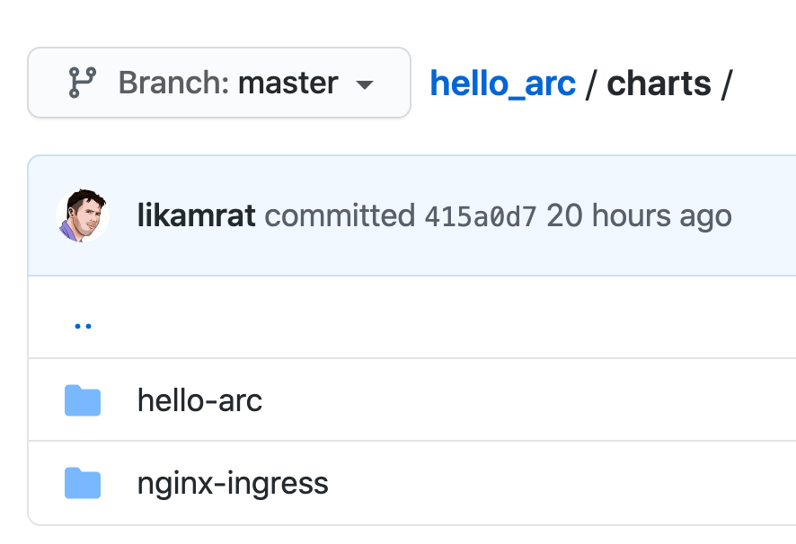

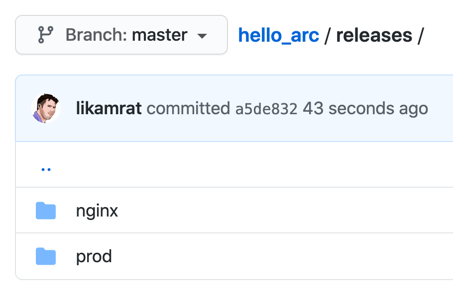

* The nginx-ingress controller (a Cluster-level component) will be deployed with 3 replicas to the *cluster-mgmt* namespace.

* The "Hello Arc" application (a Namespace-level component) will be deployed with 1 replica to the *prod* namespace.

## Deployment

* In order to keep your local environment clean and untouched, we will use [Google Cloud Shell](https://cloud.google.com/shell) to run the [*az_k8sconfig_helm_gke*](../gke/gitops/helm/az_k8sconfig_helm_gke.sh) shell script against the GKE connected cluster.

* Edit the environment variables in the [*az_k8sconfig_helm_gke*](../gke/gitops/helm/az_k8sconfig_helm_gke.sh) shell script to match your parameters, upload it to the Cloud Shell environment and run it using the ```. ./az_k8sconfig_helm_gke``` command.

**Note**: The extra dot is due to the script has an *export* function and needs to have the vars exported in the same shell session as the rest of the commands. 


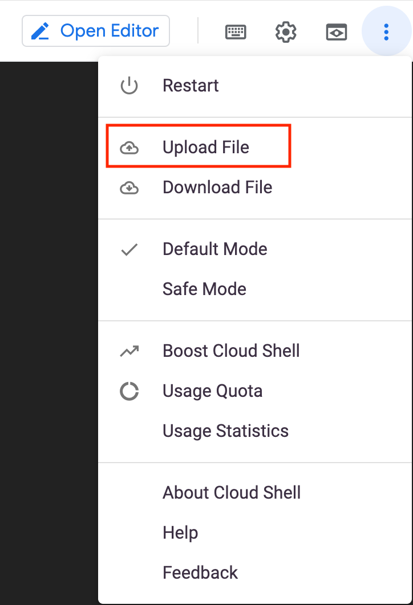

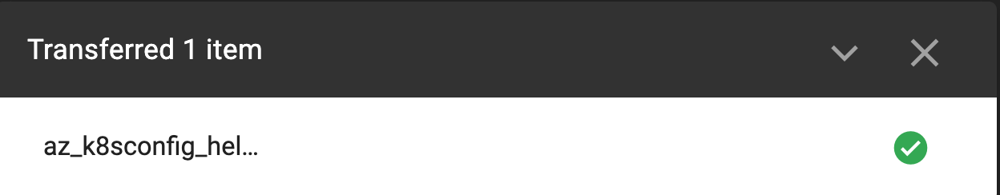

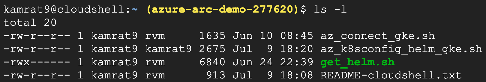

The script will:

- Install Helm 3 in Google Cloud Shell
- Install Azure CLI & Azure Arc Extensions
- Login to your Azure subscription using the SPN credentials
- Create two GitOps configurations for the Azure Arc Connected Cluster. Both configurations will be using the Helm charts located in the "Hello Arc" repository. 
    - Cluster-level config to deploy nginx-ingress controller Helm chart
    - Namespace-level config to deploy the "Hello Arc" application Helm chart

**Disclaimer: For the purpose of this guide, notice how the "*git-poll-interval 3s*" is set. The 3 seconds interval is useful for demo purposes since it will make the git-poll interval to rapidly track changes on the repository but it is recommended to have longer interval in your production environment (default value is 5min)**

* Once the script will complete it's run, you will have 2 GitOps configuration created and all the resources deployed in your Kubernetes cluster. **Note:** that it takes few min for the configuration change it's Operator state status from "Pending" to Install. 

    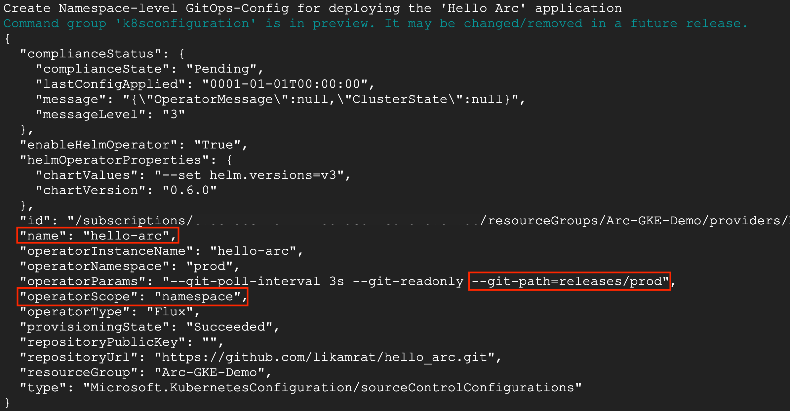

    

    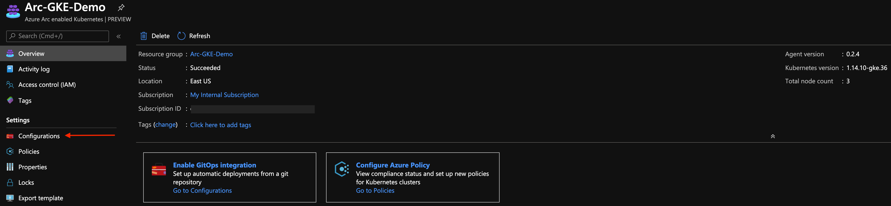

    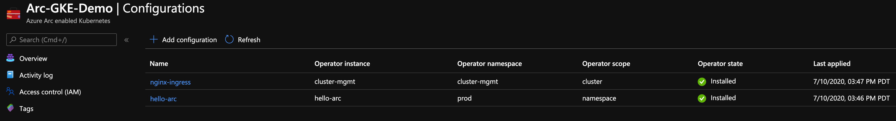

    * The Cluster-level config initiated the nginx-ingress Pods and Service resource deployment (along with the Flux operator and Memcached). To see it's resource, use the below *kubectl* commands.

        ```bash
        kubectl get pods -n cluster-mgmt
        kubectl get svc -n cluster-mgmt
        ```

    

    * The Namespace-level config initiated the "Hello Arc" Pod (1 replica), Service and Ingress Route resource deployment.

        ```bash
        kubectl get pods -n prod
        kubectl get svc -n prod
        kubectl get ing -n prod
        ```

    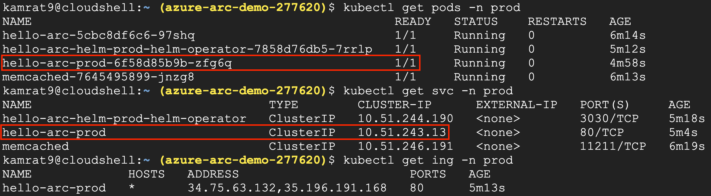

# Initiating "Hello Arc" Application GitOps

* The GitOps flow works as follow:

    1. The Flux operator holds the "desired state" for both the nginx-ingress and the "Hello Arc" Helm releases, this are the configuration we deployed against the Azure Arc connected cluster. The operator will pull every 3 seconds the state of the releases in the repository.

    2. Changing the application release will trigger the Flux operator to kick-in the GitOps flow.

    3. A new version of the application will be deployed on the cluster with more replicas as configured. Once the new pods is successfully deployed, the old ones will be terminated (rolling upgrade). 

* To show the above flow, open 2 (ideally 3) side-by-side browser windows:

    - Google Cloud Shell open running the ```kubectl get pods -n prod -w```

    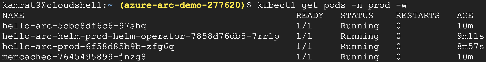

    - In your own repository fork, open the "Hello Arc" [*hello-arc.yaml*](https://github.com/likamrat/hello_arc/blob/master/releases/prod/hello-arc.yaml) Helm release file. 

    - The external IP address of the Kubernetes Service seen using the ```kubectl get svc -n prod``` command. 

    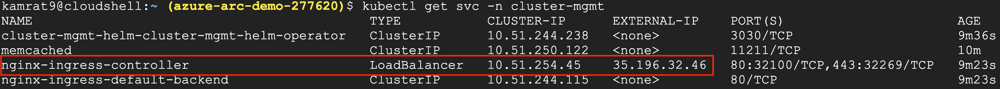

    End result should look something like that:

    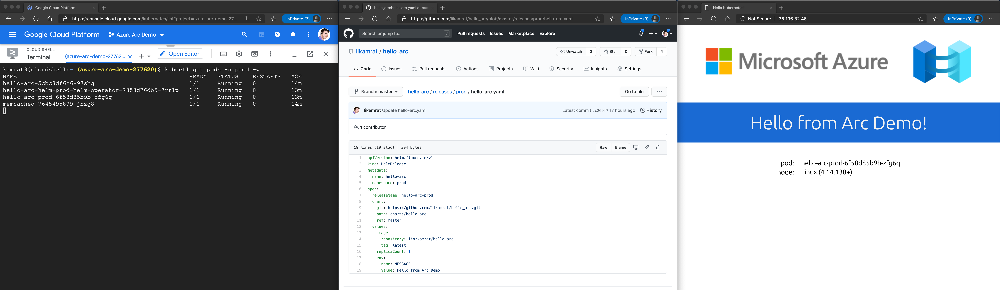   

    As mentioned in the Prerequisites above, it is optional but very recommended to configure the "Tab Auto Refresh" extension for your browser. If you did, in the "Hello Arc" application window, configure it to refresh every 2 seconds.   

    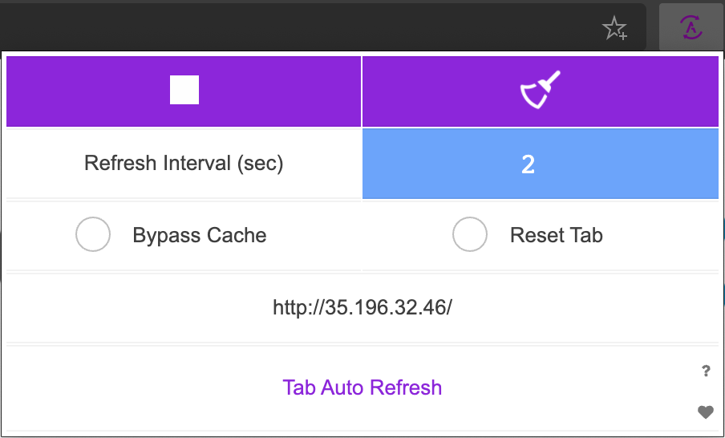

* In the repository window showing the *hello-arc.yaml* file, change the number of *replicaCount* to 3 as well as the the message text and commit your changes. Alternatively, you can open the forked repository in your IDE, make the change, commit and push it.

    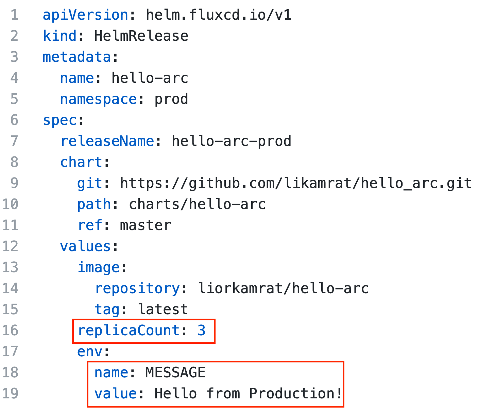

* Upon committing the changes, notice how the rolling upgrade starts. Once the Pods are up & running, the new "Hello Arc" application version window will show the new messages as well as the additional pods replicas, showing the rolling upgrade is completed and the GitOps flow is successful. 

    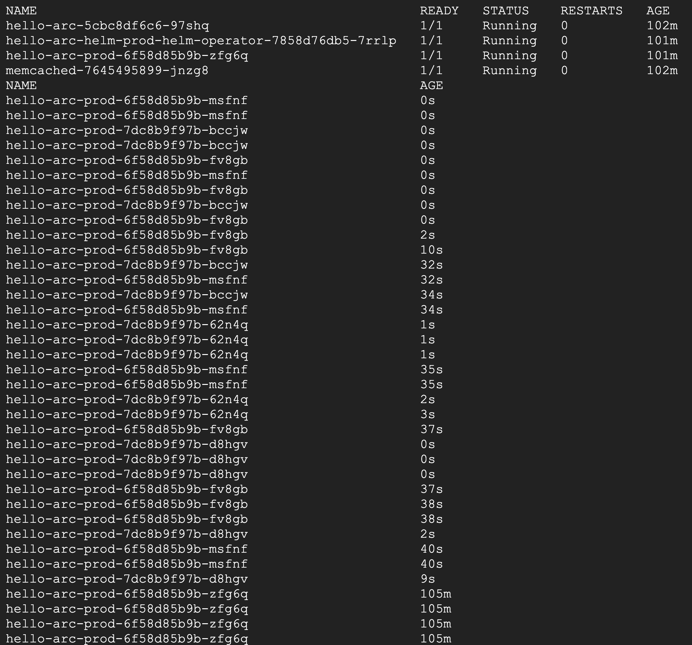

    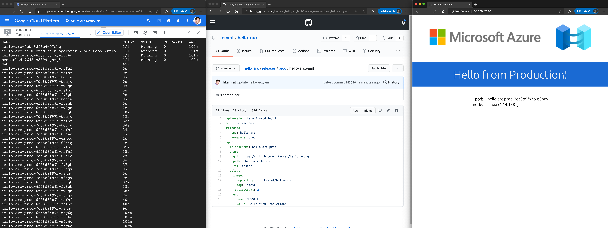

    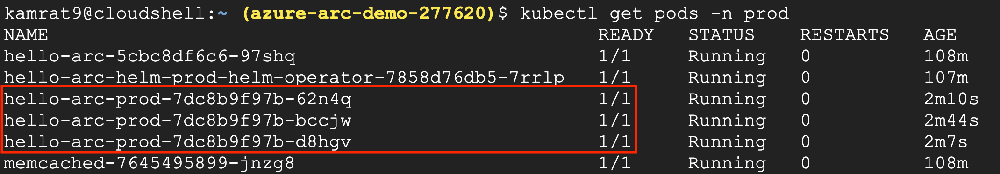

# Cleanup

To delete the GitOps configuration and it's respective Kubernetes resources, edit the environment variables to match the Azure Arc Kubernetes cluster and Resources in the [az_k8sconfig_helm_cleanup](../gke/gitops/helm/az_k8sconfig_helm_cleanup.sh) script, upload it to Cloud Shell and run it using the    
```. ./az_k8sconfig_helm_cleanup.sh``` command.
