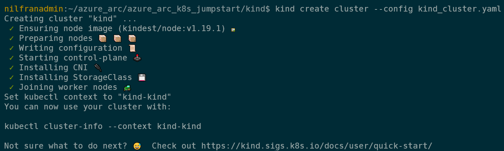
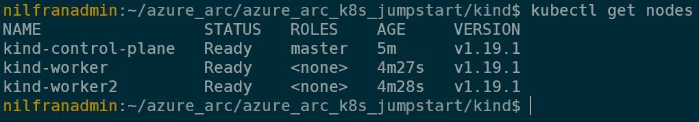
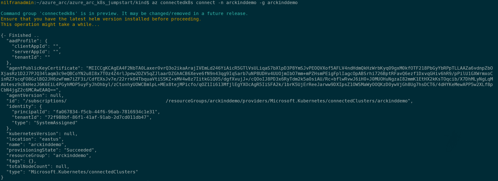
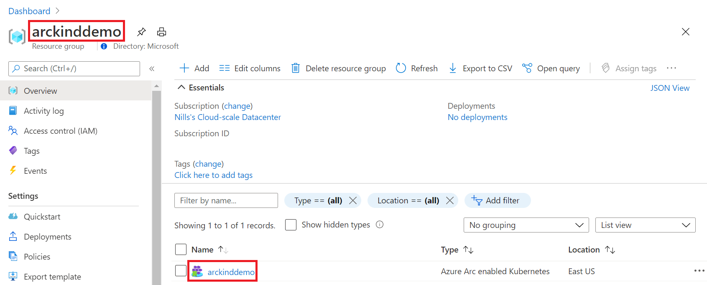
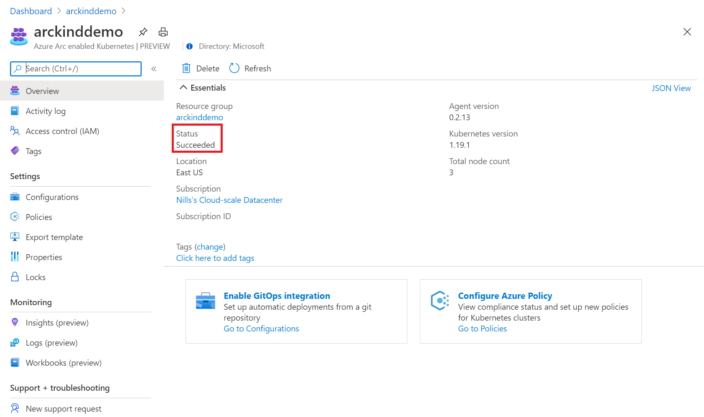
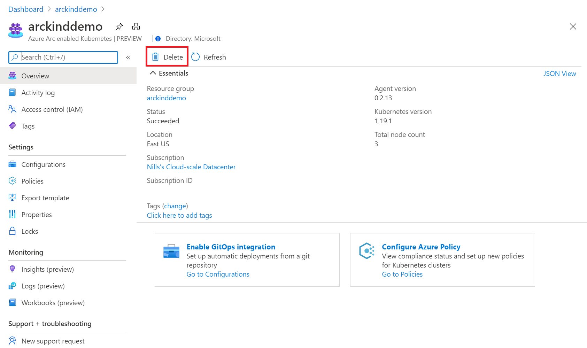
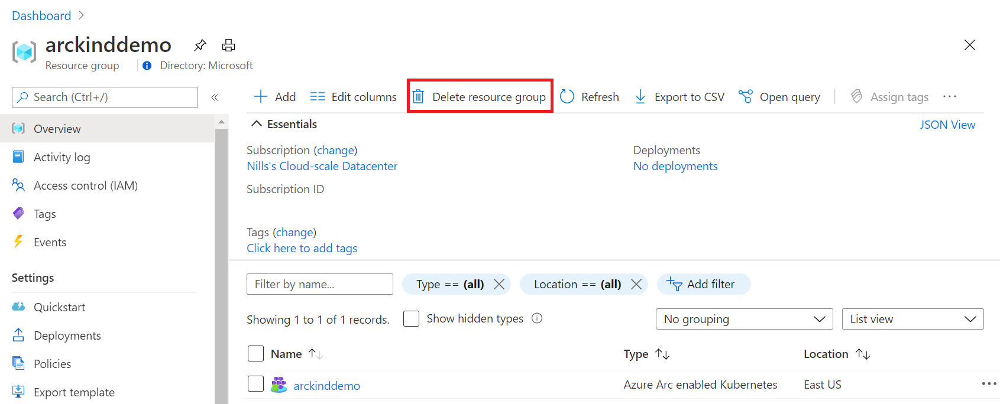
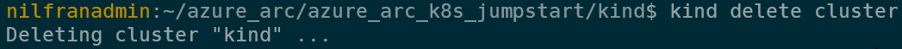
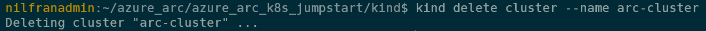

# Overview

The following README will guide you on how to use [kind](https://kind.sigs.k8s.io/) to run a Kubernetes cluster locally and connect it as an Azure Arc enabled Kubernetes cluster resource.

# Prerequisites

* Clone this repo

    ```terminal
    git clone https://github.com/microsoft/azure_arc.git
    ```
    
* [Install or update Azure CLI](https://docs.microsoft.com/en-us/cli/azure/install-azure-cli?view=azure-cli-latest). **Azure CLI should be running version 2.7** or later. Use ```az --version``` to check your current installed version.

* [Install and Set Up kubectl](https://kubernetes.io/docs/tasks/tools/install-kubectl/)

* [Install Helm 3](https://helm.sh/docs/intro/install/)

* Kind leverages Docker to run the Kubernetes nodes. You will need to install Docker locally:
  * If you are a Windows user, install [Docker Desktop](https://www.docker.com/products/docker-desktop). You can also use the [Chocolatey package](https://chocolatey.org/packages/docker-desktop) to automate the installation.
  * If you are a MacOS User, install [Docker Desktop for Mac](https://docs.docker.com/docker-for-mac/).
  * If you are a Linux user, use your package manager to install the [Docker engine](https://docs.docker.com/engine/install/).

* Install the [Go programming language](https://golang.org/dl/).

* Create Azure Service Principal (SP)   

    To connect a Kubernetes cluster to Azure Arc, Azure Service Principal assigned with the "Contributor" role is required. To create it, login to your Azure account run the below command (this can also be done in [Azure Cloud Shell](https://shell.azure.com/)).

    ```bash
    az login
    az ad sp create-for-rbac -n "<Unique SP Name>" --role contributor
    ```

    For example:

    ```az ad sp create-for-rbac -n "http://AzureArcK8s" --role contributor```

    Output should look like this:

    ```
    {
    "appId": "XXXXXXXXXXXXXXXXXXXXXXXXXXXX",
    "displayName": "AzureArcK8s",
    "name": "http://AzureArcK8s",
    "password": "XXXXXXXXXXXXXXXXXXXXXXXXXXXX",
    "tenant": "XXXXXXXXXXXXXXXXXXXXXXXXXXXX"
    }
    ```
    
    **Note**: It is optional but highly recommended to scope the SP to a specific [Azure subscription and Resource Group](https://docs.microsoft.com/en-us/cli/azure/ad/sp?view=azure-cli-latest) 

* Enable subscription for two providers for Azure Arc enabled Kubernetes<br> 
  Registration is an asynchronous process, and registration may take approximately 10 minutes.
  ```bash
  az provider register --namespace Microsoft.Kubernetes
  Registering is still on-going. You can monitor using 'az provider show -n Microsoft.Kubernetes'

  az provider register --namespace Microsoft.KubernetesConfiguration
  Registering is still on-going. You can monitor using 'az provider show -n Microsoft.KubernetesConfiguration'
  ```
  You can monitor the registration process with the following commands:
  ```bash
  az provider show -n Microsoft.Kubernetes -o table
 
  az provider show -n Microsoft.KubernetesConfiguration -o table
  ```

* Install the Azure Arc for Kubernetes CLI extensions ***connectedk8s*** and ***k8sconfiguration***:

  ```bash
  az extension add --name connectedk8s
  az extension add --name k8sconfiguration
  ```


 
# Deployment

* Install kind
  * On Linux: 

    ```bash
    curl -Lo ./kind https://kind.sigs.k8s.io/dl/v0.9.0/kind-linux-amd64
    chmod +x ./kind
    sudo mv ./kind /usr/local/bin/kind
    ```
  * On MacOS:

    ```bash
    brew install kind
    ```
  * On Windows:
       ```powershell
       choco install kind
       ```

* Navigate to the folder that has the kind cluster definition.
  ```bash
  cd azure_arc/azure_arc_k8s_jumpstart/kind
  ```

* Create the kind cluster. We are using a configuration file called `kind_cluster.yaml` to specify our cluster configuration. This will create a 3 node cluster, with 1 master node and 2 worker nodes.
  
**Note**: By default, kind will store the kubeconfig file used to connect to your cluster in the ~/.kube directory. If you want to use a custom directory to store the kubeconfig file, use the `--kube-config` flag. 
If you did chose a specific location for the cluster's *kubeconfig* file make sure you are exporting its location as an environment variable using the `export KUBECONFIG=kubeconfig location` or in Windows, add this location to your PATH. 
    

    kind create cluster --config kind_cluster.yaml --name arc-cluster
    ```
    

* Verify your cluster was created successfully and you can access the cluster using `kubectl`.
    ```bash
    kubectl get nodes
    ```
    

# Connecting to Azure Arc

Now that you have a running kind cluster, lets connect the kind cluster to Azure Arc.f
    ```bash
    az login --service-principal -u mySpnClientId -p mySpnClientSecret --tenant myTenantID
    ```

 * Create a resource group<br> 
   ```bash
   az group create --name Arc-kind-Demo -l EastUS -o table
   ```
   **Note: Azure Arc enabled Kubernetes is currently supported in *East US* and *West Europe***
  

  
* Deploy the Arc binaries using Azure CLI:
  ```bash
  az connectedk8s connect -n Arc-kind-Demo -g Arc-kind-Demo --tags 'Project=jumpstart_azure_arc_k8s'
  ```

* Upon completion, you will have your kind cluster connected as a new Azure Arc Kubernetes cluster resource in a new Resource Group.

  

  

  

# Delete the deployment

* In Azure, the most straightforward way is to delete the cluster or the Resource Group via the Azure Portal or through the CLI.

    ```bash
    az group delete --name Arc-kind-Demo
    ```

* To delete the kind cluster locally, use the following command:
    ```bash
    kind delete cluster --name arc-cluster
    ```

  

  

  
