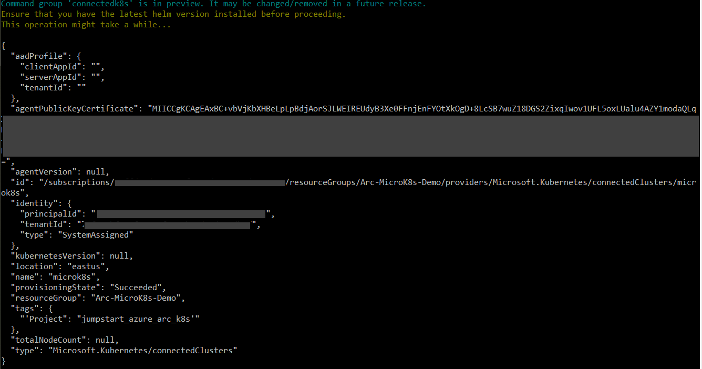
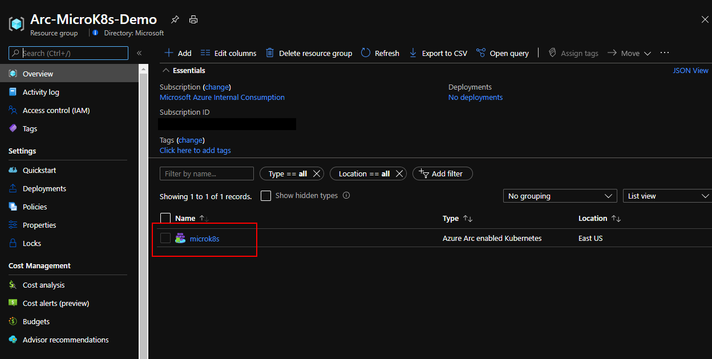
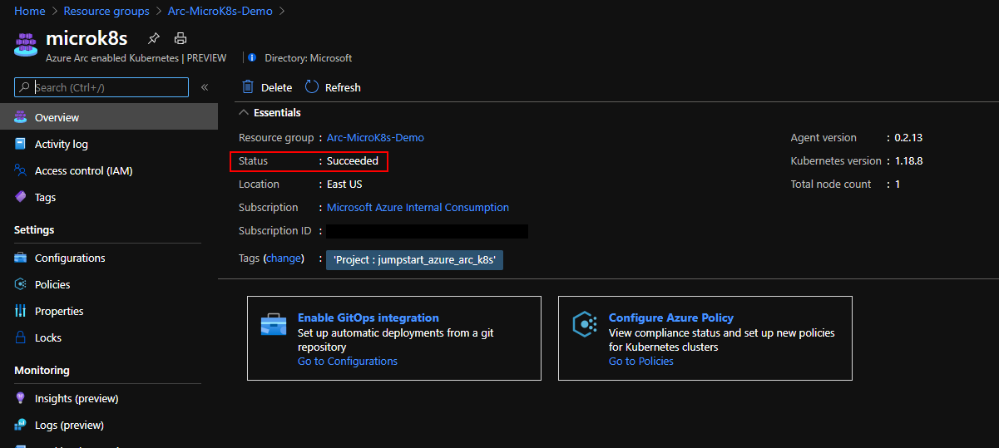
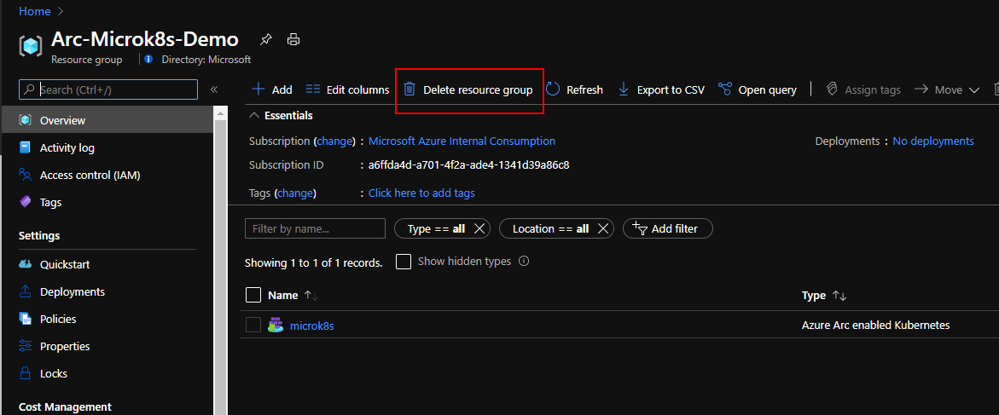

# Overview

The following README will guide you on how to use [MicroK8s](https://microk8s.io/) to run a Kubernetes cluster locally and connect it as an Azure Arc enabled Kubernetes cluster resource.

# Prerequisites

* Clone this repo

    ```terminal
    git clone https://github.com/microsoft/azure_arc.git
    ```
    
* [Install or update Azure CLI](https://docs.microsoft.com/en-us/cli/azure/install-azure-cli?view=azure-cli-latest). **Azure CLI should be running version 2.7** or later. Use ```az --version``` to check your current installed version.

* [Install and Set Up kubectl](https://kubernetes.io/docs/tasks/tools/install-kubectl/)

* [Install Helm 3](https://helm.sh/docs/intro/install/)

* Create Azure Service Principal (SP)   

    To connect a Kubernetes cluster to Azure Arc, Azure Service Principal assigned with the "Contributor" role is required. To create it, login to your Azure account run the below command (this can also be done in [Azure Cloud Shell](https://shell.azure.com/)).

    ```bash
    az login
    az ad sp create-for-rbac -n "<Unique SP Name>" --role contributor
    ```

    For example:

    ```az ad sp create-for-rbac -n "http://AzureArcK8s" --role contributor```

    Output should look like this:

    ```
    {
    "appId": "XXXXXXXXXXXXXXXXXXXXXXXXXXXX",
    "displayName": "AzureArcK8s",
    "name": "http://AzureArcK8s",
    "password": "XXXXXXXXXXXXXXXXXXXXXXXXXXXX",
    "tenant": "XXXXXXXXXXXXXXXXXXXXXXXXXXXX"
    }
    ```
    
    **Note**: It is optional but highly recommended to scope the SP to a specific [Azure subscription and Resource Group](https://docs.microsoft.com/en-us/cli/azure/ad/sp?view=azure-cli-latest) 

* Enable subscription for two providers for Azure Arc enabled Kubernetes<br> 
  Registration is an asynchronous process, and registration may take approximately 10 minutes.
  ```bash
  az provider register --namespace Microsoft.Kubernetes
  Registering is still on-going. You can monitor using 'az provider show -n Microsoft.Kubernetes'

  az provider register --namespace Microsoft.KubernetesConfiguration
  Registering is still on-going. You can monitor using 'az provider show -n Microsoft.KubernetesConfiguration'
  ```
  You can monitor the registration process with the following commands:
  ```bash
  az provider show -n Microsoft.Kubernetes -o table
 
  az provider show -n Microsoft.KubernetesConfiguration -o table
  ```

* Install the Azure Arc for Kubernetes CLI extensions ***connectedk8s*** and ***k8sconfiguration***:

  ```bash
  az extension add --name connectedk8s
  az extension add --name k8sconfiguration
  ```

# Deployment

* Install MicroK8s following the [specific install guide](https://microk8s.io/) for your operating system.

* Navigate to the folder that has the MicroK8s cluster definition.

Windows:
  ```bash
  cd azure_arc\azure_arc_k8s_jumpstart\microk8s
  ```

Linux and Mac:
  ```bash
  cd azure_arc/azure_arc_k8s_jumpstart/microk8s
  ```

* Export MicroK8s config 

MicroK8s will not update your .kube/config file, and accessing the cluster is done using the microk8s cli, eg: `microk8s kubectl get nodes`. To be able to use this config with the Azure Arc CLI, we need to export it into a file.

Windows: 
```
microk8s config view > %HOMEPATH%\.kube\microk8s
```
Linux and Mac: 

```
microk8s config view > ~/.kube/microk8s
```

# Connect the cluster to Azure Arc

* Authenticate Azure CLI

We'll start by authenticating our CLI with Azure, **replacing the values below** with the output from the command we issued to create service principal earlier (`az ad sp create-for-rbac`).

```
az login --service-principal -u appId -p password --tenant tenant
```

* Create a Resource Group

```
az group create -n Arc-MicroK8s-Demo -l EastUS
```

* Connect the cluster to Azure Arc

Windows:
```
az connectedk8s connect -n microk8s -g Arc-MicroK8s-Demo --kube-config %HOMEPATH%\.kube\microk8s --kube-context microk8s  --tags 'Project=jumpstart_azure_arc_k8s'
```

Linux and Mac:
```
az connectedk8s connect -n microk8s -g Arc-MicroK8s-Demo  --kube-config ~/.kube/microk8s --kube-context microk8s  --tags 'Project=jumpstart_azure_arc_k8s'
```



* Upon completion, you will have your MicroK8s cluster connected as a new Azure Arc Kubernetes cluster resource in a new Resource Group.

  

  


# Delete the deployment

* In Azure, the most straightforward way is to delete the cluster or the Resource Group via the Azure Portal or through the CLI.

    ```bash
    az group delete --name Arc-MicroK8s-Demo
    ```

  

* To stop the MicroK8s cluster locally, use the following command:
    ```bash
    microk8s stop
    ```

* To fully uninstall MicroK8s, check the [official docs](https://microk8s.io/docs) for your operating system.