# Overview

The following README will guide you on how to use the provided [Azure ARM Template](https://docs.microsoft.com/en-us/azure/azure-resource-manager/templates/overview) to deploy a "Ready to Go" Azure virtual machine installed with [Microk8s](https://microk8s.io/) and connect it as an Azure Arc cluster resource.

# Prerequisites

* Clone or fork this repo.

* [Install or update Azure CLI](https://docs.microsoft.com/en-us/cli/azure/install-azure-cli?view=azure-cli-latest). Azure CLI should be running version 2.6.0 or later. Use ```az --version``` to check your current installed version.

* Create Azure Service Principal (SP)   

    To connect the Microk8s cluster installed on the VM to Azure Arc, Azure Service Principal assigned with the "Contributor" role is required. To create it, login to your Azure account run the following command:

    ```az login```

    ```az ad sp create-for-rbac -n "http://AzureArcK8s" --role contributor```

    Output should look like this:

    ```
    {
    "appId": "XXXXXXXXXXXXXXXXXXXXXXXXXXXX",
    "displayName": "AzureArcK8s",
    "name": "http://AzureArcK8s",
    "password": "XXXXXXXXXXXXXXXXXXXXXXXXXXXX",
    "tenant": "XXXXXXXXXXXXXXXXXXXXXXXXXXXX"
    }
    ```
    **Note**: It is optional but highly recommended to scope the SP to a specific [Azure subscription and Resource Group](https://docs.microsoft.com/en-us/cli/azure/ad/sp?view=azure-cli-latest) 

* Enable subscription for two providers for Azure Arc enabled Kubernetes<br> 
  Registration is an asynchronous process, and registration may take approximately 10 minutes.
  ```bash
  az provider register --namespace Microsoft.Kubernetes
  Registering is still on-going. You can monitor using 'az provider show -n Microsoft.Kubernetes'

  az provider register --namespace Microsoft.KubernetesConfiguration
  Registering is still on-going. You can monitor using 'az provider show -n Microsoft.KubernetesConfiguration'
  ```
  You can monitor the registration process with the following commands:
  ```bash
  az provider show -n Microsoft.Kubernetes -o table
 
  az provider show -n Microsoft.KubernetesConfiguration -o table
  ```

# Deployment 

The deployment is using the template parameters file. Before initiating the deployment, edit the [*azuredeploy.parameters.json*](../microk8s/azure/arm_template/azuredeploy.parameters.json) file to include the OS username and password as well as the appId, password and tenant generated from the service principal creation.  

## If you cloned this repo

If you cloned this repository and made these changes locally, run the below command:

```bash
  az group create --name <Name of the Azure Resource Group> --location <Azure Region>
  az deployment group create \
  --resource-group <Name of the Azure Resource Group> \
  --name <The name of this deployment> \ 
  --template-file <The *azuredeploy.json* template file location> \ 
  --parameters <The *azuredeploy.parameters.json* parameters file location>
```

For example and to make it easy for you, ```cd``` to the directory of the ARM template json files and run the command and wait for it to finish.. 

```bash
  az group create --name Arc-Microk8s-Demo --location "East US"
  az deployment group create \
  --resource-group Arc-Microk8s-Demo \
  --name arcmicrok8sdemo01 \
  --template-file azuredeploy.json \
  --parameters azuredeploy.parameters.json
```

## If you forked this repo

If you forked this repository and you are pushing the changes to the forked repo, run the below command and wait for it to finish.

```bash
  az group create --name Arc-Microk8s-Demo --location "East US"   
  az deployment group create \
  --resource-group Arc-Microk8s-Demo \
  --name arcmicrok8sdemo01 \
  --template-uri <The *azuredeploy.json* template file location in your GitHub repo> \
  --parameters <The *azuredeploy.parameters.json* template file location in your GitHub repo>
```

For example:

```bash
  az group create --name Arc-Microk8s-Demo --location "East US"   
  az deployment group create \
  --resource-group Arc-Microk8s-Demo \
  --name arcmicrok8sdemo01 \
  --template-uri https://raw.githubusercontent.com/shoegazerpt/azure_arc/master/azure_arc_k8s_jumpstart/microk8s/arm_template/azuredeploy.json \
  --parameters https://raw.githubusercontent.com/shoegazerpt/azure_arc/master/azure_arc_k8s_jumpstart/microk8s/arm_template/azuredeploy.parameters.json
```

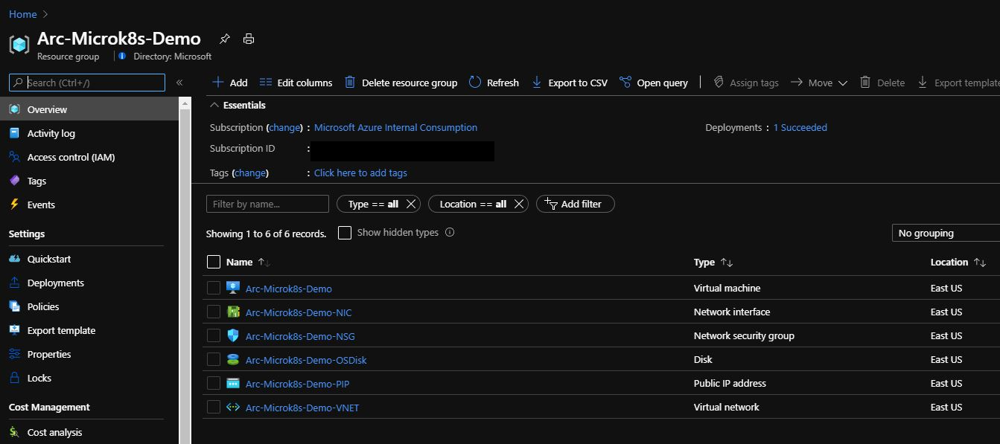

# Connecting to Azure Arc

**Note:** The VM bootstrap includes the log in process to Azure as well deploying the needed Azure Arc CLI extensions - no action items on you there!

* SSH to the VM using the created Azure Public IP and your username/password.

  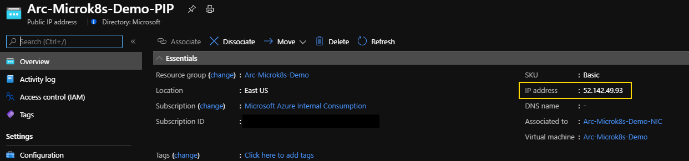

* Check the cluster is up and running using the ```microk8s kubectl get nodes -o wide```

  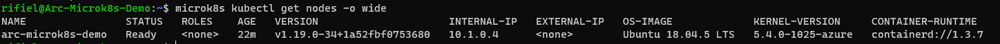

* Before registering the cluster in Azure Arc, we need to be able to use kubectl without the microk8s prefix. There's different ways to do this, one of which is writing a ~/.kube/config file:

    ```sudo microk8s config | sed -e 's/certificate-authority-data\:\s.*$/insecure-skip-tls-verify: true/g' > ~/.kube/config```

* We can now run kubectl directly, e.g.:

    ```kubectl get nodes -o wide```

* Using the Azure Service Principle you've created, run the below command to connect the cluster to Azure Arc.

    ```az connectedk8s connect --name <Name of your cluster as it will be shown in Azure> --resource-group <Azure Resource Group Name>```

    For example:

    ```az connectedk8s connect --name arcmicrok8sdemo01 --resource-group Arc-Microk8s-Demo```

  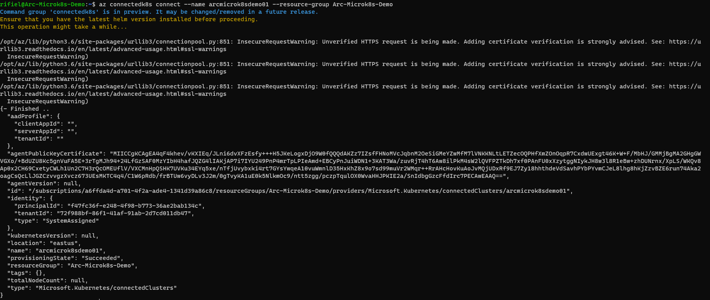

  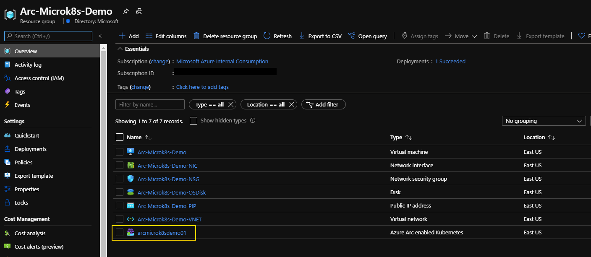

  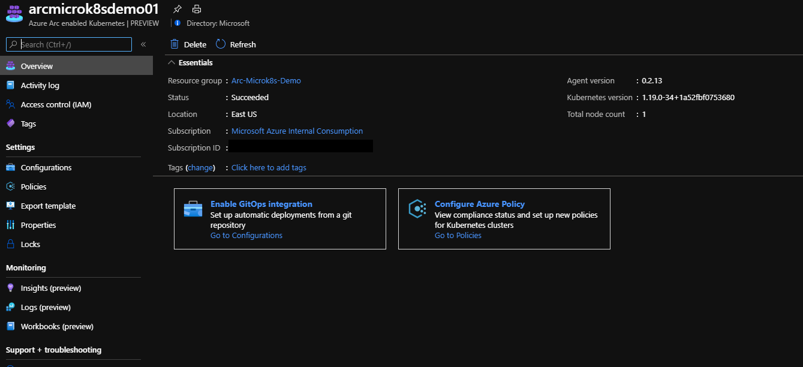

# Microk8s External Access

Microk8s supports Istio and others as ingress controllers, [which can be enabled](https://microk8s.io/docs/addons) with ```microk8s enable <addon>```. For this deployment, however, we'll be exposing a service with NodePort. 

To test external access Microk8s, an "*hello-world*" deployment was for you and it is included in the *home* directory [(credit)](https://github.com/paulbouwer/hello-kubernetes). 

* Since we're using a NodePort service, it will be exposed in the default allowed range of 30000-32767, which in our case we've set to 30557. A matching Azure Network Security Group (NSG) was also applied.

  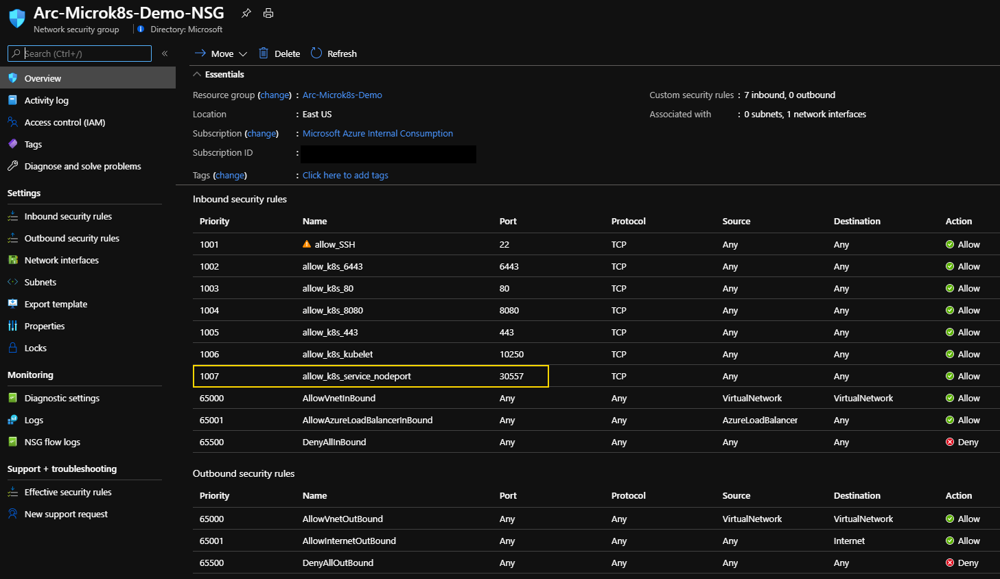

  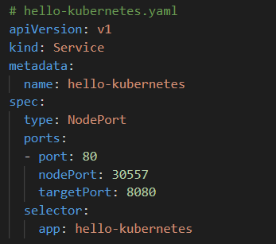

  To deploy it, use the ```microk8s kubectl apply -f hello-kubernetes.yaml``` command. Run ```microk8s kubectl get pods``` and ```microk8s kubectl get svc``` to check that the pods and the service has been created. 

  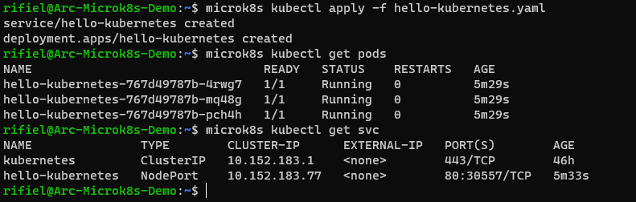

* In your browser, enter the *cluster_public_ip:30557* which will bring up the *hello-world* application.

  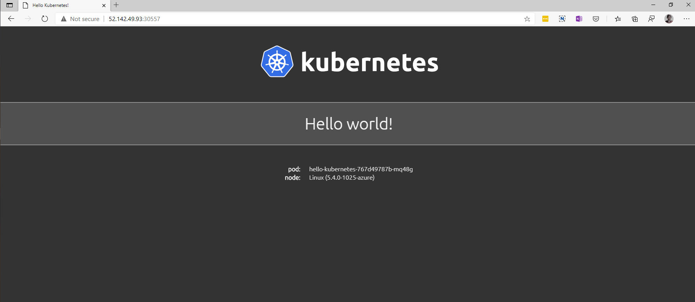

# Delete the deployment

The most straightforward way is to delete the cluster is via the Azure Portal, just select the cluster and delete it. 

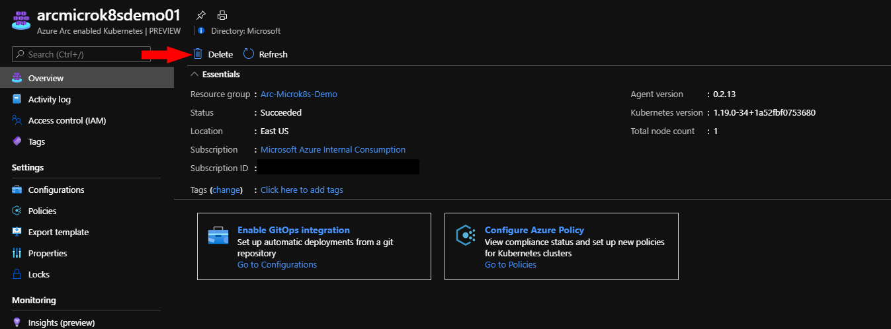

If you want to nuke the entire environment, just delete the Azure Resource Group. 

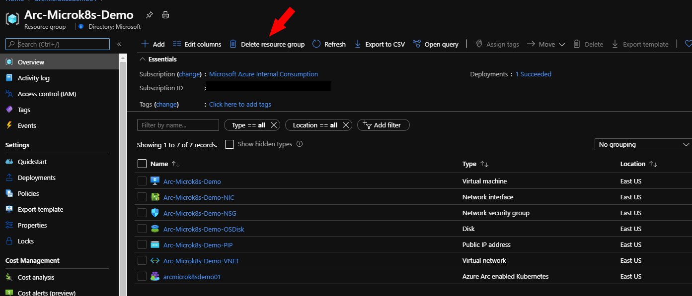
