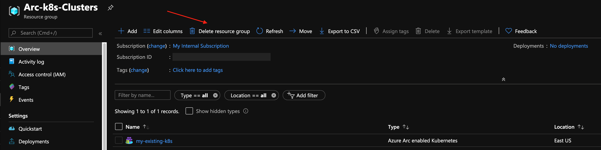

# Overview

The following README will guide you on how to connect an existing Kubernetes cluster to Azure Arc using a simple shell script.

# Prerequisites

* Make sure your *kubeconfig* file is configured properly and you are working against your [k8s cluster context](https://kubernetes.io/docs/tasks/access-application-cluster/configure-access-multiple-clusters/). 

* (Optional) To simplify work against multiple k8s contexts, consider using [kubectx](https://github.com/ahmetb/kubectx).

* [Install or update Azure CLI](https://docs.microsoft.com/en-us/cli/azure/install-azure-cli?view=azure-cli-latest). Azure CLI should be running version 2.6.0 or later. Use ```az --version``` to check your current installed version.

* Create Azure Service Principal (SP)   

    To connect a Kubernetes cluster to Azure Arc, Azure Service Principal assigned with the "Contributor" role is required. To create it, login to your Azure account run the following command:

    ```bash
    az login
    az ad sp create-for-rbac -n "<Unique SP Name>"
    ```

    For example:

    ```az ad sp create-for-rbac -n "http://AzureArcK8s"```

    Output should look like this:
    ```
    {
    "appId": "XXXXXXXXXXXXXXXXXXXXXXXXXXXX",
    "displayName": "AzureArcK8s",
    "name": "http://AzureArcK8s",
    "password": "XXXXXXXXXXXXXXXXXXXXXXXXXXXX",
    "tenant": "XXXXXXXXXXXXXXXXXXXXXXXXXXXX"
    }
    ```

    Then, assign a the "Contributor" role to the SP you've just created.

    ```az role assignment create --assignee "<Unique SP Name>" --role contributor```.

    **Note**: It is optional but highly recommended to scope the SP to a specific [Azure subscription and Resource Group](https://docs.microsoft.com/en-us/cli/azure/ad/sp?view=azure-cli-latest)

* Enable subscription for two providers for Azure Arc enabled Kubernetes<br> 
  Registration is an asynchronous process, and registration may take approximately 10 minutes.
  ```bash
  az provider register --namespace Microsoft.Kubernetes
  Registering is still on-going. You can monitor using 'az provider show -n Microsoft.Kubernetes'

  az provider register --namespace Microsoft.KubernetesConfiguration
  Registering is still on-going. You can monitor using 'az provider show -n Microsoft.KubernetesConfiguration'
  ```
  You can monitor the registration process with the following commands:
  ```bash
  az provider show -n Microsoft.Kubernetes -o table
 
  az provider show -n Microsoft.KubernetesConfiguration -o table
  ```

* Create a new Azure Resource Group where you want your cluster(s) to show up. 

* Download the [az_connect_k8s](../scripts/az_connect_k8s.sh) shell script.


* Change the environment variables according to your environment. 


# Deployment

Run the script using the ```. ./az_connect_k8s.sh``` command. 

**Note**: The extra dot is due to the script has an *export* function and needs to have the vars exported in the same shell session as the rest of the commands. 

Upon completion, you will have your Kubernetes cluster, connected as a new Azure Arc cluster inside your Resource Group. 


# Delete the deployment

The most straightforward way is to delete the cluster is via the Azure Portal, just select cluster and delete it. 


If you want to nuke the entire environment, just delete the Azure Resource Group.

