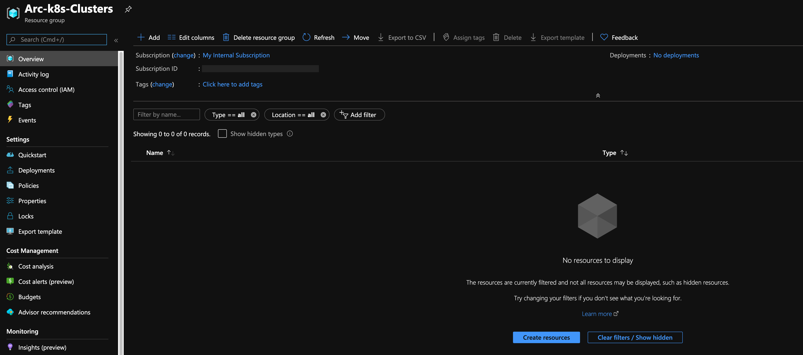
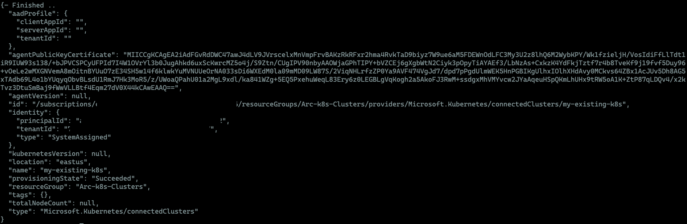
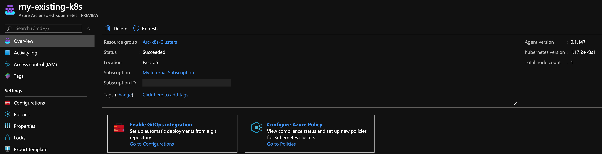

# Overview

The following README will guide you on how to connect an existing Kubernetes cluster to Azure Arc using a simple shell script.

# Prerequisites

* Make sure your *kubeconfig* file is configured properly and you are working against your [k8s cluster context](https://kubernetes.io/docs/tasks/access-application-cluster/configure-access-multiple-clusters/). 

* (Optional) To simplify work against multiple k8s contexts, consider using [kubectx](https://github.com/ahmetb/kubectx).

* [Install or update Azure CLI](https://docs.microsoft.com/en-us/cli/azure/install-azure-cli?view=azure-cli-latest). **Azure CLI should be running version 2.7** or later. Use ```az --version``` to check your current installed version.

* [Install and Set Up kubectl](https://kubernetes.io/docs/tasks/tools/install-kubectl/)

* [Install Helm 3](https://helm.sh/docs/intro/install/). If you are on a Windows environment, a recommended and easy way is to use the [Helm 3 Chocolatey package](https://chocolatey.org/packages/kubernetes-helm). 

* Create Azure Service Principal (SP)   

    To connect a Kubernetes cluster to Azure Arc, Azure Service Principal assigned with the "Contributor" role is required. To create it, login to your Azure account run the below command (this can also be done in [Azure Cloud Shell](https://shell.azure.com/)).

    ```bash
    az login
    az ad sp create-for-rbac -n "<Unique SP Name>" --role contributor
    ```

    For example:

    ```az ad sp create-for-rbac -n "http://AzureArcK8s" --role contributor```

    Output should look like this:

    ```
    {
    "appId": "XXXXXXXXXXXXXXXXXXXXXXXXXXXX",
    "displayName": "AzureArcK8s",
    "name": "http://AzureArcK8s",
    "password": "XXXXXXXXXXXXXXXXXXXXXXXXXXXX",
    "tenant": "XXXXXXXXXXXXXXXXXXXXXXXXXXXX"
    }
    ```

    **Note**: It is optional but highly recommended to scope the SP to a specific [Azure subscription and Resource Group](https://docs.microsoft.com/en-us/cli/azure/ad/sp?view=azure-cli-latest)

* Enable subscription for two providers for Azure Arc enabled Kubernetes. Registration is an asynchronous process, and registration may take approximately 10 minutes.

  ```bash
  az provider register --namespace Microsoft.Kubernetes
  ```
  Registering is still on-going. You can monitor using ```az provider show -n Microsoft.Kubernetes```.

  ```bash
  az provider register --namespace Microsoft.KubernetesConfiguration
  ```
  Registering is still on-going. You can monitor using ```az provider show -n Microsoft.KubernetesConfiguration```.


  You can monitor the registration process with the following commands:
  
  ```bash
  az provider show -n Microsoft.Kubernetes -o table
 
  az provider show -n Microsoft.KubernetesConfiguration -o table
  ```

* Create a new Azure Resource Group where you want your cluster(s) to show up. 

  ```az group create -l <Azure Region> -n <Resource Group Name>```

  For example:

  ```az group create -l eastus -n Arc-k8s-Clusters```

  **Note: Currently, Connected Azure Arc cluster resource creation is supported only in the following locations: eastus, westeurope, eastus2euap. Use the --location (or -l) flag to specify one of these locations.**



* Change the following environment variables according to your Azure Service Principle name and Azure environment.

If using shell:

```bash
export appId='<Your Azure Service Principle name>'
export password='<Your Azure Service Principle password>'
export tenantId='<Your Azure tenant ID>'
export resourceGroup='<Azure Resource Group Name>'
export arcClusterName='<The name of your k8s cluster as it will be shown in Azure Arc>'
```

If using PowerShell:

```powershell
$env:appId=<Your Azure Service Principle name>
$env:password=<Your Azure Service Principle password>
$env:tenantId=<Your Azure tenant ID>
$env:resourceGroup=<Azure Resource Group Name>
$env:arcClusterName=<The name of your k8s cluster as it will be shown in Azure Arc>
```

# Deployment

* Install the Azure Arc for Kubernetes CLI extensions ***connectedk8s*** and ***k8sconfiguration***:

  ```bash
  az extension add --name connectedk8s
  az extension add --name k8sconfiguration
  ```

* Login to your Azure Subscription using the SP you created.  

  If using shell:

  ```bash
  az login --service-principal --username $appId --password $password --tenant $tenantId
  ```

  If using Powershell:

  ```powershell
  az login --service-principal --username $env:appId --password $env:password --tenant $env:tenantId
  ```

* If you are working in a Linux OS or MacOS environment, make sure you are the owner of the following:

  ```bash
  sudo chown -R $USER /home/${USER}/.kube
  sudo chown -R $USER /home/${USER}/.kube/config
  sudo chown -R $USER /home/${USER}/.azure/config
  sudo chown -R $USER /home/${USER}/.azure
  sudo chmod -R 777 /home/${USER}/.azure/config
  sudo chmod -R 777 /home/${USER}/.azure
  ```

* To connect the Kubernetes cluster to Azure Arc use the below command.

  If using shell:

  ```bash
  az connectedk8s connect --name $arcClusterName --resource-group $resourceGroup
  ```

  If using Powershell:

  ```powershell
  az connectedk8s connect --name $env:arcClusterName --resource-group $env:resourceGroup
  ```

Upon completion, you will have your Kubernetes cluster, connected as a new Azure Arc cluster inside your Resource Group. 






# Delete the deployment

The most straightforward way is to delete the cluster is via the Azure Portal, just select cluster and delete it. 


If you want to nuke the entire environment, just delete the Azure Resource Group.

