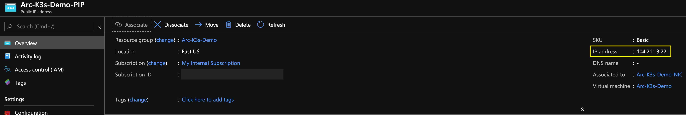
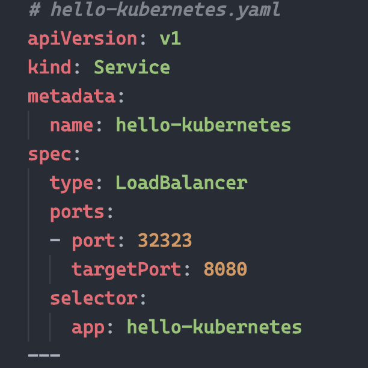
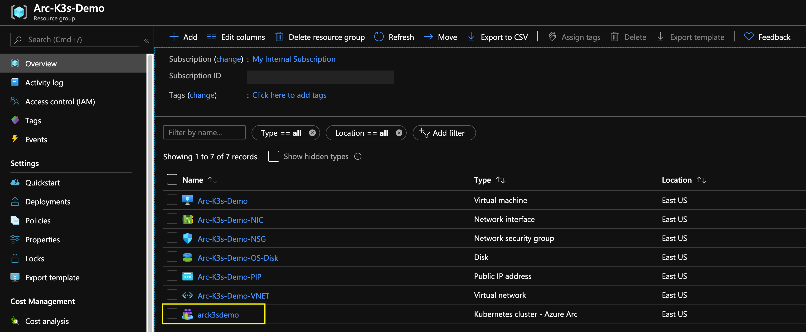
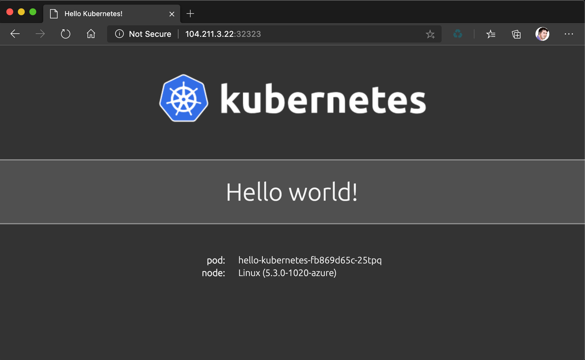
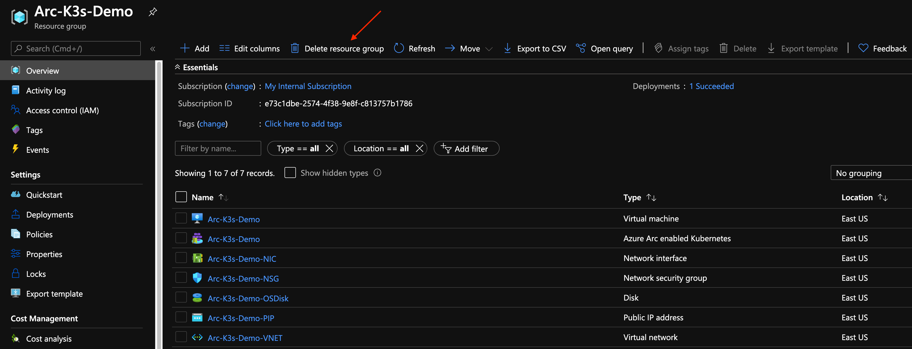

# Overview

The following README will guide you on how to use the provided [Azure ARM Template](https://docs.microsoft.com/en-us/azure/azure-resource-manager/templates/overview) to deploy a "Ready to Go" Azure virtual machine installed with single-master Rancher K3s Kubernetes cluster and connected it as an Azure Arc cluster resource.

# Prerequisites

* Clone this repo

    ```terminal
    git clone https://github.com/microsoft/azure_arc.git
    ```
    
* [Install or update Azure CLI](https://docs.microsoft.com/en-us/cli/azure/install-azure-cli?view=azure-cli-latest). **Azure CLI should be running version 2.7** or later. Use ```az --version``` to check your current installed version.

* Create Azure Service Principal (SP)   

    To connect a Kubernetes cluster to Azure Arc, Azure Service Principal assigned with the "Contributor" role is required. To create it, login to your Azure account run the below command (this can also be done in [Azure Cloud Shell](https://shell.azure.com/)).

    ```bash
    az login
    az ad sp create-for-rbac -n "<Unique SP Name>" --role contributor
    ```

    For example:

    ```az ad sp create-for-rbac -n "http://AzureArcK8s" --role contributor```

    Output should look like this:

    ```
    {
    "appId": "XXXXXXXXXXXXXXXXXXXXXXXXXXXX",
    "displayName": "AzureArcK8s",
    "name": "http://AzureArcK8s",
    "password": "XXXXXXXXXXXXXXXXXXXXXXXXXXXX",
    "tenant": "XXXXXXXXXXXXXXXXXXXXXXXXXXXX"
    }
    ```
    
    **Note**: It is optional but highly recommended to scope the SP to a specific [Azure subscription and Resource Group](https://docs.microsoft.com/en-us/cli/azure/ad/sp?view=azure-cli-latest) 

* Enable subscription for two providers for Azure Arc enabled Kubernetes<br> 
  Registration is an asynchronous process, and registration may take approximately 10 minutes.
  ```bash
  az provider register --namespace Microsoft.Kubernetes
  Registering is still on-going. You can monitor using 'az provider show -n Microsoft.Kubernetes'

  az provider register --namespace Microsoft.KubernetesConfiguration
  Registering is still on-going. You can monitor using 'az provider show -n Microsoft.KubernetesConfiguration'
  ```
  You can monitor the registration process with the following commands:
  ```bash
  az provider show -n Microsoft.Kubernetes -o table
 
  az provider show -n Microsoft.KubernetesConfiguration -o table
  ```

# Deployment 

The deployment is using the template parameters file. Before initiating the deployment, edit the [*azuredeploy.parameters.json*](../rancher_k3s/azure/arm_template/azuredeploy.parameters.json) file to include the OS username and password as well as the appId, password and tenant generated from the service principal creation.  

To deploy the ARM template, navigate to the [deployment folder](../rancher_k3s/azure/arm_template) and run the below command:

```bash
  az group create --name <Name of the Azure Resource Group> --location <Azure Region>
  az deployment group create \
  --resource-group <Name of the Azure Resource Group> \
  --name <The name of this deployment> \
  --template-uri https://raw.githubusercontent.com/microsoft/azure_arc/master/azure_arc_k8s_jumpstart/rancher_k3s/azure/arm_template/azuredeploy.json \
  --parameters <The *azuredeploy.parameters.json* parameters file location>
```

For example:

```bash
  az group create --name Arc-K3s-Demo --location "East US"
  az deployment group create \
  --resource-group Arc-K3s-Demo \
  --name arck3sdemo01 \
  --template-uri https://raw.githubusercontent.com/microsoft/azure_arc/master/azure_arc_k8s_jumpstart/rancher_k3s/azure/arm_template/azuredeploy.json \
  --parameters azuredeploy.parameters.json
```

Upon completion, you will have new VM installed as a single-host k3s cluster which is already projected as an Azure Arc enabled Kubernetes cluster in a new Resource Group.


# K3s External Access

Traefik is the (default) ingress controller for k3s and uses port 80. To test external access to k3s cluster, an "*hello-world*" deployment was for you and it is included in the *home* directory [(credit)](https://github.com/paulbouwer/hello-kubernetes). 

* Since port 80 is taken by Traefik [(read more about here)](https://github.com/rancher/k3s/issues/436), the deployment LoadBalancer was changed to use port 32323 along side with the matching Azure Network Security Group (NSG). 

  

  

  To deploy it, use the ```kubectl apply -f hello-kubernetes.yaml``` command. Run ```kubectl get pods``` and ```kubectl get svc``` to check that the pods and the service has been created. 

  

  

  

* In your browser, enter the *cluster_public_ip:3232* which will bring up the *hello-world* application.

  

# Delete the deployment

To delete environment, simply just delete the Azure Resource Group.



