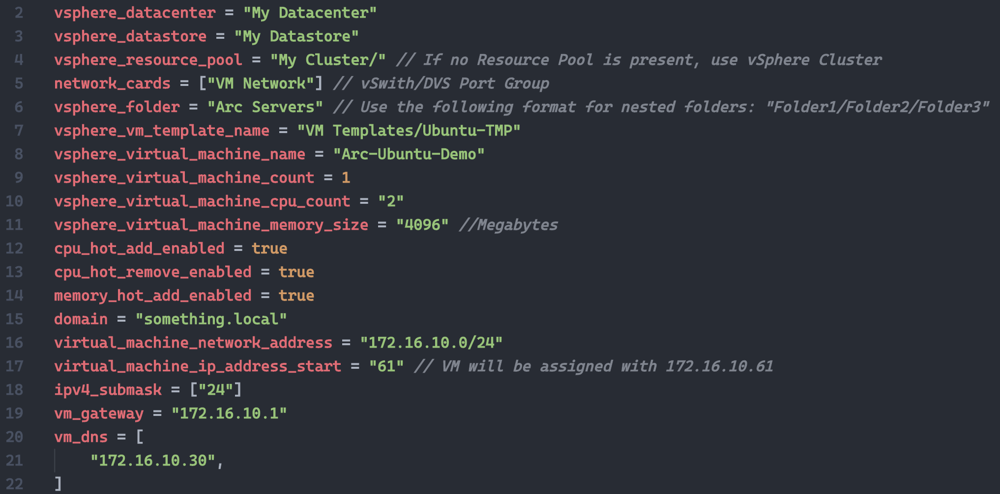
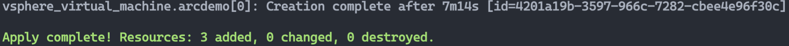
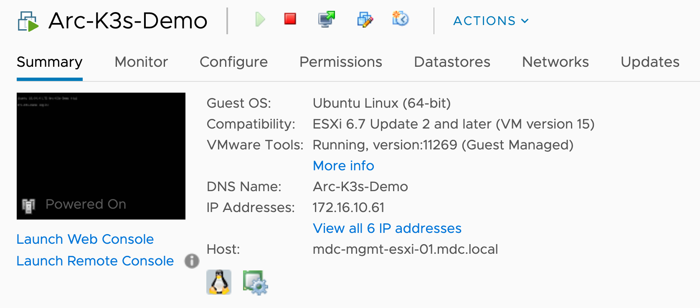
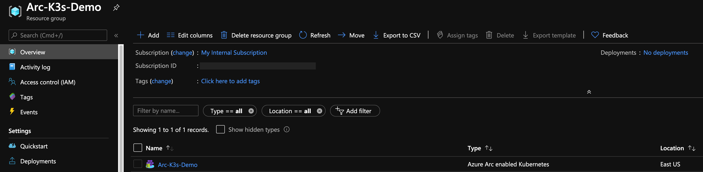
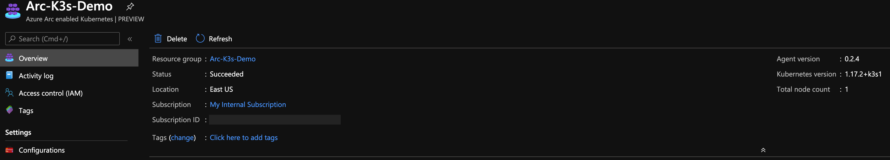
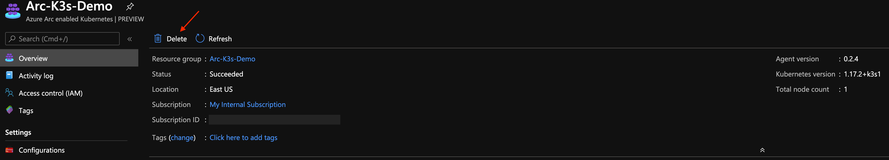
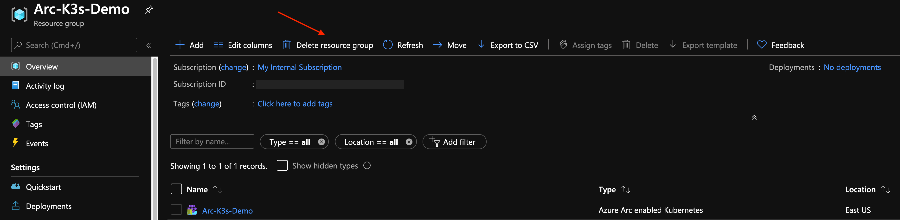

# Overview

The following README will guide you on how to use the provided [Terraform](https://www.terraform.io/) plan to deploy a "Ready to Go" VMware vSphere Ubuntu Server virtual machine installed with a single-master Rancher K3s Kubernetes cluster and connected it as an Azure Arc cluster resource.

# Prerequisites

* Clone this repo

    ```terminal
    git clone https://github.com/microsoft/azure_arc.git
    ```

* [Install or update Azure CLI](https://docs.microsoft.com/en-us/cli/azure/install-azure-cli?view=azure-cli-latest). **Azure CLI should be running version 2.7** or later. Use ```az --version``` to check your current installed version.

* [Install Terraform >=0.12](https://learn.hashicorp.com/terraform/getting-started/install.html)

* A VMware vCenter Server user with [permissions to deploy](https://docs.vmware.com/en/VMware-vSphere/6.7/com.vmware.vsphere.vm_admin.doc/GUID-8254CD05-CC06-491D-BA56-A773A32A8130.html) a Virtual Machine from a Template in the vSphere Web Client.

* Create Azure Service Principal (SP)   

    To connect a Kubernetes cluster to Azure Arc, Azure Service Principal assigned with the "Contributor" role is required. To create it, login to your Azure account run the below command (this can also be done in [Azure Cloud Shell](https://shell.azure.com/)).

    ```bash
    az login
    az ad sp create-for-rbac -n "<Unique SP Name>" --role contributor
    ```

    For example:

    ```az ad sp create-for-rbac -n "http://AzureArcK8s" --role contributor```

    Output should look like this:

    ```
    {
    "appId": "XXXXXXXXXXXXXXXXXXXXXXXXXXXX",
    "displayName": "AzureArcK8s",
    "name": "http://AzureArcK8s",
    "password": "XXXXXXXXXXXXXXXXXXXXXXXXXXXX",
    "tenant": "XXXXXXXXXXXXXXXXXXXXXXXXXXXX"
    }
    ```

    **Note**: It is optional but highly recommended to scope the SP to a specific [Azure subscription and Resource Group](https://docs.microsoft.com/en-us/cli/azure/ad/sp?view=azure-cli-latest)

* Enable subscription for two providers for Azure Arc enabled Kubernetes<br> 
  Registration is an asynchronous process, and registration may take approximately 10 minutes.
  ```bash
  az provider register --namespace Microsoft.Kubernetes
  Registering is still on-going. You can monitor using 'az provider show -n Microsoft.Kubernetes'

  az provider register --namespace Microsoft.KubernetesConfiguration
  Registering is still on-going. You can monitor using 'az provider show -n Microsoft.KubernetesConfiguration'
  ```
  You can monitor the registration process with the following commands:
  ```bash
  az provider show -n Microsoft.Kubernetes -o table
 
  az provider show -n Microsoft.KubernetesConfiguration -o table
  ```

## Preparing an Ubuntu Server VMware vSphere VM Template

Before using the below guide to deploy an Ubuntu Server VM and connect it to Azure Arc, a VMware vSphere Template is required. [The following README](../../azure_arc_servers_jumpstart/docs/vmware_ubuntu_template.md) will instruct you how to easily create such a template using VMware vSphere 6.5 and above. 

**Note:** If you already have an Ubuntu Server VM template it is still recommended to use the guide as a reference. 

# Deployment

Before executing the Terraform plan, you must set the environment variables which will be used by the plan. These variables are based on the Azure Service Principal you've just created, your Azure subscription and tenant, and your VMware vSphere credentials.

* Retrieve your Azure Subscription ID and tenant ID using the ```az account list``` command.

* The Terraform plan creates resources in both Microsoft Azure and VMware vSphere. It then executes a script on the virtual machine to install the Azure Arc agent and all necessary artifacts. This script requires certain information about your VMware vSphere and Azure environments. Edit [*scripts/vars.sh*](../rancher_k3s/vmware/terraform/scripts/vars.sh) and update each of the variables with the appropriate values.
    
    * TF_VAR_subscription_id=Your Azure Subscription ID
    * TF_VAR_client_id=Your Azure Service Principle name
    * TF_VAR_client_secret=Your Azure Service Principle password
    * TF_VAR_tenant_id=Your Azure tenant ID
    * TF_VAR_resourceGroup=Azure Resource Group Name
    * TF_VAR_location=Azure Region
    * TF_VAR_arcClusterName=The name of your k8s cluster as it will be shown in Azure Arc
    * TF_VAR_vsphere_user=vCenter Admin Username
    * TF_VAR_vsphere_password=vCenter Admin Password
    * TF_VAR_vsphere_server=vCenter server FQDN/IP
    * TF_VAR_admin_user=OS Admin Username
    * TF_VAR_admin_password=OS Admin Password

* From CLI, navigate to the [*azure_arc_k8s_jumpstart/rancher_k3s/vmware/terraform*](../rancher_k3s/vmware/terraform) directory of the cloned repo.

* Export the environment variables you edited by running [*scripts/vars.sh*](../rancher_k3s/vmware/terraform/scripts/vars.sh) with the source command as shown below. Terraform requires these to be set for the plan to execute properly. Note that this script will also be automatically executed remotely on the virtual machine as part of the Terraform deployment. 

    ```source ./scripts/vars.sh```

* In addition to the *TF_VAR* environment variables you've just exported, edit the Terraform variables in the [*terraform.tfvars*](../rancher_k3s/vmware/terraform/terraform.tfvars) to match your VMware vSphere environment.



* Run the ```terraform init``` command which will download the Terraform AzureRM, Local and vSphere providers.


* Run the ```terraform apply --auto-approve``` command and wait for the plan to finish. 



Once the Terraform deployment is completed, a new Ubuntu Server VM will be up & running, installed with a single-master Rancher K3s Kubernetes cluster and will be projected as an Azure Arc Kubernetes cluster in a newly created Azure Resource Group. 







# Delete the deployment

The most straightforward way is to delete the cluster is via the Azure Portal, just select cluster and delete it. 



If you want to nuke the entire environment, just delete the Azure Resource Group and the newly generated *az_connect_k3s* shell script in the [*scripts*](../rancher_k3s/vmware/terraform/scripts) folder. 



Alternatively, you can use the ```terraform destroy --auto-approve``` command.


