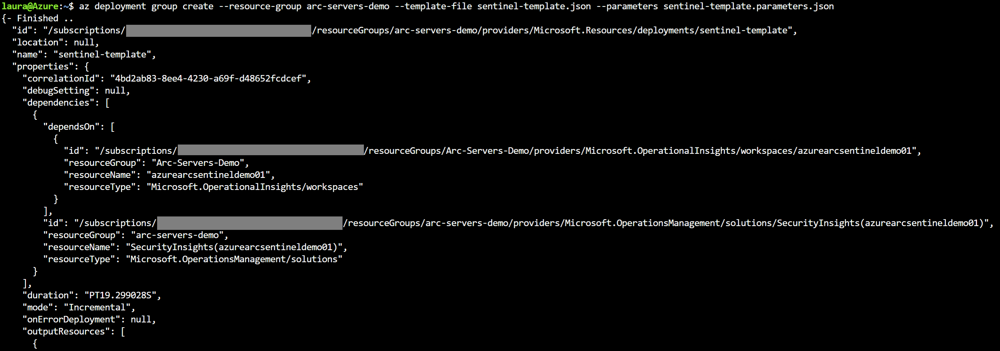

# Azure Arc enabled Servers on Azure Sentinel

The following README will guide you on how to onboard an Azure Arc enabled Servers on to [Azure Sentinel](https://docs.microsoft.com/es-es/azure/sentinel/), so you can start collecting security-related events and start correlating them with other data sources. 

In this guide, you will enable and configure Azure Sentinel on your Azure subscription. To complete this process you will: 

* Setup the Log Analytics Workspace where logs and events will be aggregated for analysis and correlation. 

* Enable Azure Sentinel on the workspace. 

* Onboard Azure Arc enabled Servers on Sentinel by using the extension management feature and Azure Policies. 


**Note: This guide assumes you already deployed VMs or servers that are running on-premises or other clouds and you have connected them to Azure Arc.**

**If you haven't, this repository offers you a way to do so in an automated fashion:**
- **[GCP Ubuntu VM](gcp_terraform_ubuntu.md) / [GCP Windows VM](gcp_terraform_windows.md)**
- **[AWS Ubuntu VM](aws_terraform_ubuntu.md)**
- **[VMware Ubuntu VM](vmware_terraform_ubuntu.md) / [VMware Windows Server VM](vmware_terraform_winsrv.md)**
- **[Local Ubuntu VM](local_vagrant_ubuntu.md) / [Local Windows VM](local_vagrant_windows.md)**

# Prerequisites

* Clone this repo

    ```terminal
    git clone https://github.com/microsoft/azure_arc.git
    ```

* As mentioned, this guide starts at the point where you already deployed and connected VMs or bare-metal servers to Azure Arc. For this scenario, as can be seen in the screenshots below, we will be using a Google Cloud Platform (GCP) instance that has been already connected to Azure Arc and is visible as a resource in Azure.

    

    

  
* [Install or update Azure CLI](https://docs.microsoft.com/en-us/cli/azure/install-azure-cli?view=azure-cli-latest). Azure CLI should be running version 2.7** or later. Use ```az --version``` to check your current installed version.

* Create Azure Service Principal (SP).   

    To connect a VM or bare-metal server to Azure Arc, Azure Service Principal assigned with the "Contributor" role is required. To create it, login to your Azure account run the below command (this can also be done in [Azure Cloud Shell](https://shell.azure.com/)).

    ```bash
    az login
    az ad sp create-for-rbac -n "<Unique SP Name>" --role contributor
    ```
    For example:
    ```az ad sp create-for-rbac -n "http://AzureArcServers" --role contributor```
    Output should look like this:
    ```
    {
    "appId": "XXXXXXXXXXXXXXXXXXXXXXXXXXXX",
    "displayName": "AzureArcServers",
    "name": "http://AzureArcServers",
    "password": "XXXXXXXXXXXXXXXXXXXXXXXXXXXX",
    "tenant": "XXXXXXXXXXXXXXXXXXXXXXXXXXXX"
    }
    ```
    
  **Note**: It is optional but highly recommended to scope the SP to a specific [Azure subscription and Resource Group](https://docs.microsoft.com/en-us/cli/azure/ad/sp?view=azure-cli-latest).

# Onboarding Azure Sentinel

Azure Sentinel uses the Log Analytics agent to collect Windows and Linux server's log files and forwards them to Azure Sentinel, the data collected is stored in a Log Analytics workspace. Since you cannot use the default workspace created by Azure Security Center (ASC), a custom one is required and you could have raw events and alerts for ASC within the same custom workspace as Sentinel.

* You will need to create a dedicated Log Analytics workspace and enable the Azure Sentinel solution on the top of it. For that you can use this [ARM template](../azuresentinel/arm/sentinel-template.json) that will create a new Log Analytics Workspace and define the Azure Sentinel solution and enable it for the workspace. To automate the deployment edit the ARM template [parameters file](../azuresentinel/arm/sentinel-template.parameters.json), provide a name and location for your workspace:

    

* To deploy the ARM template, navigate to the [deployment folder](../azuresentinel/arm) and run the below command:

  ```bash
    az deployment group create --resource-group <Name of the Azure Resource Group> \
    --template-file <The *sentinel-template.json* template file location> \
    --parameters <The *sentinel-template.parameters.json* template file location>
  ```

For example: 

   


# Azure Arc enabled VMs onboarding on Azure Sentinel 

Once you have deployed Azure Sentinel on your Log Analytics workspace, you will need to connect data sources to it. 

There are connectors for Microsoft services, 3rd party solutions from the Security products ecosystem or, you can also use Common Event Format (CEF), Syslog as well as REST-API to connect your data sources with Azure Sentinel. 

For servers and VMs, you can install the Microsoft Monitoring Agent (MMA) agent or the Sentinel agent which collects the logs and forwards them to Azure Sentinel. You can deploy the agent in multiple ways by leveraging Azure Arc:

* Using the **[Extension Management](arc_vm_extension_mma_arm.md)**

    This feature in Azure Arc enabled Servers allows you to deploy the MMA agent VM extensions to a non-Azure Windows and/or Linux VMs. You can use the Azure Portal, Azure CLI, an ARM template as well as PowerShell script to manage the extension deployment to Arc servers.

* Setting up **[Azure Policies](arc_policies_mma.md)**

    Using this approach, you will assign an Azure Policy to audit if the Azure Arc enabled Server has the MMA agent installed. If the agent is not installed, you will use the Extensions feature to automatically deploy it to the VM using a Remediation task, an enrollment experience that levels to Azure VMs. 

# Clean up environment

Complete the following steps to clean up your environment.

* Remove the virtual machines from each environment by following the teardown instructions from each guide.

    - *[GCP Ubuntu VM](gcp_terraform_ubuntu.md) / [GCP Windows VM](gcp_terraform_windows.md)*
    - *[AWS Ubuntu VM](aws_terraform_ubuntu.md)*
    - *[VMware Ubuntu VM](vmware_terraform_ubuntu.md) / [VMware Windows Server VM](vmware_terraform_winsrv.md)*
    - *[Local Ubuntu VM](local_vagrant_ubuntu.md) / [Local Windows VM](local_vagrant_windows.md)*

* Remove the Log Analytics workspace by executing the following script in AZ CLI. Provide the workspace name you used when creating the Log Analytics Workspace.

    ```bash
    az monitor log-analytics workspace delete --resource-group <Name of the Azure Resource Group> --workspace-name <Log Analytics Workspace Name> --yes
    ```

