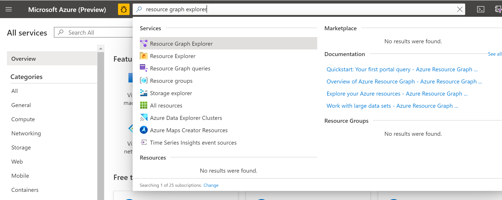
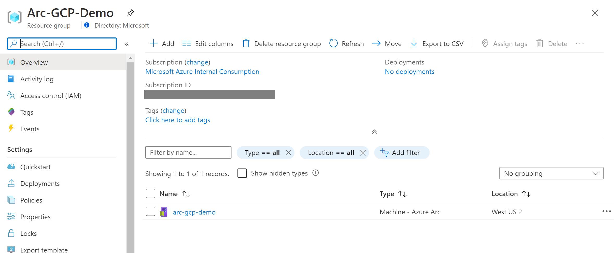
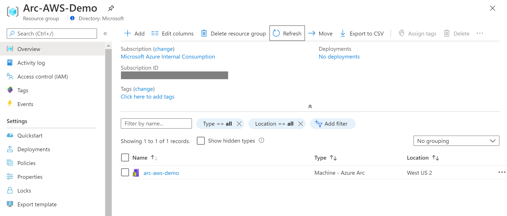
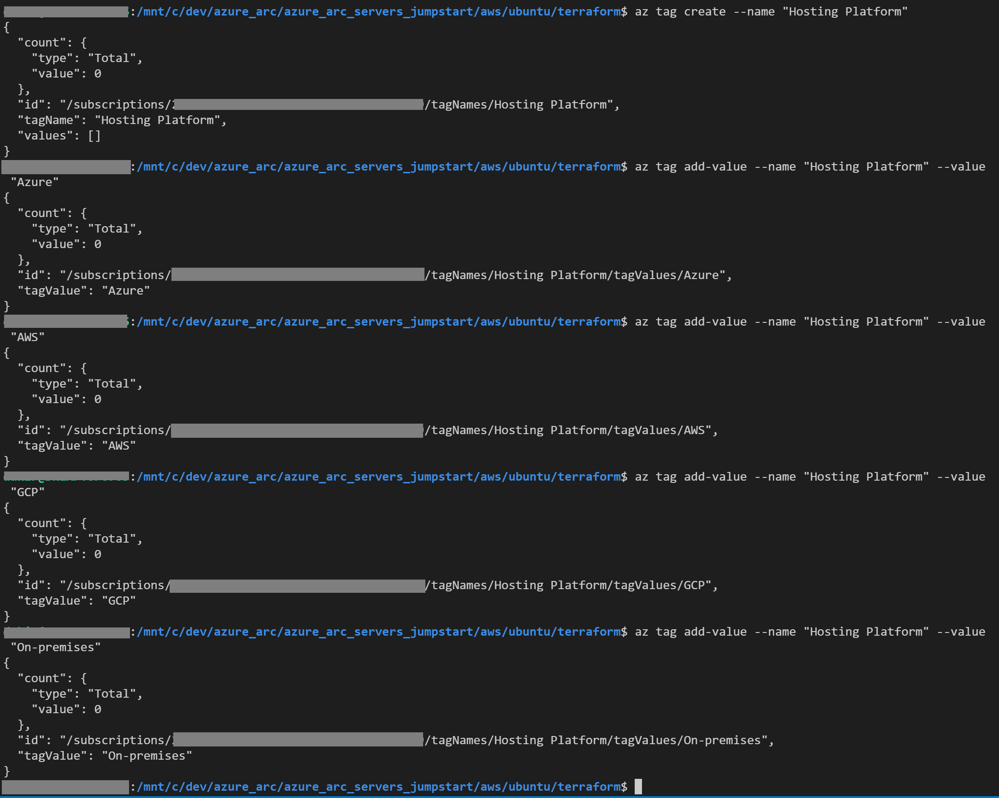
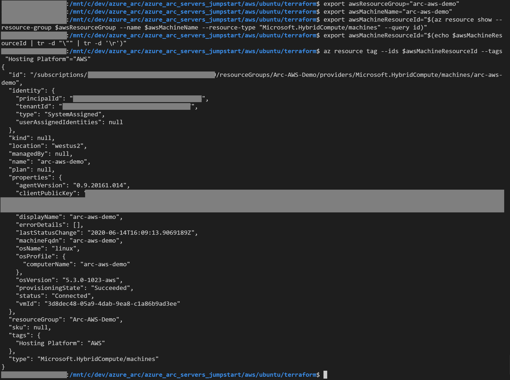
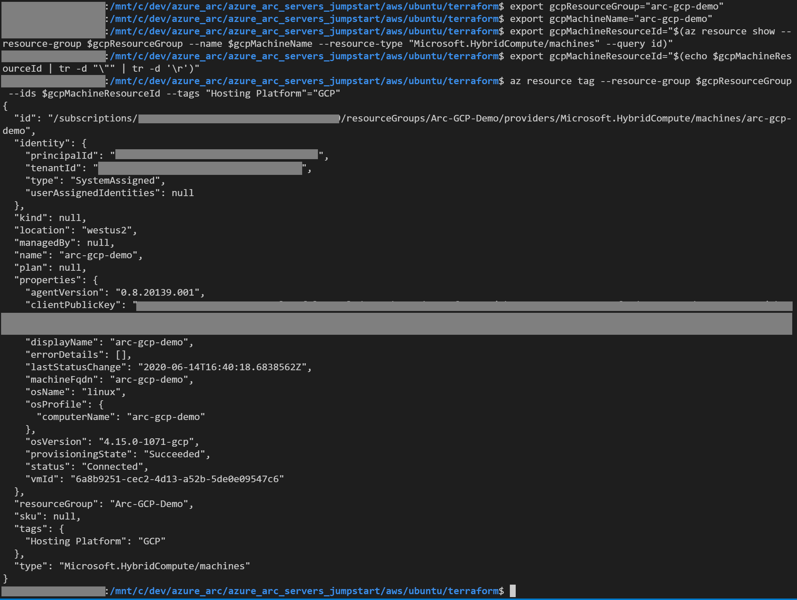
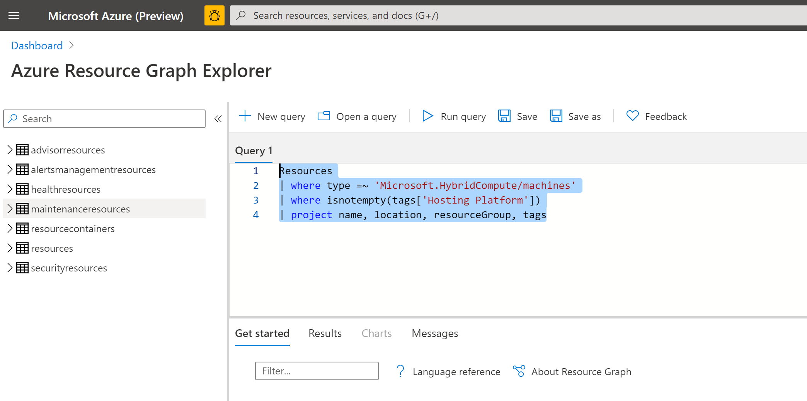
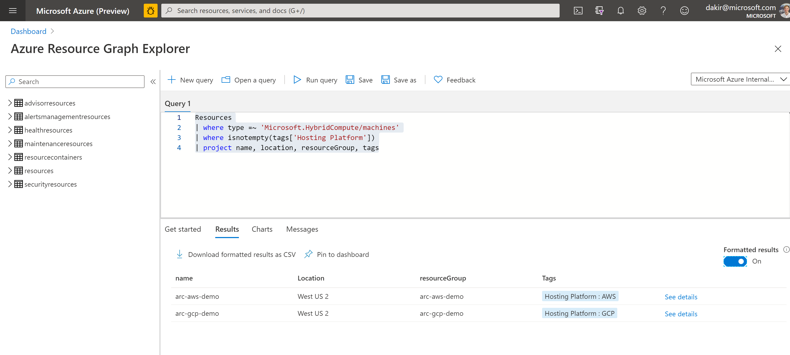
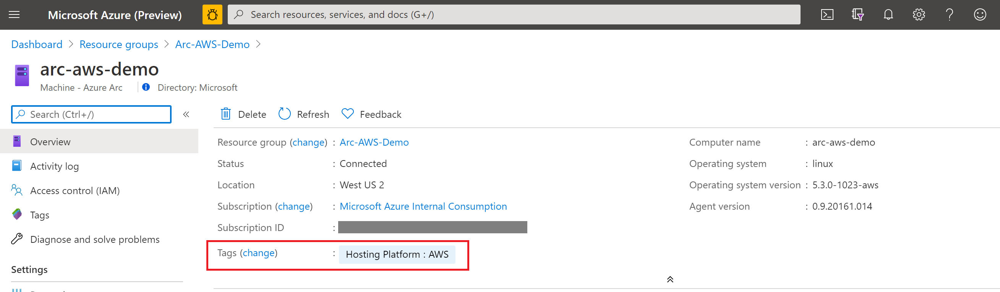
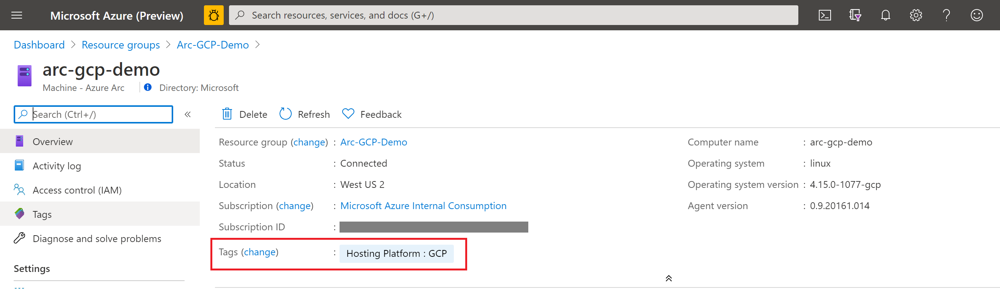

# Arc Inventory Tagging
 
The following README will guide you on how to use Azure Arc for servers to provide server inventory management capabilities across hybrid multi-cloud and on-premises environments.

Azure Arc for servers allows you to manage your Windows and Linux machines hosted outside of Azure on your corporate network or other cloud provider, similarly to how you manage native Azure virtual machines. When a hybrid machine is connected to Azure, it becomes a connected machine and is treated as a resource in Azure. Each connected machine has a Resource ID, is managed as part of a resource group inside a subscription, and benefits from standard Azure constructs such as Azure Policy and applying tags. The ability to easily organize and manage server inventory using Azure as a management engine greatly reduces administrative complexity and provides a consistent strategy for hybrid and multicloud environments.

In this guide, we will use [Resource Graph Explorer](https://docs.microsoft.com/en-us/azure/governance/resource-graph/first-query-portal) and [AZ CLI](https://docs.microsoft.com/en-us/cli/azure/install-azure-cli?view=azure-cli-latest) to demonstrate tagging and querying server inventory across multiple clouds from a single pane of glass in Azure.

*Note: This guide assumes you already deployed an Ubuntu VM in AWS and an Ubuntu VM in GCP and have connected them to Azure Arc. If you haven't, this repository offers you a way to do so in an automated fashion using these guides.*
* [GCP Ubuntu VM](../docs/gcp_terraform_ubuntu.md)
* [AWS Ubuntu VM](../docs/aws_terraform_ubntu.md)

# Prerequisites

* Clone this repo

    ```terminal
    git clone https://github.com/microsoft/azure_arc.git
    ```

* [Install or update Azure CLI](https://docs.microsoft.com/en-us/cli/azure/install-azure-cli?view=azure-cli-latest). **Azure CLI should be running version 2.7** or later. Use ```az --version``` to check your current installed version.

* Resources projected into Azure via Azure Arc from AWS and/or GCP.

# Verify that your Arc connected servers are ready for tagging

We will be using Resource Graph Explorer during this exercise to query and view resources in Azure. 

* Enter "Resource Graph Explorer" in the top search bar in the Azure portal and select it.

    

* In the query window, enter the following query and then click "Run Query":

        Resources
        | where type =~ 'Microsoft.HybridCompute/machines'

* If you have correctly connected servers via Arc, they should be listed in the Results pane of Resource Graph Explorer. You can also view the Arc connected resources from the Azure portal.

    

    

    

# Create a basic Azure tag taxonomy

* Open AZ CLI and run the following commands to create a basic taxonomy structure that will allow us to easily query and report on where our server resources are hosted (i.e., Azure vs AWS vs GCP vs On-premises). For more guidance on building out a tag taxonomy please review the [Resource naming and tagging decision guide](https://docs.microsoft.com/en-us/azure/cloud-adoption-framework/decision-guides/resource-tagging/).

    ```bash
    az tag create --name "Hosting Platform"
    az tag add-value --name "Hosting Platform" --value "Azure"
    az tag add-value --name "Hosting Platform" --value "AWS"
    az tag add-value --name "Hosting Platform" --value "GCP"
    az tag add-value --name "Hosting Platform" --value "On-premises"
    ```

    

# Tag Arc resources

Now that we have created a basic taxonomy structure, we will apply tags to our Arc server resources. In this guide, we will demonstrate tagging resources in both AWS and GCP. If you only have resources in one of these providers, you can skip to the appropriate section for AWS or GCP.

## Tag Arc-connected AWS Ubuntu server

* In AZ CLI, run the following commands to apply the "Hosting Platform : AWS" tag to your Arc AWS servers. 

    *Note: If you connected your AWS servers using a method other than the one described in [this tutorial](../docs/aws_terraform_ubuntu.md), then you will need to adjust the values for `awsResourceGroup` and `awsMachineName` to match values specific to your environment.*

    ```bash
    export awsResourceGroup="arc-aws-demo"
    export awsMachineName="arc-aws-demo"
    export awsMachineResourceId="$(az resource show --resource-group $awsResourceGroup --name $awsMachineName --resource-type "Microsoft.HybridCompute/machines" --query id)"
    export awsMachineResourceId="$(echo $awsMachineResourceId | tr -d "\"" | tr -d '\r')"
    az resource tag --ids $awsMachineResourceId --tags "Hosting Platform"="AWS"
    ```

    

## Tag Arc-connected GCP Ubuntu server

* In AZ CLI, run the following commands to apply the "Hosting Platform : GCP" tag to your Arc GCP servers. 

    *Note: If you connected your GCP servers using a method other than the one described in [this tutorial](../docs/gcp_terraform_ubuntu.md), then you will need to adjust the values for `gcpResourceGroup` and `gcpMachineName` to match values specific to your environment.*

    ```bash
    export gcpResourceGroup="arc-gcp-demo"
    export gcpMachineName="arc-gcp-demo"
    export gcpMachineResourceId="$(az resource show --resource-group $gcpResourceGroup --name $gcpMachineName --resource-type "Microsoft.HybridCompute/machines" --query id)"
    export gcpMachineResourceId="$(echo $gcpMachineResourceId | tr -d "\"" | tr -d '\r')"
    az resource tag --resource-group $gcpResourceGroup --ids $gcpMachineResourceId --tags "Hosting Platform"="GCP"
    ```

    

# Query resources by tag using Resource Graph Explorer

Now that we have applied tags to our resources that are hosted in multiple clouds, we can use Resource Graph Explorer to query them and get insight into our multi-cloud landscape.

* In the query window, enter the following query:

        Resources
        | where type =~ 'Microsoft.HybridCompute/machines'
        | where isnotempty(tags['Hosting Platform'])
        | project name, location, resourceGroup, tags

    

* Click "Run Query" and then select the Formatted Results toggle. If done correctly, you should see all Arc-connected servers and their assigned "Hosting Platform" tag values.

    

* We can also view the tags on the projected servers from Azure Portal.

    

    

# Clean up environment

Complete the following steps to clean up your environment.

* Remove the virtual machines from each environment by following the teardown instructions from each guide.

    * [GCP Ubuntu VM](../docs/gcp_terraform_ubuntu.md#teardown)
    * [AWS Ubuntu VM](../docs/aws_terraform_ubntu.md#teardown)

* Remove tags created as part of this guide by executing the following script in AZ CLI.
    ```bash
    az tag remove-value --name "Hosting Platform" --value "Azure"
    az tag remove-value --name "Hosting Platform" --value "AWS" 
    az tag remove-value --name "Hosting Platform" --value "GCP"
    az tag remove-value --name "Hosting Platform" --value "On-premises"
    az tag create --name "Hosting Platform"
    ```
