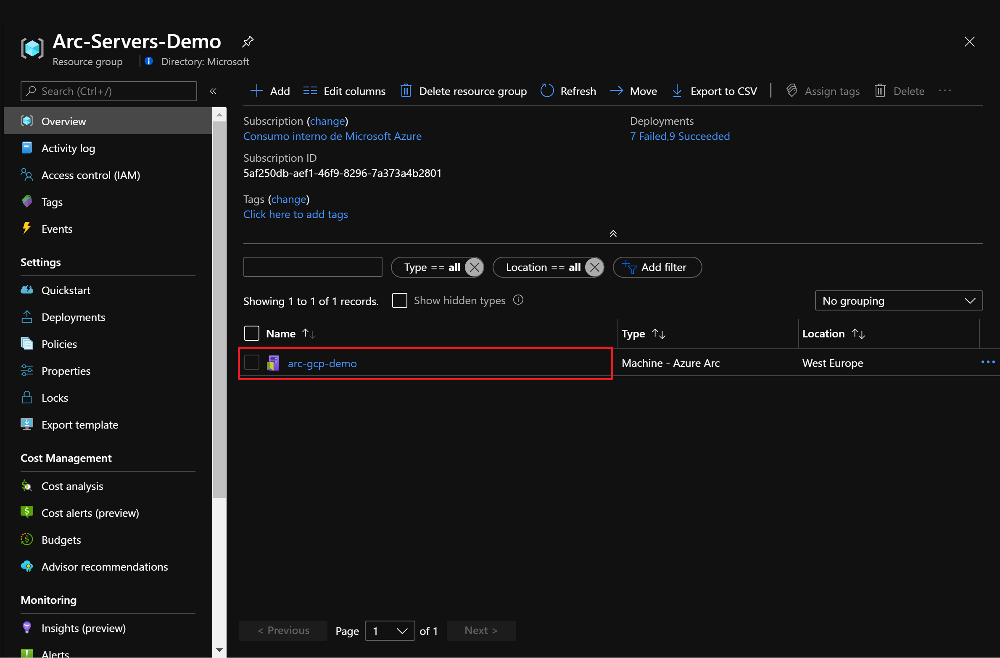
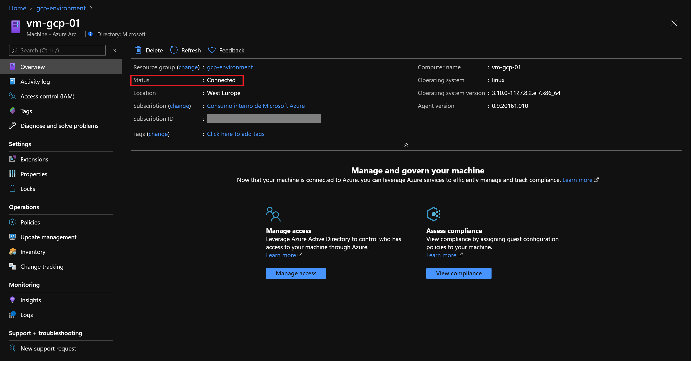
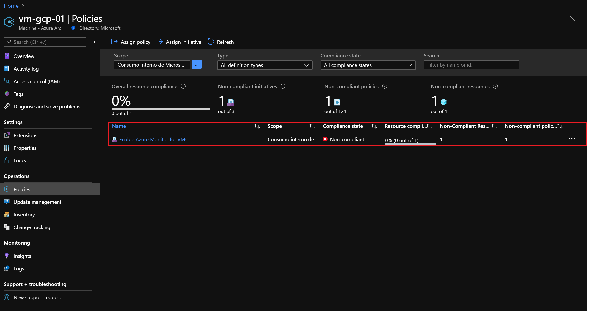
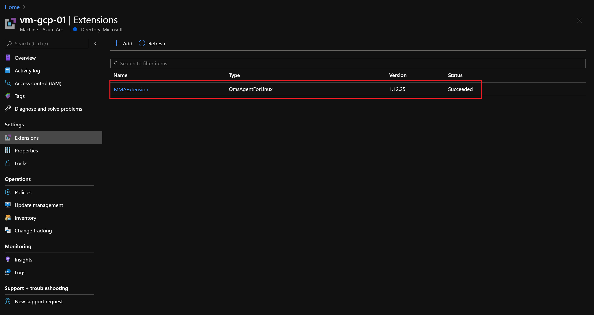
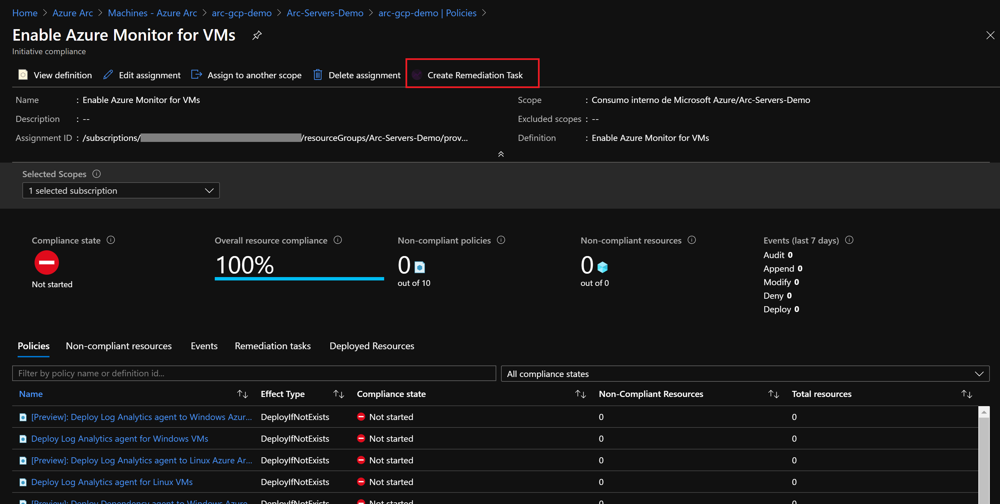
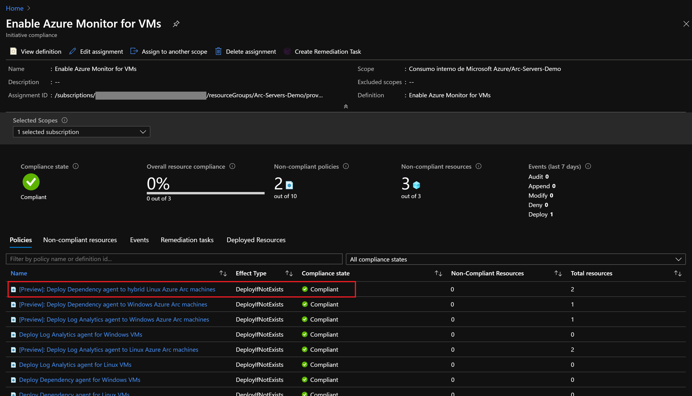

# Manage Arc Servers with Azure Policy

The following README will guide you on how to use Azure Arc for servers to assign Azure Policies to VMs outside of Azure, whether they are on-premises or other clouds. With this feature you can now use Azure Policies to audit settings in the operating system of an Azure Arc connected servers, if a setting is not compliant you can also trigger a remediation task. 

In this case, you will assign a policy to audit if the Azure Arc connected machine has the (Microsoft Monitoring Agent) MMA agent installed, if not, you will use the extensions feature to automatically deploy it to the VM, an enrollment experience that levels to Azure VMs. This approach can be used to make sure all your servers are onboarded to services such as Azure Monitor, Azure Security Center, Azure Sentinel, etc. 

You can use the Azure Portal, an ARM template or PowerShell script to assign policies to Azure Subscriptions or Resource Groups. In this guide, you will use an ARM template to assign built-in policies. 

**Note: This guide assumes you already deployed VMs or servers that are running on-premises or other clouds and you have connected them to Azure Arc.**

**If you haven't, this repository offers you a way to do so in an automated fashion:**
- **[GCP Ubuntu VM](gcp_terraform_ubuntu.md) / [GCP Windows VM](gcp_terraform_windows.md)**
- **[AWS Ubuntu VM](aws_terraform_ubuntu.md)**
- **[VMware Ubuntu VM](vmware_terraform_ubuntu.md) / [VMware Windows Server VM](vmware_terraform_winsrv.md)**
- **[Local Ubuntu VM](local_vagrant_ubuntu.md) / [Local Windows VM](local_vagrant_windows.md)**

Please review the [Azure Monitor Supported OS documentation](https://docs.microsoft.com/en-us/azure/azure-monitor/insights/vminsights-enable-overview#supported-operating-systems) and ensure that the VMs you will use for this exercise are supported. For Linux VMs, check both the Linux distro and kernel to ensure you are using a supported configuration.


# Prerequisites

* Clone this repo

    ```terminal
    git clone https://github.com/microsoft/azure_arc.git
    ```

* As mentioned, this guide starts at the point where you already deployed and connected VMs or servers to Azure Arc. In the screenshots below we can see a GCP server has been connected with Azure Arc and is visible as a resource in Azure.

    

    

  
* [Install or update Azure CLI](https://docs.microsoft.com/en-us/cli/azure/install-azure-cli?view=azure-cli-latest). Azure CLI should be running version 2.7** or later. Use ```az --version``` to check your current installed version.

* Create Azure Service Principal (SP)   

    To connect a VM or bare-metal server to Azure Arc, Azure Service Principal assigned with the "Contributor" role is required. To create it, login to your Azure account run the below command (this can also be done in [Azure Cloud Shell](https://shell.azure.com/)).

    ```bash
    az login
    az ad sp create-for-rbac -n "<Unique SP Name>" --role contributor
    ```
    For example:
    ```az ad sp create-for-rbac -n "http://AzureArcServers" --role contributor```
    Output should look like this:
    ```
    {
    "appId": "XXXXXXXXXXXXXXXXXXXXXXXXXXXX",
    "displayName": "AzureArcServers",
    "name": "http://AzureArcServers",
    "password": "XXXXXXXXXXXXXXXXXXXXXXXXXXXX",
    "tenant": "XXXXXXXXXXXXXXXXXXXXXXXXXXXX"
    }
    ```
    
  **Note**: It is optional but highly recommended to scope the SP to a specific [Azure subscription and Resource Group](https://docs.microsoft.com/en-us/cli/azure/ad/sp?view=azure-cli-latest).

* You will also need to have a Log Analytics Workspace deployed. You can automate the deployment by editing the ARM template [parameters file](../policies/arm/log_analytics-template.parameters.json), provide a name and location for your workspace

    

  To deploy the ARM template, navigate to the [deployment folder](../policies/arm) and run the below command:

  ```bash
    az deployment group create --resource-group <Name of the Azure Resource Group> \
    --template-file <The *log_analytics-template.json* template file location> \
    --parameters <The *log_analytics-template.parameters.json* template file location>
  ```

# Azure Policies on Azure Arc connected machines

* Now that you have all the prerequisites set, you can assign policies to our Arc connected machines. Edit the [parameters file](../policies/arm/policy.json) to provide your subscription ID as well as the Log Analytics Workspace.

    

  To start the deployment, use the below command: 

  ```bash
  az policy assignment create --name 'Enable Azure Monitor for VMs' \
  --scope '/subscriptions/<Your subscription ID>/resourceGroups/<Name of the Azure Resource Group>' \
  --policy-set-definition '55f3eceb-5573-4f18-9695-226972c6d74a' \
  -p <The *policy.json* template file location> \
  --assign-identity --location <Azure Region>
  ```

  The flag *policy-set-definition* points to the initiative "Enable Azure Monitor" definition ID. 

* Once the initiative is assigned, it takes around 30 minutes for the assignment to be applied to the defined scope. After those 30 minutes, Azure Policy will start the evaluation cycle against the Azure Arc connected machine and recognize it as "Non-compliant" (since it still does note have the Log Analytics Agent configuration deployed). To check this, go to the Azure Arc connected Machine under the Policies section. 

  

* Now, you will assign a remediation task to the non-compliant resource to put into a compliant state. 

  

* Under 'Policy to remediate' choose '[Preview] Deploy Log Analytics Agent to Linux Azure Arc machines' and select 'Remediate'. This remediation task is instructing Azure Policy to run the deployIfNotExists effect and use the Azure Arc extension management capabilities to deploy the Log Analytics agent on the VM

  

* Once you have assigned remediation task, the policy will be evaluated again and show that the server on GCP is compliant and that the Microsoft Monitoring Agent extension is installed on the Azure Arc machine.

  

  

# Clean up environment

Complete the following steps to clean up your environment.

* Remove the virtual machines from each environment by following the teardown instructions from each guide.

    - *[GCP Ubuntu VM](gcp_terraform_ubuntu.md) / [GCP Windows VM](gcp_terraform_windows.md)*
    - *[AWS Ubuntu VM](aws_terraform_ubuntu.md)*
    - *[VMware Ubuntu VM](vmware_terraform_ubuntu.md) / [VMware Windows Server VM](vmware_terraform_winsrv.md)*
    - *[Local Ubuntu VM](local_vagrant_ubuntu.md) / [Local Windows VM](local_vagrant_windows.md)*

* Remove the Azure Policy assignment by executing the following script in AZ CLI.

   ```bash
    az policy assignment delete --name 'Enable Azure Monitor for VMs' --resource-group <resource_group>
    ```
* Remove the Log Analytics workspace by executing the following script in AZ CLI. Provide the workspace name you used when creating the Log Analytics Workspace.

    ```bash
    az monitor log-analytics workspace delete --resource-group <Name of the Azure Resource Group> --workspace-name <Log Analytics Workspace Name> --yes
    ```
