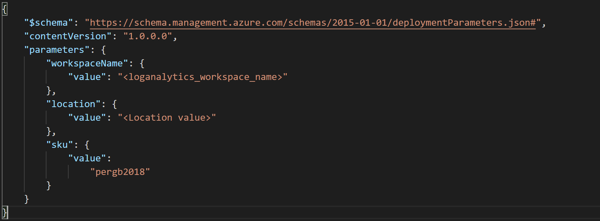
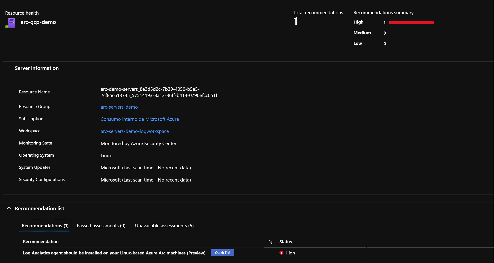
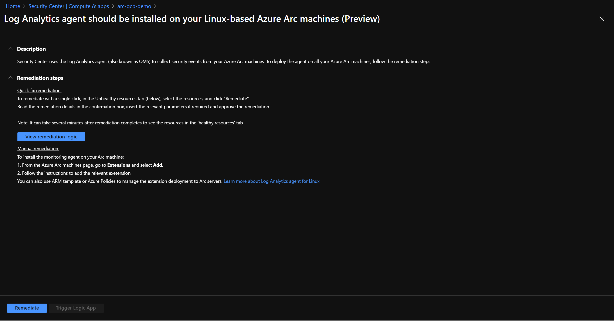
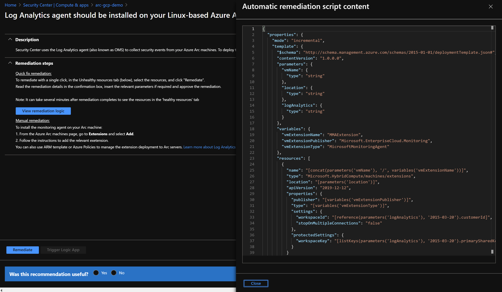
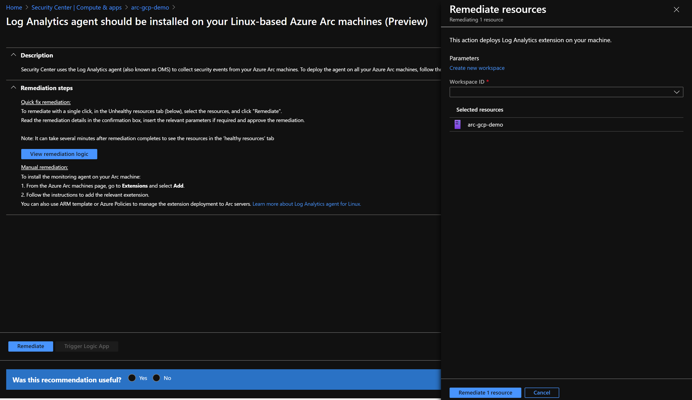
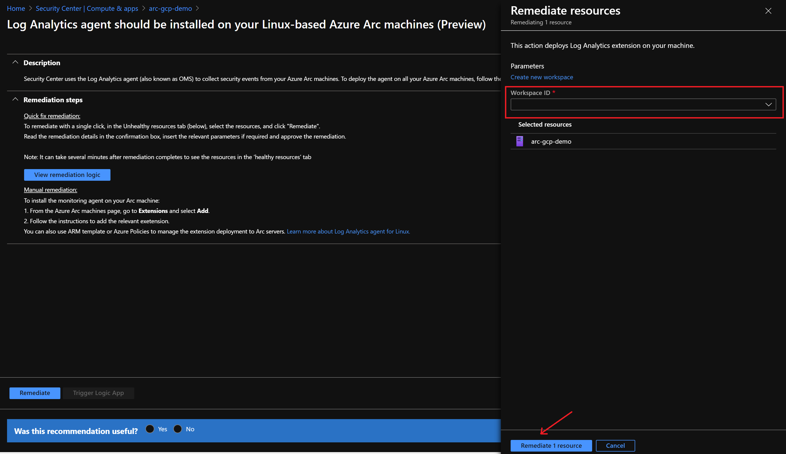
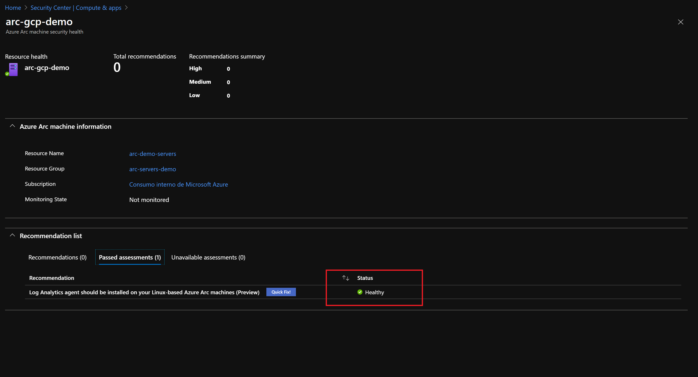

# Azure Arc enabled Servers on Azure Security Center

The following README will guide you on how to onboard an Azure Arc enabled Machine on to [Azure Security Center (ASC)](https://docs.microsoft.com/en-us/azure/security-center/), so you can start collecting security-related configurations as well as event logs as a way to recommend actions and improve your overall Azure security posture.

In this guide, you will enable and configure Standard tier ASC on your Azure subscription, which will provide you with advanced threat protection (ATP) and detection capabilities. To complete this process you will: 

* Setup the Log Analytics Workspace where logs and events will be aggregated for analysis. 

* Assign Security Center’s default security policies.

* Review Azure Security Center's recommendations.

* Apply recommended configurations on Azure Arc enabled Servers using the ***Quick Fix*** remediations. 

**Note: This guide assumes you already deployed VMs or servers that are running on-premises or other clouds and you have connected them to Azure Arc.**

**If you haven't, this repository offers you a way to do so in an automated fashion:**
- **[GCP Ubuntu VM](gcp_terraform_ubuntu.md) / [GCP Windows VM](gcp_terraform_windows.md)**
- **[AWS Ubuntu VM](aws_terraform_ubuntu.md)**
- **[VMware Ubuntu VM](vmware_terraform_ubuntu.md) / [VMware Windows Server VM](vmware_terraform_winsrv.md)**
- **[Local Ubuntu VM](local_vagrant_ubuntu.md) / [Local Windows VM](local_vagrant_windows.md)**

# Prerequisites

* Clone this repo

    ```terminal
    git clone https://github.com/microsoft/azure_arc.git
    ```

* As mentioned, this guide starts at the point where you already deployed and connected VMs or bare-metal servers to Azure Arc. For this scenario, as can be seen in the screenshots below, we will be using a Google Cloud Platform (GCP) instance that has been already connected to Azure Arc and is visible as a resource in Azure.

    

    

  
* [Install or update Azure CLI](https://docs.microsoft.com/en-us/cli/azure/install-azure-cli?view=azure-cli-latest). Azure CLI should be running version 2.7** or later. Use ```az --version``` to check your current installed version.

* Create Azure Service Principal (SP).   

    To connect a VM or bare-metal server to Azure Arc, Azure Service Principal assigned with the "Contributor" role is required. To create it, login to your Azure account run the below command (this can also be done in [Azure Cloud Shell](https://shell.azure.com/)).

    ```bash
    az login
    az ad sp create-for-rbac -n "<Unique SP Name>" --role contributor
    ```
    For example:
    ```az ad sp create-for-rbac -n "http://AzureArcServers" --role contributor```
    Output should look like this:
    ```
    {
    "appId": "XXXXXXXXXXXXXXXXXXXXXXXXXXXX",
    "displayName": "AzureArcServers",
    "name": "http://AzureArcServers",
    "password": "XXXXXXXXXXXXXXXXXXXXXXXXXXXX",
    "tenant": "XXXXXXXXXXXXXXXXXXXXXXXXXXXX"
    }
    ```
    
  **Note**: It is optional but highly recommended to scope the SP to a specific [Azure subscription and Resource Group](https://docs.microsoft.com/en-us/cli/azure/ad/sp?view=azure-cli-latest).

# Onboarding Azure Security Center

* Data collected by Security Center is stored in a Log Analytics workspace, you can either use the default one created by ASC or a custom one created by you. If you want to create a dedicated workspace, you can automate the deployment by editing the ARM template [parameters file](../securitycenter/arm/log_analytics-template.parameters.json), provide a name and location for your workspace:

    

* To deploy the ARM template, navigate to the [deployment folder](../securitycenter/arm) and run the below command:

  ```bash
    az deployment group create --resource-group <Name of the Azure Resource Group> \
    --template-file <The *log_analytics-template.json* template file location> \
    --parameters <The *log_analytics-template.parameters.json* template file location>
  ```

* If you are going for an user-defined workspace, you should instruct Security Center to use it instead of the default one, use the below command:

  ```bash
    az security workspace-setting create --name default \
    --target-workspace '/subscriptions/<Your subscription ID>/resourceGroups/<Name of the Azure Resource Group>/providers/Microsoft.OperationalInsights/workspaces/<Name of the Log Analytics Workspace>'
  ```

* Select the Azure Security Center tier, the Free tier is enabled on all your Azure subscriptions by default and will provide continuous security assessment and actionable security recommendations. In this guide, you will use the Standard tier for Virtual Machines that extends these capabilities providing unified security management and threat protection across your hybrid cloud workloads. To enable the Standard tier of Azure Security Center for VMs run the command below: 

    ```bash
    az security pricing create -n VirtualMachines --tier 'standard'
    ```
* Now you need to assign the default Security Center policy initiative. ASC makes its security recommendations based on policies, there is an specific initiative that groups Security Center policies with the definition ID '1f3afdf9-d0c9-4c3d-847f-89da613e70a8'. The command below will assign the ASC initiative to your subscription:

    ```bash
    az policy assignment create --name 'ASC Default <Your subscription ID>' \
    --scope '/subscriptions/<Your subscription ID>' \
    --policy-set-definition '1f3afdf9-d0c9-4c3d-847f-89da613e70a8' 
    ```


# Azure Arc and Azure Security Center Integration

Now that you have successfully onboarded ASC, you will get recommendations to help you protect your resources, including your Azure Arc enabled Machines. ASC will then periodically analyze the security state of your Azure resources to identify potential security vulnerabilities.

* In the "Compute & apps" section under "VM and Servers", ASC will provide you with an overview of all the discovered security recommendations for your VMs and computers, including Azure VMs, Azure Classic VMs, servers and **Azure Arc Machines**.

    

* On the Azure Arc machines, ASC will provide a recommendation to install the Log Analytics agent. In addition, each recommendation will include:
    - A short description of what is being recommended.
    - A Secure Score impact, in this case, with a status of *High*.
    - The remediation steps to carry out in order to implement the recommendation. For specific recommendations, like this one, you will also get a ***Quick Fix*** that enables you to quickly remediate a recommendation on multiple resources.

    
   
    

* This remediation ***Quick Fix*** is using an ARM template to deploy the Microsoft Monitoring Agent extension on the Azure Arc machine. 

    

* You can trigger the remediation with the ARM template from the Azure Security Center dashboard, by selecting the Log Analytics Workspace used for ASC and clicking on "Remediate 1 resource".

    

* After you apply the recommendation on the Azure Arc enabled machine the resource will be now marked as healthy.

    

# Clean up environment

Complete the following steps to clean up your environment.

* Remove the virtual machines from each environment by following the teardown instructions from each guide.

    - *[GCP Ubuntu VM](gcp_terraform_ubuntu.md) / [GCP Windows VM](gcp_terraform_windows.md)*
    - *[AWS Ubuntu VM](aws_terraform_ubuntu.md)*
    - *[VMware Ubuntu VM](vmware_terraform_ubuntu.md) / [VMware Windows Server VM](vmware_terraform_winsrv.md)*
    - *[Local Ubuntu VM](local_vagrant_ubuntu.md) / [Local Windows VM](local_vagrant_windows.md)*

* Remove the Log Analytics workspace by executing the following script in AZ CLI. Provide the workspace name you used when creating the Log Analytics Workspace.

    ```bash
    az monitor log-analytics workspace delete --resource-group <Name of the Azure Resource Group> --workspace-name <Log Analytics Workspace Name> --yes
    ```
