# Deploy Update Management on Azure Arc enabled Servers

The scenario will show you how to onboard Azure Arc enabled Servers to [Update Management](https://docs.microsoft.com/en-us/azure/automation/update-management/overview), so that you can manage operating system updates for your Azure Arc enabled servers running Windows or Linux.

In this guide, you will create and configure an Azure Automation account and Log Analytics workspace to support Update Management for Azure Arc enabled servers by doing the following:

* Setup a new Log Analytics Workspace and Azure Automation account. 

* Enable Update Management on Azure Arc enabled servers. 

**Note: This guide assumes you already deployed VMs or servers that are running on-premises or other clouds and you have connected them to Azure Arc.**

**If you haven't, this repository offers you a way to do so in an automated fashion:**
- **[GCP Ubuntu VM](gcp_terraform_ubuntu.md) / [GCP Windows VM](gcp_terraform_windows.md)**
- **[AWS Ubuntu VM](aws_terraform_ubuntu.md)**
- **[Azure Ubuntu VM](azure_arm_template_linux.md) / [Azure Windows VM](azure_arm_template_win.md)**
- **[VMware Ubuntu VM](vmware_terraform_ubuntu.md) / [VMware Windows Server VM](vmware_terraform_winsrv.md)**
- **[Local Ubuntu VM](local_vagrant_ubuntu.md) / [Local Windows VM](local_vagrant_windows.md)**

## Prerequisites

* Clone this repo

    ```terminal
    git clone https://github.com/microsoft/azure_arc.git
    ```

* As mentioned, this guide starts at the point where you already deployed and connected VMs or bare-metal servers to Azure Arc. For this scenario, as can be seen in the screenshots below, we will be using an Amazon Web Services (AWS) EC2 instance that has been already connected to Azure Arc and is visible as a resource in Azure.

    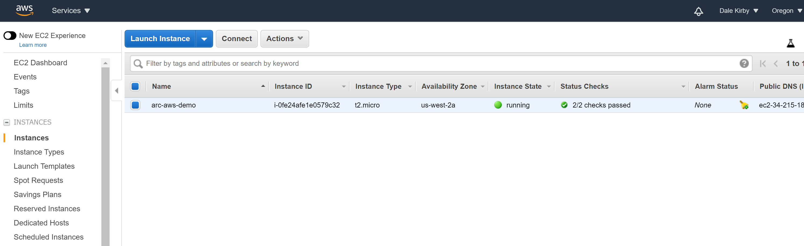

    

  
* [Install or update Azure CLI](https://docs.microsoft.com/en-us/cli/azure/install-azure-cli?view=azure-cli-latest). Azure CLI should be running version 2.14 or later. Use ```az --version``` to check your current installed version.

* Create Azure Service Principal (SP).   

    To connect a VM or bare-metal server to Azure Arc, Azure Service Principal assigned with the "Contributor" role is required. To create it, login to your Azure account run the below command (this can also be done in [Azure Cloud Shell](https://shell.azure.com/)).

    ```bash
    az login
    az ad sp create-for-rbac -n "<Unique SP Name>" --role contributor
    ```
    For example:
    ```az ad sp create-for-rbac -n "http://AzureArcServers" --role contributor```
    Output should look like this:
    ```
    {
    "appId": "XXXXXXXXXXXXXXXXXXXXXXXXXXXX",
    "displayName": "AzureArcServers",
    "name": "http://AzureArcServers",
    "password": "XXXXXXXXXXXXXXXXXXXXXXXXXXXX",
    "tenant": "XXXXXXXXXXXXXXXXXXXXXXXXXXXX"
    }
    ```
    
  **Note**: It is optional but highly recommended to scope the SP to a specific [Azure subscription and Resource Group](https://docs.microsoft.com/en-us/cli/azure/ad/sp?view=azure-cli-latest).

# Configuring Update Management

Update Management uses the Log Analytics agent to collect Windows and Linux server log files and the data collected is stored in a Log Analytics workspace. 

* You will need to create a Log Analytics workspace. For that you can use this [ARM template](../updateManagement/law-template.json) that will create a new Log Analytics Workspace and define the Azure Sentinel solution and enable it for the workspace. 

* First, create a new resource group for the Log Analytics workspace by running the below command, replacing the values in brackets with your own.

    ```bash
    az group create --name <Name for your resource group> \
    --location <Location for your resources> \
    --tags "Project=jumpstart_azure_arc_servers"
    ```
    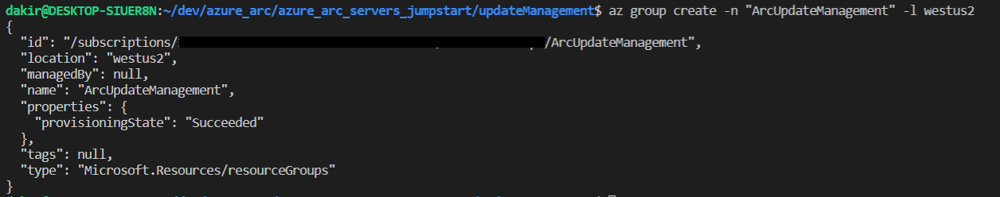

* Next, edit the ARM template [parameters file](../updateManagement/law-template.parameters.json), providing a name for your Log Analytics workspace, a location, and a name for your Azure Automation account. You also need to supply the name of your Azure Arc enabled server, and the name of the resource group that contains the Arc enabled server as shown in the example below:

    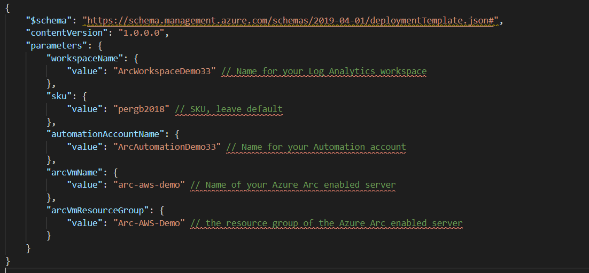

* To deploy the ARM template, navigate to the [deployment folder](../updateManagement/) and run the below command:

    ```bash
    az deployment group create --resource-group <Name of the Azure Resource Group you created> \
        --template-file law-template.json \
        --parameters law-template.parameters.json
    ```

   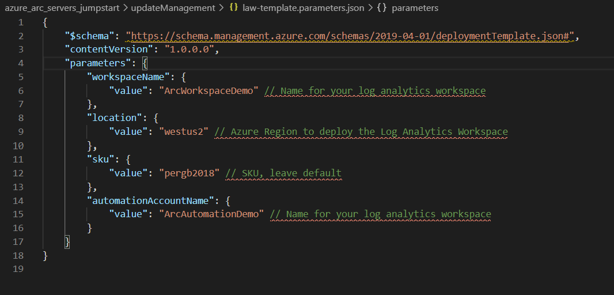

* When the deployment is complete, you should be able to see the resource group with your Log Analytics workspace, automation account and Update Management solution from the Azure Portal. Drilling into the Log Analytics workspace Solutions blade should show the Update Management solution.

    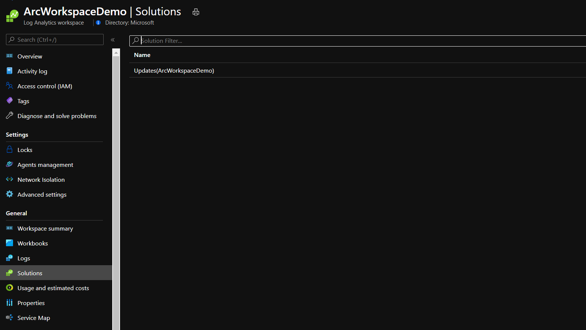

## Confirm that the Update Management solution is deployed on your Azure Arc enabled server.

* Click on the Solutions blade of the Log Analytics workspace and then click the Updates solution from the list to check the progress of the Update Management assessment.

    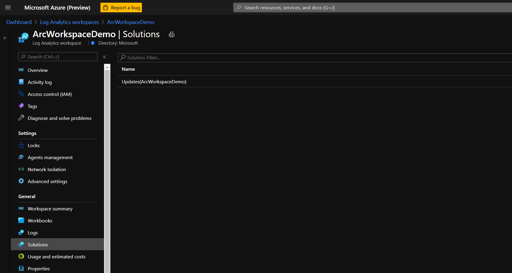

* It may take several hours for Update Management to collect enough data to show an assessment for your VM. In the screen below we can see the assessment is being peformed.

    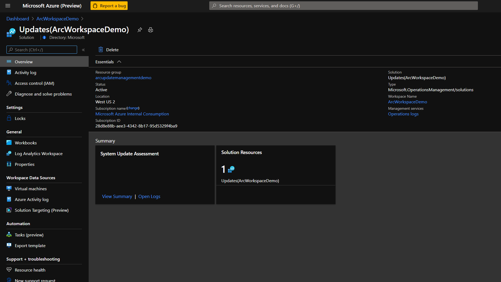

* When the assessment is complete, you will see an option to "View summary" on the Update Management blade.

    

* Click View Summary and then click again to drill into the Update Management assessment. In the below example we can see there are updates missing on our Azure Arc enabled server.

    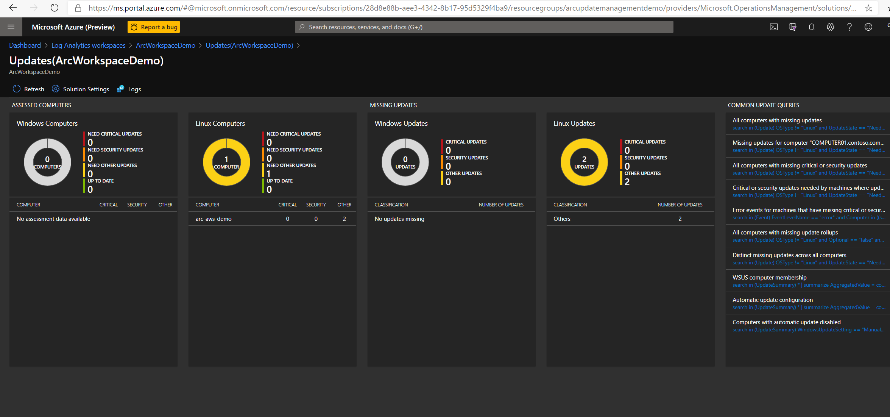

## Schedule an Update

Now that we have configured the Update Management solution, we can deploy updates on a set schedule for our Azure Arc enabled server.

* Navigate to the Automation Account we created previously and click on the Update Management blade as shown in the screenshot below. You should see your Azure Arc enabled server listed.

    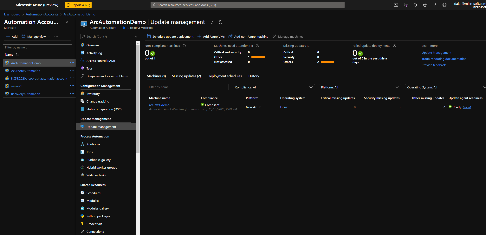

* From the above screen, click "Schedule update deployment". On the next screen, select the Operating System that your Azure Arc enabled server is using, and then select "Machines to update" as shown below.

    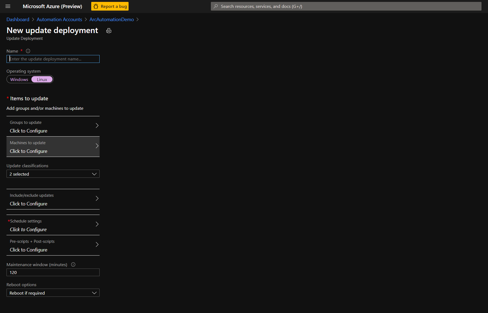

* From the "Type" dropdown, select "Machines" and then select your server and click Ok.

    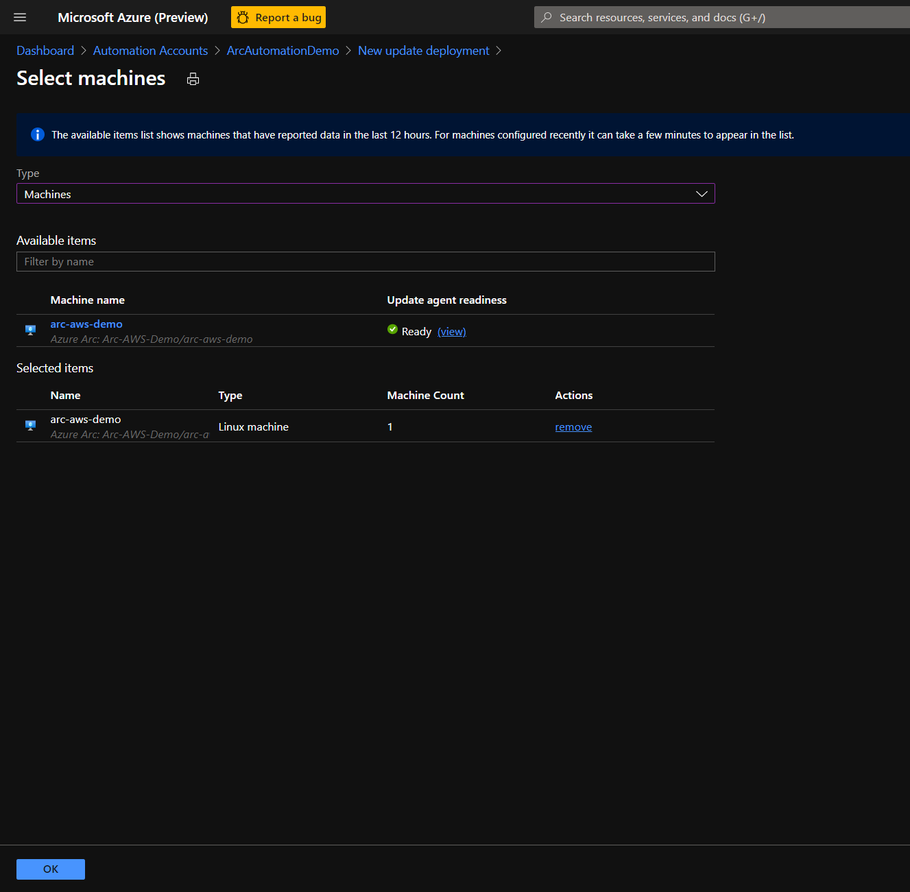

* Click Schedule Settings and then provide a desired schedule.

    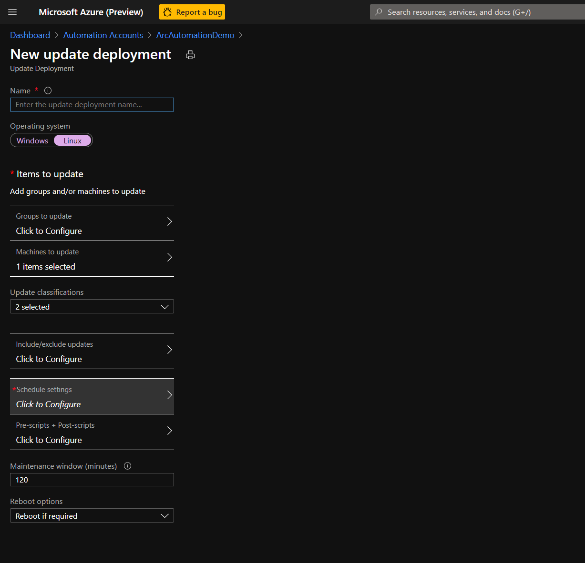

    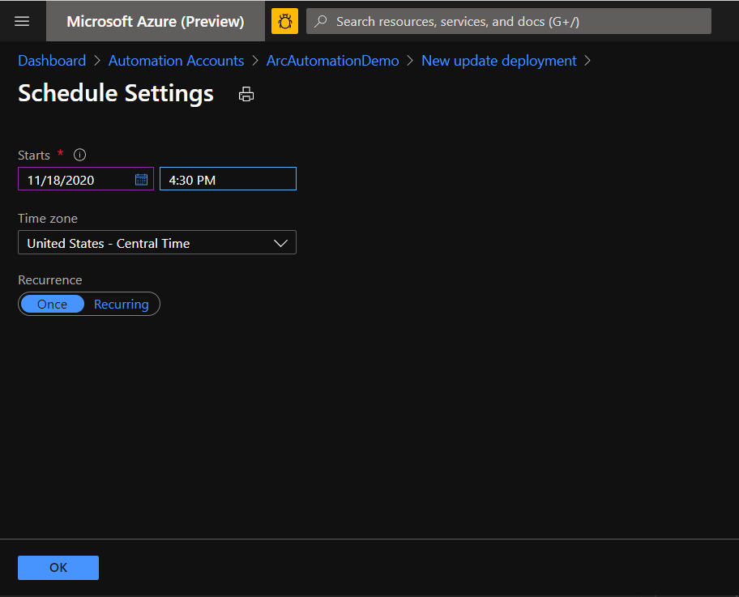

* Finally, provide a name for your Update deployment and then click Create.

    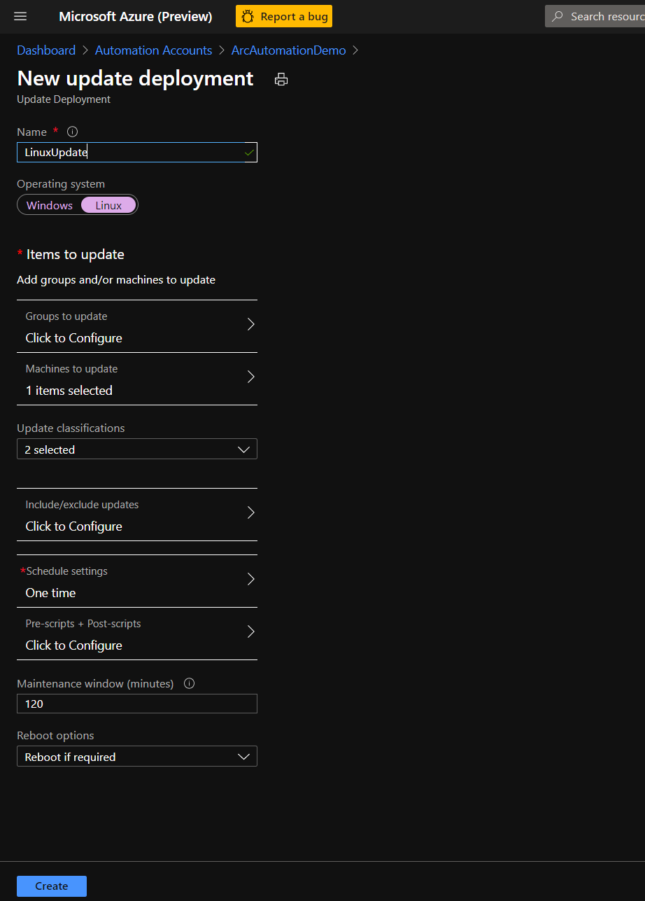

* From the Automation Account Update Management blade, you should be able to see your scheduled Update deployment from the Deployment Schedules tab. 
    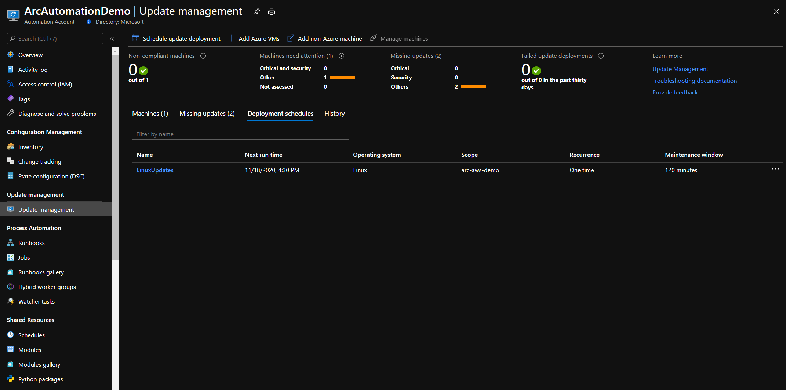

The Update Management solution will now update your Azure Arc enabled servers in the deployment window based on the schedule you defined. There is a lot more you can do with [Update Management](https://docs.microsoft.com/en-us/azure/automation/update-management/overview) that is outside the scope of this scenario. Review the [documentation](https://docs.microsoft.com/en-us/azure/automation/update-management/overview) for more information. 

## Clean up environment

Complete the following steps to clean up your environment.

* Remove the virtual machines from each environment by following the teardown instructions from each guide.

    - *[GCP Ubuntu VM](gcp_terraform_ubuntu.md) / [GCP Windows VM](gcp_terraform_windows.md)*
    - *[AWS Ubuntu VM](aws_terraform_ubuntu.md)*
    - *[Azure Ubuntu VM](azure_arm_template_linux.md) / [Azure Windows VM](azure_arm_template_win.md)*
    - *[VMware Ubuntu VM](vmware_terraform_ubuntu.md) / [VMware Windows Server VM](vmware_terraform_winsrv.md)*
    - *[Local Ubuntu VM](local_vagrant_ubuntu.md) / [Local Windows VM](local_vagrant_windows.md)*

* Remove the Log Analytics workspace by executing the following script in AZ CLI. Provide the workspace name you used when creating the Log Analytics Workspace.

    ```bash
    az monitor log-analytics workspace delete --resource-group <Name of the Azure Resource Group> --workspace-name <Log Analytics Workspace Name> --yes
    ```

* Delete the Automation Account from the Azure portal.

    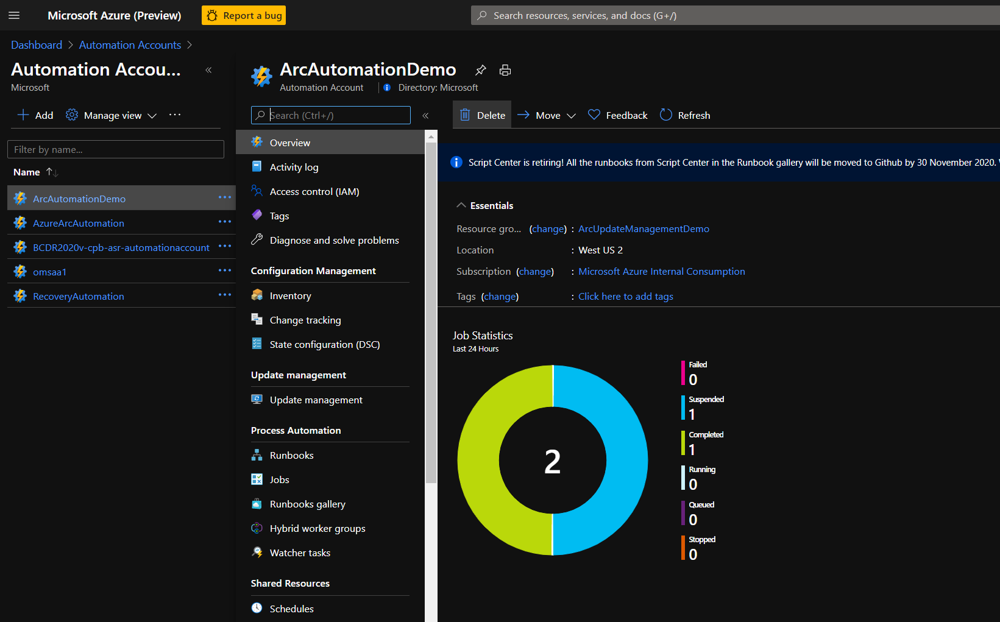

* Delete the resource group.

    ```bash
    az group delete --name <Name of your resource group>
    ```

    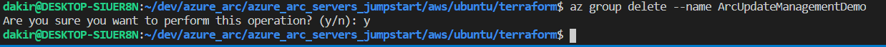
