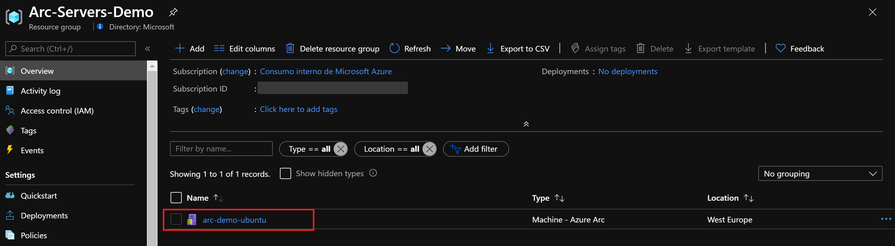
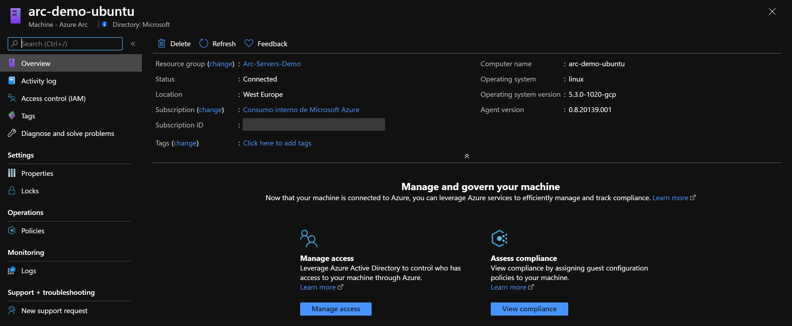
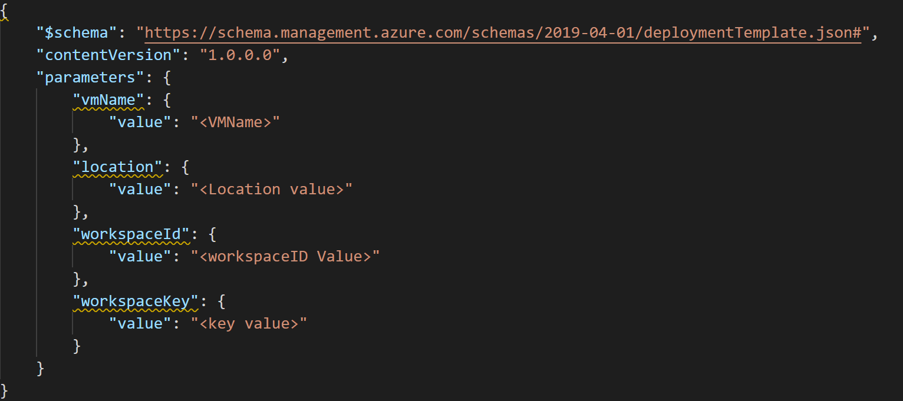
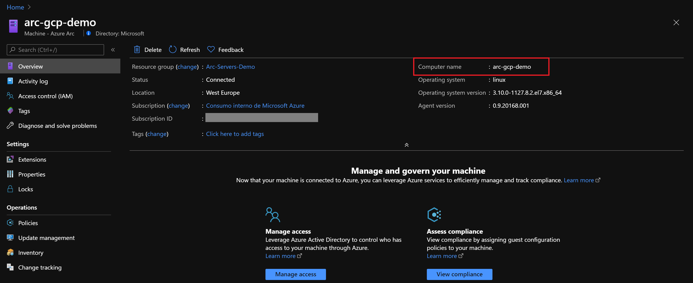
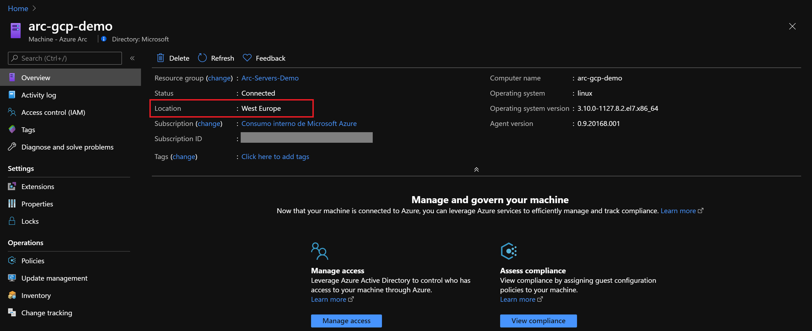
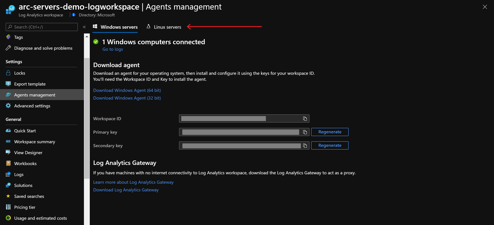
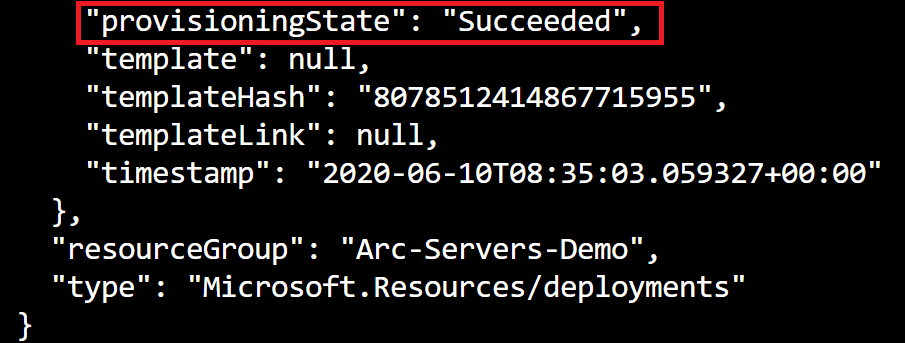

# Arc Server MMA Extension

The following README will guide you on how to manage extensions on Azure Arc connected machines. Virtual machine extensions are small applications that provide post-deployment configuration and automation tasks such as software installation, anti-virus protection, or a mechanism to run a custom script.

Azure Arc for servers, enables you to deploy Azure VM extensions to non-Azure Windows and Linux VMs, giving you a hybrid or multicloud management experience that levels to Azure VMs.

You can use the Azure Portal, Azure CLI, an ARM template, PowerShell script or Azure policies to manage the extension deployment to Arc servers, both Linux and Windows. In this guide, you will use an ARM template deploy the Microsoft Monitoring Agent (MMA) to your servers so they are onboarded on Azure Services that leverage this service: Azure Monitor, Azure Security Center, Azure Sentinel, etc. 

**Note: This guide assumes you already deployed VMs or servers that are running on-premises or other clouds and you have connected them to Azure Arc.**

**If you haven't, this repository offers you a way to do so in an automated fashion:**
- **[GCP Ubuntu VM](gcp_terraform_ubuntu.md) / [GCP Windows VM](gcp_terraform_windows.md)**
- **[AWS Ubuntu VM](aws_terraform_ubuntu.md)**
- **[VMware Ubuntu VM](vmware_terraform_ubuntu.md) / [VMware Windows Server VM](vmware_terraform_winsrv.md)**
- **[Local Ubuntu VM](local_vagrant_ubuntu.md) / [Local Windows VM](local_vagrant_windows.md)**

Please review the [Azure Monitor Supported OS documentation](https://docs.microsoft.com/en-us/azure/azure-monitor/insights/vminsights-enable-overview#supported-operating-systems) and ensure that the VMs you will use for this exercise are supported. For Linux VMs, check both the Linux distro and kernel to ensure you are using a supported configuration.

# Prerequisites

* Clone this repo

    ```terminal
    git clone https://github.com/microsoft/azure_arc.git
    ```
    
* Register your subscription to access preview extensions functionality.

* As mentioned, this guide starts at the point where you already deployed and connected VMs or servers to Azure Arc. In the screenshots below you can see a GCP server has been connected with Azure Arc and is visible as a resource in Azure.

    

    


* [Install or update Azure CLI](https://docs.microsoft.com/en-us/cli/azure/install-azure-cli?view=azure-cli-latest). Azure CLI should be running version 2.7** or later. Use ```az --version``` to check your current installed version.

* Create Azure Service Principal (SP)   

    To connect a VM or bare-metal server to Azure Arc, Azure Service Principal assigned with the "Contributor" role is required. To create it, login to your Azure account run the below command (this can also be done in [Azure Cloud Shell](https://shell.azure.com/)).

  ```bash
    az login
    az ad sp create-for-rbac -n "<Unique SP Name>" --role contributor
    ```
    For example:
    ```az ad sp create-for-rbac -n "http://AzureArcServers" --role contributor```
    Output should look like this:
    ```
    {
    "appId": "XXXXXXXXXXXXXXXXXXXXXXXXXXXX",
    "displayName": "AzureArcServers",
    "name": "http://AzureArcServers",
    "password": "XXXXXXXXXXXXXXXXXXXXXXXXXXXX",
    "tenant": "XXXXXXXXXXXXXXXXXXXXXXXXXXXX"
    }
    ```
    
    **Note**: It is optional but highly recommended to scope the SP to a specific [Azure subscription and Resource Group](https://docs.microsoft.com/en-us/cli/azure/ad/sp?view=azure-cli-latest) 

* You will also need to have a Log Analytics Workspace deployed. You can automate the deployment by editing the ARM template [parameters file](../extensions/arm/log_analytics-template.parameters.json) and provide a name and location for your workspace. 

    

To deploy the ARM template, navigate to the [deployment folder](../extensions/arm) and run the below command:

  ```bash
    az deployment group create --resource-group <Name of the Azure Resource Group> \
    --template-file <The *log_analytics-template.json* template file location> \
    --parameters <The *log_analytics-template.parameters.json* template file location>
  ```

# Azure Arc for Servers Microsoft Monitoring Agent Extension Deployment

* Edit the [*extensions parameters file*](../extensions/arm/mma-template.parameters.json) 

    

* To match your configuration you will need to provide: 
    - The VM name as it is registered in Azure Arc

    

    - The location of the resource group where you registered the Azure Arc connected VM  

    

    - Information of the Log Analytics Workspace you previously created: Workspace ID and key. These parameters will be used to configure the MMA agent. You can get this information by going to your Log Analytics Workspace and under "Settings" select "Agent management"

    

    

* Choose the ARM template that matches your Operating System, for [*Windows*](../extensions/arm/mma-template-windows.json) and [*Linux*](../extensions/arm/mma-template-linux.json), deploy the template by running the following command: 

    ```bash
    az deployment group create --resource-group <Name of the Azure Resource Group> \
    --template-file <The *mma-template.json* template file location> \
    --parameters <The *mma-temaplte.parameters.json* template file location>
    ```
   
* Once the template has completed it's run, you should see an output as follows: 

    
    
* You will have the Microsoft Monitoring agent deployed on your Windows or Linux system and reporting to the Log Analytics Workspace that you have selected. You can verify by going back to the "Agents management" section of your workspace and choosing either Windows or Linux, you should see now an additional connected VM. 

    

    

# Clean up environment

Complete the following steps to clean up your environment.

* Remove the virtual machines from each environment by following the teardown instructions from each guide.

    - *[GCP Ubuntu VM](gcp_terraform_ubuntu.md) / [GCP Windows VM](gcp_terraform_windows.md)*
    - *[AWS Ubuntu VM](aws_terraform_ubuntu.md)*
    - *[VMware Ubuntu VM](vmware_terraform_ubuntu.md) / [VMware Windows Server VM](vmware_terraform_winsrv.md)*
    - *[Local Ubuntu VM](local_vagrant_ubuntu.md) / [Local Windows VM](local_vagrant_windows.md)*

* Remove the Log Analytics workspace by executing the following command in AZ CLI. Provide the workspace name you used when creating the Log Analytics Workspace.

    ```bash
    az monitor log-analytics workspace delete --resource-group <Name of the Azure Resource Group> --workspace-name <Log Analytics Workspace Name> --yes
    ```
    