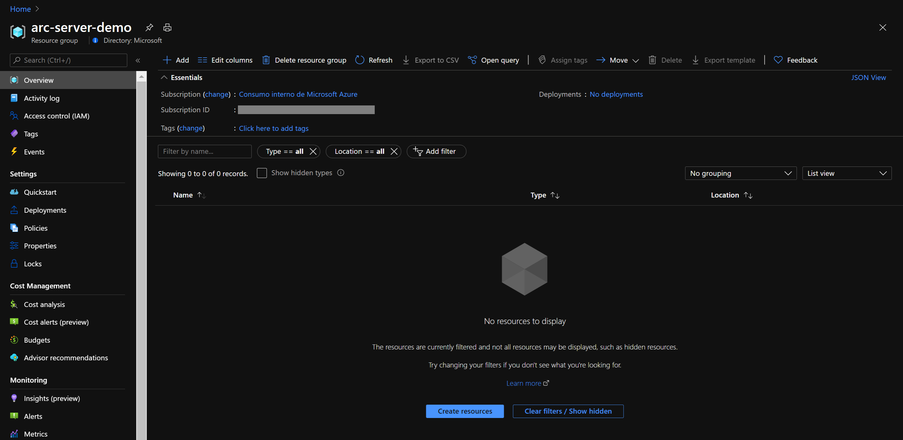
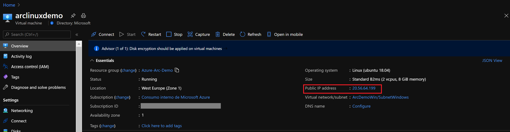
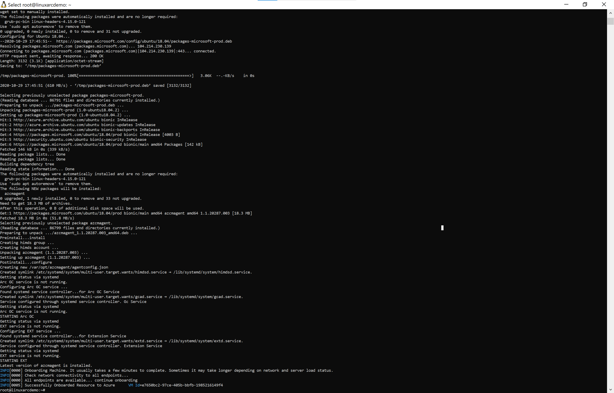
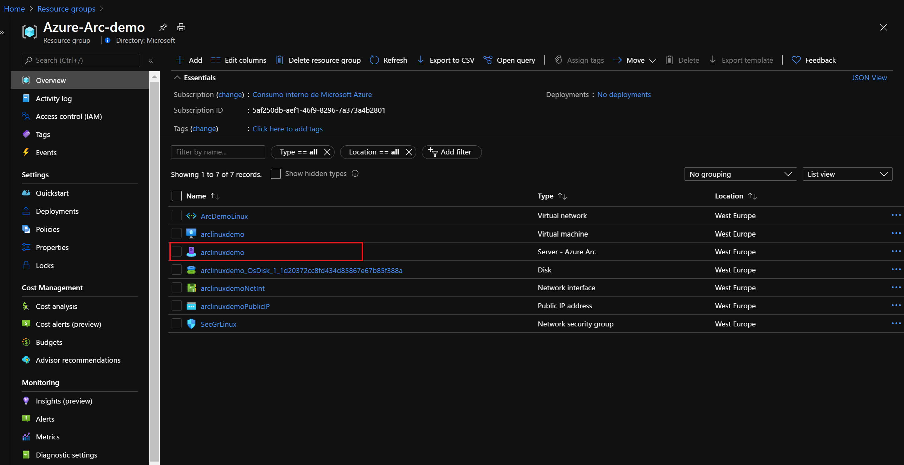
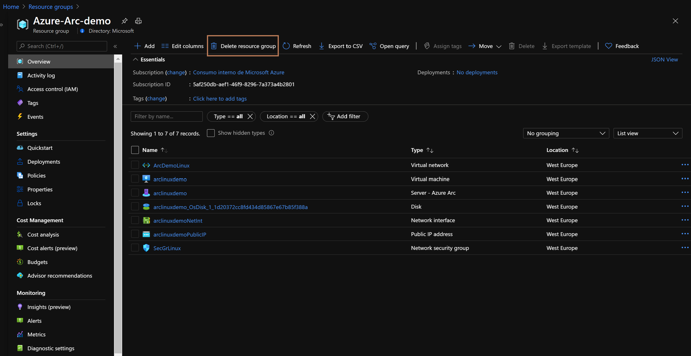

#  Onboard an Azure Linux Server VM with Azure Arc

The following README will guide you on how to onboard an Azure Linux VM on to Azure Arc. An ARM template is provided for the creation of the Azure Resouces, along with a script that will allow you to onboard the Azure VM onto Azure Arc, this step is required as Azure VMs are already part of ARM, therefore, the Azure Arc agent cannot be installed following the regular onboarding method. 

   > [!NOTE]Please note that this scenario is only intended for demo purposes. 

At the end of this README you will have an Azure Linux VM connected as an Azure Arc enabled Server. 

# Azure Account  

* You will need an Azure Account with an active subscription so you can deploy the Azure VMs and then register and onboard them with Azure Arc. If you do not have an account already, you can start with a free trial account. 

* To create an Azure free account browse to [this link](https://azure.microsoft.com/en-us/free/) and select 'Start Free' to get access to a free trial subscription. 

# Prerequisites

* Clone this repo

    ```terminal
    git clone https://github.com/microsoft/azure_arc.git
    ```
    
* [Install or update Azure CLI](https://docs.microsoft.com/en-us/cli/azure/install-azure-cli?view=azure-cli-latest). **Azure CLI should be running version 2.7** or later. Use ```az --version``` to check your current installed version.

# Automation Flow

For you to get familiar with the automation and deployment flow, below is an explanation.

1. User is editing the *azurevm_linux.parameters.json* file 

2. User is executing the *azurevm_linux.json* ARM template which will create an Azure VM on the Azure Subscription

3. Once the ARM template has completed, user will be logging in to the Linux OS. Upon first login a Shell script on the guest OS will run automatically, the script will: 
    * Prepare the OS for the installation of the "Azure Arc Connected Machine Agent".
    * Install and configure the "Azure Arc Connected Machine Agent". 

# Deployment

* Before executing the ARM template, you must create a resource group and set the parameters that match your environment. Edit the *azurevm_linux.parameters.json* file and provide: 
    - **adminUsername:** a username for Admin access to the Linux OS
    - **adminPublicKey:** the public key for SSH access
    - **dnsLabelPrefix:** a DNS prefix for the VM 
    - **vmName:** a custom name for the Azure VM
    - **subscriptionID:** the ID for your Azure Subscription 
    - **servicePrincipalClient:** the Azure Service Principal name
    - **servicePrincipalClientSecret:** Azure Service Principal password
    - **tenantID:**  ID of your Azure AD Tenant 
    - **resourceGroup:** Name of the resource group where all resource will be deployed


* To deploy the ARM template, navigate to the local cloned deployment folder and run the below command:

    ```terminal
    az group create --name Azure-Arc-Demo --location <Azure Region> --tags Project=jumpstart_azure_arc_servers
    az deployment group create --resource-group Azure-Arc-Demo --name <The name of this deployment> \
    --template-uri https://raw.githubusercontent.com/microsoft/azure_arc/master/azure_arc_servers_jumpstart/azure/arm_template/azurevm_linux.json \
    --parameters <The *azurevm_linux.parameters.json* parameters file location>
    ```
* Once Azure resources have been provisioned, you will be able to see them in Azure portal. 



# Azure Arc Agent Installation 

* Using the public IP assigned to the Linux VM, SSH onto the recently created machine. 



* Upon successful login an script will run automatically that will deploy the Azure Arc agent.



* Once the execution is complete you will see an Azure Arc enabled Server in your Resource Group. 



# Clean up environment

Complete the following steps to clean up your environment:

* Remove the resource group that holds all the resources for this scenario. 


