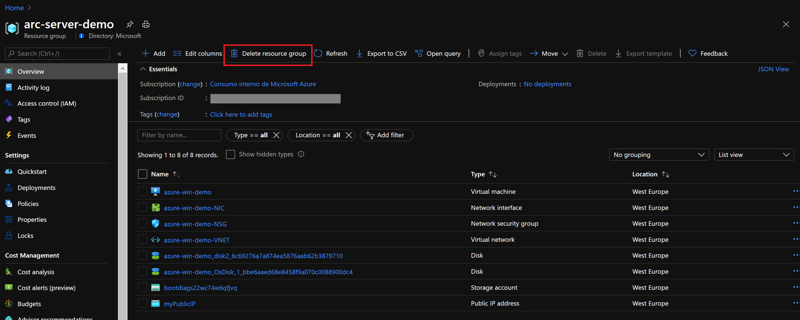
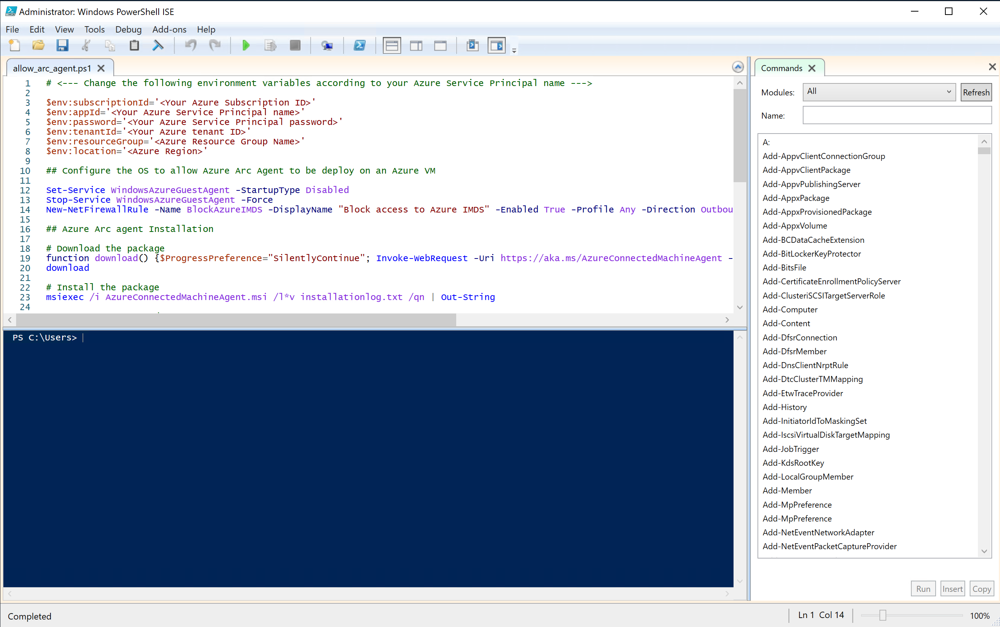
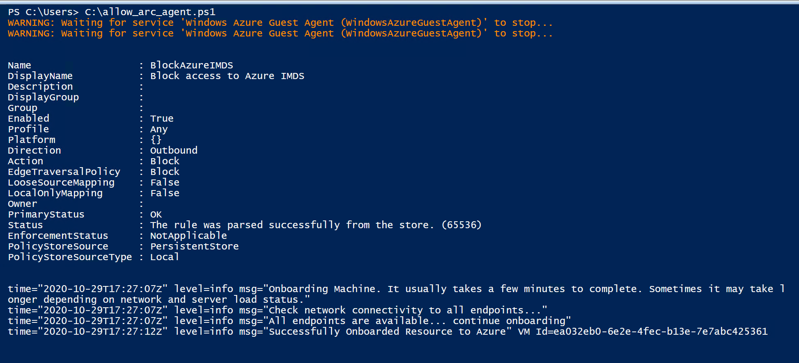
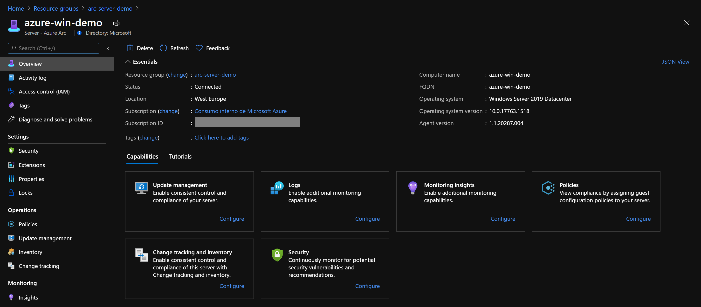
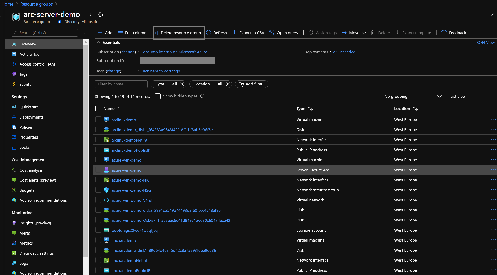

#  Onboard an Azure Windows Server VM with Azure Arc

The following README will guide you on how onboard a Azure Windows VM on to Azure Arc. An ARM template is provided for the creation of the Azure Resouces, along with an script that will allow you to onboard Azure Arc, this step is requiered as Azure VMs are already part of ARM, therefore, the Azure Arc agent cannot be installed following the regular onboarding method. 

Please note that this scenario is only intended for demo purposes. 

# Azure Account  

* You will need an Azure Account with an active and valid subscription so you can deploy the Azure VMs and then register and onboard them with Azure Arc. If you do not have an account already, you can start with a free-trial account. 

* To create you Azure free account browse to [this link](https://azure.microsoft.com/en-us/free/) and select 'Start Free' to get access to a free trial subscription. 

# Prerequisites

* Clone this repo

    ```terminal
    git clone https://github.com/microsoft/azure_arc.git
    ```
    
* [Install or update Azure CLI](https://docs.microsoft.com/en-us/cli/azure/install-azure-cli?view=azure-cli-latest). **Azure CLI should be running version 2.7** or later. Use ```az --version``` to check your current installed version.

# Automation Flow

Below you can find the automation flow for this scenario:

1. Edit the *azurevm_windows.parameters.json* file 

2. Upon execution of the *azurevm_windows.json* ARM template, an Azure VM will be created on your Azure Subscription

3. Connect to the VM and run the *allow_arc_agent.ps1* Powershell script on the guest OS to: 
    * Prepare the OS for the installation of the "Azure Arc Connected Machine Agent".
    * Install and configure the "Azure Arc Connected Machine Agent". 

# Deployment

* Create a new Azure Resource Group where you want your machine(s) to be deployed and then be registered as Azure Arc enabled Servers. 



* Before executing the ARM template, you must set the parameters that match your environment. Edit the *azurevm_windows.parameters.json* file and provide: 
    - **adminUsername:** a username for Admin access to the Windows OS
    - **adminPassword:** a password for the admin user of the Windows OS
    - **dnsLabelPrefix:** a DNS prefix for the VM 
    - **vmName:** a custom name for the Azure VM

* To deploy the ARM template, navigate to the local cloned deployment folder and run the below command:

    ```console
    az deployment group create --resource-group <Name of the Azure Resource Group> --name <The name of this deployment> --template-uri https://raw.githubusercontent.com/microsoft/azure_arc/master/azure_arc_servers_jumpstart/azure/arm_template/azurevm_windows.json --parameters <The *azurevm_windows.parameters.json* parameters file location>
    ```
* Once Azure resources have been provisioned, you will be able to see it in Azure portal. 

    > [!NOTE] Deployment time of the Azure Resource (Windows VM and Custom Script Extension) can take ~25-30 minutes.

# Azure Arc Agent Installation 

* Login onto the recently created machine, open Powershell ISE as Administrator.

   > [!NOTE] the script is using $env:ProgramFiles as the agent installation path so make sure you are not using Powershell ISE (x86).



* Provide your environment variables and run the script *allow_arc_agent.ps1*. 



* Upon completion, you will have your Windows server, connected as a new Azure Arc resource inside your Resource Group.



# Clean up environment

Complete the following steps to clean up your environment.

* Remove the resource group that holds all the resources for this scenario. 



