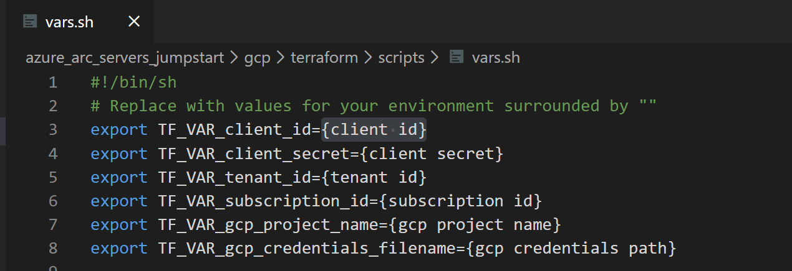

# Azure Arc for Google Cloud

The following README will guide you on how to use the provided [Terraform](https://www.terraform.io/) plan to deploy a GCP virtual machine and connect it as an Azure Arc cluster resource.

# Prerequisites

* Clone this repo

* [Generate SSH Key](https://help.github.com/articles/generating-a-new-ssh-key-and-adding-it-to-the-ssh-agent/) (or use existing ssh key) 

* Google Cloud account - [create a free trial account](https://cloud.google.com/free)

* [Install Terraform >=0.12](https://learn.hashicorp.com/terraform/getting-started/install.html)

### Create a new GCP Project

* Browse to https://console.developers.google.com and login with your Google Cloud account. Once logged in, [create a new project](https://cloud.google.com/resource-manager/docs/creating-managing-projects) named "Azure Arc Demo". After creating it, be sure to copy down the project id as it is usually different then the project name.

    <!--  -->

* Once the new project is created and selected in the dropdown at the top of the page, you must enable Compute Engine API access for the project. Click on "+Enable APIs and Services" and search for "Compute Engine". 

    <!--  -->

* Then click Enable to enable API access.

    <!--  -->

* Next, set up a service account key, which Terraform will use to create and manage resources in your GCP project. Go to the [create service account key page](https://console.cloud.google.com/apis/credentials/serviceaccountkey). Select the default service account or create a new one, select JSON as the key type, and click Create. This downloads a JSON file with all the credentials that will be needed for Terraform to manage the resources. Copy the downloaded JSON file to the ```gcp/terraform``` directory.

* Finally, make sure your SSH keys are available in ```~/.ssh``` and named id_rsa.pub and id_rsa. If not, you may need to modify ```main.tf``` to use a key with a different name or path.

### Create Azure Service Principal (SP)   

* To connect the GCP virtual machine to Azure Arc, an Azure Service Principal assigned with the "Contributor" role is required. To create it, login to your Azure account run the following command:

    ```az login```

    ```az ad sp create-for-rbac -n "http://AzureArcGCP" --role contributor```

    Output should look similar to this:

    ```
    {
    "appId": "aedXXXXXXXXXXXXXXXXXXac661",
    "displayName": "AzureArcGCP",
    "name": "http://AzureArcGCP",
    "password": "b54XXXXXXXXXXXXXXXXXb2338e",
    "tenant": "72f98XXXXXXXXXXXXXXXXX11db47"
    }
    ```

    **Note**: It is optional but highly recommended to scope the SP to a specific [Azure subscription and Resource Group](https://docs.microsoft.com/en-us/cli/azure/ad/sp?view=azure-cli-latest)

# Deployment

Before executing the Terraform plan, you must export the environment variables which will be used by the plan. These variables are based on the Azure Service Principal you've just created, your Azure subscription and tenant, and the GCP project name.

* Retrieve your Azure Subscription ID and tenant ID using the ```az account list``` command.

* The Terraform plan creates resources in both Microsoft Azure and Google Cloud. It then executes a script on a Google Cloud virtual machine to install the Azure Arc agent and all necessary artifacts. This script requires certain information about your Google Cloud and Azure environments. Edit ***scripts/vars.sh*** and update each of the variables with the appropriate values.
    

* Open Az CLI and navigate to the azure_arc_servers_jumpstart/gcp/terraform directory of the cloned repo.

* Export the environment variables you edited by running the vars.sh script with the source command as shown below.

    ```source ./scripts/vars.sh```

* Run the ```terraform init``` command which will download the Terraform AzureRM provider.

    

* Next, run the ```terraform apply --auto-approve``` command and wait for the plan to finish. Once finished, you will be able to manage the Google Cloud virtual machine from Azure.

# View the GCP VM from Azure Portal

* Open the Azure portal and navigate to the resource group "Arc-Servers-Demo". The virtual machine created in GCP will be visible as a resource.

    

* stuff about managing resource

# Delete the deployment

To delete all the resources you created as part of this demo use the ```terraform destroy --auto-approve``` command as shown below.