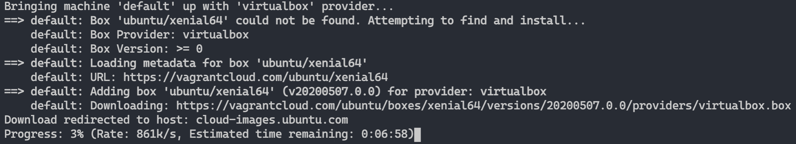
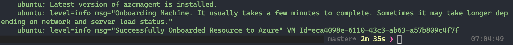
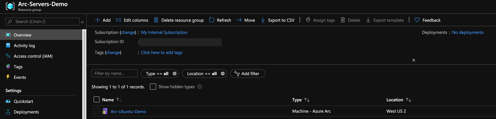
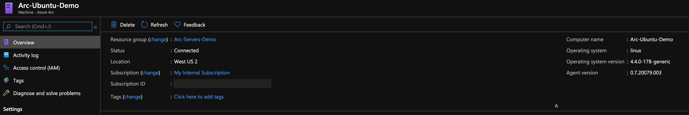
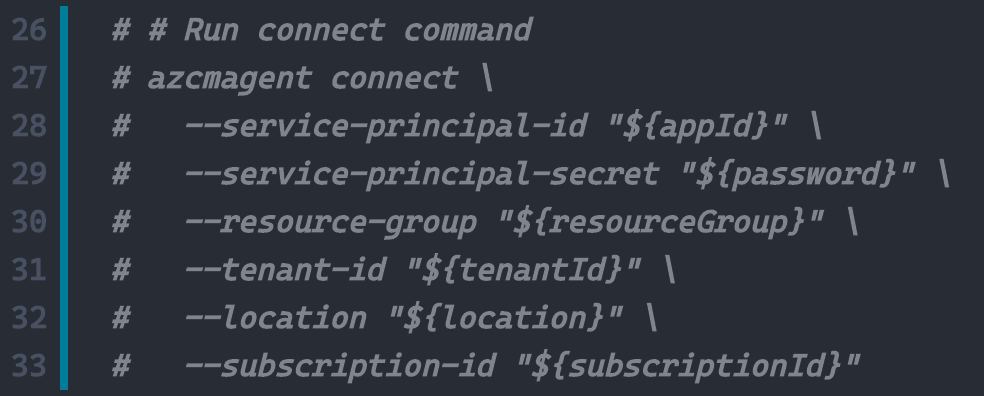
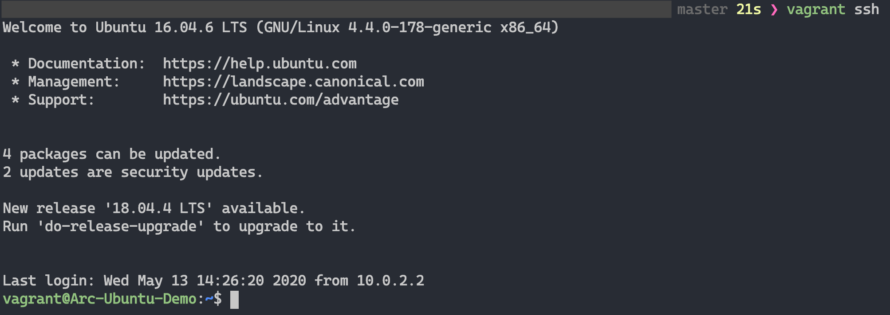
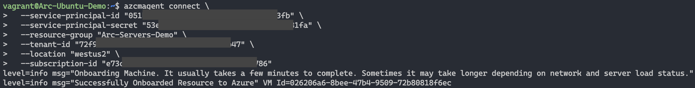
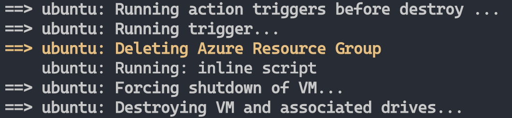

# Onboard a local Ubuntu server hosted with Vagrant into Azure Arc

The following README will guide you on how to deploy a local "Ready to Go" **Ubuntu** virtual machine using [Vagrant](https://www.vagrantup.com/) and connect it as an Azure Arc server resource.

# Prerequisites

* Clone this repo

    ```terminal
    git clone https://github.com/microsoft/azure_arc.git
    ```
    
* [Install or update Azure CLI](https://docs.microsoft.com/en-us/cli/azure/install-azure-cli?view=azure-cli-latest). **Azure CLI should be running version 2.7** or later. Use ```az --version``` to check your current installed version.

* Vagrant relies on an underlying hypervisor. For the purpose of this guide, we will be using "Oracle VM VirtualBox".

    * Install [VirtualBox](https://www.virtualbox.org/wiki/Downloads). 
    
        - If you are an OSX user, simply run ```brew cask install virtualbox```
        - If you are a Windows user, you can use the [Chocolatey package](https://chocolatey.org/packages/virtualbox)
        - If you are a Linux user, all package installation methods can be found [here](https://www.virtualbox.org/wiki/Linux_Downloads)

    * Install [Vagrant](https://www.vagrantup.com/docs/installation/)

        - If you are an OSX user, simply run ```brew cask install vagrant``` 
        - If you are a Windows user, you can use the [Chocolatey package](https://chocolatey.org/packages/vagrant)
        - If you are a Linux user, look [here](https://www.vagrantup.com/downloads.html)

* Create Azure Service Principal (SP)   

    To connect the Vagrant virtual machine to Azure Arc, an Azure Service Principal assigned with the "Contributor" role is required. To create it, login to your Azure account run the below command (this can also be done in [Azure Cloud Shell](https://shell.azure.com/)). 

    ```bash
    az login
    az ad sp create-for-rbac -n "<Unique SP Name>" --role contributor
    ```

    For example:

    ```az ad sp create-for-rbac -n "http://AzureArcServers" --role contributor```

    Output should look like this:

    ```
    {
    "appId": "XXXXXXXXXXXXXXXXXXXXXXXXXXXX",
    "displayName": "AzureArcServers",
    "name": "http://AzureArcServers",
    "password": "XXXXXXXXXXXXXXXXXXXXXXXXXXXX",
    "tenant": "XXXXXXXXXXXXXXXXXXXXXXXXXXXX"
    }
    ```

    **Note**: It is optional but highly recommended to scope the SP to a specific [Azure subscription and Resource Group](https://docs.microsoft.com/en-us/cli/azure/ad/sp?view=azure-cli-latest)

* The Vagrantfile executes a script on the VM OS to install all the needed artifacts as well to inject environment variables. Edit the [*scripts/vars.sh*](../local/vagrant/ubuntu/scripts/vars.sh) shell script to match the Azure Service Principle you've just created. 

    * subscriptionId=Your Azure Subscription ID
    * appId=Your Azure Service Principle name
    * password=Your Azure Service Principle password
    * tenantId=Your Azure tenant ID
    * resourceGroup=Azure Resource Group Name
    * location=Azure Region

# Deployment

Like any Vagrant deployment, a [*Vagrantfile*](../local/vagrant/ubuntu/Vagrantfile) and a [Vagrant Box](https://www.vagrantup.com/docs/boxes.html) is needed. At a high-level, the deployment will:

1. Download the Ubuntu 16.04 image file [Vagrant Box](https://app.vagrantup.com/ubuntu/boxes/xenial64)
2. Execute the Arc installation script

After editing the ***scripts/vars.sh*** script to match your environment, from the *Vagrantfile* folder, run ```vagrant up```. As this is the first time you are creating the VM, the first run will be **much slower** than the ones to follow. This is because the deployment is downloading the Ubuntu box for the first time.



Once the download is complete, the actual provisioning will start. As you can see in the screenshot below, the process takes no longer than 3min!



Upon completion, you will have a local Ubuntu VM deployed, connected as a new Azure Arc server inside a new Resource Group. 





# Semi-Automated Deployment (Optional)

As you may noticed, the last step of the run is to register the VM as a new Arc server resource. 


In a case you want to demo/control the actual registration process, to the following: 

1. In the [*install_arc_agent*](../local/vagrant/ubuntu/scripts/install_arc_agent.sh) shell script, comment out the "Run connect command" section and save the file. You can also comment out or change the creation of the Resource Group. 




2. SSH the VM using the ```vagrant ssh``` command.



3. Run the same *azcmagent connect* command you've just commented out using your environment variables. 



# Delete the deployment

To delete the entire deployment, run the ```vagrant destroy -f``` command. The Vagrantfile includes a *before: destroy* Vagrant trigger which will run a script to delete the Azure Resource Group before destroying the actual VM. That way, you will be starting fresh next time. 

