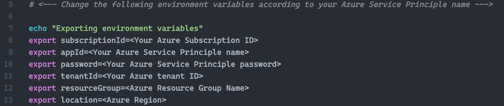
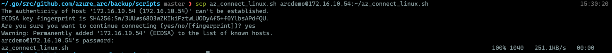
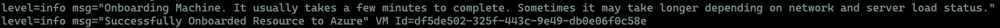
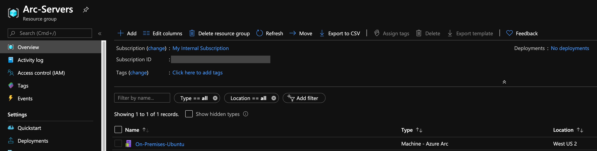
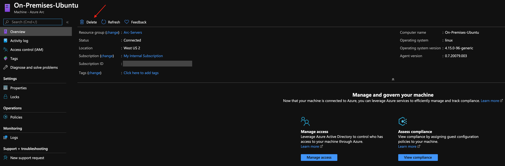
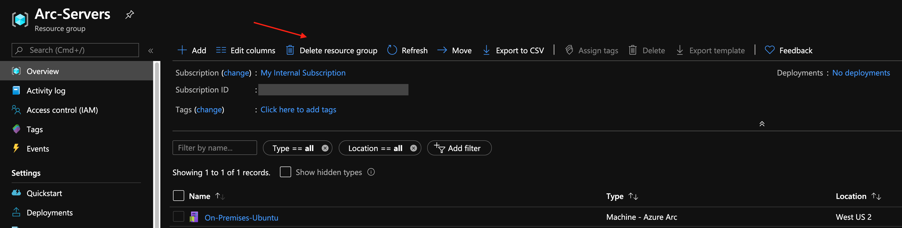

# Overview

The following README will guide you on how to connect an Linux server to Azure Arc using a simple shell script.

# Prerequisites

* [Install or update Azure CLI](https://docs.microsoft.com/en-us/cli/azure/install-azure-cli?view=azure-cli-latest). Azure CLI should be running version 2.6.0 or later. Use ```az --version``` to check your current installed version.

* Create Azure Service Principal (SP)   

    To connect the K3s cluster installed on the VM to Azure Arc, Azure Service Principal assigned with the "Contributor" role is required. To create it, login to your Azure account run the following command:

    ```bash
    az login
    az ad sp create-for-rbac -n "<Unique SP Name>" --role contributor
    ```

    For example:

    ```az ad sp create-for-rbac -n "http://AzureArcServer" --role contributor```

    Output should look like this:
    ```
    {
    "appId": "XXXXXXXXXXXXXXXXXXXXXXXXXXXX",
    "displayName": "AzureArcServer",
    "name": "http://AzureArcServer",
    "password": "XXXXXXXXXXXXXXXXXXXXXXXXXXXX",
    "tenant": "XXXXXXXXXXXXXXXXXXXXXXXXXXXX"
    }
    ```
    **Note**: It is optional but highly recommended to scope the SP to a specific [Azure subscription and Resource Group](https://docs.microsoft.com/en-us/cli/azure/ad/sp?view=azure-cli-latest)

* Create a new Azure Resource Group where you want your server(s) to show up. 


* Download the [az_connect_linux](../scripts/az_connect_linux.sh) shell script.

* Change the environment variables according to your environment. 



* Copy the script to the designated server using your preferred tool of choice (or copy/paste the script to a new file inside the server). Below example shows copy the script from MacOS to the server using SCP.



# Deployment

Run the script using the ```. ./az_connect_linux.sh``` command. 

**Note**: The extra dot is due to the script has an *export* function and needs to have the vars exported in the same shell session as the rest of the commands. 

Upon completion, you will have your Linux server, connected as a new Azure Arc resource inside your Resource Group. 






# Delete the deployment

The most straightforward way is to delete the server via the Azure Portal, just select server and delete it. 



If you want to nuke the entire environment, just delete the Azure Resource Group.


