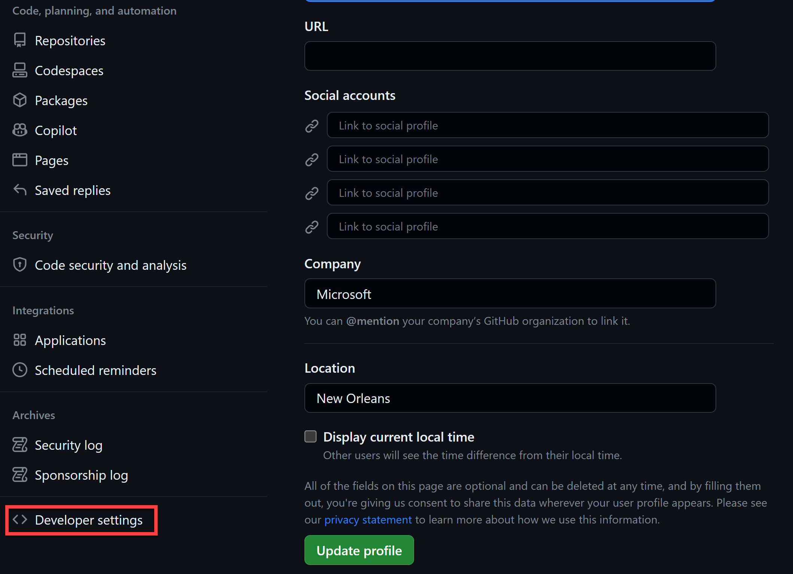
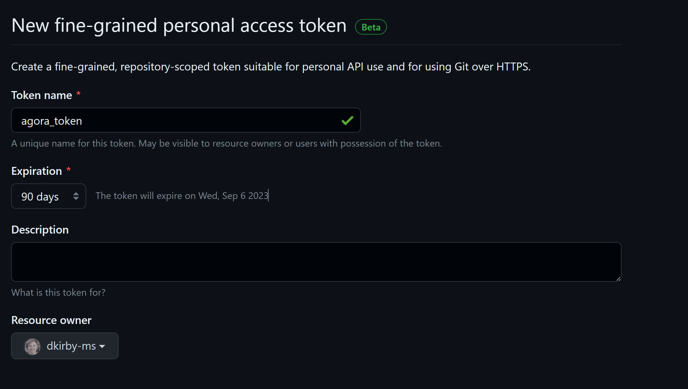
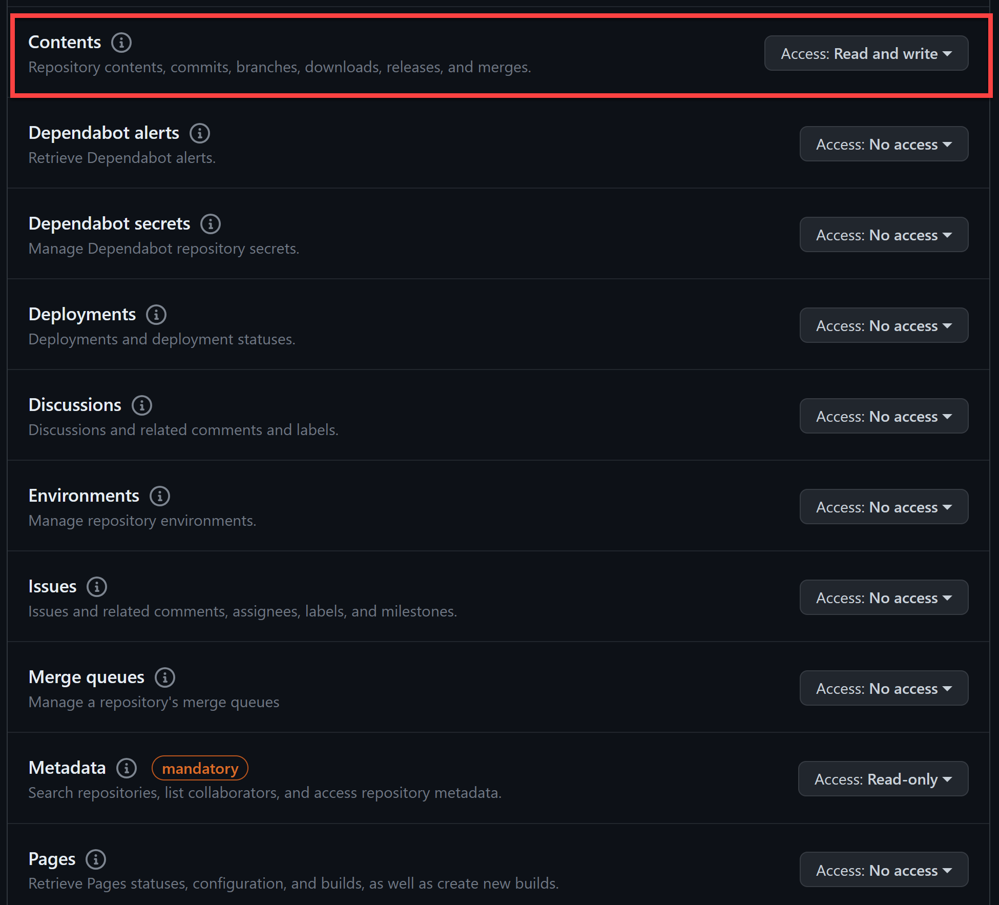

# Jumpstart Agora - Physical Deployment

## Overview

Jumpstart Agora provides a simple deployment process using Azure CLI and PowerShell that minimizes user interaction. This automation automatically configures the Contoso Supermarket scenario environment, including the infrastructure, the Contoso-Supermarket applications, CI/CD artifacts, and observability components in a physical machine that meets the requirements.

## Requirements

- Hardware Requirements:
  - CPU: Core i3 or better
  - RAM: 16GB Minimum
  - Storage: 200GB
  - OS: Windows 10 21H2, Windows 11, Windows IOT, Windows Server
  
### Prepare environment

Plesae follow the next steps to prepare your environment for succesfull deployment:

1. Enable Hyper-V in your host
2. Install Azure CLI
3. Install Git Client
4. Azure Account 

    The script requires a Service Principal to authenticate and create resources in Azure.

    Create service principal using [Azure Cloud Shell](https://shell.azure.com/) or Bash shell with Azure CLI:

    ```shell
    az login
    subscriptionId=$(az account show --query id --output tsv)
    az ad sp create-for-rbac -n "<Unique SP Name>" --role "Owner" --scopes /subscriptions/$subscriptionId
    ```

    For example:

    ```shell
    az login
    subscriptionId=$(az account show --query id --output tsv)
    az ad sp create-for-rbac -n "JumpstartAgoraSPN" --role "Owner" --scopes /subscriptions/$subscriptionId
    ```

    Output should look similar to this:

    ```json
    {
    "appId": "XXXXXXXXXXXXXXXXXXXXXXXXXXXX",
    "displayName": "JumpstartAgora",
    "password": "XXXXXXXXXXXXXXXXXXXXXXXXXXXX",
    "tenant": "XXXXXXXXXXXXXXXXXXXXXXXXXXXX"
    }
    ```
5. You will also need to create a GitHub Access TOKEN (GithubPAT). To create this PAT:

onfigure a GitHub fine-grained personal access token (PAT) with permissions to modify __only__ the Jumpstart Agora Apps repo that you forked.

  - In the top right of the GitHub website, click on the dropdown on your user icon and then click "Settings".

    

  - In the left menu navigation click on "Developer settings".

    

  - Under "Personal access tokens" select "Fine-grained tokens".

    

    

  - Give your token a name and select an expiry period.

    

  - Under "Repository access" select "Only select repositories" and then choose the _jumpstart-agora-apps_ repo that you forked in the previous steps.

    

  - Assign the "Read and write" permissions for your fork of the _jumpstart-agora-apps_ repo. The PAT should have read and write permissions for the following operations: Actions, Administration, Contents, Pull Requests, Secrets, and Workflows.

    

    

    

  - Once the correct permissions are assigned click the "Generate token" button.

    

  - Copy the token value to a temporary location such as in Notepad. You will need this value in a later step.

    

    > __NOTE: GitHub fine-grained access tokens are a beta feature of GitHub and may be subject to change in user experience or functionality.__
    > __NOTE: The token shown in the above screenshot is a placeholder value for example purposes only and not a working token.__

## Deployment

1. Open the physical_agora_params.psd1 and update the following fields:

    Change this values on the psd1 file:

     ```psd1
        GitHub                 = @{
            githubAccount      = ""
            githubBranch       = ""
            gitHubUser         = ""
            githubPat          = ""
        }
        # Required URLs

        AzureDeployment             =@{
            deploymentName     = ""
            azureLocation      = "westus2"
            appId              = ""
            spnClientSecret    = ""
            spnTenantId        = ""
            spnClientID        = ""
        }  spnClientID        = ""
    ```

2. Open a Powershell Windows (with Admin rights) and execute the physical_deployment.ps1 file. 
   
   > __NOTE: The physical_agora_params.psd1 and the physical_deployment.ps1 file must be in the same directory..__

 ```shell
    ./physical_deployment.ps1
```

After the succesfull deployment, you should see the local IP Addresses of the POS and the Store Manager App.

## Troubleshooting