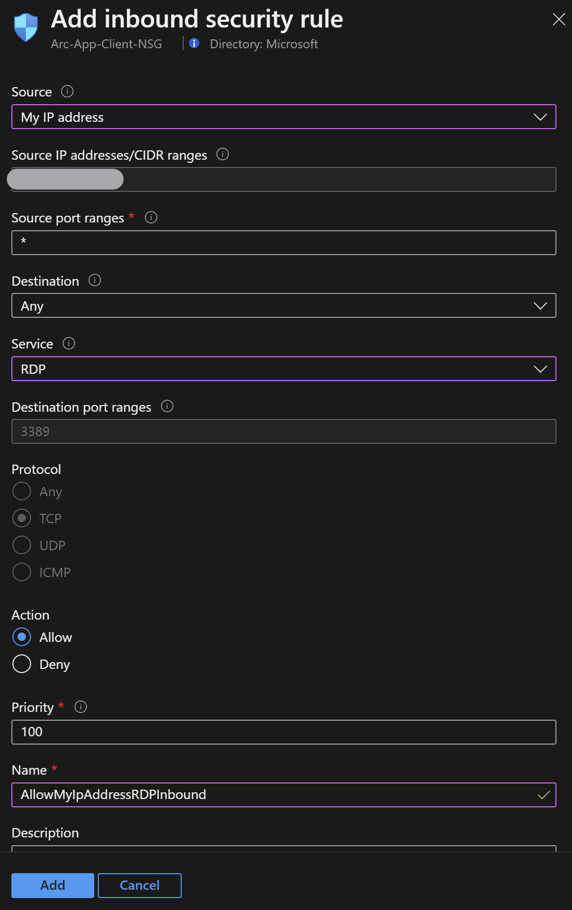
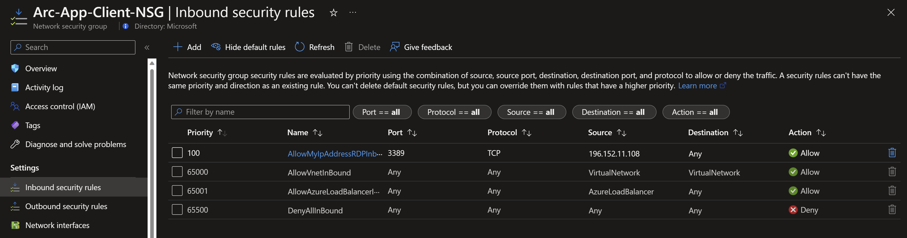
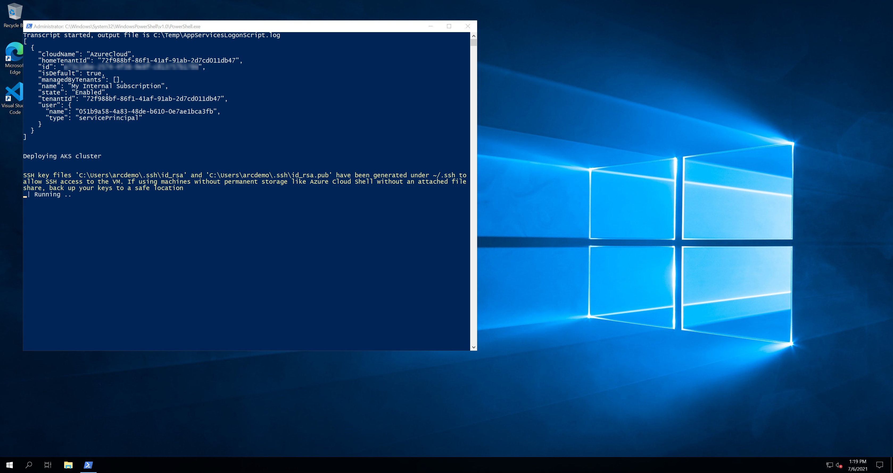
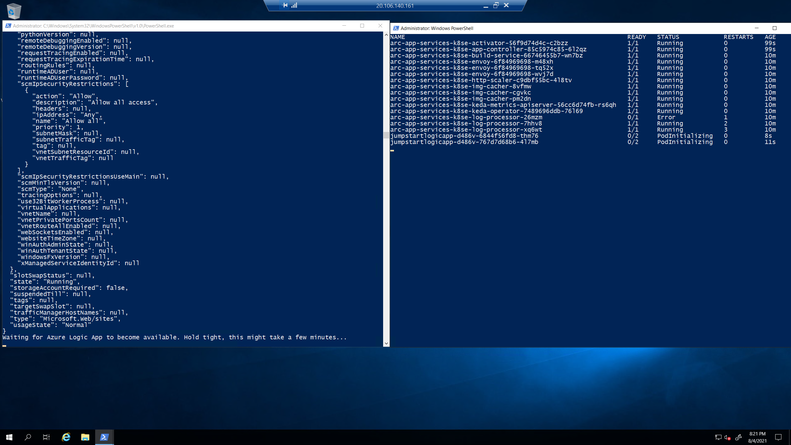
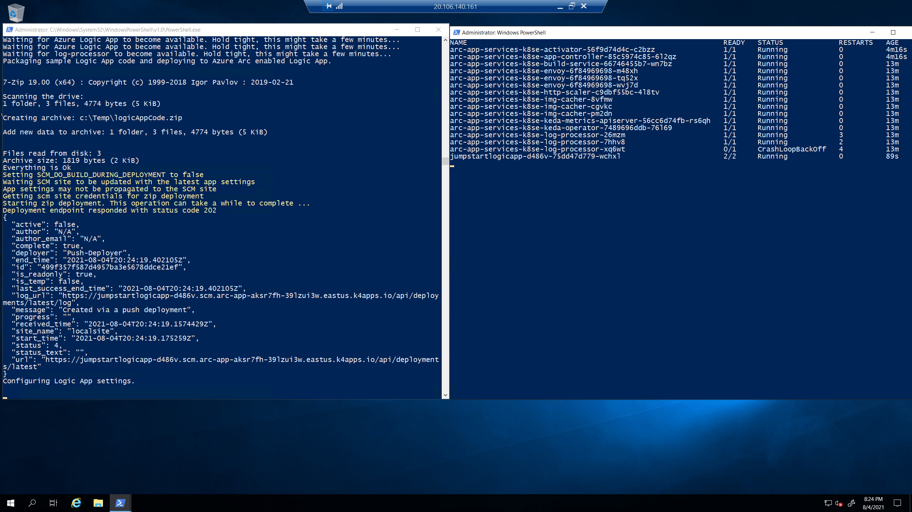

## Deploy Azure Logic App on AKS using an ARM Template

The following Jumpstart scenario will guide you on how to deploy a "Ready to Go" environment so you can start using [Azure Arc-enabled app services](https://docs.microsoft.com/azure/app-service/overview-arc-integration) deployed on [Azure Kubernetes Service (AKS)](https://docs.microsoft.com/azure/aks/intro-kubernetes) cluster using [Azure ARM Template](https://docs.microsoft.com/azure/azure-resource-manager/templates/overview).

By the end of this scenario, you will have an AKS cluster deployed with an App Service plan, a sample Azure Logic App that reads messages from an Azure storage account queue and creates blobs in an Azure storage account container, and a Microsoft Windows Server 2022 (Datacenter) Azure VM installed & pre-configured with all the required tools needed to work with Azure Arc-enabled app services.

> **NOTE: Currently, Azure Arc-enabled app services is in preview.**

## Prerequisites

- Clone the Azure Arc Jumpstart repository

    ```shell
    git clone https://github.com/microsoft/azure_arc.git
    ```

- [Install or update Azure CLI to version 2.42.0 and above](https://docs.microsoft.com/cli/azure/install-azure-cli?view=azure-cli-latest). Use the below command to check your current installed version.

  ```shell
  az --version
  ```

- [Generate a new SSH key pair](https://docs.microsoft.com/azure/virtual-machines/linux/create-ssh-keys-detailed) or use an existing one (Windows 10 and above now comes with a built-in ssh client).

  ```shell
  ssh-keygen -t rsa -b 4096
  ```

  To retrieve the SSH public key after it's been created, depending on your environment, use one of the below methods:
  - In Linux, use the `cat ~/.ssh/id_rsa.pub` command.
  - In Windows (CMD/PowerShell), use the SSH public key file that by default, is located in the _`C:\Users\WINUSER/.ssh/id_rsa.pub`_ folder.

  SSH public key example output:

  ```shell
  ssh-rsa o1djFhyNe5NXyYk7XVF7wOBAAABgQDO/QPJ6IZHujkGRhiI+6s1ngK8V4OK+iBAa15GRQqd7scWgQ1RUSFAAKUxHn2TJPx/Z/IU60aUVmAq/OV9w0RMrZhQkGQz8CHRXc28S156VMPxjk/gRtrVZXfoXMr86W1nRnyZdVwojy2++sqZeP/2c5GoeRbv06NfmHTHYKyXdn0lPALC6i3OLilFEnm46Wo+azmxDuxwi66RNr9iBi6WdIn/zv7tdeE34VAutmsgPMpynt1+vCgChbdZR7uxwi66RNr9iPdMR7gjx3W7dikQEo1djFhyNe5rrejrgjerggjkXyYk7XVF7wOk0t8KYdXvLlIyYyUCk1cOD2P48ArqgfRxPIwepgW78znYuwiEDss6g0qrFKBcl8vtiJE5Vog/EIZP04XpmaVKmAWNCCGFJereRKNFIl7QfSj3ZLT2ZXkXaoLoaMhA71ko6bKBuSq0G5YaMq3stCfyVVSlHs7nzhYsX6aDU6LwM/BTO1c= user@pc
  ```

- Create Azure service principal (SP). To deploy this scenario, an Azure service principal assigned with multiple Role-based access control (RBAC) roles is required:

  - "Contributor" - Required for provisioning Azure resources
  - "Security admin" - Required for installing Cloud Defender Azure-Arc enabled Kubernetes extension and dismiss alerts
  - "Security reader" - Required for being able to view Azure-Arc enabled Kubernetes Cloud Defender extension findings

    To create it login to your Azure account run the below command (this can also be done in [Azure Cloud Shell](https://shell.azure.com/).

    ```shell
    az login
    subscriptionId=$(az account show --query id --output tsv)
    az ad sp create-for-rbac -n "<Unique SP Name>" --role "Contributor" --scopes /subscriptions/$subscriptionId
    az ad sp create-for-rbac -n "<Unique SP Name>" --role "Security admin" --scopes /subscriptions/$subscriptionId
    az ad sp create-for-rbac -n "<Unique SP Name>" --role "Security reader" --scopes /subscriptions/$subscriptionId
    ```

    For example:

    ```shell
    az login
    subscriptionId=$(az account show --query id --output tsv)
    az ad sp create-for-rbac -n "JumpstartArcAppSvc" --role "Contributor" --scopes /subscriptions/$subscriptionId
    az ad sp create-for-rbac -n "JumpstartArcAppSvc" --role "Security admin" --scopes /subscriptions/$subscriptionId
    az ad sp create-for-rbac -n "JumpstartArcAppSvc" --role "Security reader" --scopes /subscriptions/$subscriptionId
    ```

    Output should look like this:

    ```json
    {
    "appId": "XXXXXXXXXXXXXXXXXXXXXXXXXXXX",
    "displayName": "JumpstartArcAppSvc",
    "password": "XXXXXXXXXXXXXXXXXXXXXXXXXXXX",
    "tenant": "XXXXXXXXXXXXXXXXXXXXXXXXXXXX"
    }
    ```

    > **NOTE: If you create multiple subsequent role assignments on the same service principal, your client secret (password) will be destroyed and recreated each time. Therefore, make sure you grab the correct password**.

    > **NOTE: The Jumpstart scenarios are designed with as much ease of use in-mind and adhering to security-related best practices whenever possible. It is optional but highly recommended to scope the service principal to a specific [Azure subscription and resource group](https://docs.microsoft.com/cli/azure/ad/sp?view=azure-cli-latest) as well considering using a [less privileged service principal account](https://docs.microsoft.com/azure/role-based-access-control/best-practices)**

## Automation Flow

For you to get familiar with the automation and deployment flow, below is an explanation.

- User is editing the ARM template parameters file (1-time edit). These parameters values are being used throughout the deployment.

- Main [_azuredeploy_ ARM template](https://github.com/microsoft/azure_arc/blob/main/azure_arc_app_services_jumpstart/aks/arm_template/azuredeploy.json) will initiate the deployment of the linked ARM templates:

  - [_clientVm_](https://github.com/microsoft/azure_arc/blob/main/azure_arc_app_services_jumpstart/aks/arm_template/clientVm.json) - Deploys the client Windows VM. This is where all user interactions with the environment are made from.
  - [_logAnalytics_](https://github.com/microsoft/azure_arc/blob/main/azure_arc_app_services_jumpstart/aks/arm_template/logAnalytics.json) - Deploys Azure Log Analytics workspace to support Azure Arc-enabled app services logs uploads.

- User remotes into client Windows VM, which automatically kicks off the [_AppServicesLogonScript_](https://github.com/microsoft/azure_arc/blob/main/azure_arc_app_services_jumpstart/aks/arm_template/artifacts/AppServicesLogonScript.ps1) PowerShell script that deploy the AKS cluster and will configure Azure Arc-enabled app services Kubernetes environment on the AKS cluster.

    > **NOTE: Notice the AKS cluster will be deployed via the PowerShell script automation.**

## Deployment

As mentioned, this deployment will leverage ARM templates. You will deploy a single template that will initiate the entire automation for this scenario.

- The deployment is using the ARM template parameters file. Before initiating the deployment, edit the [_azuredeploy.parameters.json_](https://github.com/microsoft/azure_arc/blob/main/azure_arc_app_services_jumpstart/aks/arm_template/azuredeploy.parameters.json) file located in your local cloned repository folder. An example parameters file is located [here](https://github.com/microsoft/azure_arc/blob/main/azure_arc_app_services_jumpstart/aks/arm_template/artifacts/azuredeploy.parameters.example.json).

  - _`sshRSAPublicKey`_ - Your SSH public key
  - _`spnClientId`_ - Your Azure service principal id
  - _`spnClientSecret`_ - Your Azure service principal secret
  - _`spnTenantId`_ - Your Azure tenant id
  - _`windowsAdminUsername`_ - Client Windows VM Administrator name
  - _`windowsAdminPassword`_ - Client Windows VM Password. Password must have 3 of the following: 1 lower case character, 1 upper case character, 1 number, and 1 special character. The value must be between 12 and 123 characters long.
  - _`logAnalyticsWorkspaceName`_ - Unique name for the deployment log analytics workspace.
  - _`kubernetesVersion`_ - AKS version
  - _`dnsPrefix`_ - AKS unique DNS prefix
  - _`deployAppService`_ - Boolean that sets whether or not to deploy App Service plan and a Web App. For this scenario, we leave it set to _**false**_.
  - _`deployAPIMgmt`_ - Boolean that sets whether or not to deploy a self-hosted Azure API Management gateway. For this scenario, we leave it set to _**false**_.
  - _`deployFunction`_ - Boolean that sets whether or not to deploy App Service plan and an Azure Function application. For this scenario, we leave it set to _**false**_.
  - _`deployLogicApp`_ - Boolean that sets whether or not to deploy App Service plan and an Azure Logic App. For this scenario, we leave it set to _**true**_.
  - _`templateBaseUrl`_ - GitHub URL to the deployment template - filled in by default to point to [Microsoft/Azure Arc](https://github.com/microsoft/azure_arc) repository, but you can point this to your forked repo as well.
  - _`deployBastion`_ - Choice (true | false) to deploy Azure Bastion or not to connect to the client VM.
  - _`bastionHostName`_ - Azure Bastion host name.

- To deploy the ARM template, navigate to the local cloned [deployment folder](https://github.com/microsoft/azure_arc/tree/main/azure_arc_app_services_jumpstart/aks/ARM) and run the below command:

    ```shell
    az group create --name <Name of the Azure resource group> --location <Azure Region>
    az deployment group create \
    --resource-group <Name of the Azure resource group> \
    --name <The name of this deployment> \
    --template-uri https://raw.githubusercontent.com/microsoft/azure_arc/main/azure_arc_app_services_jumpstart/aks/arm_template/azuredeploy.json \
    --parameters <The *azuredeploy.parameters.json- parameters file location>
    ```

    > **NOTE: Make sure that you are using the same Azure resource group name as the one you've just used in the `azuredeploy.parameters.json` file**

    For example:

    ```shell
    az group create --name Arc-AppSvc-Demo --location "East US"
    az deployment group create \
    --resource-group Arc-AppSvc-Demo \
    --name arcappsvc \
    --template-uri https://raw.githubusercontent.com/microsoft/azure_arc/main/azure_arc_app_services_jumpstart/aks/arm_template/azuredeploy.json \
    --parameters azuredeploy.parameters.json
    ```

    > **NOTE: The deployment time for this scenario can take ~5-10min**

    > **NOTE: Since Azure Arc-enabled app services is [currently in preview](https://docs.microsoft.com/azure/app-service/overview-arc-integration#public-preview-limitations), deployment regions availability is limited to East US and West Europe.**

    > **NOTE: If you receive an error message stating that the requested VM size is not available in the desired location (as an example: 'Standard_D8s_v3'), it means that there is currently a capacity restriction for that specific VM size in that particular region. Capacity restrictions can occur due to various reasons, such as high demand or maintenance activities. Microsoft Azure periodically adjusts the available capacity in each region based on usage patterns and resource availability. To continue deploying this scenario, please try to re-run the deployment using another region.**

- Once Azure resources has been provisioned, you will be able to see it in Azure portal. At this point, the resource group should have **7 various Azure resources** deployed.

    

    

## Windows Login & Post Deployment

Various options are available to connect to _Arc-App-Client_ VM, depending on the parameters you supplied during deployment.

- [RDP](https://azurearcjumpstart.io/azure_arc_jumpstart/azure_arc_app_svc/aks/aks_logic_app_arm_template/#connecting-directly-with-rdp) - available after configuring access to port 3389 on the _Arc-App-Client-NSG_, or by enabling [Just-in-Time access (JIT)](https://azurearcjumpstart.io/azure_arc_jumpstart/azure_arc_app_svc/aks/aks_logic_app_arm_template/#connect-using-just-in-time-access-jit).
- [Azure Bastion](https://azurearcjumpstart.io/azure_arc_jumpstart/azure_arc_app_svc/aks/aks_logic_app_arm_template/#connect-using-azure-bastion) - available if ```true``` was the value of your _`deployBastion`_ parameter during deployment.

### Connecting directly with RDP

By design, port 3389 is not allowed on the network security group. Therefore, you must create an NSG rule to allow inbound 3389.

- Open the _Arc-App-Client-NSG_ resource in Azure portal and click "Add" to add a new rule.

  

  

- Specify the IP address that you will be connecting from and select RDP as the service with "Allow" set as the action. You can retrieve your public IP address by accessing [https://icanhazip.com](https://icanhazip.com) or [https://whatismyip.com](https://whatismyip.com).

  

  

  

### Connect using Azure Bastion

- If you have chosen to deploy Azure Bastion in your deployment, use it to connect to the VM.

  

  > **NOTE: When using Azure Bastion, the desktop background image is not visible. Therefore some screenshots in this guide may not exactly match your experience if you are connecting with Azure Bastion.**

### Connect using just-in-time access (JIT)

If you already have [Microsoft Defender for Cloud](https://docs.microsoft.com/azure/defender-for-cloud/just-in-time-access-usage?tabs=jit-config-asc%2Cjit-request-asc) enabled on your subscription and would like to use JIT to access the Client VM, use the following steps:

- In the Client VM configuration pane, enable just-in-time. This will enable the default settings.

  

  

### Post Deployment

- At first login, as mentioned in the "Automation Flow" section above, the [_AppServicesLogonScript_](https://github.com/microsoft/azure_arc/blob/main/azure_arc_app_services_jumpstart/aks/arm_template/artifacts/AppServicesLogonScript.ps1) PowerShell logon script will start its run.

- Let the script run its course and **do not close** the PowerShell session as this will be done for you once completed. Once the script will finish its run, the logon script PowerShell session will be closed, the Windows wallpaper will change and the Azure Logic App will be deployed on the cluster and ready to use.

    > **NOTE: As you will notice from the screenshots below, during the Azure Arc-enabled app services environment, the _log-processor_ service pods will be restarted and will go through multiple Kubernetes pod lifecycle stages. This is normal and can safely be ignored. To learn more about the various Azure Arc-enabled app services Kubernetes components, visit the official [Azure Docs page](https://docs.microsoft.com/azure/app-service/overview-arc-integration#pods-created-by-the-app-service-extension).**

    

    

    

    

    

    

    

    

    

    

    

    

    

    

    

    

    

    

    

    

    

  Once the script finishes its run, the logon script PowerShell session will be closed, the Windows wallpaper will change, and both the app service plan and the Azure Logic App deployed on the cluster will be ready.

    

- Since this scenario is deploying both the app service plan and a sample Logic App application, you will also notice additional, newly deployed Azure resources in the resources group. The important ones to notice are:

  - **Azure Arc-enabled Kubernetes cluster** - Azure Arc-enabled app services are using this resource to deploy the app services [cluster extension](https://docs.microsoft.com/azure/azure-arc/kubernetes/conceptual-extensions), as well as using Azure Arc [Custom locations](https://docs.microsoft.com/azure/azure-arc/kubernetes/conceptual-custom-locations).

  - **Custom location** - Provides a way for tenant administrators to use their Azure Arc-enabled Kubernetes clusters as a target location for deploying Azure services.

  - [**App Service Kubernetes Environment**](https://docs.microsoft.com/azure/app-service/overview-arc-integration#app-service-kubernetes-environment) - The App Service Kubernetes environment resource is required before apps may be created. It enables configuration common to apps in the custom location, such as the default DNS suffix.

  - [**App Service plan**](https://docs.microsoft.com/azure/app-service/overview-hosting-plans) - In App Service (Web Apps, API Apps, or Mobile Apps), an app always runs in an App Service plan. In addition, Azure Logic Apps also has the option of running in an App Service plan. An App Service plan defines a set of compute resources for an Azure Logic App to run.

  - [**Azure Logic App**](https://docs.microsoft.com/azure/logic-apps/logic-apps-overview) - Azure Logic Apps is a cloud-based platform for creating and running automated workflows that integrate your apps, data, services, and systems.

  - [**API Connection**](https://docs.microsoft.com/azure/connectors/apis-list)A connector provides prebuilt operations that you can use as steps in your Logic Apps workflows.

  - [Application Insights](https://docs.microsoft.com/azure/azure-monitor/app/app-insights-overview) - Application Insights, a feature of Azure Monitor, is an extensible Application Performance Management (APM) service for developers and DevOps professionals. Use it to monitor your live applications.

  - Azure Storage Account - The storage account deployed in this scenario is used for hosting the [queue storage](https://docs.microsoft.com/azure/storage/queues/storage-queues-introduction) and [blob storage](https://docs.microsoft.com/azure/storage/blobs/storage-blobs-introduction) where the Azure Logic App will be creating files in response to messages in a queue.

  

- In this scenario, **a sample Jumpstart Azure Logic App** was deployed. To view the deployed Logic App, simply click the Azure Logic App resource.

  

- You can view the Logic App workflow by clicking on "Workflows" and then clicking the workflow name "CreateBlobFromQueueMessage".

  

  

- To demonstrate the messaging queuing element and to show how blobs are created when messages are read from the queue storage, the Azure Logic App deployment script also generates 10 sample queue messages. To view it, click on the newly created storage account and go to the "Queues" section where you will see the queue named "jumpstart-queue". Note that the queue will be empty because the workflow automatically deletes messages from the queue after creating a new blob in the "jumpstart-blobs" container.

  

  

- Go back to the Azure storage account and click on Containers. From here you will see the "jumpstart-blobs" container. Open this container and view the blobs that were created by the Logic App.

  

  

- Alternatively, you can view the storage details using the Azure Storage Explorer client application installed automatically in the Client VM or using the Azure Storage Explorer portal-based view.

  

  

  

- To generate your own blobs using the Logic App, create a new message in the queue by using Azure Storage Explorer and clicking Add Message as shown below.

  

  

  

- Go back to the storage container and see the new added blob that was created automatically by the Logic App.

  

- As part of the deployment, an Application Insights instance was also provisioned to provide you with relevant performance and application telemetry.

  

## Cluster extensions

In this scenario, the Azure Arc-enabled app services cluster extension was deployed and used throughout this scenario in order to deploy the app services infrastructure.

- In order to view cluster extensions, click on the Azure Arc-enabled Kubernetes resource Extensions settings.

  

  

## Cleanup

- If you want to delete the entire environment, simply delete the deployed resource group from the Azure portal.

  
