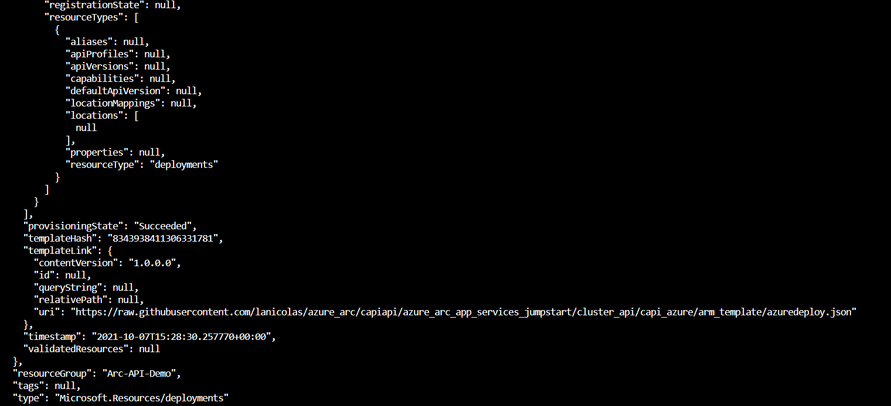
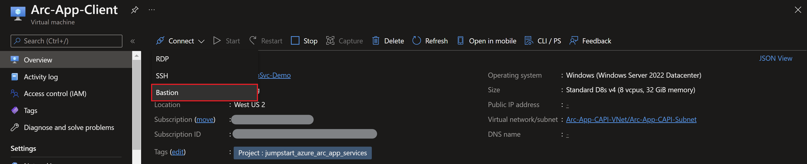
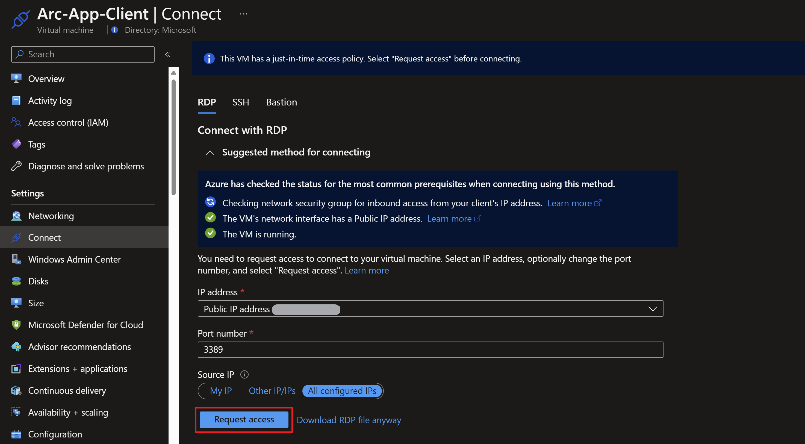
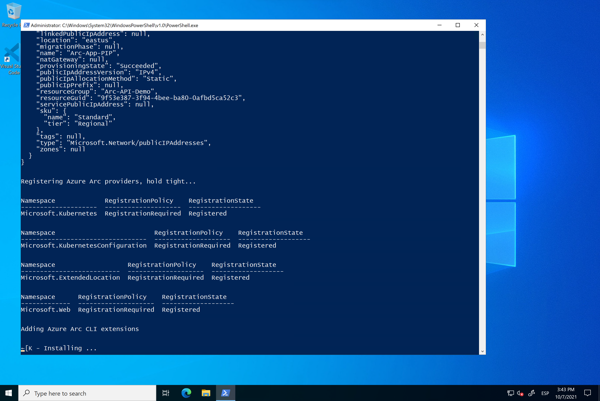
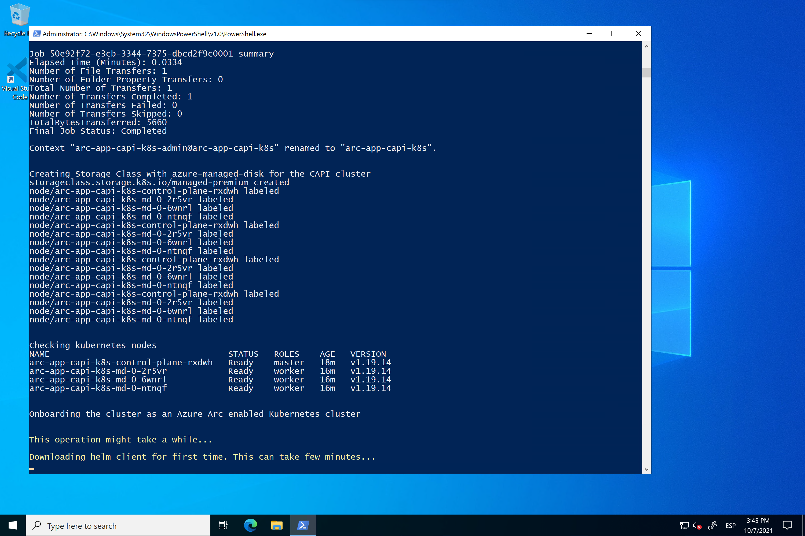
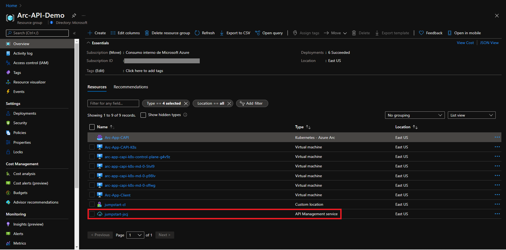
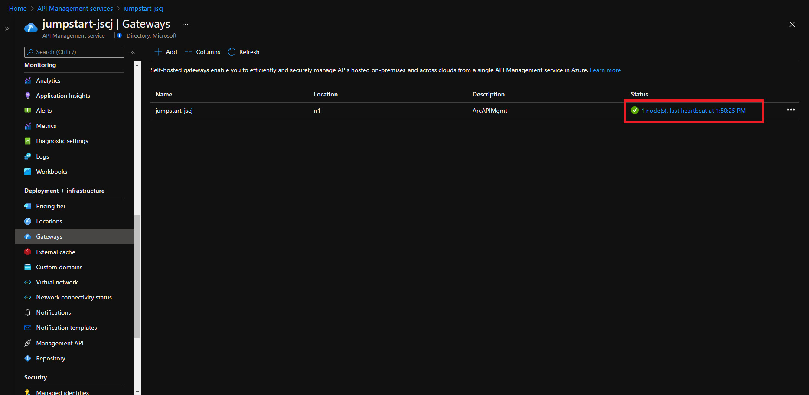

> **ADVISORY: An known issue affecting Azure CLI Kubernetes extensions is causing problems with automation in Jumpstart Kubernetes scenarios, data and app services scenarios, and ArcBox where the Azure CLI Kubernetes extensions are used. This issue will result in incomplete or failed deployments. Thank you for your patience as the teams work to address the issue.**

## Deploy an Azure API Management gateway on Cluster API (CAPI) using an ARM Template

The following README will guide you on how to deploy a "Ready to Go" environment so you can start using [a self-hosted Azure API Management Gateway](https://docs.microsoft.com/en-us/azure/api-management/how-to-deploy-self-hosted-gateway-azure-arc) deployed on [Cluster API (CAPI)](https://cluster-api.sigs.k8s.io/introduction.html) Kubernetes cluster and it's [Cluster API Azure provider (CAPZ)](https://cloudblogs.microsoft.com/opensource/2020/12/15/introducing-cluster-api-provider-azure-capz-kubernetes-cluster-management/) cluster using [Azure ARM Template](https://docs.microsoft.com/en-us/azure/azure-resource-manager/templates/overview).

By the end of this guide, you will have a CAPI Kubernetes cluster deployed with an Azure API Management gateway, a backend API and a Microsoft Windows Server 2022 (Datacenter) Azure VM, installed & pre-configured with all the required tools needed to work with the Azure API Management gateway.

> **Note: Currently, API Management self-hosted gateway on Azure Arc is in preview. The deployment time for this scenario can take ~60-90 minutes**

## Prerequisites

* Clone the Azure Arc Jumpstart repository

    ```shell
    git clone https://github.com/microsoft/azure_arc.git
    ```

* [Install or update Azure CLI to version 2.25.0 and above](https://docs.microsoft.com/en-us/cli/azure/install-azure-cli?view=azure-cli-latest). Use the below command to check your current installed version.

  ```shell
  az --version
  ```

* [Generate SSH Key](https://docs.microsoft.com/en-us/azure/virtual-machines/linux/create-ssh-keys-detailed) (or use existing ssh key).

* Create Azure service principal (SP). To deploy this scenario, an Azure service principal assigned with multiple RBAC roles is required:

  * "Contributor" - Required for provisioning Azure resources
  * "Security admin" - Required for installing Cloud Defender Azure-Arc enabled Kubernetes extension and dismiss alerts
  * "Security reader" - Required for being able to view Azure-Arc enabled Kubernetes Cloud Defender extension findings

    To create it login to your Azure account run the below command (this can also be done in [Azure Cloud Shell](https://shell.azure.com/).

    ```shell
    az login
    az ad sp create-for-rbac -n "<Unique SP Name>" --role "Contributor"
    az ad sp create-for-rbac -n "<Unique SP Name>" --role "Security admin"
    az ad sp create-for-rbac -n "<Unique SP Name>" --role "Security reader"
    ```

    For example:

    ```shell
    az ad sp create-for-rbac -n "JumpstartArcAppSvc" --role "Contributor"
    az ad sp create-for-rbac -n "JumpstartArcAppSvc" --role "Security admin"
    az ad sp create-for-rbac -n "JumpstartArcAppSvc" --role "Security reader"
    ```

    Output should look like this:

    ```json
    {
    "appId": "XXXXXXXXXXXXXXXXXXXXXXXXXXXX",
    "displayName": "AzureArcAppSvc",
    "name": "http://AzureArcAppSvc",
    "password": "XXXXXXXXXXXXXXXXXXXXXXXXXXXX",
    "tenant": "XXXXXXXXXXXXXXXXXXXXXXXXXXXX"
    }
    ```

    > **Note: It is optional, but highly recommended, to scope the SP to a specific [Azure subscription](https://docs.microsoft.com/en-us/cli/azure/ad/sp?view=azure-cli-latest).**

## Architecture (In a nutshell)

From the Cluster API Book docs:

"Cluster API requires an existing Kubernetes cluster accessible via kubectl; during the installation process the Kubernetes cluster will be transformed into a management cluster by installing the Cluster API provider components, so it is recommended to keep it separated from any application workload."

In this guide and as part of the automation flow (described below), a [Rancher K3s](https://rancher.com/docs/k3s/latest/en/) cluster will be deployed which will be used as the management cluster. This cluster will then be used to deploy the workload cluster using the Cluster API Azure provider (CAPZ).

## Automation Flow

For you to get familiar with the automation and deployment flow, below is an explanation.

* User is editing the ARM template parameters file (1-time edit). These parameters values are being used throughout the deployment.

* Main [_azuredeploy_ ARM template](https://github.com/microsoft/azure_arc/blob/main/azure_arc_app_services_jumpstart/cluster_api/capi_azure/arm_template/azuredeploy.json) will initiate the deployment of the linked ARM templates:

  * [_ubuntuCapi_](https://github.com/microsoft/azure_arc/blob/main/azure_arc_app_services_jumpstart/cluster_api/capi_azure/arm_template/ubuntuCapi.json) - Deploys an Ubuntu Linux VM which will have Rancher K3s installed and transformed into a Cluster API management cluster via the Azure CAPZ provider.
  * [_clientVm_](https://github.com/microsoft/azure_arc/blob/main/azure_arc_app_services_jumpstart/cluster_api/capi_azure/arm_template/clientVm.json) - Deploys the client Windows VM. This is where all user interactions with the environment are made from.
  * [_mgmtStagingStorage_](https://github.com/microsoft/azure_arc/blob/main/azure_arc_app_services_jumpstart/cluster_api/capi_azure/arm_template/mgmtStagingStorage.json) - Used for staging files in automation scripts.
  * [_logAnalytics_](https://github.com/microsoft/azure_arc/blob/main/azure_arc_app_services_jumpstart/cluster_api/capi_azure/arm_template/logAnalytics.json) - Deploys Azure Log Analytics workspace to support Azure Arc-enabled app services logs uploads.

* User remotes into client Windows VM, which automatically kicks off the [_AppServicesLogonScript_](https://github.com/microsoft/azure_arc/blob/main/azure_arc_app_services_jumpstart/cluster_api/capi_azure/arm_template/artifacts/AppServicesLogonScript.ps1) PowerShell script that will configure Azure Arc-enabled app services Kubernetes environment on the CAPI cluster.

## Deployment

As mentioned, this deployment will leverage ARM templates. You will deploy a single template that will initiate the entire automation for this scenario.

* The deployment is using the ARM template parameters file. Before initiating the deployment, edit the [_azuredeploy.parameters.json_](https://github.com/microsoft/azure_arc/blob/main/azure_arc_app_services_jumpstart/cluster_api/capi_azure/arm_template/azuredeploy.parameters.json) file located in your local cloned repository folder. An example parameters file is located [here](https://github.com/microsoft/azure_arc/blob/main/azure_arc_app_services_jumpstart/cluster_api/capi_azure/arm_template/artifacts/azuredeploy.parameters.example.json).

  * _`sshRSAPublicKey`_ - Your SSH public key
  * _`spnClientId`_ - Your Azure service principal id
  * _`spnClientSecret`_ - Your Azure service principal secret
  * _`spnTenantId`_ - Your Azure tenant id
  * _`windowsAdminUsername`_ - Client Windows VM Administrator name
  * _`windowsAdminPassword`_ - Client Windows VM Password. Password must have 3 of the following: 1 lower case character, 1 upper case character, 1 number, and 1 special character. The value must be between 12 and 123 characters long.
  * _`myIpAddress`_ - Your local public IP address. This is used to allow remote RDP and SSH connections to the client Windows VM and CAPI cluster nodes.
  * _`logAnalyticsWorkspaceName`_ - Unique name for the deployment log analytics workspace.
  * _`deployAppService`_ - Boolean that sets whether or not to deploy App Service plan and a Web App. For this scenario, we leave it set to _**false**_.
  * _`deployFunction`_ - Boolean that sets whether or not to deploy App Service plan and an Azure Function application. For this scenario, we leave it set to _**false**_.
  * _`deployLogicApp`_ - Boolean that sets whether or not to deploy App Service plan and an Azure Logic App. For this scenario, we leave it set to _**false**_.
  * _`deployApiMgmt`_ - Boolean that sets whether or not to deploy App Service plan and an Azure Logic App. For this scenario, we leave it set to _**true**_.
  * _`templateBaseUrl`_ - GitHub URL to the deployment template - filled in by default to point to [Microsoft/Azure Arc](https://github.com/microsoft/azure_arc) repository, but you can point this to your forked repo as well.
  * _`adminEmail`_ - Your email address, it will be used to notify you once the API management deployment is done.
  
* To deploy the ARM template, navigate to the local cloned [deployment folder](https://github.com/microsoft/azure_arc/blob/main/azure_arc_app_services_jumpstart/cluster_api/capi_azure/arm_template) and run the below command:

    ```shell
    az group create --name <Name of the Azure resource group> --location <Azure Region>
    az deployment group create \
    --resource-group <Name of the Azure resource group> \
    --name <The name of this deployment> \
    --template-uri https://raw.githubusercontent.com/microsoft/azure_arc/app_svc_capi/azure_arc_app_services_jumpstart/cluster_api/capi_azure/arm_template/azuredeploy.json \
    --parameters <The *azuredeploy.parameters.json* parameters file location>
    ```

    > **Note: Make sure that you are using the same Azure resource group name as the one you've just used in the `azuredeploy.parameters.json` file**

    For example:

    ```shell
    az group create --name Arc-API-Demo --location "East US"
    az deployment group create \
    --resource-group Arc-API-Demo \
    --name arcappsvc \
    --template-uri https://raw.githubusercontent.com/microsoft/azure_arc/main/azure_arc_app_services_jumpstart/cluster_api/capi_azure/arm_template/azuredeploy.json \
    --parameters azuredeploy.parameters.json
    ```

    > **Note: The deployment time for this scenario can take ~60-90 minutes**

* Once Azure resources has been provisioned, you will be able to see it in Azure portal. At this point, the resource group should have **34 various Azure resources** deployed.

    

    

## Windows Login & Post Deployment

* Now that first phase of the automation is completed, it is time to RDP to the client VM using it's public IP.

    

* At first login, as mentioned in the "Automation Flow" section above, the [_AppServicesLogonScript_](https://raw.githubusercontent.com/microsoft/azure_arc/main/azure_arc_app_services_jumpstart/cluster_api/capi_azure/arm_template/artifacts/AppServicesLogonScript.ps1) PowerShell logon script will start it's run.

* Let the script to run its course and **do not close** the PowerShell session, this will be done for you once completed. Once the script will finish it's run, the logon script PowerShell session will be closed, the Windows wallpaper will change and the Azure web application will be deployed on the cluster and be ready to use.

    > **Note: As you will notices from the screenshots below, during the Azure Arc-enabled app services environment, the _log-processor_ service pods will be restarted and will go through multiple Kubernetes pod lifecycle stages. This is normal and can safely be ignored. To learn more about the various Azure Arc-enabled app services Kubernetes components, visit the official [Azure Docs page](https://docs.microsoft.com/en-us/azure/app-service/overview-arc-integration#pods-created-by-the-app-service-extension).**

    

    

    

    

    

    

  Once the script finishes it's run, the logon script PowerShell session will be closed, the Windows wallpaper will change, and both the API Management gateway and the sample API will be configured on the cluster.

    

* Since this scenario is deploying both the app service plan and a sample web application, you will also notice additional, newly deployed Azure resources in the resources group. The important ones to notice are:

  * **Azure Arc-enabled Kubernetes cluster** - Azure Arc-enabled app services are using this resource to deploy the app services [cluster extension](https://docs.microsoft.com/en-us/azure/azure-arc/kubernetes/conceptual-extensions), as well as using Azure Arc [Custom locations](https://docs.microsoft.com/en-us/azure/azure-arc/kubernetes/conceptual-custom-locations).

  * **Custom location** - Provides a way for tenant administrators to use their Azure Arc-enabled Kubernetes clusters as a target location for deploying Azure services.

  * [**App Service Kubernetes Environment**](https://docs.microsoft.com/en-us/azure/app-service/overview-arc-integration#app-service-kubernetes-environment) - The App Service Kubernetes environment resource is required before apps may be created. It enables configuration common to apps in the custom location, such as the default DNS suffix.

  * [**App Service plan**](https://docs.microsoft.com/en-us/azure/app-service/overview-hosting-plans) - In App Service (Web Apps, API Apps, or Mobile Apps), an app always runs in an App Service plan. In addition, Azure Functions also has the option of running in an App Service plan. An App Service plan defines a set of compute resources for a web app to run.

  * [**App Service**](https://docs.microsoft.com/en-us/azure/app-service/overview) - Azure App Service is an HTTP-based service for hosting web applications, REST APIs, and mobile back ends.

  

## API Management self-hosted gateway

In this scenario, the Azure Arc-enabled API Management cluster extension was deployed and used throughout this scenario in order to deploy the self-hosted API Management gateway services infrastructure.

* In order to view cluster extensions, click on the azure Arc-enabled Kubernetes resource Extensions settings.

  

  

Deploying the API Management gateway extension to an Azure Arc-enabled Kubernetes cluster creates an Azure API Management self-hosted gateway. You can verify this from the portal by going to the Resource Group and selecting the API management service.

  

Select Gateways on the Deployment + infrastructure section.

  

A self-hosted gateway should be deployed with one connected node.

  

In this scenario, a sample Demo conference API was deployed. To view the deployed API, simply click on the self-hosted gateway resource and select on APIs.

  

To demonstrate that the self-hosted gateway is processing API requests you need to identify two elements:

* Public IP address of the self-hosted gateway, by running the command below from the client VM.

    ```powershell
    kubectl get svc -n apimgmt
    ```

  

* API management subscription key, from the Azure portal on the API Management service resource select Subscriptions under APIs and select Show/hide keys for the one with display name "Built-in all-access subscription".

  

  

Once you have obtained these two parameters, replace them on the following code snippet and run it from the client VM PowerShell.

  ```powershell
    $publicip = <self hosted gateway public IP>
    $subscription = <self hosted gateway subscription>
    
    $url = "http://$($publicip):5000/conference/topics"
    $headers = @{
    'Ocp-Apim-Subscription-Key' = $subscription
    'Ocp-Apim-Trace' = 'true'
    }
    $i=1
    While ($i -le 10)
    {
    Invoke-RestMethod -URI $url -Headers $headers
    $i++
    }
  ```

  

In the Overview page of the API Management service, you can now see how the self-hosted gateway API requests are now shown.

  

## Cleanup

* If you want to delete the entire environment, simply delete the deployed resource group from the Azure Portal.

  
