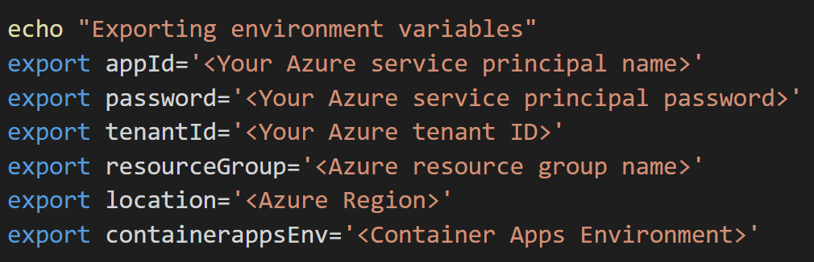
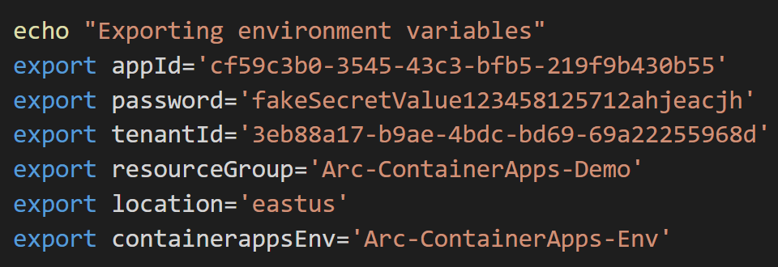
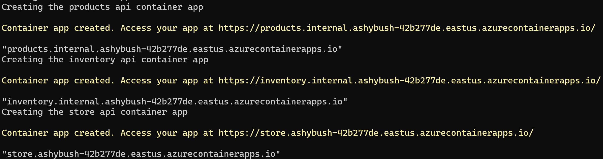
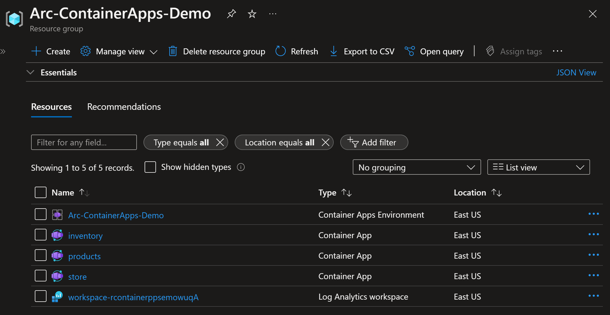
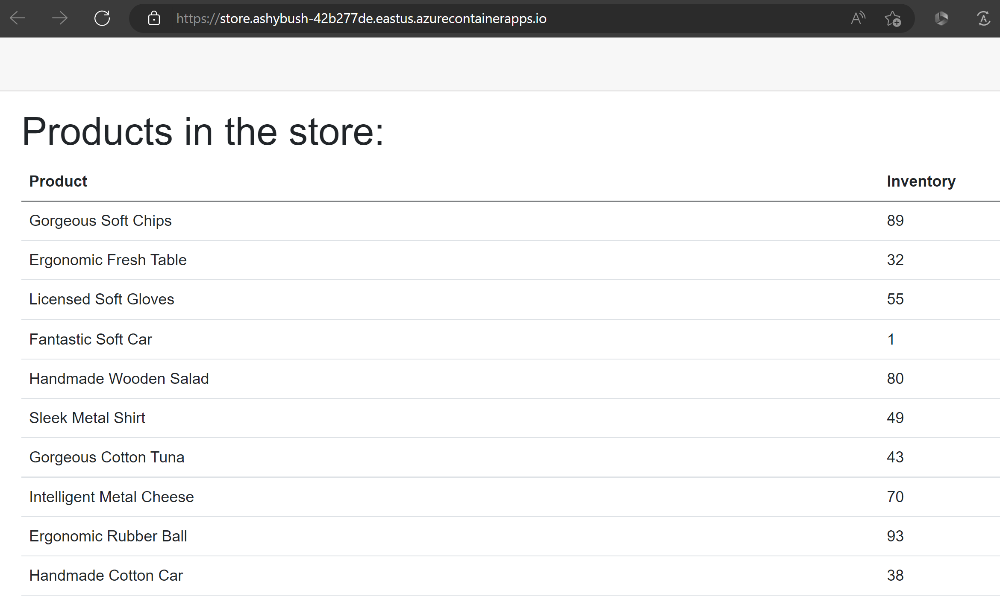
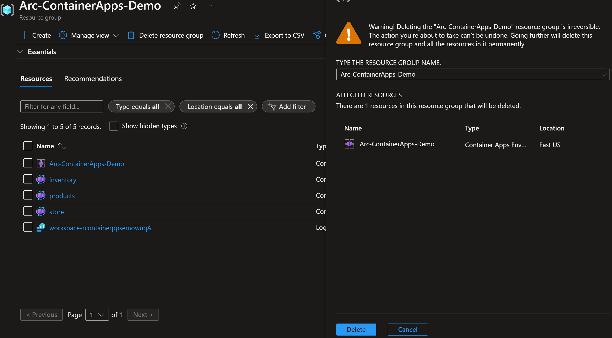

## Deploy cloud-native application hosted in Azure Container Apps

The following Jumpstart scenario will guide you on how to run cloud-native application on [Azure Container Apps](https://azure.microsoft.com/en-us/products/container-apps/). The Azure Container Apps service enables you to run microservices and containerized applications on a serverless platform. Individual container apps are deployed to a single Container Apps environment, which acts as a secure boundary around groups of container apps.

In this scenario, you will deploy a [Container Apps environment](https://learn.microsoft.com/en-us/azure/container-apps/environment) and a 3-node container app running in Azure.

- Store - The store app is the store's frontend app, running a Blazor Server project that reaches out to the backend APIs.
- Products API - This API is a Swagger UI-enabled API that hands back product names and IDs to callers.
- Inventory API - A simple API that provides a random number for a given product ID string. The values of each string/integer pair are stored in memory cache so they are consistent between API calls.

## Prerequisites

- Clone the Azure Arc Jumpstart repository

    ```shell
    git clone https://github.com/microsoft/azure_arc.git
    ```

- [Install or update Azure CLI to version 2.42.0 and above](https://docs.microsoft.com/cli/azure/install-azure-cli?view=azure-cli-latest). Use the below command to check your current installed version.

  ```shell
  az --version
  ```

- Create Azure service principal (SP)

    To be able to complete the scenario and its related automation, Azure service principal assigned with the “Contributor” role is required. To create it, login to your Azure account run the below command (this can also be done in [Azure Cloud Shell](https://shell.azure.com/)).

    ```shell
    az login
    subscriptionId=$(az account show --query id --output tsv)
    az ad sp create-for-rbac -n "<Unique SP Name>" --role "Contributor" --scopes /subscriptions/$subscriptionId
    ```

    For example:

    ```shell
    az login
    subscriptionId=$(az account show --query id --output tsv)
    az ad sp create-for-rbac -n "JumpstartArcK8s" --role "Contributor" --scopes /subscriptions/$subscriptionId
    ```

    Output should look like this:

    ```json
    {
    "appId": "XXXXXXXXXXXXXXXXXXXXXXXXXXXX",
    "displayName": "JumpstartArcK8s",
    "password": "XXXXXXXXXXXXXXXXXXXXXXXXXXXX",
    "tenant": "XXXXXXXXXXXXXXXXXXXXXXXXXXXX"
    }
    ```

    > **NOTE: If you create multiple subsequent role assignments on the same service principal, your client secret (password) will be destroyed and recreated each time. Therefore, make sure you grab the correct password**.

    > **NOTE: The Jumpstart scenarios are designed with as much ease of use in-mind and adhering to security-related best practices whenever possible. It is optional but highly recommended to scope the service principal to a specific [Azure subscription and resource group](https://docs.microsoft.com/cli/azure/ad/sp?view=azure-cli-latest) as well considering using a [less privileged service principal account](https://docs.microsoft.com/azure/role-based-access-control/best-practices)**

## Automation Flow

For you to get familiar with the automation and deployment flow, below is an explanation.

1. User is editing the environment variables in the Shell script file (1-time edit) which then be used throughout the configuration.

2. User is running the shell script. The script will:

    - Connect to Azure using SPN credentials.
    - Install Azure Arc CLI extensions.
    - Create Container Apps environment.
    - Deploy the containers apps.

3. User verifies the frontend store app in the browser.

## Deployment

- Edit the environment variables section in the included [az_container_apps](https://github.com/microsoft/azure_arc/blob/main/azure_arc_app_services_jumpstart/cotainerapps/scripts/az_container_apps.sh) shell script to match your parameters, and run it using the *`. ./az_container_apps.sh`* command.

    > **NOTE: The extra dot is due to the script having an _export_ function and needs to have the vars exported in the same shell session as the rest of the commands.**

    

    For example:

    

- Once the script run has finished, you will have the Container Apps environment created and all the container apps deployed in your resource group.

  > **NOTE: It might take a few minutes for the Container Apps Environment to be provisioned.**

  

  

- Click on the store container app to open it up in the Azure portal. Open the application URL in the Overview tab.

  

  

## Cleanup

- If you want to delete the entire environment, simply delete the deployed resource group from the Azure Portal.

  
