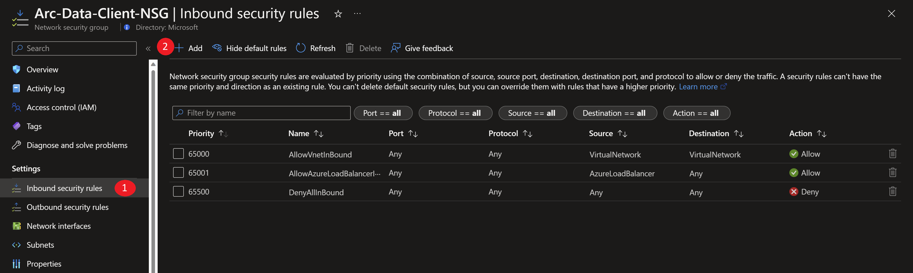
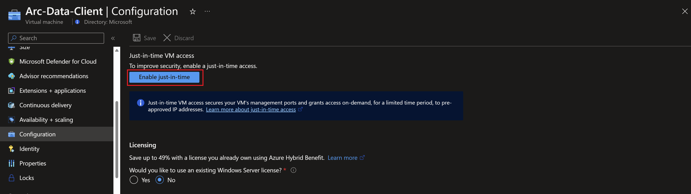
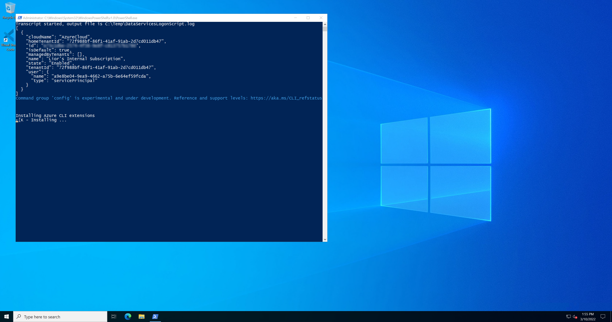
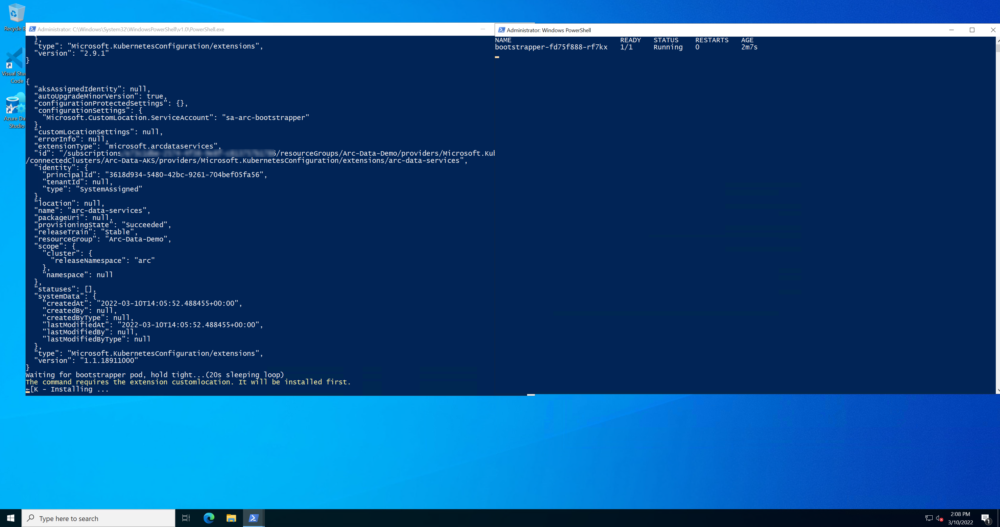
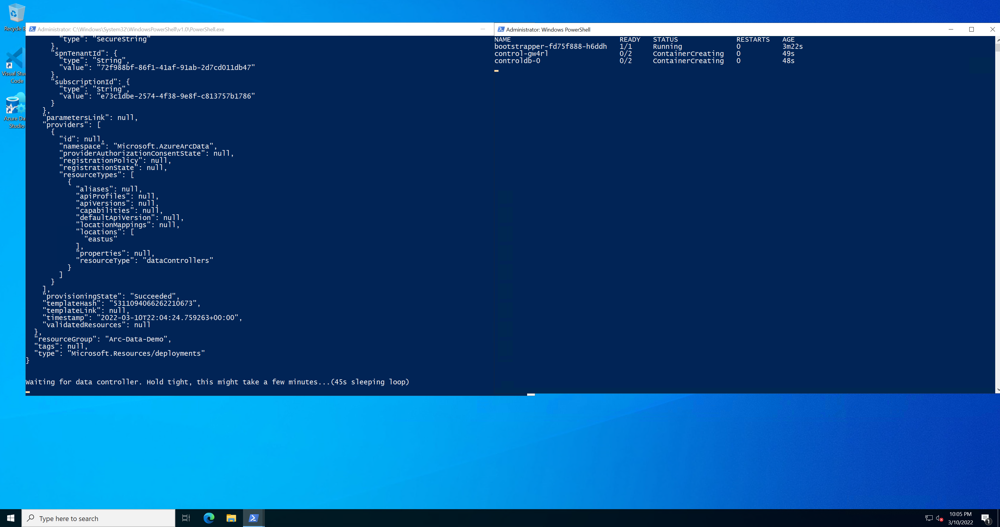
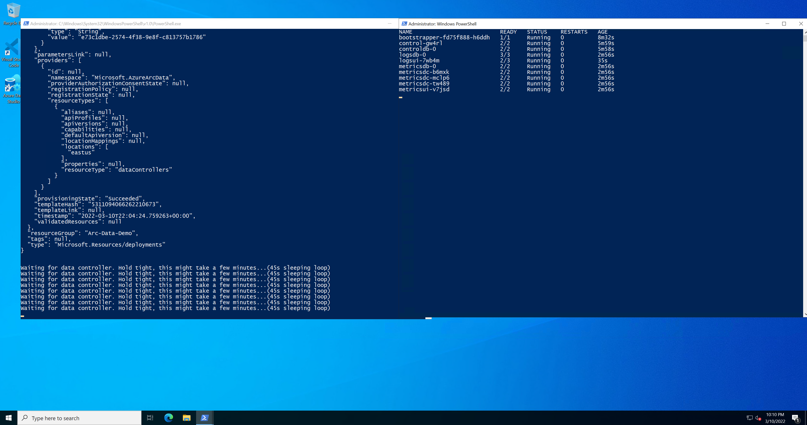
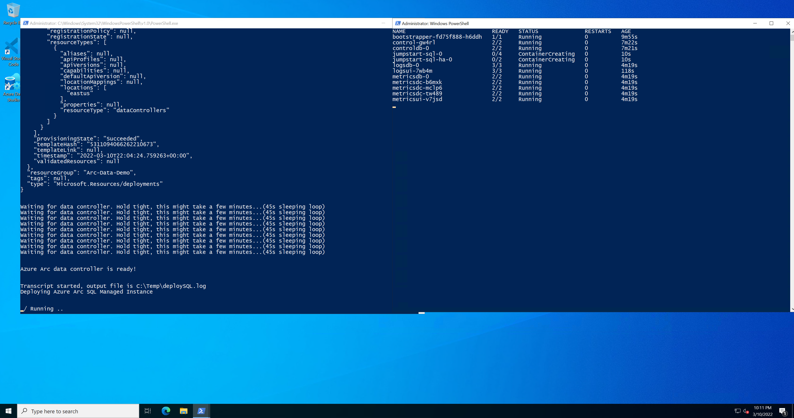
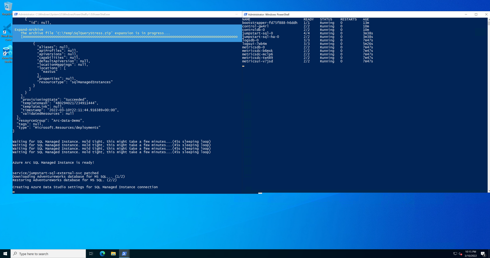

## Deploy Azure SQL Managed Instance in directly connected mode on AKS using an ARM Template

The following README will guide you on how to deploy a "Ready to Go" environment so you can start using [Azure Arc-enabled data services](https://docs.microsoft.com/en-us/azure/azure-arc/data/overview) and [SQL Managed Instance](https://docs.microsoft.com/en-us/azure/azure-arc/data/managed-instance-overview) deployed on [Azure Kubernetes Service (AKS)](https://docs.microsoft.com/en-us/azure/aks/intro-kubernetes) cluster using [Azure ARM Template](https://docs.microsoft.com/en-us/azure/azure-resource-manager/templates/overview).

By the end of this guide, you will have an AKS cluster deployed with an Azure Arc Data Controller, SQL Managed Instance, and a Microsoft Windows Server 2022 (Datacenter) Azure client VM, installed & pre-configured with all the required tools needed to work with Azure Arc-enabled data services:


> **Note: Currently, Azure Arc-enabled data services with PostgreSQL Hyperscale is in [public preview](https://docs.microsoft.com/en-us/azure/azure-arc/data/release-notes)**.

## Prerequisites

* Clone the Azure Arc Jumpstart repository

    ```shell
    git clone https://github.com/microsoft/azure_arc.git
    ```

* [Install or update Azure CLI to version 2.15.0 and above](https://docs.microsoft.com/en-us/cli/azure/install-azure-cli?view=azure-cli-latest). Use the below command to check your current installed version.

  ```shell
  az --version
  ```

* [Generate SSH Key](https://docs.microsoft.com/en-us/azure/virtual-machines/linux/create-ssh-keys-detailed) (or use existing ssh key).

* Create Azure service principal (SP)

    To be able to complete the scenario and its related automation, Azure service principal assigned with the “Contributor” role is required. To create it, login to your Azure account run the below command (this can also be done in [Azure Cloud Shell](https://shell.azure.com/)).

    ```shell
    az login
    az ad sp create-for-rbac -n "<Unique SP Name>" --role contributor
    ```

    For example:

    ```shell
    az ad sp create-for-rbac -n "http://AzureArcData" --role contributor
    ```

    Output should look like this:

    ```json
    {
    "appId": "XXXXXXXXXXXXXXXXXXXXXXXXXXXX",
    "displayName": "AzureArcData",
    "name": "http://AzureArcData",
    "password": "XXXXXXXXXXXXXXXXXXXXXXXXXXXX",
    "tenant": "XXXXXXXXXXXXXXXXXXXXXXXXXXXX"
    }
    ```

    > **Note: It is optional, but highly recommended, to scope the SP to a specific [Azure subscription](https://docs.microsoft.com/en-us/cli/azure/ad/sp?view=azure-cli-latest).**

## Automation Flow

For you to get familiar with the automation and deployment flow, below is an explanation.

* User is editing the ARM template parameters file (1-time edit). These parameters values are being used throughout the deployment.

* Main [_azuredeploy_ ARM template](https://github.com/microsoft/azure_arc/blob/main/azure_arc_data_jumpstart/aks/arm_template/azuredeploy.json) will initiate the deployment of the linked ARM templates:

  * [_VNET_](https://github.com/microsoft/azure_arc/blob/main/azure_arc_data_jumpstart/aks/arm_template/VNET.json) - Deploys a Virtual Network with a single subnet - used by our clientVM.
  * [_aks_](https://github.com/microsoft/azure_arc/blob/main/azure_arc_data_jumpstart/aks/arm_template/aks.json) - Deploys the AKS cluster where all the Azure Arc data services will be deployed.
  * [_clientVm_](https://github.com/microsoft/azure_arc/blob/main/azure_arc_data_jumpstart/aks/arm_template/clientVm.json) - Deploys the client Windows VM. This is where all user interactions with the environment are made from.
  * [_logAnalytics_](https://github.com/microsoft/azure_arc/blob/main/azure_arc_data_jumpstart/aks/arm_template/logAnalytics.json) - Deploys Azure Log Analytics workspace to support Azure Arc-enabled data services logs uploads.

User remotes into client Windows VM, which automatically kicks off the [_DataServicesLogonScript_](https://github.com/microsoft/azure_arc/blob/main/azure_arc_data_jumpstart/aks/arm_template/artifacts/DataServicesLogonScript.ps1) PowerShell script that deploy and configure Azure Arc-enabled data services on the AKS cluster including the data controller and SQL Managed Instance.

## Deployment

As mentioned, this deployment will leverage ARM templates. You will deploy a single template that will initiate the entire automation for this scenario.

* The deployment is using the ARM template parameters file. Before initiating the deployment, edit the [_azuredeploy.parameters.json_](https://github.com/microsoft/azure_arc/blob/main/azure_arc_data_jumpstart/aks/arm_template/azuredeploy.parameters.json) file located in your local cloned repository folder. An example parameters file is located [here](https://github.com/microsoft/azure_arc/blob/main/azure_arc_data_jumpstart/aks/arm_template/artifacts/azuredeploy.parameters.example.json).

  * `sshRSAPublicKey` - Your SSH public key
  * `spnClientId` - Your Azure service principal id
  * `spnClientSecret` - Your Azure service principal secret
  * `spnTenantId` - Your Azure tenant id
  * `windowsAdminUsername` - Client Windows VM Administrator name
  * `windowsAdminPassword` - Client Windows VM Password. Password must have 3 of the following: 1 lower case character, 1 upper case character, 1 number, and 1 special character. The value must be between 12 and 123 characters long.
  * `myIpAddress` - Your local public IP address. This is used to allow remote RDP and SSH connections to the client Windows VM and AKS cluster.
  * `logAnalyticsWorkspaceName` - Unique name for the deployment log analytics workspace.
  * `deploySQLMI` - Boolean that sets whether or not to deploy SQL Managed Instance, for this data controller and Azure SQL Managed Instance scenario, we will set it to _**true**_.
  * `SQLMIHA` - Boolean that sets whether or not to deploy SQL Managed Instance in an highly-available configuration, set this to either _**true**_ or _**false**_.
  * `deployPostgreSQL` - Boolean that sets whether or not to deploy PostgreSQL Hyperscale, for this data controller and Azure SQL Managed Instance scenario, we leave it set to _**false**_.
  * `kubernetesVersion` - AKS version
  * `dnsPrefix` - AKS unique DNS prefix

    > **Note: In case you decided to deploy SQL Managed Instance in an highly-available fashion, refer to the ["High Availability"](##-High-Availability-with-Always-On-availability-groups) section in this readme. Also note that this capability is currently in [preview](https://docs.microsoft.com/en-us/azure/azure-arc/data/release-notes)**.

* To deploy the ARM template, navigate to the local cloned [deployment folder](https://github.com/microsoft/azure_arc/blob/main/azure_arc_data_jumpstart/aks/arm_template) and run the below command:

    ```shell
    az group create --name <Name of the Azure resource group> --location <Azure Region>
    az deployment group create \
    --resource-group <Name of the Azure resource group> \
    --name <The name of this deployment> \
    --template-uri https://raw.githubusercontent.com/microsoft/azure_arc/main/azure_arc_data_jumpstart/aks/arm_template/azuredeploy.json \
    --parameters <The *azuredeploy.parameters.json* parameters file location>
    ```

    > **Note: Make sure that you are using the same Azure resource group name as the one you've just used in the _azuredeploy.parameters.json_ file**

    For example:

    ```shell
    az group create --name Arc-Data-Demo --location "East US"
    az deployment group create \
    --resource-group Arc-Data-Demo \
    --name arcdata \
    --template-uri https://raw.githubusercontent.com/microsoft/azure_arc/main/azure_arc_data_jumpstart/aks/arm_template/azuredeploy.json \
    --parameters azuredeploy.parameters.json
    --parameters templateBaseUrl="https://raw.githubusercontent.com/your--github--handle/azure_arc/main/azure_arc_data_jumpstart/aks/arm_template/"
    ```

    > **Note: The deployment time for this scenario can take ~15-20min**

* Once Azure resources has been provisioned, you will be able to see it in Azure portal. At this point, the resource group should have **8 various Azure resources** deployed.

    

    

## Windows Login & Post Deployment

* Now that first phase of the automation is completed, it is time to RDP to the client VM using it's public IP.

    

* At first login, as mentioned in the "Automation Flow" section above, the [_DataServicesLogonScript_](https://github.com/microsoft/azure_arc/blob/main/azure_arc_data_jumpstart/aks/arm_template/artifacts/DataServicesLogonScript.ps1) PowerShell logon script will start it's run.

* Let the script to run its course and **do not close** the PowerShell session, this will be done for you once completed. Once the script will finish it's run, the logon script PowerShell session will be closed, the Windows wallpaper will change and both the Azure Arc Data Controller and SQL Managed Instance will be deployed on the cluster and be ready to use.












* Since this scenario is deploying the Azure Arc Data Controller and SQL Managed Instance, you will also notice additional newly deployed Azure resources in the resources group (at this point you should have **12 various Azure resources deployed**. The important ones to notice are:

  * Azure Arc-enabled Kubernetes cluster - Azure Arc-enabled data services deployed in directly connected are using this type of resource in order to deploy the data services [cluster extension](https://docs.microsoft.com/en-us/azure/azure-arc/kubernetes/conceptual-extensions) as well as for using Azure Arc [Custom locations](https://docs.microsoft.com/en-us/azure/azure-arc/kubernetes/conceptual-custom-locations).

  * Custom location - provides a way for tenant administrators to use their Azure Arc-enabled Kubernetes clusters as target locations for deploying Azure services instances.

  * Azure Arc Data Controller - The data controller that is now deployed on the Kubernetes cluster.

  * Azure Arc-enabled SQL Managed Instance - The SQL Managed Instance that is now deployed on the Kubernetes cluster.


* Another tool automatically deployed is Azure Data Studio along with the *Azure Data CLI*, the *Azure Arc* and the *PostgreSQL* extensions. Using the Desktop shortcut created for you, open Azure Data Studio and click the Extensions settings to see both extensions.

  

* additionally, the SQL Managed Instance connection will be configured automatically for you.

  

  

## Cluster extensions

In this scenario, the Azure Arc-enabled data services cluster extension was deployed and used throughout this scenario in order to deploy the data services infrastructure.

* In order to view cluster extensions, click on the Azure Arc-enabled Kubernetes resource Extensions settings.

  

  

## High Availability with Always On availability groups

Azure Arc-enabled SQL Managed Instance is deployed on Kubernetes as a containerized application and uses kubernetes constructs such as stateful sets and persistent storage to provide built-in health monitoring, failure detection, and failover mechanisms to maintain service health. For increased reliability, you can also configure Azure Arc-enabled SQL Managed Instance to deploy with extra replicas in a high availability configuration.

For showcasing and testing SQL Managed Instance with [Always On availability groups](https://docs.microsoft.com/en-us/azure/azure-arc/data/managed-instance-high-availability#deploy-with-always-on-availability-groups), a dedicated [Jumpstart scenario](https://azurearcjumpstart.io/azure_arc_jumpstart/azure_arc_data/day2/aks/aks_mssql_ha/) is available to help you simulate failures and get hands-on experience with this deployment model.

## Operations

### Azure Arc-enabled SQL Managed Instance Stress Simulation

Included in this scenario, is a dedicated SQL stress simulation tool named _SqlQueryStress_ automatically installed for you on the Client VM. _SqlQueryStress_ will allow you to generate load on the Azure Arc-enabled SQL Managed Instance that can be done used to showcase how the SQL database and services are performing as well to highlight operational practices described in the next section.

* To start with, open the _SqlQueryStress_ desktop shortcut and connect to the SQL Managed Instance **primary** endpoint IP address. This can be found in the _SQLMI Endpoints_ text file desktop shortcut that was also created for you alongside the username and password you used to deploy the environment.

  

  

> **Note: Secondary SQL Managed Instance endpoint will be available only when using the [HA deployment model ("Business Critical")](https://azurearcjumpstart.io/azure_arc_jumpstart/azure_arc_data/day2/cluster_api/capi_azure/capi_mssql_ha/).**

* To connect, use "SQL Server Authentication" and select the deployed sample _AdventureWorks_ database (you can use the "Test" button to check the connection).

  

* To generate some load, we will be running a simple stored procedure. Copy the below procedure and change the number of iterations you want it to run as well as the number of threads to generate even more load on the database. In addition, change the delay between queries to 1ms for allowing the stored procedure to run for a while.

    ```sql
    exec [dbo].[uspGetEmployeeManagers] @BusinessEntityID = 8
    ```

* As you can see from the example below, the configuration settings are 100,000 iterations, five threads per iteration, and a 1ms delay between queries. These configurations should allow you to have the stress test running for a while.

  

  

### Azure Arc-enabled SQL Managed Instance monitoring using Grafana

When deploying Azure Arc-enabled data services, a [Grafana](https://grafana.com/) instance is also automatically deployed on the same Kubernetes cluster and include built-in dashboards for both Kubernetes infrastructure as well SQL Managed Instance monitoring (PostgreSQL dashboards are included as well but we will not be covering these in this section).

* Now that you have the _SqlQueryStress_ stored procedure running and generating load, we can look how this is shown in the the built-in Grafana dashboard. As part of the automation, a new URL desktop shortcut simply named "Grafana" was created.

  

* [Optional] The IP address for this instance represents the Kubernetes _LoadBalancer_ external IP that was provision as part of Azure Arc-enabled data services. Use the _```kubectl get svc -n arc```_ command to view the _metricsui_ external service IP address.

  

* To log in, use the same username and password that is in the _SQLMI Endpoints_ text file desktop shortcut.

  

* Navigate to the built-in "SQL Managed Instance Metrics" dashboard.

  

  

* Change the dashboard time range to "Last 5 minutes" and re-run the stress test using _SqlQueryStress_ (in case it was already finished).

  

* You can now see how the SQL graphs are starting to show increased activity and load on the database instance.

  

  

## Cleanup

* If you want to delete the entire environment, simply delete the deployment resource group from the Azure portal.

    

## Known Issues

* Webhook pods go into error state, even after Data Controller/SQL MI/Postgres pods are up, caused by a known Helm-related backend issue that is being worked on. These errors can be safely ignored and do not impact the functionality of Azure Arc-enabled data services and the Jumpstart automation.

    
