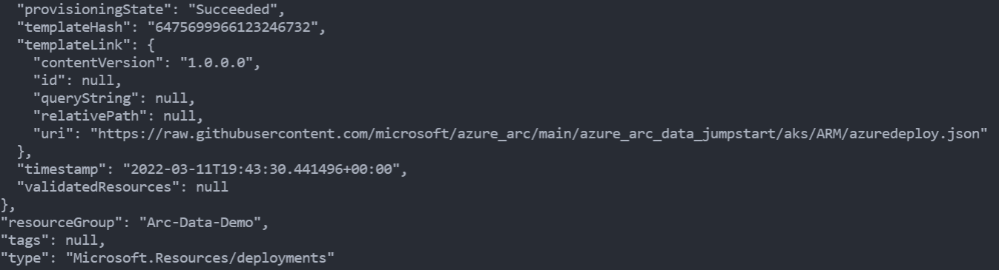
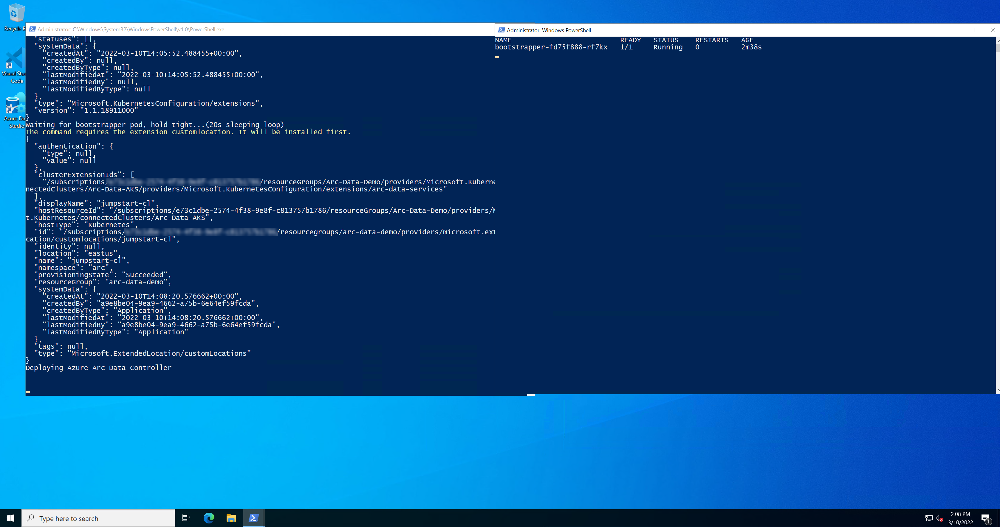
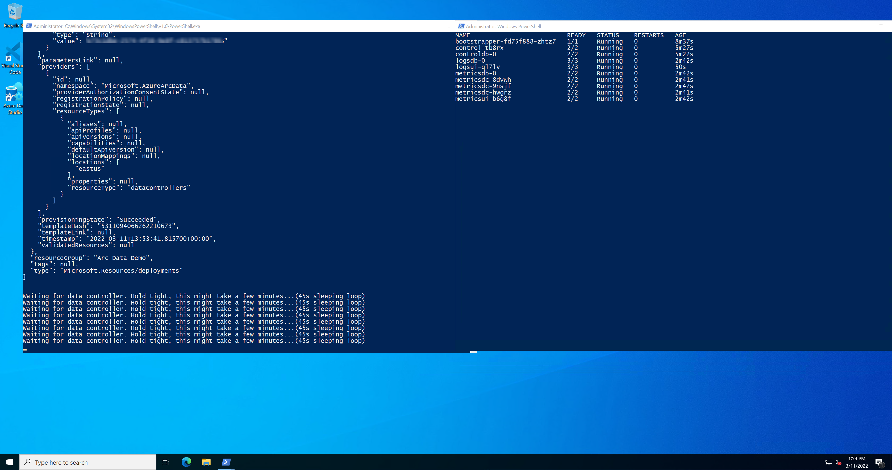
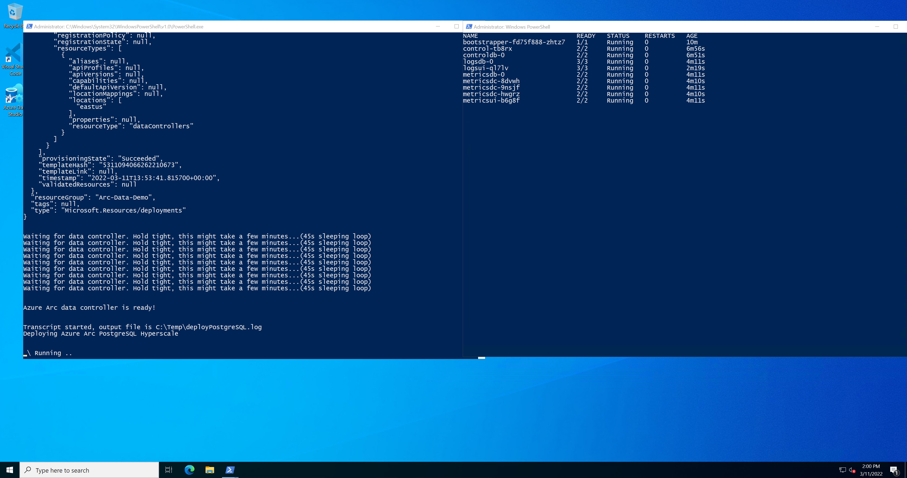
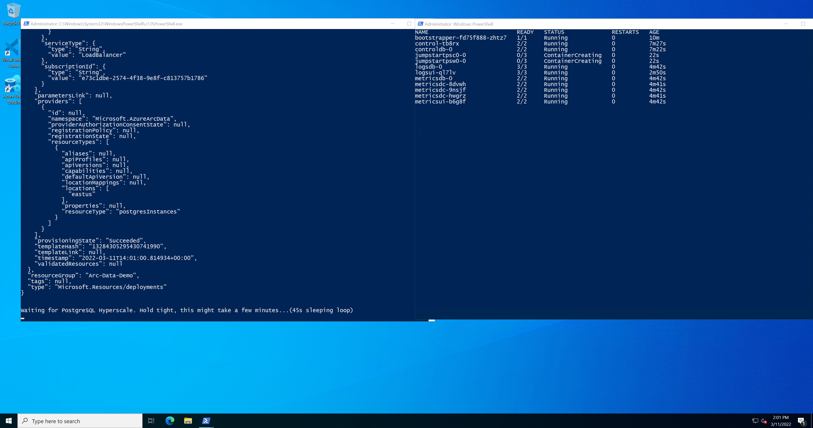
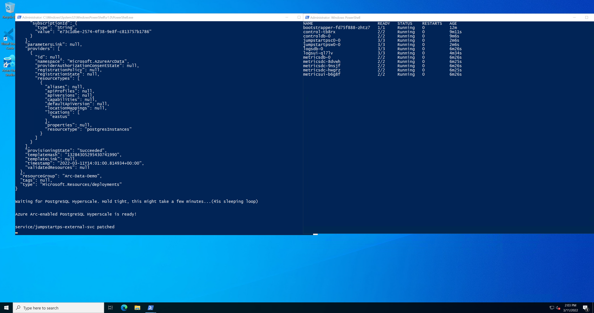
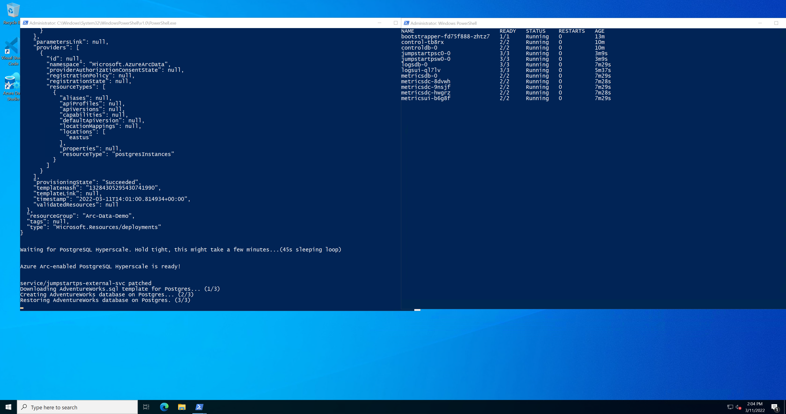

> **ADVISORY: An known issue affecting Azure CLI Kubernetes extensions is causing problems with automation in Jumpstart Kubernetes scenarios, data and app services scenarios, and ArcBox where the Azure CLI Kubernetes extensions are used. This issue will result result in incomplete or failed deployments. Thank you for your patience as the teams work to address the issue.**

## Deploy Azure PostgreSQL Hyperscale in directly connected mode on AKS using an ARM Template

The following README will guide you on how to deploy a "Ready to Go" environment so you can start using [Azure Arc-enabled data services](https://docs.microsoft.com/azure/azure-arc/data/overview) and [PostgreSQL Hyperscale](https://docs.microsoft.com/azure/azure-arc/data/what-is-azure-arc-enabled-postgres-hyperscale) deployed on [Azure Kubernetes Service (AKS)](https://docs.microsoft.com/azure/aks/intro-kubernetes) cluster using [Azure ARM Template](https://docs.microsoft.com/azure/azure-resource-manager/templates/overview).

By the end of this guide, you will have an AKS cluster deployed with an Azure Arc Data Controller, PostgreSQL Hyperscale instance, and a Microsoft Windows Server 2022 (Datacenter) Azure client VM, installed & pre-configured with all the required tools needed to work with Azure Arc-enabled data services:


> **NOTE: Currently, Azure Arc-enabled PostgreSQL Hyperscale is in [public preview](https://docs.microsoft.com/azure/azure-arc/data/release-notes)**.

## Prerequisites

- Clone the Azure Arc Jumpstart repository

    ```shell
    git clone https://github.com/microsoft/azure_arc.git
    ```

- [Install or update Azure CLI to version 2.25.0 and above](https://docs.microsoft.com/cli/azure/install-azure-cli?view=azure-cli-latest). Use the below command to check your current installed version.

  ```shell
  az --version
  ```

- [Generate SSH Key](https://docs.microsoft.com/azure/virtual-machines/linux/create-ssh-keys-detailed) (or use existing ssh key).

- Create Azure service principal (SP). To deploy this scenario, an Azure service principal assigned with multiple RBAC roles is required:

  - "Contributor" - Required for provisioning Azure resources
  - "Security admin" - Required for installing Cloud Defender Azure-Arc enabled Kubernetes extension and dismiss alerts
  - "Security reader" - Required for being able to view Azure-Arc enabled Kubernetes Cloud Defender extension findings
  - "Monitoring Metrics Publisher" - Required for being Azure Arc-enabled data services billing, monitoring metrics, and logs management

    To create it login to your Azure account run the below command (this can also be done in [Azure Cloud Shell](https://shell.azure.com/).

    ```shell
    az login
    az ad sp create-for-rbac -n "<Unique SP Name>" --role "Contributor"
    az ad sp create-for-rbac -n "<Unique SP Name>" --role "Security admin"
    az ad sp create-for-rbac -n "<Unique SP Name>" --role "Security reader"
    az ad sp create-for-rbac -n "<Unique SP Name>" --role "Monitoring Metrics Publisher"
    ```

    For example:

    ```shell
    az ad sp create-for-rbac -n "JumpstartArcDataSvc" --role "Contributor"
    az ad sp create-for-rbac -n "JumpstartArcDataSvc" --role "Security admin"
    az ad sp create-for-rbac -n "JumpstartArcDataSvc" --role "Security reader"
    az ad sp create-for-rbac -n "JumpstartArcDataSvc" --role "Monitoring Metrics Publisher"
    ```

    Output should look like this:

    ```json
    {
    "appId": "XXXXXXXXXXXXXXXXXXXXXXXXXXXX",
    "displayName": "AzureArcData",
    "name": "http://AzureArcData",
    "password": "XXXXXXXXXXXXXXXXXXXXXXXXXXXX",
    "tenant": "XXXXXXXXXXXXXXXXXXXXXXXXXXXX"
    }
    ```

    > **NOTE: It is optional, but highly recommended, to scope the SP to a specific [Azure subscription](https://docs.microsoft.com/cli/azure/ad/sp?view=azure-cli-latest).**

## Automation Flow

For you to get familiar with the automation and deployment flow, below is an explanation.

- User is editing the ARM template parameters file (1-time edit). These parameters values are being used throughout the deployment.

- Main [_azuredeploy_ ARM template](https://github.com/microsoft/azure_arc/blob/main/azure_arc_data_jumpstart/aks/ARM/azuredeploy.json) will initiate the deployment of the linked ARM templates:

  - [_VNET_](https://github.com/microsoft/azure_arc/blob/main/azure_arc_data_jumpstart/aks/ARM/VNET.json) - Deploys a Virtual Network with a single subnet to be used by the Client virtual machine.
  - [_aks_](https://github.com/microsoft/azure_arc/blob/main/azure_arc_data_jumpstart/aks/ARM/aks.json) - Deploys the AKS cluster where all the Azure Arc data services will be deployed.
  - [_clientVm_](https://github.com/microsoft/azure_arc/blob/main/azure_arc_data_jumpstart/aks/ARM/clientVm.json) - Deploys the client Windows VM. This is where all user interactions with the environment are made from.
  - [_logAnalytics_](https://github.com/microsoft/azure_arc/blob/main/azure_arc_data_jumpstart/aks/ARM/logAnalytics.json) - Deploys Azure Log Analytics workspace to support Azure Arc-enabled data services logs uploads.

- User remotes into client Windows VM, which automatically kicks off the [_DataServicesLogonScript_](https://github.com/microsoft/azure_arc/blob/main/azure_arc_data_jumpstart/aks/ARM/artifacts/DataServicesLogonScript.ps1) PowerShell script that deploy and configure Azure Arc-enabled data services on the AKS cluster including the data controller and PostgreSQL Hyperscale.

- In addition to deploying the data controller and PostgreSQL Hyperscale, the sample [_AdventureWorks_](https://docs.microsoft.com/sql/samples/adventureworks-install-configure?view=sql-server-ver15&tabs=ssms) database will restored automatically for you as well.

## Deployment

As mentioned, this deployment will leverage ARM templates. You will deploy a single template that will initiate the entire automation for this scenario.

- The deployment is using the ARM template parameters file. Before initiating the deployment, edit the [_azuredeploy.parameters.json_](https://github.com/microsoft/azure_arc/blob/main/azure_arc_data_jumpstart/aks/ARM/azuredeploy.parameters.json) file located in your local cloned repository folder. An example parameters file is located [here](https://github.com/microsoft/azure_arc/blob/main/azure_arc_data_jumpstart/aks/ARM/artifacts/azuredeploy.parameters.example.json).

  - _'sshRSAPublicKey'_ - Your SSH public key
  - _'spnClientId'_ - Your Azure service principal id
  - _'spnClientSecret'_ - Your Azure service principal secret
  - _'spnTenantId'_ - Your Azure tenant id
  - _'windowsAdminUsername'_ - Client Windows VM Administrator name
  - _'windowsAdminPassword'_ - Client Windows VM Password. Password must have 3 of the following: 1 lower case character, 1 upper case character, 1 number, and 1 special character. The value must be between 12 and 123 characters long.
  - _'myIpAddress'_ - Your local public IP address. This is used to allow remote RDP and SSH connections to the client Windows VM and AKS cluster.
  - _'logAnalyticsWorkspaceName'_ - Unique name for the deployment log analytics workspace.
  - _'deploySQLMI'_ - Boolean that sets whether or not to deploy SQL Managed Instance, for this scenario we leave it set to _**false**_.
  - _'SQLMIHA`_ - Boolean that sets whether or not to deploy SQL Managed Instance with high-availability (business continuity) configurations, for this scenario we leave it set to _**false**_.
  - _'deployPostgreSQL'_ - Boolean that sets whether or not to deploy PostgreSQL Hyperscale, for this Azure Arc-enabled PostgreSQL Hyperscale scenario we will set it to _**true**_.
  - _'deployBastion'_ - Choice (true | false) to deploy Azure Bastion or not to connect to the client VM.
  - _'bastionHostName'_ - Azure Bastion host name.

- To deploy the ARM template, navigate to the local cloned [deployment folder](https://github.com/microsoft/azure_arc/blob/main/azure_arc_data_jumpstart/aks/ARM) and run the below command:

    ```shell
    az group create --name <Name of the Azure resource group> --location <Azure Region>
    az deployment group create \
    --resource-group <Name of the Azure resource group> \
    --name <The name of this deployment> \
    --template-uri https://raw.githubusercontent.com/microsoft/azure_arc/main/azure_arc_data_jumpstart/aks/ARM/azuredeploy.json \
    --parameters <The *azuredeploy.parameters.json* parameters file location>
    ```

    > **NOTE: Make sure that you are using the same Azure resource group name as the one you've just used in the _azuredeploy.parameters.json_ file**

    For example:

    ```shell
    az group create --name Arc-Data-Demo --location "East US"
    az deployment group create \
    --resource-group Arc-Data-Demo \
    --name arcdata \
    --template-uri https://raw.githubusercontent.com/microsoft/azure_arc/main/azure_arc_data_jumpstart/aks/ARM/azuredeploy.json \
    --parameters azuredeploy.parameters.json
    ```

    > **NOTE: The deployment time for this scenario can take ~15-20min**

- Once Azure resources has been provisioned, you will be able to see it in Azure portal. At this point, the resource group should have **8 various Azure resources** deployed (If you chose to deploy Azure Bastion, you will have **9 Azure resources**).

    

    

## Windows Login & Post Deployment

- Now that the first phase of the automation is completed, it is time to RDP to the client VM. If you have not chosen to deploy Azure Bastion in the ARM template, RDP to the VM using its public IP.

    

- If you have chosen to deploy Azure Bastion in the ARM template, use it to connect to the VM.

    

- At first login, as mentioned in the "Automation Flow" section above, the [_DataServicesLogonScript_](https://github.com/microsoft/azure_arc/blob/main/azure_arc_data_jumpstart/aks/ARM/artifacts/DataServicesLogonScript.ps1) PowerShell logon script will start it's run.

- Let the script to run its course and **do not close** the PowerShell session, this will be done for you once completed. Once the script will finish it's run, the logon script PowerShell session will be closed, the Windows wallpaper will change and both the Azure Arc Data Controller and PostgreSQL will be deployed on the cluster and be ready to use.

  

  

  

  

  

  

  

  

  

  

  

  

  

  

  

  

  

  

  

  

  

  

  

- Since this scenario is deploying the Azure Arc Data Controller and PostgreSQL Hyperscale instance, you will also notice additional newly deployed Azure resources in the resources group (at this point you should have **12 various Azure resources deployed**. The important ones to notice are:

  - Azure Arc-enabled Kubernetes cluster - Azure Arc-enabled data services deployed in directly connected are using this type of resource in order to deploy the data services [cluster extension](https://docs.microsoft.com/azure/azure-arc/kubernetes/conceptual-extensions) as well as for using Azure Arc [Custom locations](https://docs.microsoft.com/azure/azure-arc/kubernetes/conceptual-custom-locations).

  - Custom location - provides a way for tenant administrators to use their Azure Arc-enabled Kubernetes clusters as target locations for deploying Azure services instances.

  - Azure Arc Data Controller - The data controller that is now deployed on the Kubernetes cluster.

  - Azure Arc-enabled PostgreSQL Hyperscale - The PostgreSQL Hyperscale instance that is now deployed on the Kubernetes cluster.

  

- As part of the automation, Azure Data Studio is installed along with the _Azure Data CLI_, _Azure CLI_, _Azure Arc_ and the _PostgreSQL_ extensions. Using the Desktop shortcut created for you, open Azure Data Studio and click the Extensions settings to see the installed extensions.

  

  

- Additionally, the PostgreSQL connection will be configured automatically for you. As mentioned, the sample _AdventureWorks_ database was restored as part of the automation.

  

## Cluster extensions

In this scenario, two Azure Arc-enabled Kubernetes cluster extensions were installed:

- _azuremonitor-containers_ - The Azure Monitor Container Insights cluster extension. To learn more about it, you can check our Jumpstart ["Integrate Azure Monitor for Containers with GKE as an Azure Arc Connected Cluster using Kubernetes extensions](https://azurearcjumpstart.io/azure_arc_jumpstart/azure_arc_k8s/day2/gke/gke_monitor_extension/) scenario.

- _arc-data-services_ - The Azure Arc-enabled data services cluster extension that was used throughout this scenario in order to deploy the data services infrastructure.

In order to view these cluster extensions, click on the Azure Arc-enabled Kubernetes resource Extensions settings.


## Cleanup

- If you want to delete the entire environment, simply delete the deployment resource group from the Azure portal.

    
