## Deploy Azure PostgreSQL Hyperscale on AKS using Azure DevOps Release Pipeline

The following README will guide you on how to use [Azure DevOps (ADO) Release pipelines](https://docs.microsoft.com/en-us/azure/devops/pipelines/release/?view=azure-devops) to deploy a "Ready to Go" environment so you can start using Azure Arc-enabled data services with Azure PostgreSQL Hyperscale (Citus) on [Azure Kubernetes Service (AKS)](https://docs.microsoft.com/en-us/azure/aks/intro-kubernetes) cluster using [Azure ARM Template](https://docs.microsoft.com/en-us/azure/azure-resource-manager/templates/overview).

By the end of this guide, you will have an Azure DevOps Release pipeline to deploy AKS cluster with an Azure Arc Data Controller ([in "Directly Connected" mode](https://docs.microsoft.com/en-us/azure/azure-arc/data/connectivity), Azure PostgreSQL Hyperscale with a sample database and a Microsoft Windows Server 2022 (Datacenter) Azure VM, installed & pre-configured with all the required tools needed to work with Azure Arc Data Services.

> **NOTE: Currently, Azure Arc-enabled data services with PostgreSQL Hyperscale is in [public preview](https://docs.microsoft.com/en-us/azure/azure-arc/data/release-notes)**.

> **NOTE: The following scenario is focusing the Azure DevOps Release pipeline creation. Once the pipeline has been created and the environment deployment has finished, the automation flow and next steps are as [described on in the main bootstrap scenario](https://azurearcjumpstart.io/azure_arc_jumpstart/azure_arc_data/aks/aks_postgresql_hyperscale_arm_template/)**

## Prerequisites

* [Azure DevOps account](https://azure.microsoft.com/en-us/services/devops/) set up with your organization and ready for project creation.

  * (Optional) [Create new Azure DevOps organization](https://docs.microsoft.com/en-us/azure/devops/organizations/accounts/create-organization?view=azure-devops).

  * (Optional) [Create new Azure DevOps project](https://docs.microsoft.com/en-us/azure/devops/organizations/projects/create-project?view=azure-devops&tabs=preview-page).

* [Install or update Azure CLI to version 2.25.0 and above](https://docs.microsoft.com/en-us/cli/azure/install-azure-cli?view=azure-cli-latest). Use the below command to check your current installed version.

  ```shell
  az --version
  ```

* [Generate SSH Key](https://docs.microsoft.com/en-us/azure/virtual-machines/linux/create-ssh-keys-detailed) (or use existing ssh key).

* Create Azure service principal (SP)

    To be able to complete the scenario and its related automation, Azure service principal assigned with the “Contributor” role is required. To create it, login to your Azure account run the below command (this can also be done in [Azure Cloud Shell](https://shell.azure.com/)).

    ```shell
    az login
    az ad sp create-for-rbac -n "<Unique SP Name>" --role contributor
    ```

    For example:

    ```shell
    az ad sp create-for-rbac -n "http://AzureArcData" --role contributor
    ```

    Output should look like this:

    ```json
    {
    "appId": "XXXXXXXXXXXXXXXXXXXXXXXXXXXX",
    "displayName": "AzureArcData",
    "name": "http://AzureArcData",
    "password": "XXXXXXXXXXXXXXXXXXXXXXXXXXXX",
    "tenant": "XXXXXXXXXXXXXXXXXXXXXXXXXXXX"
    }
    ```

    > **NOTE: It is optional, but highly recommended, to scope the SP to a specific [Azure subscription](https://docs.microsoft.com/en-us/cli/azure/ad/sp?view=azure-cli-latest).**

## Deployment

In this scenario, you will create a new Release pipeline to deploy the environment ARM template for this Jumpstart scenario.

* In a new or an existing ADO project, start the process of creating a new release pipeline.

    

    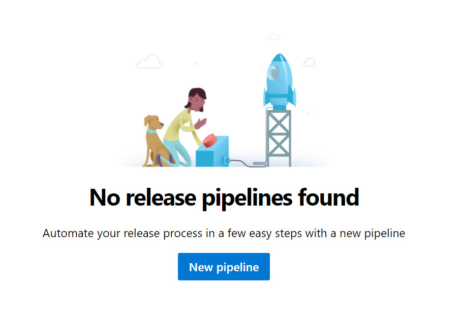

* To create the pipeline, we will be using an empty job template and give it a name (once done click the X button).

    

    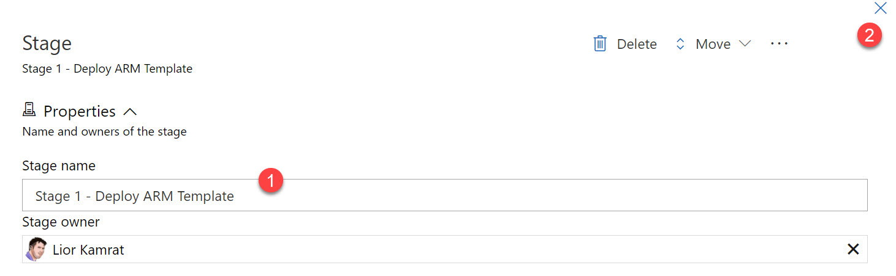

* Create a new task for the stage you have just created. This task will be the one for deploying the ARM template.

    

    

* Click on the new task to start it's configuration.

    

* When deploying an ARM template, the Azure Resource Manager connection and subscription must be provided.

    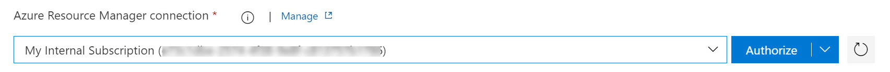

  > **NOTE: For new ADO project, you will be asked to click the authorization button**

    

* Provide the Azure resource group and location where all the resources will be deployed. Make sure to validate if the service is [currently available in your Azure region](https://azure.microsoft.com/en-us/global-infrastructure/services/?products=azure-arc).

    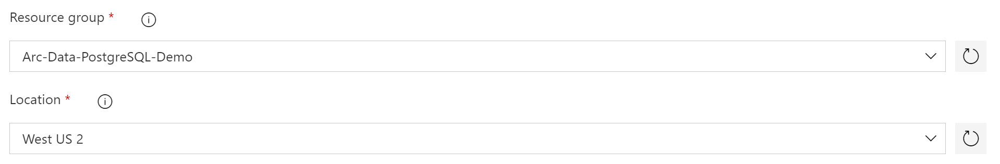

* As mentioned, the task will deployed the existing ARM template for deploying Azure Arc-enabled data services with PostgreSQL Hyperscale that in the Azure Arc Jumpstart GitHub repository.

  * Change the Template location to "URL of the file"

  * Copy the raw URLs for both the [template](https://raw.githubusercontent.com/microsoft/azure_arc/main/azure_arc_data_jumpstart/aks/arm_template/postgres_hs/azuredeploy.json) and the [parameters](https://raw.githubusercontent.com/microsoft/azure_arc/main/azure_arc_data_jumpstart/aks/arm_template/postgres_hs/azuredeploy.parameters.json) json files and paste it in it's the proper field.

  * The deployment ARM template requires you provide parameters values. Click on the _Edit Override template parameters_ to add your parameters values.

    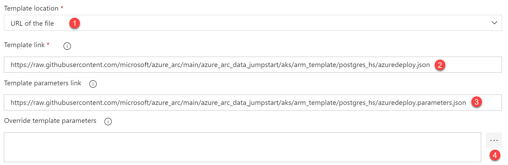

  * _`sshRSAPublicKey`_ - Your ssh public key
  * _`spnClientId`_ - Your Azure service principal name
  * _`spnClientSecret`_ - Your Azure service principal password
  * _`spnTenantId`_ - Your Azure tenant ID
  * _`windowsAdminUsername`_ - Client Windows VM admin username
  * _`windowsAdminPassword`_ - Client Windows VM admin password
  * _`myIpAddress`_ - Public IP address of your network
  * _`logAnalyticsWorkspaceName`_ - Unique Log Analytics workspace name
  * _`deploySQLMI`_ - SQL Managed Instance deployment (true/false)
  * _`SQLMIHA`_ - SQL Managed Instance high-availability deployment (true/false)
  * _`deployPostgreSQL`_ - PostgreSQL Hyperscale deployment (true/false)
  * _`clusterName`_ - AKS cluster name
  * _`bastionHostName`_ - Indicate whether to deploy bastion host to manage AKS
  * _`dnsPrefix`_ - AKS unique DNS prefix
  * _`kubernetesVersion`_ - AKS Kubernetes Version (See previous prerequisite)

    > **NOTE: Make sure that you are using the same Azure resource group name as the one you've just used in the _`azuredeploy.parameters.json`_ file**

    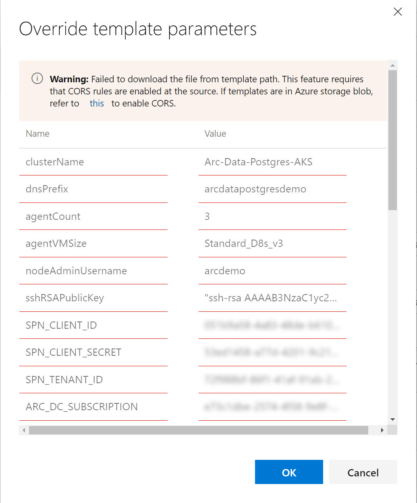

    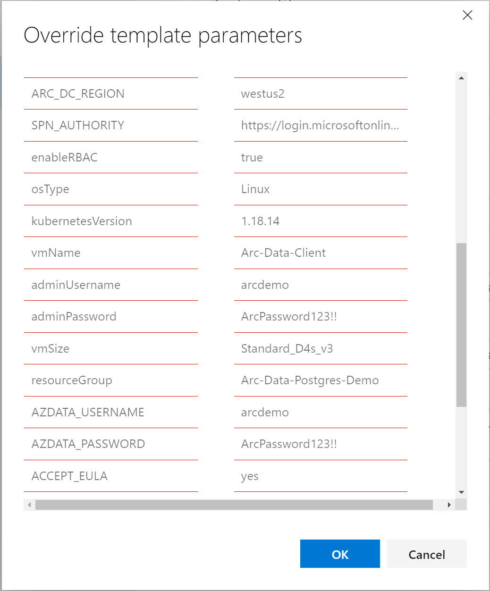

    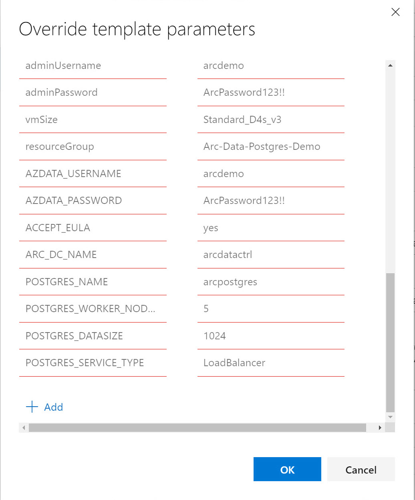

    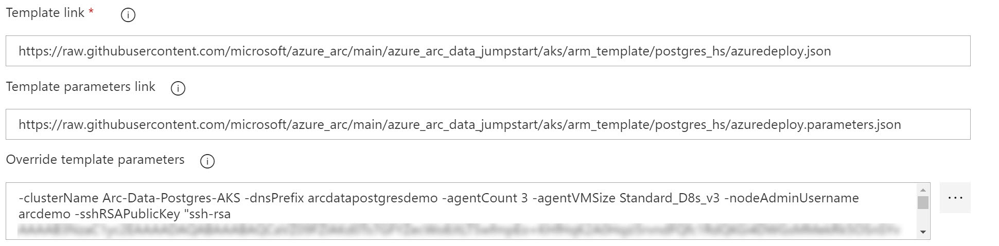

* Provide a deployment name.

    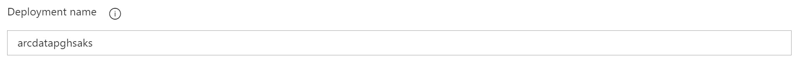

* Click the save button.

    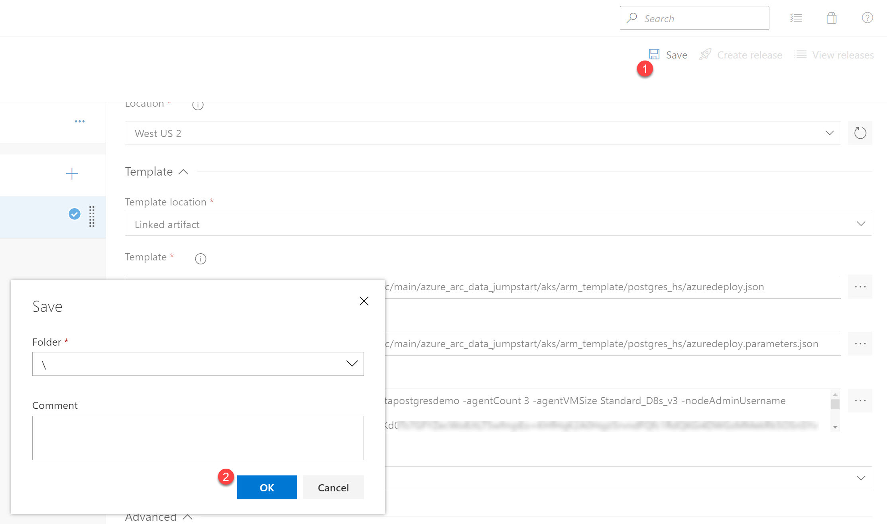

* After saving the task configuration, continue to create the release pipeline.

    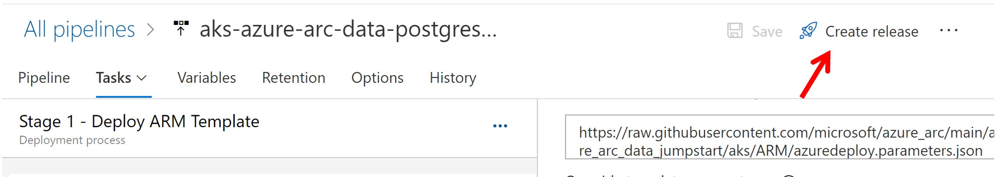

    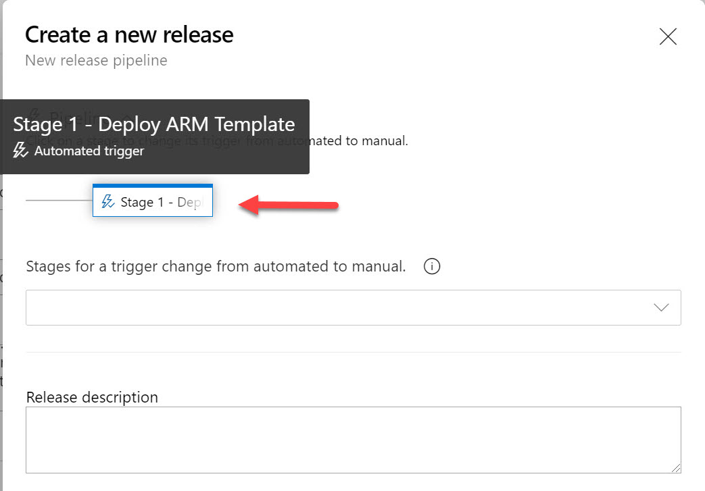

    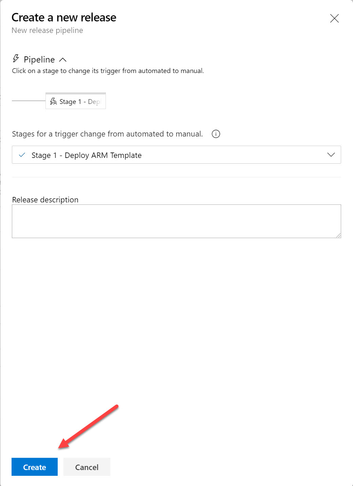

    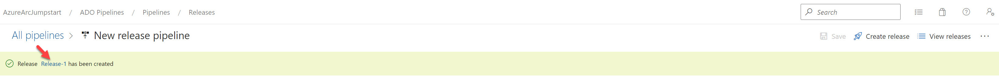

* Once done, click on the new release link. In this scenario, you will perform a manually triggering for the deployment. Once you do, click on the Logs button to see the progress.

    

    

    

    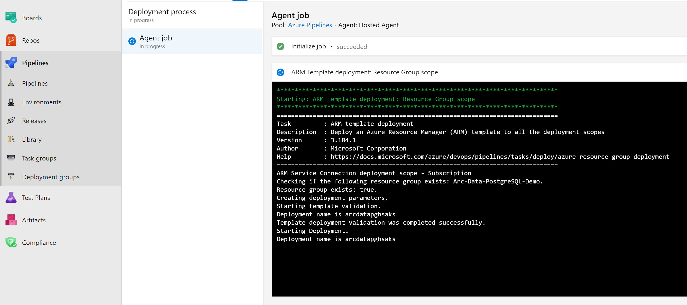

* Once completed, all the deployment resources will be available in the Azure portal.

  > **NOTE: Deployment time of the Azure resources (AKS + Windows VM) can take ~25-30 minutes.**

    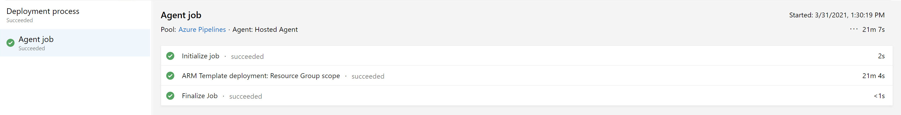

    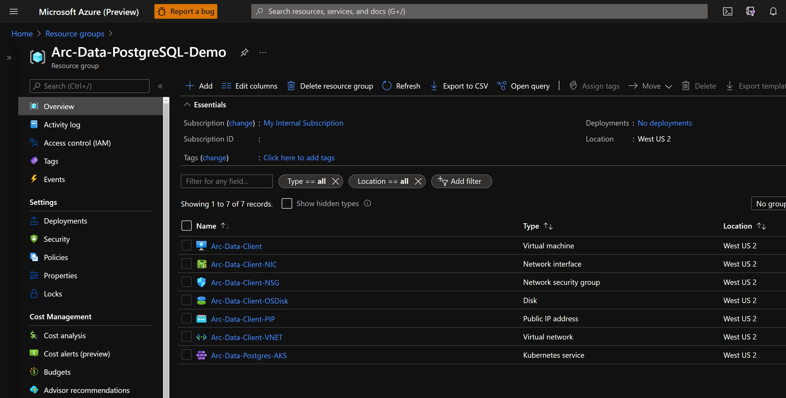

* As mentioned, this scenario is focusing on the Azure DevOps Release pipeline creation. At this point, now that you have the Azure resources created, continue to the next steps as [described on in the main bootstrap scenario](https://azurearcjumpstart.io/azure_arc_jumpstart/azure_arc_data/aks/aks_postgresql_hyperscale_arm_template/#windows-login--post-deployment).
