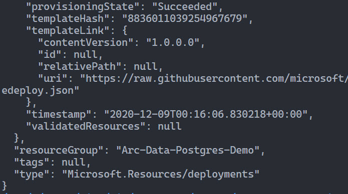
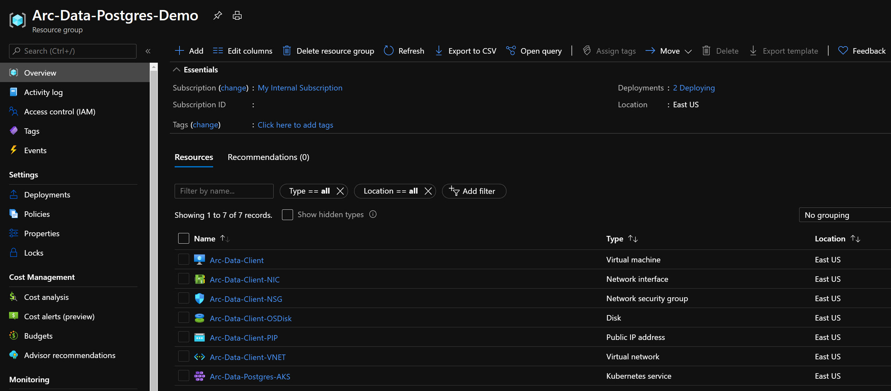
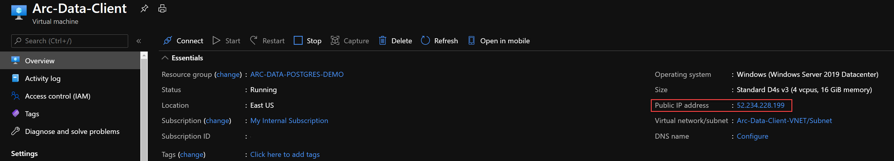
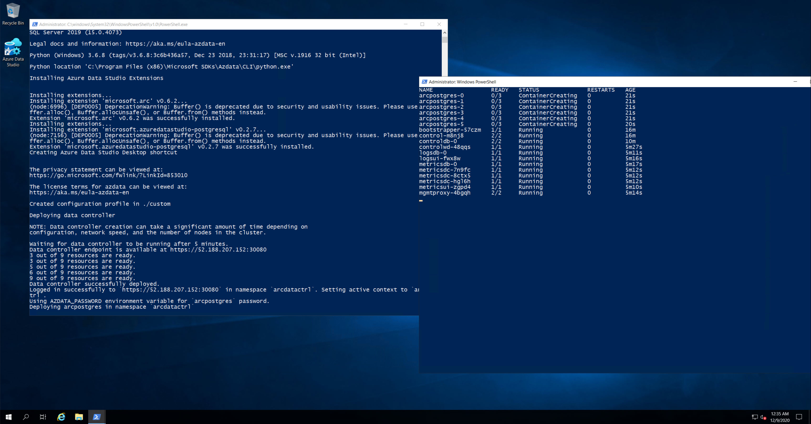
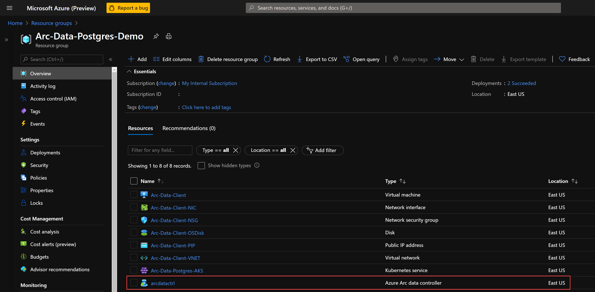
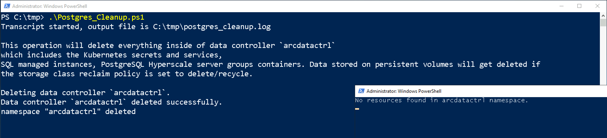
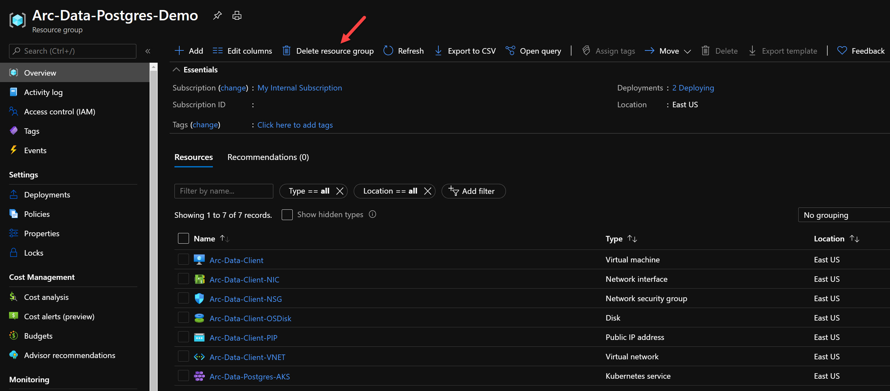

<!-- ---
type: docs
title: "PostgreSQL Hyperscale ARM Template"
linkTitle: "PostgreSQL Hyperscale ARM Template"
weight: 3
description: >
--- -->

## Deploy Azure PostgreSQL Hyperscale on AKS using an ARM Template

The following README will guide you on how to deploy a "Ready to Go" environment so you can start using Azure Arc Data Services with Azure PostgreSQL Hyperscale (Citus) deployed on [Azure Kubernetes Service (AKS)](https://docs.microsoft.com/en-us/azure/aks/intro-kubernetes) cluster, using [Azure ARM Template](https://docs.microsoft.com/en-us/azure/azure-resource-manager/templates/overview).

By the end of this guide, you will have an AKS cluster deployed with an Azure Arc Data Controller, Azure PostgreSQL Hyperscale with a sample database and a Microsoft Windows Server 2019 (Datacenter) Azure VM, installed & pre-configured with all the required tools needed to work with Azure Arc Data Services.

> **Note: Currently, Azure Arc enabled data services is in [public preview](https://docs.microsoft.com/en-us/azure/azure-arc/data/release-notes)**.

## Prerequisites

* Clone the Azure Arc Jumpstart repository

    ```shell
    git clone https://github.com/microsoft/azure_arc.git
    ```

* [Install or update Azure CLI to version 2.15.0 and above](https://docs.microsoft.com/en-us/cli/azure/install-azure-cli?view=azure-cli-latest). Use the below command to check your current installed version.

  ```shell
  az --version
  ```

* [Generate SSH Key](https://docs.microsoft.com/en-us/azure/virtual-machines/linux/create-ssh-keys-detailed) (or use existing ssh key).

* Create Azure service principal (SP)

    To be able to complete the scenario and its related automation, Azure service principal assigned with the “Contributor” role is required. To create it, login to your Azure account run the below command (this can also be done in [Azure Cloud Shell](https://shell.azure.com/)).

    ```shell
    az login
    az ad sp create-for-rbac -n "<Unique SP Name>" --role contributor
    ```

    For example:

    ```shell
    az ad sp create-for-rbac -n "http://AzureArcData" --role contributor
    ```

    Output should look like this:

    ```json
    {
    "appId": "XXXXXXXXXXXXXXXXXXXXXXXXXXXX",
    "displayName": "AzureArcData",
    "name": "http://AzureArcData",
    "password": "XXXXXXXXXXXXXXXXXXXXXXXXXXXX",
    "tenant": "XXXXXXXXXXXXXXXXXXXXXXXXXXXX"
    }
    ```

    > **Note: It is optional, but highly recommended, to scope the SP to a specific [Azure subscription and resource group](https://docs.microsoft.com/en-us/cli/azure/ad/sp?view=azure-cli-latest).**

* Enable subscription for the *Microsoft.AzureArcData* resource provider for Azure Arc enabled data services. Registration is an asynchronous process, and registration may take approximately 10 minutes.

  ```shell
  az provider register --namespace Microsoft.AzureArcData
  ```

  You can monitor the registration process with the following commands:

  ```shell
  az provider show -n Microsoft.AzureArcData -o table
  ```

## Automation Flow

For you to get familiar with the automation and deployment flow, below is an explanation.

* User is editing the ARM template parameters file (1-time edit). These parameters values are being used throughout the deployment.

* Main ARM template will deploy AKS.

* Once AKS deployment has finished, the main ARM template will call a secondary ARM template which is depended on a successful AKS deployment.

* Secondary ARM template will deploy a client Windows Server 2019 VM.

* As part of the Windows Server 2019 VM deployment, there are 2 scripts executions; First script (ClientTools.ps1) at deployment runtime using the ARM *"CustomScriptExtension"* module and a second script (LogonScript.ps1) on user first logon to Windows.

  * Runtime script will:
    * Inject user parameters values (from bullet point #1) to be used in both runtime and logon script
    * Install the required tools – az cli, az cli PowerShell module, kubernetes-cli, Visual C++ Redistributable (Chocolaty packages)
    * Download & install the Azure Data Studio & azdata cli
    * Download the Azure Data Studio Azure Data CLI, Azure Arc & PostgreSQL extensions
    * Download the *Postgres_Cleanup* and *Postgres_Deploy* PowerShell scripts
    * Create the Postgres Connectivity script
    * Create the logon script
    * Create the Windows schedule task to run the logon script at first login
    * Disable Windows Server Manager from running at login

  * Logon script will:
    * Create the *LogonScript.log* file
    * Retrieve the AKS credentials & create the *kubeconfig* file in user Windows profile
    * Create the *azdata* config file in user Windows profile
    * Install the Azure Data Studio Azure Data CLI, Azure Arc & PostgreSQL extensions
    * Create the Azure Data Studio desktop shortcut
    * Open another PowerShell session which will execute the ```kubectl get pods -n <Arc Data Controller namespace> -w``` command
    * Deploy the Arc Data Controller using the user parameters values
    * Deploy Azure Postgres server group **(with 5 workers)** on the AKS cluster
    * Creating Postgres connectivity details using the Postgres Connectivity script
    * Unregister the logon script Windows schedule task so it will not run after first login

## Deployment

As mentioned, this deployment will leverage ARM templates. You will deploy a single template, responsible on deploying AKS. Once AKS deployment has finished, the template will then automatically execute another template which will deploy the Windows Server Azure VM followed by the Azure Arc Data Controller deployment and Azure Postgres on the AKS cluster.

* Before deploying the ARM template, login to Azure using AZ CLI with the ```az login``` command. To determine which AKS Kubernetes versions are available in your region use the below Azure CLI command.

    ```shell
    az aks get-versions -l "<Your Azure Region>"
    ```

* The deployment is using the ARM template parameters file. Before initiating the deployment, edit the [*azuredeploy.parameters.json*](https://github.com/microsoft/azure_arc/blob/main/azure_arc_data_jumpstart/aks/arm_template/postgres_hs/azuredeploy.parameters.json) file located in your local cloned repository folder. An example parameters file is located [here](https://github.com/microsoft/azure_arc/blob/main/azure_arc_data_jumpstart/aks/arm_template/postgres_hs/azuredeploy.parameters.example.json).

  > **Known issue: Currently, Azure Arc enabled data services running on AKS with a [Kubernetes version >=1.19.x is not supported](https://docs.microsoft.com/en-us/azure/azure-arc/data/release-notes#known-issues). This is due to data services cannot be deployed on AKS cluster with availability zones enabled.**

  * *clusterName* - AKS cluster name
  * *dnsPrefix* - AKS unique DNS prefix
  * *nodeAdminUsername* - AKS Node Username
  * *sshRSAPublicKey* - Your ssh public key
  * *SPN_CLIENT_ID* - Your Azure service principal name
  * *SPN_CLIENT_SECRET* - Your Azure service principal password
  * *SPN_TENANT_ID* - Azure tenant ID
  * *ARC_DC_SUBSCRIPTION* - Azure Arc Data Controller Azure subscription ID
  * *ARC_DC_REGION* - Azure location where the Azure Arc Data Controller resource will be created in Azure (Currently, supported regions supported are eastus, eastus2, centralus, westus2, westeurope, southeastasia)  
  * *kubernetesVersion* - AKS Kubernetes Version (See previous prerequisite)
  * *adminUsername* - Client Windows VM admin username
  * *adminPassword* - Client Windows VM admin password
  * *vmSize* - Client Windows VM size
  * *resourceGroup* - Azure resource group where all the resources get deploy
  * *AZDATA_USERNAME* - Azure Arc Data Controller admin username
  * *AZDATA_PASSWORD* - Azure Arc Data Controller admin password (The password must be at least 8 characters long and contain characters from three of the following four sets: uppercase letters, lowercase letters, numbers, and symbols.)
  * *ACCEPT_EULA* - "yes" **Do not change**
  * *ARC_DC_NAME* - Azure Arc Data Controller name. The name must consist of lowercase alphanumeric characters or '-', and must start d end with a alphanumeric character (This name will be used for k8s namespace as well).
  * *POSTGRES_NAME* - PostgreSQL Hyperscale server group name to be deployed on the Kubernetes cluster. Names must be 10 characters or fewer in length and conform to DNS naming conventions.
  * *POSTGRES_WORKER_NODE_COUNT* - PostgreSQL Hyperscale server group number of workers
  * *POSTGRES_DATASIZE* - PostgreSQL Hyperscale size of data volumes in MB (Recommended to use at least 1GB (1024 MB)).*
  * *POSTGRES_SERVICE_TYPE* - Kubernetes service type i.e ClusterIP/LoadBalancer/NodePort. As AKS supports Load Balancers, leave configured with *LoadBalancer*.

* To deploy the ARM template, navigate to the local cloned [deployment folder](https://github.com/microsoft/azure_arc/tree/main/azure_arc_data_jumpstart/aks/arm_template/postgres_hs) and run the below command:

    ```shell
    az group create --name <Name of the Azure resource group> --location <Azure Region>
    az deployment group create \
    --resource-group <Name of the Azure resource group> \
    --name <The name of this deployment> \
    --template-uri https://raw.githubusercontent.com/microsoft/azure_arc/main/azure_arc_data_jumpstart/aks/arm_template/postgres_hs/azuredeploy.json \
    --parameters <The *azuredeploy.parameters.json* parameters file location>
    ```

    > **Note: Make sure that you are using the same Azure resource group name as the one you've just used in the *azuredeploy.parameters.json* file.**

    For example:

    ```shell
    az group create --name Arc-Data-Postgres-Demo --location "East US"
    az deployment group create --resource-group Arc-Data-Postgres-Demo \
    --name arcdatapostgresdemo \
    --template-uri https://raw.githubusercontent.com/microsoft/azure_arc/main/azure_arc_data_jumpstart/aks/arm_template/postgres_hs/azuredeploy.json \
    --parameters azuredeploy.parameters.json
    ```

    > **Note: Deployment time of the Azure resources (AKS + Windows VM) can take ~25-30min long**

* Once Azure resources has been provisioned, you will be able to see it in Azure portal.

    

    

## Windows Login & Post Deployment

Now that both the AKS cluster and the Windows Server client VM are created, it is time to login the Client VM.

* Using it's public IP, RDP to the **Client VM**

    

* At first login, as mentioned in the "Automation Flow" section, a logon script will get executed. This script was created as part of the automated deployment process.

    Let the script to run it's course and **do not close** the PowerShell session, this will be done for you once completed. You will notice that the Azure Arc Data Controller gets deployed on the AKS cluster. **The logon script run time is 10-15min long**.  

    Once the script will finish it's run, the logon script PowerShell session will be closed and the Azure Arc Data Controller and an Azure Postgres Hyperscale (and a sample DB) will be deployed on the AKS cluster and be ready to use.

    

    

    

    

    

  <!-- > **Note: Currently, Azure Arc enabled data services is in [public preview](https://docs.microsoft.com/en-us/azure/azure-arc/data/release-notes) and features are subject to change. As such, the release being used in this scenario does not support the projection of Azure Arc data services resources in the Azure portal**.

    

     -->

* Another tool automatically deployed is Azure Data Studio along with the *Azure Data CLI*, the *Azure Arc* and the *PostgreSQL* extensions. At the end of the logon script run, Azure Data Studio will automatically be open and connected to the Azure PostgreSQL Hyperscale server with the sample DB.

  

  

  

* (Optional) In PowerShell, login to the Data Controller and check it's health using the below commands.

    ```powershell
    azdata login --namespace $env:ARC_DC_NAME
    azdata arc dc status show
    ```

  

## Cleanup

* To delete the Azure Arc Data Controller and all of it's Kubernetes resources as well as Postgres Hyperscale, run the *Postgres_Cleanup.ps1* PowerShell script located in *C:\tmp* on the Windows Client VM. At the end of it's run, the script will close all PowerShell sessions. **The Cleanup script run time is 5-10min long**.

    

* If you want to delete the entire environment, simply delete the deployment resource group from the Azure portal.

    

## Re-Deploy Azure Arc Data Controller & Postgres

In case you deleted the Azure Arc Data Controller and Postgres Hyperscale from the Kubernetes cluster, you can re-deploy it by running the *Postgres_Deploy.ps1* PowerShell script located in *C:\tmp* on the Windows Client VM. **The Deploy script run time is approximately 15min long**.


