## Deploy a vanilla Azure Arc Data Controller in directly connected mode on Cluster API Kubernetes cluster with Azure provider using an ARM Template

The following README will guide you on how to deploy a "Ready to Go" environment so you can start using [Azure Arc-enabled data services](https://docs.microsoft.com/en-us/azure/azure-arc/data/overview) deployed on [Cluster API (CAPI)](https://cluster-api.sigs.k8s.io/introduction.html) Kubernetes cluster and it's [Cluster API Azure provider (CAPZ)](https://cloudblogs.microsoft.com/opensource/2020/12/15/introducing-cluster-api-provider-azure-capz-kubernetes-cluster-management/).

By the end of this guide, you will have a CAPI Kubernetes cluster deployed with an Azure Arc Data Controller and a Microsoft Windows Server 2019 (Datacenter) Azure client VM, installed & pre-configured with all the required tools needed to work with Azure Arc-enabled data services.

> **Note: Currently, Azure Arc-enabled data services with PostgreSQL Hyperscale is in [public preview](https://docs.microsoft.com/en-us/azure/azure-arc/data/release-notes)**.

## Prerequisites

* Clone the Azure Arc Jumpstart repository

    ```shell
    git clone https://github.com/microsoft/azure_arc.git
    ```

* [Install or update Azure CLI to version 2.15.0 and above](https://docs.microsoft.com/en-us/cli/azure/install-azure-cli?view=azure-cli-latest). Use the below command to check your current installed version.

  ```shell
  az --version
  ```

* [Generate SSH Key](https://docs.microsoft.com/en-us/azure/virtual-machines/linux/create-ssh-keys-detailed) (or use existing ssh key).

* Create Azure service principal (SP)

    To be able to complete the scenario and its related automation, Azure service principal assigned with the “Contributor” role is required. To create it, login to your Azure account run the below command (this can also be done in [Azure Cloud Shell](https://shell.azure.com/)).

    ```shell
    az login
    az ad sp create-for-rbac -n "<Unique SP Name>" --role contributor
    ```

    For example:

    ```shell
    az ad sp create-for-rbac -n "http://AzureArcData" --role contributor
    ```

    Output should look like this:

    ```json
    {
    "appId": "XXXXXXXXXXXXXXXXXXXXXXXXXXXX",
    "displayName": "AzureArcData",
    "name": "http://AzureArcData",
    "password": "XXXXXXXXXXXXXXXXXXXXXXXXXXXX",
    "tenant": "XXXXXXXXXXXXXXXXXXXXXXXXXXXX"
    }
    ```

    > **Note: It is optional, but highly recommended, to scope the SP to a specific [Azure subscription](https://docs.microsoft.com/en-us/cli/azure/ad/sp?view=azure-cli-latest).**

* Enable subscription for the *Microsoft.AzureArcData* resource provider for Azure Arc-enabled data services. Registration is an asynchronous process, and registration may take approximately 10 minutes.

  ```shell
  az provider register --namespace Microsoft.AzureArcData
  ```

  You can monitor the registration process with the following commands:

  ```shell
  az provider show -n Microsoft.AzureArcData -o table
  ```

## Architecture (In a nutshell)

From the Cluster API Book docs:

"Cluster API requires an existing Kubernetes cluster accessible via kubectl; during the installation process the Kubernetes cluster will be transformed into a management cluster by installing the Cluster API provider components, so it is recommended to keep it separated from any application workload."

In this guide and as part of the automation flow (described below), a [Rancher K3s](https://rancher.com/docs/k3s/latest/en/) cluster will be deployed which will be used as the management cluster. This cluster will then be used to deploy the workload cluster using the Cluster API Azure provider (CAPZ).

## Automation Flow

For you to get familiar with the automation and deployment flow, below is an explanation.

* User is editing the ARM template parameters file (1-time edit). These parameters values are being used throughout the deployment.

* Main [_azuredeploy_ ARM template](https://github.com/microsoft/azure_arc/blob/main/azure_arc_data_jumpstart/cluster_api/capi_azure/arm_template/azuredeploy.json) will initiate the deployment of the linked ARM templates:

  * [_ubuntuCapi_](https://github.com/microsoft/azure_arc/blob/main/azure_arc_data_jumpstart/cluster_api/capi_azure/arm_template/ubuntuCapi.json) - Deploys an Ubuntu Linux VM which will have Rancher K3s installed and transformed into a Cluster API management cluster via the Azure CAPZ provider.
  * [_clientVm_](https://github.com/microsoft/azure_arc/blob/main/azure_arc_data_jumpstart/cluster_api/capi_azure/arm_template/clientVm.json) - Deploys the client Windows VM. This is where all user interactions with the environment are made from.
  * [_mgmtStagingStorage_](https://github.com/microsoft/azure_arc/blob/main/azure_arc_data_jumpstart/cluster_api/capi_azure/arm_template/mgmtStagingStorage.json) - Used for staging files in automation scripts.
  * [_logAnalytics_](https://github.com/microsoft/azure_arc/blob/main/azure_arc_data_jumpstart/cluster_api/capi_azure/arm_template/logAnalytics.json) - Deploys Azure Log Analytics workspace to support Azure Arc-enabled data services logs uploads.

* User remotes into client Windows VM, which automatically kicks off the [_DataServicesLogonScript_](https://github.com/microsoft/azure_arc/blob/main/azure_arc_data_jumpstart/cluster_api/capi_azure/arm_template/artifacts/DataServicesLogonScript.ps1) PowerShell script that deploy and configure Azure Arc-enabled data services on the CAPI workload cluster including the data controller.

## Deployment

As mentioned, this deployment will leverage ARM templates. You will deploy a single template that will initiate the entire automation for this scenario.

* The deployment is using the ARM template parameters file. Before initiating the deployment, edit the [_azuredeploy.parameters.json_](https://github.com/microsoft/azure_arc/blob/main/azure_arc_data_jumpstart/cluster_api/capi_azure/arm_template/azuredeploy.parameters.json) file located in your local cloned repository folder. An example parameters file is located [here](https://github.com/microsoft/azure_arc/blob/main/azure_arc_data_jumpstart/cluster_api/capi_azure/arm_template/artifacts/azuredeploy.parameters.example.json).

  * *sshRSAPublicKey* - Your SSH public key
  * *spnClientId* - Your Azure service principal id
  * *spnClientSecret* - Your Azure service principal secret
  * *spnTenantId* - Your Azure tenant id
  * *windowsAdminUsername* - Client Windows VM Administrator name
  * *windowsAdminPassword* - Client Windows VM Password. Password must have 3 of the following: 1 lower case character, 1 upper case character, 1 number, and 1 special character. The value must be between 12 and 123 characters long.
  * *myIpAddress* - Your local IP address. This is used to allow remote RDP and SSH connections to the client Windows VM and K3s Rancher VM.
  * *logAnalyticsWorkspaceName* - Unique name for the deployment log analytics workspace.
  * *deploySQLMI* - Boolean that sets whether or not to deploy SQL Managed Instance, for this data controller only scenario we leave it set to _**false**_.
  * *deployPostgreSQL* - Boolean that sets whether or not to deploy PostgreSQL Hyperscale, for this data controller only scenario we leave it set to _**false**_.

* To deploy the ARM template, navigate to the local cloned [deployment folder](https://github.com/microsoft/azure_arc/tree/main/azure_arc_data_jumpstart/cluster_api/capi_azure/arm_template) and run the below command:

    ```shell
    az group create --name <Name of the Azure resource group> --location <Azure Region>
    az deployment group create \
    --resource-group <Name of the Azure resource group> \
    --name <The name of this deployment> \
    --template-uri https://raw.githubusercontent.com/microsoft/azure_arc/main/azure_arc_data_jumpstart/cluster_api/capi_azure/arm_template/azuredeploy.json \
    --parameters <The *azuredeploy.parameters.json* parameters file location>
    ```

    > **Note: Make sure that you are using the same Azure resource group name as the one you've just used in the _azuredeploy.parameters.json_ file**

    For example:

    ```shell
    az group create --name Arc-Data-CAPI --location "East US"
    az deployment group create \
    --resource-group Arc-Data-CAPI \
    --name arcdatademo \
    --template-uri https://raw.githubusercontent.com/microsoft/azure_arc/main/azure_arc_data_jumpstart/cluster_api/capi_azure/arm_template/azuredeploy.json \
    --parameters azuredeploy.parameters.json
    ```

    > **Note: The deployment time for this scenario can take ~15-20min**

* Once Azure resources has been provisioned, you will be able to see it in Azure portal. At this point, the resource group should have **34 various Azure resources** deployed.

    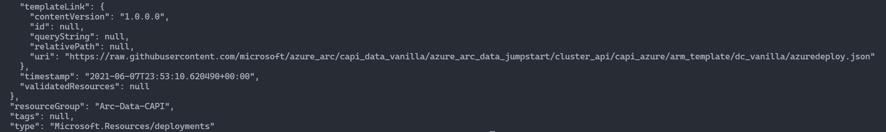

    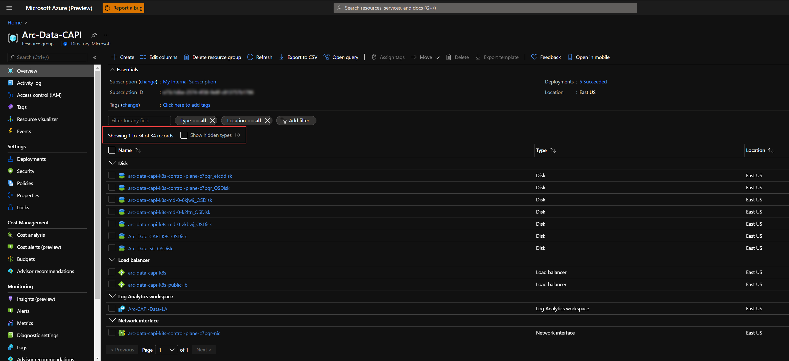

    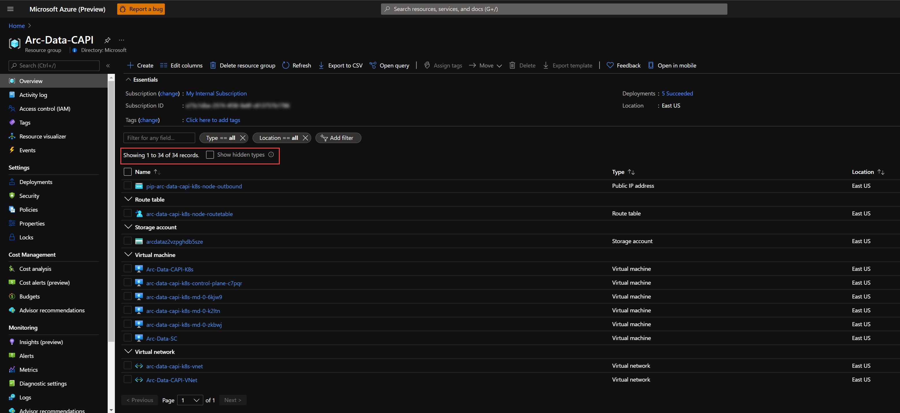

## Windows Login & Post Deployment

* Now that first phase of the automation is completed, it is time to RDP to the client VM using it's public IP.

    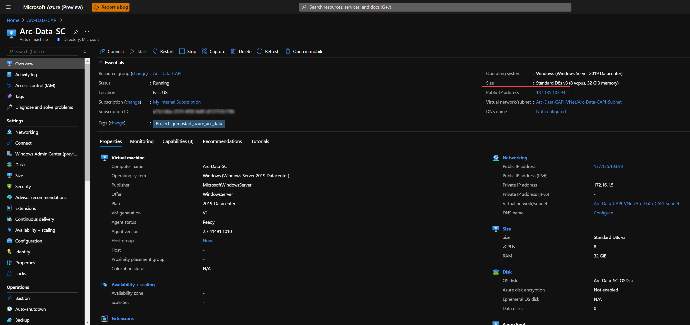

* At first login, as mentioned in the "Automation Flow" section above, the [_DataServicesLogonScript_](https://github.com/microsoft/azure_arc/blob/main/azure_arc_data_jumpstart/cluster_api/capi_azure/arm_template/artifacts/DataServicesLogonScript.ps1) PowerShell logon script will start it's run.

* Let the script to run its course and **do not close** the PowerShell session, this will be done for you once completed. Once the script will finish it's run, the logon script PowerShell session will be closed, the Windows wallpaper will change and the Azure Arc Data Controller will be deployed on the cluster and be ready to use.

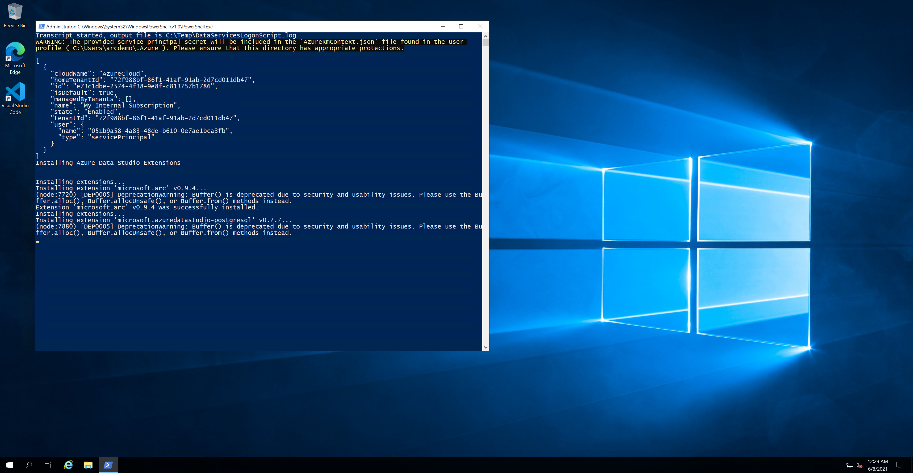


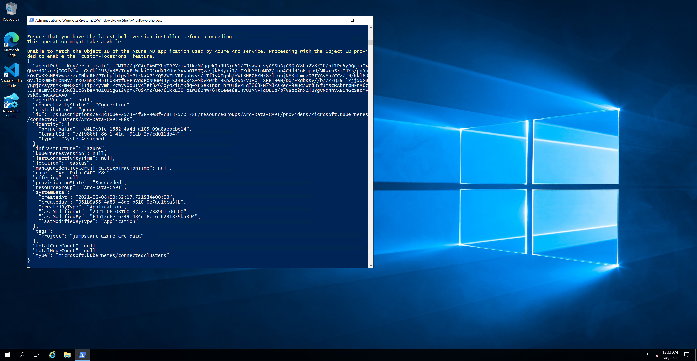

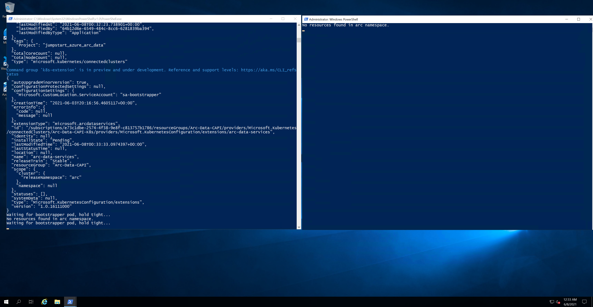


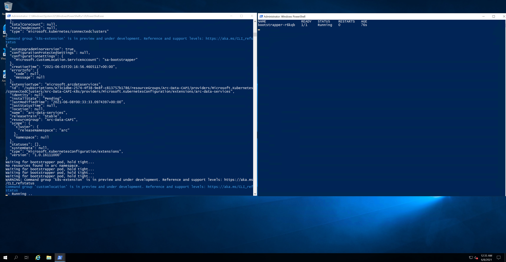

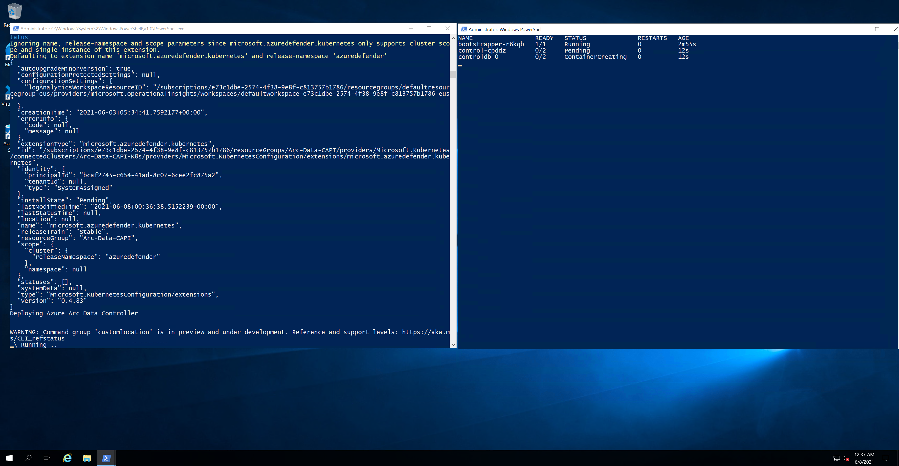

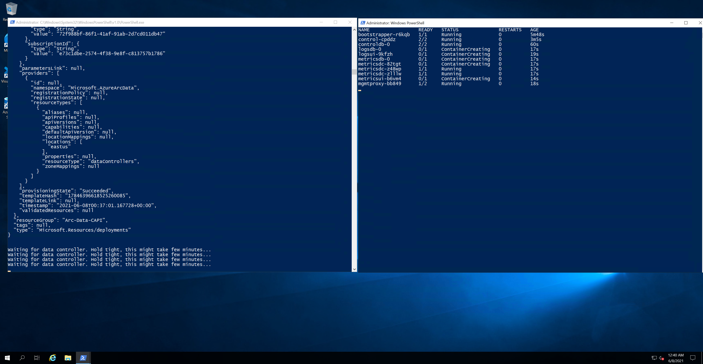


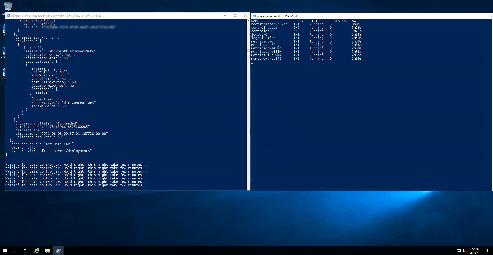


* Since this scenario is deploying the Azure Arc Data Controller, you will also notice additional newly deployed Azure resources in the resources group (at this point you should have **48 various Azure resources" deployed** The important ones to notice are:

  * Azure Arc-enabled Kubernetes cluster - Azure Arc-enabled data services deployed in directly connected are using this type of resource in order to deploy the data services [cluster extension](https://docs.microsoft.com/en-us/azure/azure-arc/kubernetes/conceptual-extensions) as well as for using Azure Arc [Custom locations](https://docs.microsoft.com/en-us/azure/azure-arc/kubernetes/conceptual-custom-locations).

  * Custom location - provides a way for tenant administrators to use their Azure Arc-enabled Kubernetes clusters as target locations for deploying Azure services instances.

  * Azure Arc Data Controller - The data controller that is now deployed on the Kubernetes cluster.

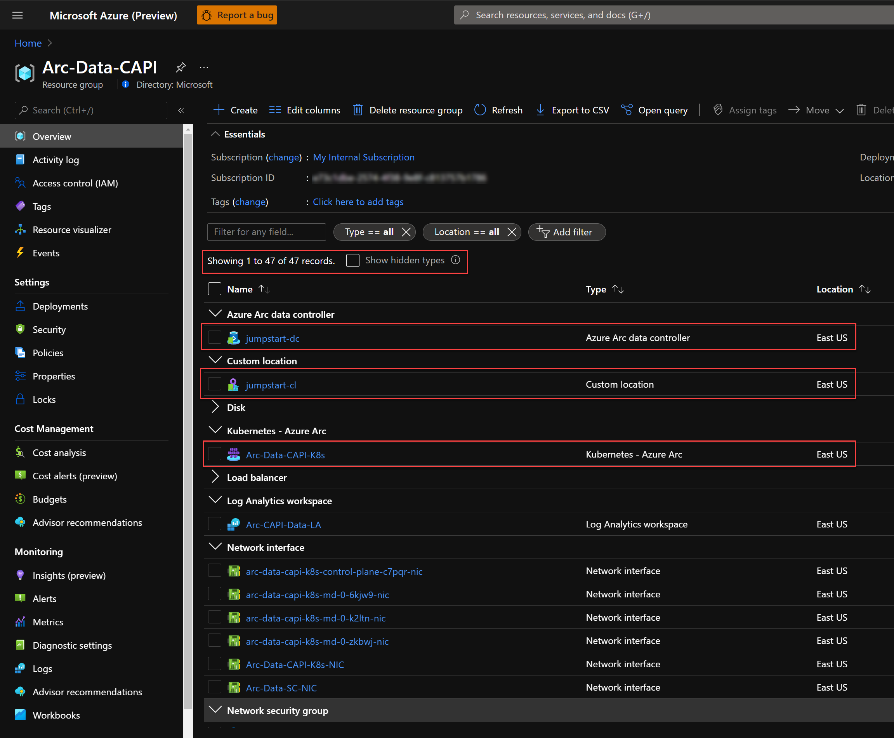

* Another tool automatically deployed is Azure Data Studio along with the *Azure Data CLI*, the *Azure Arc* and the *PostgreSQL* extensions. Using the Desktop shortcut created for you, open Azure Data Studio and click the Extensions settings to see both extensions.

  

## Cluster extensions

In this scenario, three Azure Arc-enabled Kubernetes cluster extensions were deployed:

* _microsoft.azuredefender.kubernetes_ - The Azure Defender cluster extension. To learn more about it, you can check our Jumpstart ["Integrate Azure Defender with Cluster API as an Azure Arc Connected Cluster using Kubernetes extensions"](https://azurearcjumpstart.io/azure_arc_jumpstart/azure_arc_k8s/day2/cluster_api/cluster_api_defender_extension/#create-azure-defender-extensions-instance) scenario.

* _azuremonitor-containers_ - The Azure monitor for containers cluster extension. To learn more about it, you can check our Jumpstart ["Integrate Azure Monitor for Containers with GKE as an Azure Arc Connected Cluster using Kubernetes extensions](https://azurearcjumpstart.io/azure_arc_jumpstart/azure_arc_k8s/day2/gke/gke_monitor_extension/) scenario.

* _arc-data-services_ - The Azure Arc-enabled data services cluster extension that was used throughout this scenario in order to deploy the data services infrastructure.

* In order to view these cluster extensions, click on the Azure Arc-enabled Kubernetes resource Extensions settings.

  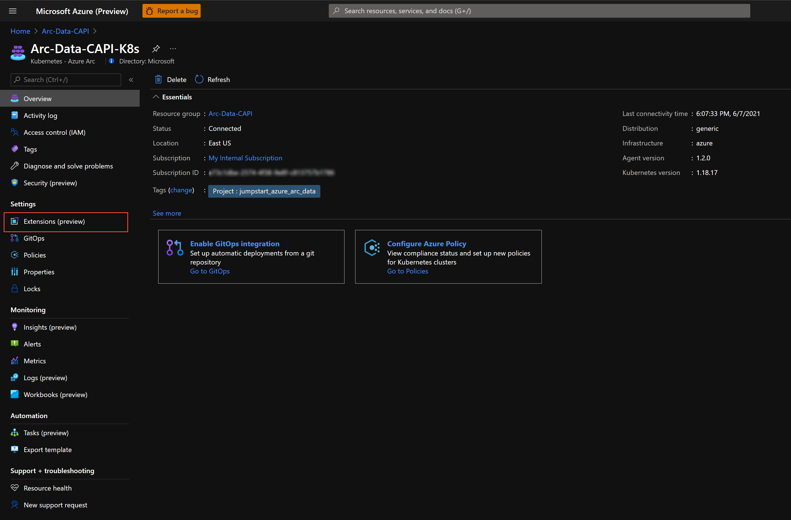

  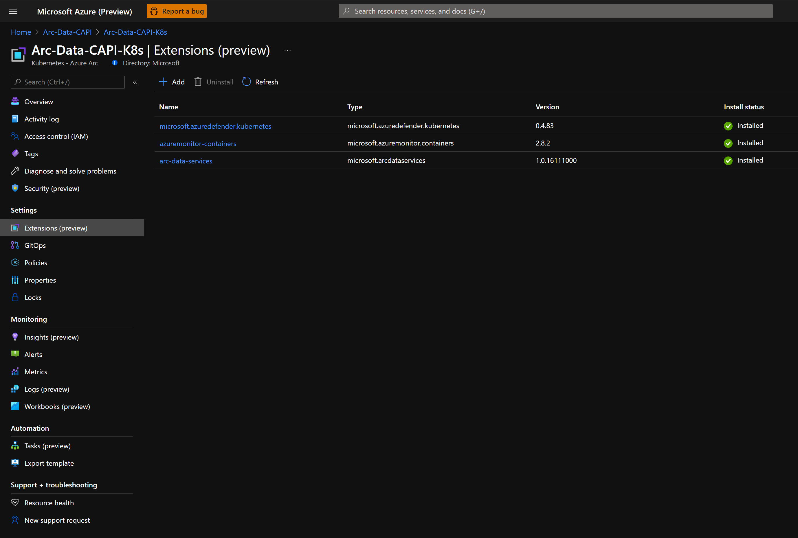

## Cleanup

* If you want to delete the entire environment, simply delete the deployment resource group from the Azure portal.

    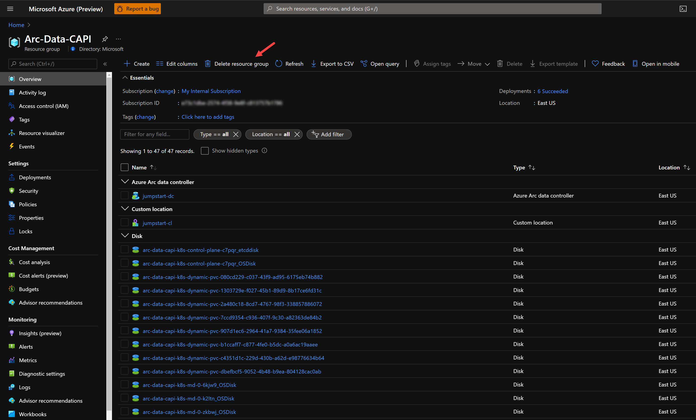

## Known Issues

* Webhook pods go into error state, even after Data Controller/SQL MI/Postgres pods are up, caused by a known Helm-related backend issue that is being worked on. These errors can be safely ignored and do not impact the functionality of Azure Arc-enabled data services and the Jumpstart automation.

    
