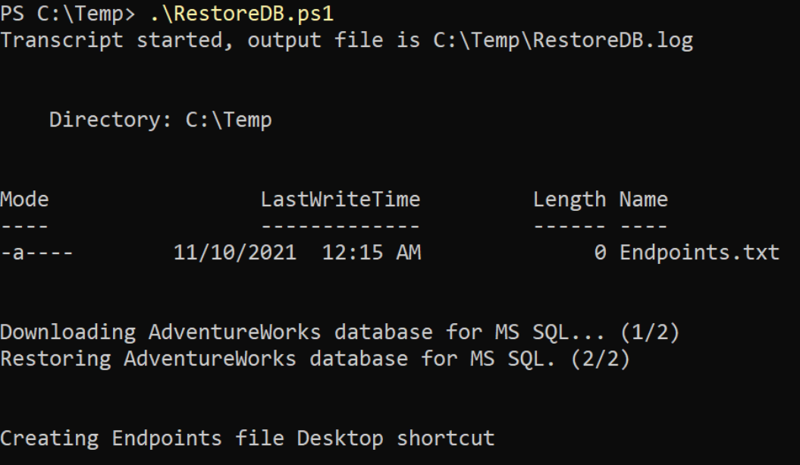
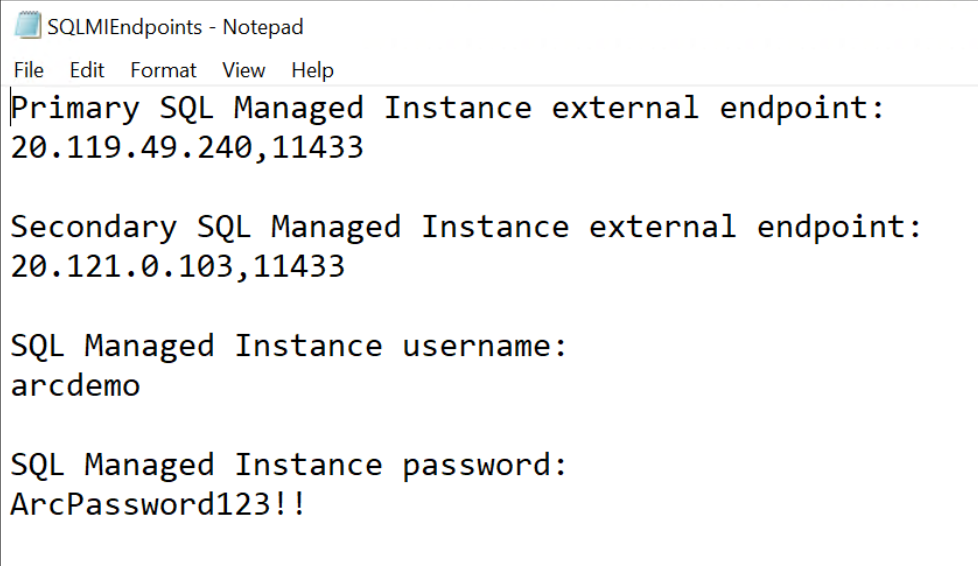
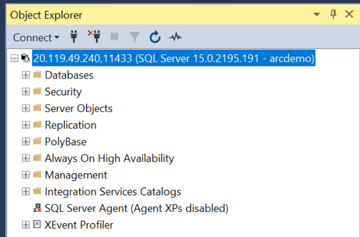
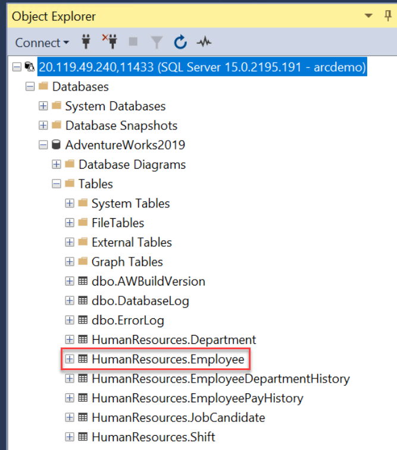
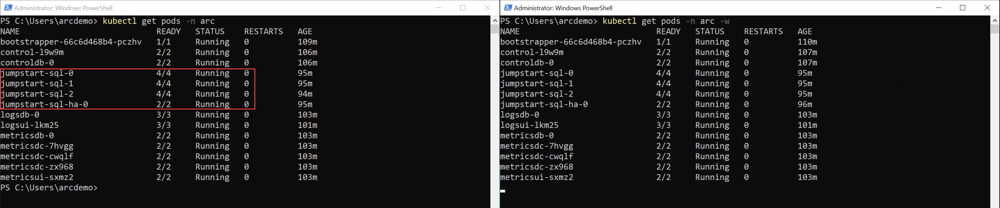

## Perform database failover with SQL Managed Instance Availability Groups

The following README will guide you on how to explore and test Azure Arc-enabled SQL Managed Instance Availability Groups, simulate failures and DB replication. In this scenario, you will be restoring a sample database, will initiate a failover to force HA event as well as validating database replication across multiple SQL nodes in an availability groups.

> **Note: This guide assumes you already deployed a Azure Arc-enabled SQL Managed Instance on Azure Kubernetes Service (AKS). If you haven't, this [following bootstrap Jumpstart scenario](https://azurearcjumpstart.io/azure_arc_jumpstart/azure_arc_data/aks/aks_mssql_mi_arm_template/) offers you a way to do so in an automated fashion. All the steps and operations described in this readme assume you used the mentioned bootstrap Jumpstart scenario and have the Client VM as part of it.**

> **Note: Azure Arc-enabled SQL Managed Instance with Availability Groups is currently in [preview](https://docs.microsoft.com/en-us/azure/azure-arc/data/release-notes)**.

## Deployed Kubernetes Resources

When deploying Azure Arc-enabled SQL Managed Instance in an availability group, multiple Kubernetes resources are created to support it. Below section describes the main ones that are important to understand for this scenario.

### SQL MI Pods Replicas

Three SQL pods replicas will be deployed to assemble the availability group. These can be seen using the _`kubectl get pods -n <deployment namespace> -o wide`_ command, for example _`kubectl get pods -n arc -o wide`_.

It is also important to highlight that Kubernetes will spread the pods across the various nodes in the cluster.

### Services & Endpoints

An external endpoint are automatically provisioned for connecting to databases within the availability group. This endpoint plays the role of the availability group listener.

In an availability group deployment, two endpoints, primary and secondary gets created, both backed by a Kubernetes Service resource with a type of _LoadBalancer_.

- Using the _`az sql mi-arc show -n jumpstart-sql --k8s-namespace arc --use-k8s`_ command, validate the deployment endpoints details and the Availability Group health status.

    

    

    > **Note: Initiating the command will also deploy _az sql_ Azure CLI extension automatically.**

- Using the _`kubectl get svc -n arc`_ command, you will be able to see the _LoadBalancer_ services used by the endpoints.

    

## Database Restore

In order for you test the HA functionality, a database restore _[RestoreDB](https://github.com/microsoft/azure_arc/blob/main/azure_arc_data_jumpstart/aks/arm_template/artifacts/RestoreDB.ps1)_ PowerShell script is provided. The script will restore the _[AdventureWorks2019](https://docs.microsoft.com/en-us/sql/samples/adventureworks-install-configure?view=sql-server-ver15&tabs=ssms)_ sample database directly onto the primary SQL node pod container. From the _C:\Temp_ folder, run the script using the _`.\RestoreDB.ps1`_ command.

## Database Replication

All databases are automatically added to the availability group, including all user (including the _AdventureWorks2019_ database you just restored) and system databases like _master_ and _msdb_. This capability provides a single-system view across the availability group replicas.

- In addition to restoring the _AdventureWorks2019_ database, the script will also create a new text file and a desktop shortcut named _Endpoints_ that includes both the primary and the secondary SQL endpoints.

    

    

- Open Microsoft SQL Server Management Studio (SSMS) which installed automatically for you as part of the [bootstrap Jumpstart scenario](https://azurearcjumpstart.io/azure_arc_jumpstart/azure_arc_data/aks/aks_mssql_mi_arm_template/) and use the primary endpoint IP address and login to the primary DB instance.

    

- Use the username and password you entered when provisioned the environment and select "SQL Server Authentication". Alternatively, you can retrieve the username and password using the _`$env:AZDATA_USERNAME`_ and _`$env:AZDATA_PASSWORD`_ commands.

    

    

    

- Follow the same process and connect to the secondary endpoint.

    

    

- On both endpoints, expend the "Databases" and the "Always On High Availability" sections and see how the _AdventureWorks2019_ database is already automatically replicated and is part of the availability group.

    

- To test that the DB replication is working, a simple table modification is needed. For this example, on the primary replica, expend the "Tables" section for the database, click on "Edit Top 200 Rows", modify one or more records and commit the changes by saving (_`Ctrl+S`_). As you can see, in this example a change was made to _"ken0"_ title and the number of vacation hours for _"rob0"_.

    

    

    

- On the secondary replica, expend the "Tables" section for the database, click on "Select Top 1000 Rows", and in the Results pane see how the table change is now replicated, showing the synchronization of the SQL instances in the availability group works as expected.

    

    

    

## Database Failover

As you already know, the availability group includes three Kubernetes replicas with a primary and two secondaries with all CRUD operations for the availability group are managed internally, including creating the availability group or joining replicas to the availability group created.

- To test that a failover between the replicas, we will simulate a "crash" that will initiate an HA event and will force one of the secondary replicas to get promoted to a primary replica. Open two PowerShell 