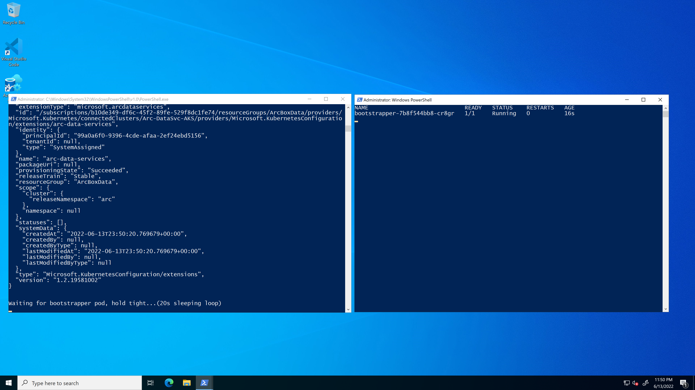

## Deploy Azure SQL Managed Instance with AD authentication support using Customer-managed keytab in directly connected mode on AKS using an ARM Template

The following Jumpstart scenario will guide you on how to deploy a "Ready to Go" environment so you can start using [Azure Arc-enabled data services](https://docs.microsoft.com/azure/azure-arc/data/overview) and [SQL Managed Instance](https://docs.microsoft.com/azure/azure-arc/data/managed-instance-overview) with [Active Directory Authentication](https://docs.microsoft.com/en-us/azure/azure-arc/data/active-directory-introduction) support to access control SQL Managed Instance. This scenario is deployed on [Azure Kubernetes Service (AKS)](https://docs.microsoft.com/azure/aks/intro-kubernetes) cluster using [Azure ARM Template](https://docs.microsoft.com/azure/azure-resource-manager/templates/overview). This scenarios uses [Customer-managed keytab (CMK)](https://docs.microsoft.com/en-us/azure/azure-arc/data/deploy-customer-managed-keytab-active-directory-connector) to support [Active Directory authentication in Arc-enabled SQL Managed Instance](https://docs.microsoft.com/en-us/azure/azure-arc/data/deploy-active-directory-sql-managed-instance?tabs=customer-managed-keytab-mode).

By the end of this scenario, you will have an AKS cluster deployed with an Azure Arc Data Controller, SQL Managed Instance, Microsoft Windows Server 2022 (Datacenter) Azure VM with Active Directory Domain Services and DNS server installed, and a Microsoft Windows Server 2022 (Datacenter) Azure client VM, installed & pre-configured with all the required tools needed to work with Azure Arc-enabled data services.

## Prerequisites

- Clone the Azure Arc Jumpstart repository

    ```shell
    git clone https://github.com/microsoft/azure_arc.git
    ```

- [Install or update Azure CLI to version 2.36.0 and above](https://docs.microsoft.com/cli/azure/install-azure-cli?view=azure-cli-latest). Use the below command to check your current installed version.

  ```shell
  az --version
  ```

- [Generate SSH Key](https://docs.microsoft.com/azure/virtual-machines/linux/create-ssh-keys-detailed) (or use existing ssh key).

- Create Azure service principal (SP). To deploy this scenario, an Azure service principal assigned with multiple RBAC roles is required:

  - "Contributor" - Required for provisioning Azure resources
  - "Security admin" - Required for installing Cloud Defender Azure-Arc enabled Kubernetes extension and dismiss alerts
  - "Security reader" - Required for being able to view Azure-Arc enabled Kubernetes Cloud Defender extension findings
  - "Monitoring Metrics Publisher" - Required for being Azure Arc-enabled data services billing, monitoring metrics, and logs management

    To create it login to your Azure account run the below command (this can also be done in [Azure Cloud Shell](https://shell.azure.com/).

    ```shell
    az login
    subscriptionId=$(az account show --query id --output tsv)
    az ad sp create-for-rbac -n "<Unique SP Name>" --role "Contributor" --scopes /subscriptions/$subscriptionId
    az ad sp create-for-rbac -n "<Unique SP Name>" --role "Security admin" --scopes /subscriptions/$subscriptionId
    az ad sp create-for-rbac -n "<Unique SP Name>" --role "Security reader" --scopes /subscriptions/$subscriptionId
    az ad sp create-for-rbac -n "<Unique SP Name>" --role "Monitoring Metrics Publisher" --scopes /subscriptions/$subscriptionId
    ```

    For example:

    ```shell
    az login
    subscriptionId=$(az account show --query id --output tsv)
    az ad sp create-for-rbac -n "JumpstartArcDataSvc" --role "Contributor" --scopes /subscriptions/$subscriptionId
    az ad sp create-for-rbac -n "JumpstartArcDataSvc" --role "Security admin" --scopes /subscriptions/$subscriptionId
    az ad sp create-for-rbac -n "JumpstartArcDataSvc" --role "Security reader" --scopes /subscriptions/$subscriptionId
    az ad sp create-for-rbac -n "JumpstartArcDataSvc" --role "Monitoring Metrics Publisher" --scopes /subscriptions/$subscriptionId
    ```

    Output should look like this:

    ```json
    {
    "appId": "XXXXXXXXXXXXXXXXXXXXXXXXXXXX",
    "displayName": "JumpstartArcDataSvc",
    "password": "XXXXXXXXXXXXXXXXXXXXXXXXXXXX",
    "tenant": "XXXXXXXXXXXXXXXXXXXXXXXXXXXX"
    }
    ```

    > **NOTE: If you create multiple subsequent role assignments on the same service principal, your client secret (password) will be destroyed and recreated each time. Therefore, make sure you grab the correct password**.

    > **NOTE: The Jumpstart scenarios are designed with as much ease of use in-mind and adhering to security-related best practices whenever possible. It is optional but highly recommended to scope the service principal to a specific [Azure subscription and resource group](https://docs.microsoft.com/cli/azure/ad/sp?view=azure-cli-latest) as well considering using a [less privileged service principal account](https://docs.microsoft.com/azure/role-based-access-control/best-practices)**

## Automation Flow

For you to get familiar with the automation and deployment flow, below is an explanation.

- User is editing the ARM template parameters file (1-time edit). These parameters values are being used throughout the deployment.

- Main [_azuredeploy_ ARM template](https://github.com/microsoft/azure_arc/blob/main/azure_arc_data_jumpstart/aks/ARM/azuredeploy.json) will initiate the deployment of the linked ARM templates:

  - [_VNET_](https://github.com/microsoft/azure_arc/blob/main/azure_arc_data_jumpstart/aks/ARM/VNET.json) - Deploys a Virtual Network with two subnets, one to be used by the Client virtual machine and Active Directory Domain Services VM, and the other to be used by AKS cluster. Assigns DNS servers in the VNet when Active Directory authentication support is enabled in SQL Managed Instance.
  - [_aks_](https://github.com/microsoft/azure_arc/blob/main/azure_arc_data_jumpstart/aks/ARM/aks.json) - Deploys the AKS cluster where all the Azure Arc data services will be deployed.
  - [_addsVm_](https://github.com/microsoft/azure_arc/blob/main/azure_arc_data_jumpstart/aks/ARM/addsVm.json) - Deploys the Active Directory Domain Services Windows VM. This is where all user accounts are created to access SQL Managed Instance using Active Directory  authentication, service account to assign service principal and generate keytab file, and DNS entries for domain controller and SQL Managed Instance name resolution for connectivity.
  - [_clientVm_](https://github.com/microsoft/azure_arc/blob/main/azure_arc_data_jumpstart/aks/ARM/clientVm.json) - Deploys the client Windows VM. This is where all user interactions with the environment are made from.
  - [_logAnalytics_](https://github.com/microsoft/azure_arc/blob/main/azure_arc_data_jumpstart/aks/ARM/logAnalytics.json) - Deploys Azure Log Analytics workspace to support Azure Arc-enabled data services logs uploads.

  - User remotes into the Active Directory domain joined client Windows VM using Active Directory account, which automatically kicks off the [_DataServicesLogonScript_](https://github.com/microsoft/azure_arc/blob/main/azure_arc_data_jumpstart/aks/ARM/artifacts/DataServicesLogonScript.ps1) PowerShell script that deploy and configure Azure Arc-enabled data services on the AKS cluster including the reverse DNS setup, PTR record for domain controller, data controller, SQLMI organization unit (OU), domain user account and keytab file, Active Directory Connector(ADC), and SQL Managed Instance.

  - In addition to deploying the data controller and SQL Managed Instance, the sample [_AdventureWorks_](https://docs.microsoft.com/sql/samples/adventureworks-install-configure?view=sql-server-ver15&tabs=ssms) database is restored, windows account is created in SQL Managed Instance, and sysadmin role is automatically assigned for you as well to connect to database server using Windows Integrated authentication using SQL Server Management Studio(SSMS) or Azure Data Studio.

## Deployment

As mentioned, this deployment will leverage ARM templates. You will deploy a single template that will initiate the entire automation for this scenario.

- The deployment is using the ARM template parameters file. Before initiating the deployment, edit the [_azuredeploy.parameters.json_](https://github.com/microsoft/azure_arc/blob/main/azure_arc_data_jumpstart/aks/ARM/azuredeploy.parameters.json) file located in your local cloned repository folder. An example parameters file is located [here](https://github.com/microsoft/azure_arc/blob/main/azure_arc_data_jumpstart/aks/ARM/artifacts/azuredeploy.parameters.example.json).

  - _`sshRSAPublicKey`_ - Your SSH public key
  - _`spnClientId`_ - Your Azure service principal id
  - _`spnClientSecret`_ - Your Azure service principal secret
  - _`spnTenantId`_ - Your Azure tenant id
  - _`windowsAdminUsername`_ - Client Windows VM Administrator name
  - _`windowsAdminPassword`_ - Client Windows VM Password. Password must have 3 of the following: 1 lower case character, 1 upper case character, 1 number, and 1 special character. The value must be between 12 and 123 characters long.
  - _`myIpAddress`_ - Your local public IP address. This is used to allow remote RDP and SSH connections to the client Windows VM and AKS cluster.
  - _`logAnalyticsWorkspaceName`_ - Unique name for the deployment log analytics workspace.
  - _`deploySQLMI`_ - Boolean that sets whether or not to deploy SQL Managed Instance, for this Azure Arc-enabled SQL Managed Instance scenario we will set it to _**true**_. Use value _**true**_ for this scenario to deploy SQL Managed Instance.
  - _`SQLMIHA`_ - Boolean that sets whether to deploy SQL Managed Instance in high availability mode using Business Critical pricing tier. A value of _**false**_ selects General Purpose pricing tier and a value of _**true**_ selects Business Critical pricing tier. Default value is  _**false**_.
  - _`enableADAuth`_ - Boolean that sets whether or not to deploy Active Directory Domain Services (ADDS) VM, for this Azure Arc-enabled SQL Managed Instance with AD authentication scenario. Default value is _**false**_. Use value _**true**_ for this scenario to deploy Domain Controller VM and support AD authentication in SQL Managed Instance.
  - _`deployPostgreSQL`_ - Boolean that sets whether or not to deploy PostgreSQL, for this scenario. Default value is _**false**_.
  - _`deployBastion`_ - Boolean that sets whether to deploy Azure Bastion or not to connect to the client VM. Default value is _**false**_.
  - _`bastionHostName`_ - Azure Bastion host name. Default value is _**Arc-Data-Demo-Bastion**_.

    > **NOTE: In case you decided to deploy SQL Managed Instance in an highly-available fashion, refer to the ["High Availability"](##-High-Availability-with-Always-On-availability-groups) section in this readme.

- To deploy the ARM template, navigate to the local cloned [deployment folder](https://github.com/microsoft/azure_arc/blob/main/azure_arc_data_jumpstart/aks/ARM) and run the below command:

    ```shell
    az group create --name <Name of the Azure resource group> --location <Azure Region>
    az deployment group create \
    --resource-group <Name of the Azure resource group> \
    --name <The name of this deployment> \
    --template-uri https://raw.githubusercontent.com/microsoft/azure_arc/main/azure_arc_data_jumpstart/aks/ARM/azuredeploy.json \
    --parameters <The *azuredeploy.parameters.json* parameters file location>
    ```

    > **NOTE: Make sure that you are using the same Azure resource group name as the one you've just used in the _`azuredeploy.parameters.json`_ file**

    For example:

    ```shell
    az group create --name Arc-Data-Demo --location "East US"
    az deployment group create \
    --resource-group Arc-Data-Demo \
    --name arcdata \
    --template-uri https://raw.githubusercontent.com/microsoft/azure_arc/main/azure_arc_data_jumpstart/aks/ARM/azuredeploy.json \
    --parameters azuredeploy.parameters.json
    ```

    > **NOTE: The deployment time for this scenario can take ~20-25min**

- Once Azure resources have been provisioned, you will be able to see them in the Azure portal. At this point, the resource group should have **12 various Azure resources** deployed (If you chose to deploy Azure Bastion, you will have **13 Azure resources**).

    

    

## Windows Login & Post Deployment

- Now that the first phase of the automation is completed, it is time to RDP to the client VM. If you have not chosen to deploy Azure Bastion in the ARM template, RDP to the VM using its public IP.

    

- If you have chosen to deploy Azure Bastion in the ARM template, use it to connect to the VM. Please make sure to use User Principal Name of the domain user i.e. **arcdemo@jupstart.local** to login to Client VM through Bastion. Login will fail if using **jumpstart\arcdemo** format. 

    

- At first login to Client VM using Remote Desktop Connection, use **jumpstart\arcdemo** Active Directory user account to login. This user account is the domain administrator and has full privileges to setup AD authentication in SQL Managed Instance. As mentioned in the "Automation Flow" section above, the [_DataServicesLogonScript_](https://github.com/microsoft/azure_arc/blob/main/azure_arc_data_jumpstart/aks/ARM/artifacts/DataServicesLogonScript.ps1) PowerShell logon script will start it's run.

> **NOTE: Using just arcdemo to login Client VM will not start automation script at first login, as this scenario relies on domain credentials to support AD authentication to connect SQL Managed Instance.**

  

- Let the script to run its course and **do not close** the PowerShell session, this will be done for you once completed. Once the script will finish it's run, the logon script PowerShell session will be closed, the Windows wallpaper will change and both the Azure Arc Data Controller and SQL Managed Instance will be deployed on the cluster and be ready to use.

  

  

  

  

  

  

  

  

  

  

  

  
  
  

  

  

- Since this scenario is deploying the Azure Arc Data Controller and SQL Managed Instance, you will also notice additional newly deployed Azure resources in the resources group (at this point you should have **15 various Azure resources deployed**. The important ones to notice are:

  - _Azure Arc-enabled Kubernetes cluster_ - Azure Arc-enabled data services deployed in directly connected are using this type of resource in order to deploy the data services [cluster extension](https://docs.microsoft.com/azure/azure-arc/kubernetes/conceptual-extensions) as well as for using Azure Arc [Custom locations](https://docs.microsoft.com/azure/azure-arc/kubernetes/conceptual-custom-locations).

  - _Custom location_ - provides a way for tenant administrators to use their Azure Arc-enabled Kubernetes clusters as target locations for deploying Azure services instances.

  - _Azure Arc Data Controller_ - The data controller that is now deployed on the Kubernetes cluster.

  > **NOTE: Azure resource will not be created for SQL Managed Instance with AD authentication created in the scenario using YAML. Azure resources are created only when using ARM template or deployed SQL Managed Instance using Azure Portal**.

  

- As part of the automation, SQL Server Management Studio and Azure Data Studio is installed along with the _Azure Data CLI_, _Azure CLI_, _Azure Arc_ and the _PostgreSQL_ extensions. Open Azure Data Studio to connect to SQL Managed Instance using AD authentication.

  > **NOTE: As part of the automation SQL Managed Instance and PostgreSQL database connections are pre-created with SQL endpoints in Azure Data Studio.**

  

  

- As part of the automation, SQL Managed Instance endpoints desktop shortcut is created to view connection information and login to the SQL Managed Instance using Windows authentication. Copy the endpoint information to login to the SQL server.

  

- Open SQL Server Management Studio to connect to SQL Managed Instance using Windows Authentication.

  

- Paste SQL Managed Instance endpoint information copied in the previous step, select Windows Authentication, leave currently selected user, and click Connect.

  

- Notice server connection information, restored default database AdventureWorks2019, and Windows user account created in SQL Server Managed Instance to support AD authentication.

  

## Cleanup

- If you want to delete the entire environment, simply delete the deployment resource group from the Azure portal.

  
