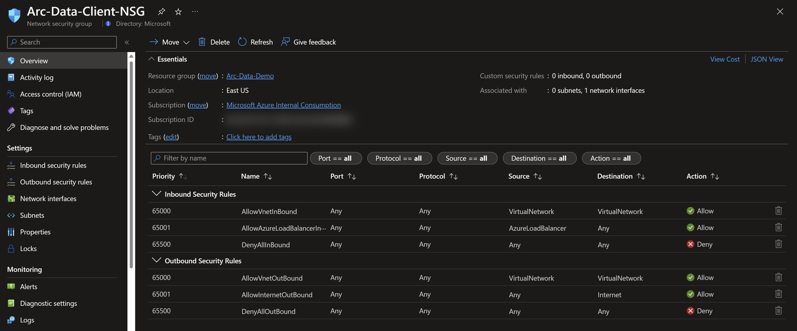
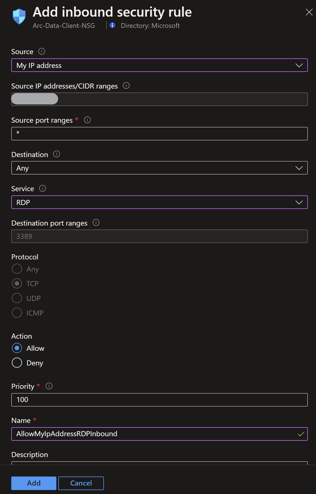
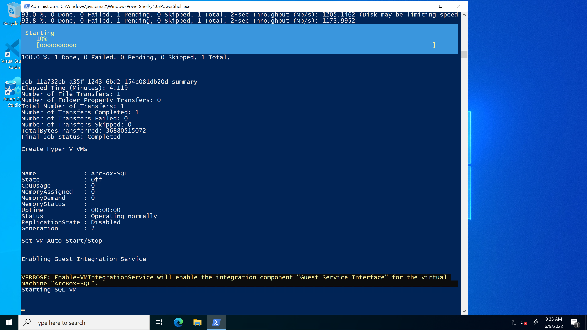
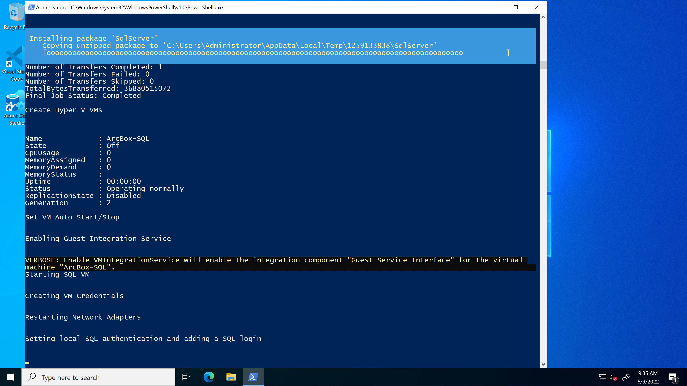
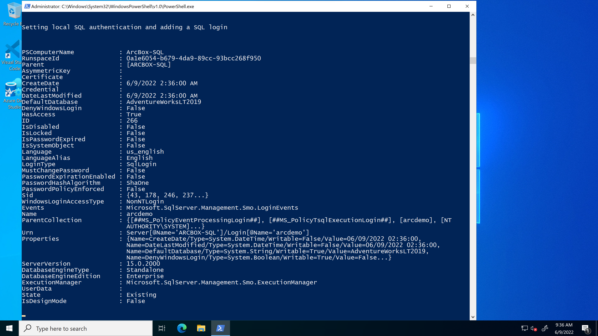
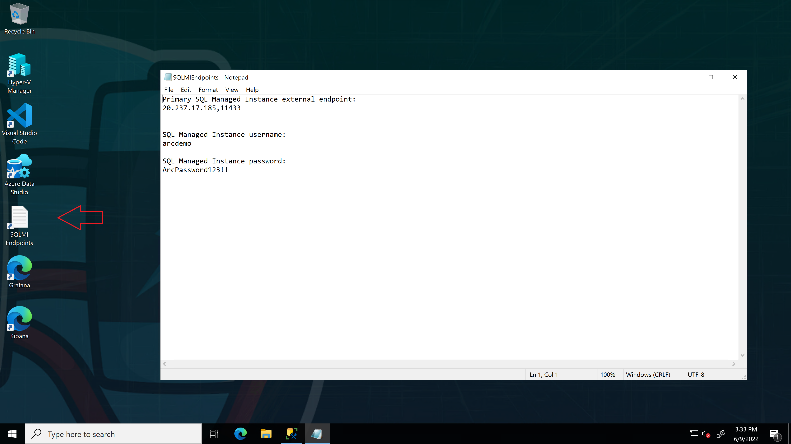
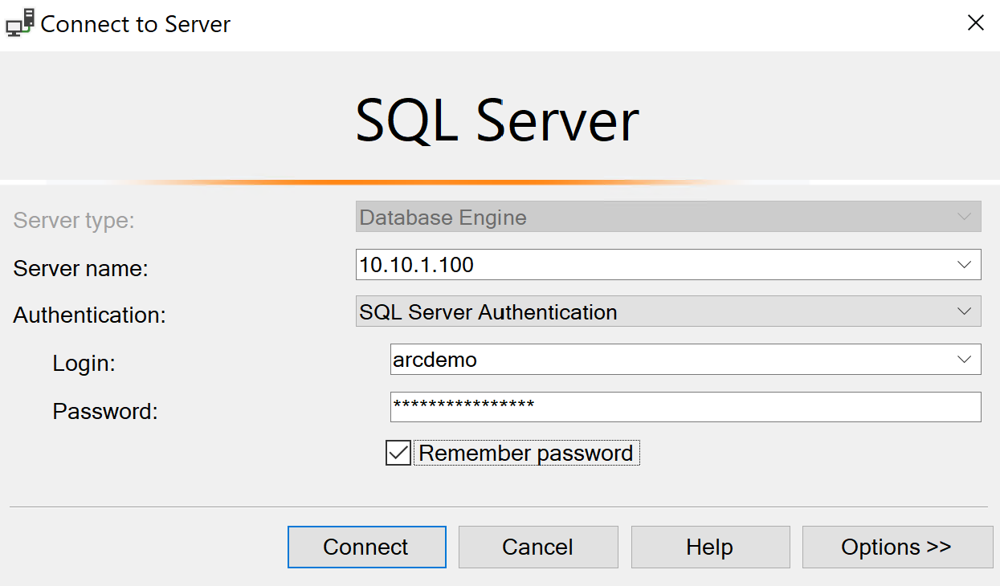

## Migrate to Azure Arc-enabled SQL Managed Instance on AKS using an ARM Template

The following Jumpstart scenario will guide you on how to deploy a "Ready to Go" environment so you can [migrate a SQL database](https://docs.microsoft.com/azure/azure-arc/data/migrate-to-managed-instance) using [Azure Arc-enabled data services](https://docs.microsoft.com/azure/azure-arc/data/overview) and [SQL Managed Instance](https://docs.microsoft.com/azure/azure-arc/data/managed-instance-overview) deployed on [Azure Kubernetes Service (AKS)](https://docs.microsoft.com/azure/aks/dr/intro-kubernetes) cluster using an [Azure ARM Template](https://docs.microsoft.com/azure/azure-resource-manager/templates/overview).

By the end of this scenario, you will have an AKS cluster deployed with an Azure Arc Data Controller, SQL Managed Instance, and a Microsoft Windows Server 2022 (Datacenter) Azure client VM, installed & pre-configured with all the required tools needed to work with Azure Arc-enabled data services. The Azure client VM will host a nested VM with SQL Server installed and configured where you will be migrating the _AdventureWorks_ sample database from:

## Prerequisites

- Clone the Azure Arc Jumpstart repository

    ```shell
    git clone https://github.com/microsoft/azure_arc.git
    ```

- [Install or update Azure CLI to version 2.49.0 and above](https://docs.microsoft.com/cli/azure/install-azure-cli?view=azure-cli-latest). Use the below command to check your current installed version.

  ```shell
  az --version
  ```

- [Generate a new SSH key pair](https://docs.microsoft.com/azure/virtual-machines/linux/create-ssh-keys-detailed) or use an existing one (Windows 10 and above now comes with a built-in ssh client).

  ```shell
  ssh-keygen -t rsa -b 4096
  ```

  To retrieve the SSH public key after it's been created, depending on your environment, use one of the below methods:
  - In Linux, use the `cat ~/.ssh/id_rsa.pub` command.
  - In Windows (CMD/PowerShell), use the SSH public key file that by default, is located in the _`C:\Users\WINUSER/.ssh/id_rsa.pub`_ folder.

  SSH public key example output:

  ```shell
  ssh-rsa o1djFhyNe5NXyYk7XVF7wOBAAABgQDO/QPJ6IZHujkGRhiI+6s1ngK8V4OK+iBAa15GRQqd7scWgQ1RUSFAAKUxHn2TJPx/Z/IU60aUVmAq/OV9w0RMrZhQkGQz8CHRXc28S156VMPxjk/gRtrVZXfoXMr86W1nRnyZdVwojy2++sqZeP/2c5GoeRbv06NfmHTHYKyXdn0lPALC6i3OLilFEnm46Wo+azmxDuxwi66RNr9iBi6WdIn/zv7tdeE34VAutmsgPMpynt1+vCgChbdZR7uxwi66RNr9iPdMR7gjx3W7dikQEo1djFhyNe5rrejrgjerggjkXyYk7XVF7wOk0t8KYdXvLlIyYyUCk1cOD2P48ArqgfRxPIwepgW78znYuwiEDss6g0qrFKBcl8vtiJE5Vog/EIZP04XpmaVKmAWNCCGFJereRKNFIl7QfSj3ZLT2ZXkXaoLoaMhA71ko6bKBuSq0G5YaMq3stCfyVVSlHs7nzhYsX6aDU6LwM/BTO1c= user@pc
  ```

- Create Azure service principal (SP). To deploy this scenario, an Azure service principal assigned with multiple Role-based access control (RBAC) roles is required:

  - "Contributor" - Required for provisioning Azure resources
  - "Security admin" - Required for installing Cloud Defender Azure-Arc enabled Kubernetes extension and dismiss alerts
  - "Security reader" - Required for being able to view Azure-Arc enabled Kubernetes Cloud Defender extension findings
  - "Monitoring Metrics Publisher" - Required for being Azure Arc-enabled data services billing, monitoring metrics, and logs management

    To create it login to your Azure account run the below command (this can also be done in [Azure Cloud Shell](https://shell.azure.com/).

    ```shell
    az login
    subscriptionId=$(az account show --query id --output tsv)
    az ad sp create-for-rbac -n "<Unique SP Name>" --role "Contributor" --scopes /subscriptions/$subscriptionId
    az ad sp create-for-rbac -n "<Unique SP Name>" --role "Security admin" --scopes /subscriptions/$subscriptionId
    az ad sp create-for-rbac -n "<Unique SP Name>" --role "Security reader" --scopes /subscriptions/$subscriptionId
    az ad sp create-for-rbac -n "<Unique SP Name>" --role "Monitoring Metrics Publisher" --scopes /subscriptions/$subscriptionId
    ```

    For example:

    ```shell
    az login
    subscriptionId=$(az account show --query id --output tsv)
    az ad sp create-for-rbac -n "JumpstartArcDataSvc" --role "Contributor" --scopes /subscriptions/$subscriptionId
    az ad sp create-for-rbac -n "JumpstartArcDataSvc" --role "Security admin" --scopes /subscriptions/$subscriptionId
    az ad sp create-for-rbac -n "JumpstartArcDataSvc" --role "Security reader" --scopes /subscriptions/$subscriptionId
    az ad sp create-for-rbac -n "JumpstartArcDataSvc" --role "Monitoring Metrics Publisher" --scopes /subscriptions/$subscriptionId
    ```

    Output should look like this:

    ```json
    {
    "appId": "XXXXXXXXXXXXXXXXXXXXXXXXXXXX",
    "displayName": "JumpstartArcDataSvc",
    "password": "XXXXXXXXXXXXXXXXXXXXXXXXXXXX",
    "tenant": "XXXXXXXXXXXXXXXXXXXXXXXXXXXX"
    }
    ```

    > **NOTE: If you create multiple subsequent role assignments on the same service principal, your client secret (password) will be destroyed and recreated each time. Therefore, make sure you grab the correct password**.

    > **NOTE: The Jumpstart scenarios are designed with as much ease of use in-mind and adhering to security-related best practices whenever possible. It is optional but highly recommended to scope the service principal to a specific [Azure subscription and resource group](https://docs.microsoft.com/cli/azure/ad/sp?view=azure-cli-latest) as well considering using a [less privileged service principal account](https://docs.microsoft.com/azure/role-based-access-control/best-practices)**

## Automation Flow

For you to get familiar with the automation and deployment flow, below is an explanation.

- User is editing the ARM template parameters file (1-time edit). These parameters values are being used throughout the deployment.

- Main [_azuredeploy_ ARM template](https://github.com/microsoft/azure_arc/blob/main/azure_arc_data_jumpstart/aks/Migration/ARM/azuredeploy.json) will initiate the deployment of the linked ARM templates:

  - [_VNET_](https://github.com/microsoft/azure_arc/blob/main/azure_arc_data_jumpstart/aks/Migration/ARM/VNET.json) - Deploys a Virtual Network with a single subnet to be used by the Client virtual machine.
  - [_aks_](https://github.com/microsoft/azure_arc/blob/main/azure_arc_data_jumpstart/aks/Migration/ARM/aks.json) - Deploys the AKS cluster where all the Azure Arc data services will be deployed.
  - [_clientVm_](https://github.com/microsoft/azure_arc/blob/main/azure_arc_data_jumpstart/aks/Migration/ARM/clientVm.json) - Deploys the client Windows VM. This is where all user interactions with the environment are made from.
  - [_logAnalytics_](https://github.com/microsoft/azure_arc/blob/main/azure_arc_data_jumpstart/aks/Migration/ARM/logAnalytics.json) - Deploys Azure Log Analytics workspace to support Azure Arc-enabled data services logs uploads.

  - User remotes into client Windows VM, which automatically kicks off the [_DataServicesLogonScript_](https://github.com/microsoft/azure_arc/blob/main/azure_arc_data_jumpstart/aks/Migration/ARM/artifacts/DataServicesLogonScript.ps1) PowerShell script that deploys and configures Azure Arc-enabled data services on the AKS cluster including the data controller and SQL Managed Instance and a SQL Server instance in a nested VM that will act as the source SQL instance to migrate from.

  - In addition to deploying the data controller and SQL Managed Instance, the sample [_AdventureWorks_](https://docs.microsoft.com/sql/samples/adventureworks-install-configure?view=sql-server-ver15&tabs=ssms) database will restored automatically for you as well on the source SQL instance on the nested VM.

## Deployment

As mentioned, this deployment will leverage ARM templates. You will deploy a single template that will initiate the entire automation for this scenario.

- The deployment is using the ARM template parameters file. Before initiating the deployment, edit the [_azuredeploy.parameters.json_](https://github.com/microsoft/azure_arc/blob/main/azure_arc_data_jumpstart/aks/Migration/ARM/azuredeploy.parameters.json) file located in your local cloned repository folder. An example parameters file is located [here](https://github.com/microsoft/azure_arc/blob/main/azure_arc_data_jumpstart/aks/Migration/ARM/artifacts/azuredeploy.parameters.example.json).

  - _`sshRSAPublicKey`_ - Your SSH public key
  - _`spnClientId`_ - Your Azure service principal id
  - _`spnClientSecret`_ - Your Azure service principal secret
  - _`spnTenantId`_ - Your Azure tenant id
  - _`windowsAdminUsername`_ - Client Windows VM Administrator name
  - _`windowsAdminPassword`_ - Client Windows VM Password. Password must have 3 of the following: 1 lower case character, 1 upper case character, 1 number, and 1 special character. The value must be between 12 and 123 characters long.
  - _`logAnalyticsWorkspaceName`_ - Unique name for the deployment log analytics workspace.
  - _`deploySQLMI`_ - Boolean that sets whether or not to deploy SQL Managed Instance, for this Azure Arc-enabled SQL Managed Instance scenario we will set it to _**true**_.
  - _`SQLMIHA`_ - Boolean that sets whether or not to deploy SQL Managed Instance with high-availability (business continuity) configurations, set this to either _**true**_ or _**false**_.
  - _`deployBastion`_ - Choice (true | false) to deploy Azure Bastion or not to connect to the client VM.
  - _`bastionHostName`_ - Azure Bastion host name.

- To deploy the ARM template, navigate to the local cloned [deployment folder](https://github.com/microsoft/azure_arc/blob/main/azure_arc_data_jumpstart/aks/Migration/ARM) and run the below command:

    ```shell
    az group create --name <Name of the Azure resource group> --location <Azure Region>
    az deployment group create \
    --resource-group <Name of the Azure resource group> \
    --name <The name of this deployment> \
    --template-uri https://raw.githubusercontent.com/microsoft/azure_arc/main/azure_arc_data_jumpstart/aks/Migration/ARM/azuredeploy.json \
    --parameters <The *azuredeploy.parameters.json* parameters file location>
    ```

    > **NOTE: Make sure that you are using the same Azure resource group name as the one you've just used in the _`azuredeploy.parameters.json`_ file**

    For example:

    ```shell
    az group create --name Arc-Data-Demo --location "East US"
    az deployment group create \
    --resource-group Arc-Data-Demo \
    --name arcdata \
    --template-uri https://raw.githubusercontent.com/microsoft/azure_arc/main/azure_arc_data_jumpstart/aks/Migration/ARM/azuredeploy.json \
    --parameters azuredeploy.parameters.json
    ```

    > **NOTE: The deployment time for this scenario can take ~15-20min**

- Once Azure resources have been provisioned, you will be able to see them in the Azure portal. At this point, the resource group should have **8 various Azure resources** deployed (If you chose to deploy Azure Bastion, you will have **9 Azure resources**).

    

    

## Windows Login & Post Deployment

Various options are available to connect to _Arc-Data-Client_ VM, depending on the parameters you supplied during deployment.

- [RDP](https://azurearcjumpstart.io/azure_arc_jumpstart/azure_arc_data/day2/aks/aks_mssql_migrate/#connecting-directly-with-rdp) - available after configuring access to port 3389 on the _Arc-Data-Client-NSG_, or by enabling [Just-in-Time access (JIT)](https://azurearcjumpstart.io/azure_arc_jumpstart/azure_arc_data/day2/aks/aks_mssql_migrate/#connect-using-just-in-time-access-jit).
- [Azure Bastion](https://azurearcjumpstart.io/azure_arc_jumpstart/azure_arc_data/day2/aks/aks_mssql_migrate/#connect-using-azure-bastion) - available if ```true``` was the value of your _`deployBastion`_ parameter during deployment.

### Connecting directly with RDP

By design, port 3389 is not allowed on the network security group. Therefore, you must create an NSG rule to allow inbound 3389.

- Open the _Arc-Data-Client-NSG_ resource in Azure portal and click "Add" to add a new rule.

  

  

- Specify the IP address that you will be connecting from and select RDP as the service with "Allow" set as the action. You can retrieve your public IP address by accessing [https://icanhazip.com](https://icanhazip.com) or [https://whatismyip.com](https://whatismyip.com).

  

  

  

### Connect using Azure Bastion

- If you have chosen to deploy Azure Bastion in your deployment, use it to connect to the VM. Please make sure to use User Principal Name of the domain user i.e. **arcdemo@jupstart.local** to login to Client VM through Bastion. Login will fail if using **jumpstart\arcdemo** format.

  

  > **NOTE: When using Azure Bastion, the desktop background image is not visible. Therefore some screenshots in this guide may not exactly match your experience if you are connecting with Azure Bastion.**

### Connect using just-in-time access (JIT)

If you already have [Microsoft Defender for Cloud](https://docs.microsoft.com/azure/defender-for-cloud/just-in-time-access-usage?tabs=jit-config-asc%2Cjit-request-asc) enabled on your subscription and would like to use JIT to access the Client VM, use the following steps:

- In the Client VM configuration pane, enable just-in-time. This will enable the default settings.

  

  

### Post Deployment

- At first login, as mentioned in the "Automation Flow" section above, the [_DataServicesLogonScript_](https://github.com/microsoft/azure_arc/blob/main/azure_arc_data_jumpstart/aks/Migration/ARM/artifacts/DataServicesLogonScript.ps1) PowerShell logon script will start it's run.

- Let the script to run its course and **do not close** the PowerShell session, this will be done for you once completed. Once the script will finish it's run, the logon script PowerShell session will be closed, the Windows wallpaper will change and both the Azure Arc Data Controller and SQL Managed Instance will be deployed on the cluster and be ready to use.

  

  

  

  

  

  

  

  

  

  

  

  

  

  

  

  

  

  

- Since this scenario is deploying the Azure Arc Data Controller and SQL Managed Instance, you will also notice additional newly deployed Azure resources in the resources group (at this point you should have **12 various Azure resources deployed**. The important ones to notice are:

  - _Azure Arc-enabled Kubernetes cluster_ - Azure Arc-enabled data services deployed in directly connected are using this type of resource in order to deploy the data services [cluster extension](https://docs.microsoft.com/azure/azure-arc/kubernetes/conceptual-extensions) as well as for using Azure Arc [Custom locations](https://docs.microsoft.com/azure/azure-arc/kubernetes/conceptual-custom-locations).

  - _Custom location_ - provides a way for tenant administrators to use their Azure Arc-enabled Kubernetes clusters as target locations for deploying Azure services instances.

  - _Azure Arc Data Controller_ - The data controllers that are now deployed on the Kubernetes clusters.

  - _Azure Arc-enabled SQL Managed Instance_ - The SQL Managed Instances that are now deployed on the Kubernetes clusters.

    

- As part of the automation, Azure Data Studio is installed along with the _Azure Data CLI_, _Azure CLI_, _Azure Arc_ and the _PostgreSQL_ extensions. Using the Desktop shortcut created for you, open Azure Data Studio and click the Extensions settings to see the installed extensions.

  

  

- Additionally, the SQL Managed Instances connection and the SQL instance on the nested VM will be configured automatically for you. As mentioned, the sample _AdventureWorks_ database was restored as part of the automation on the source SQL instance on the client VM.

  

## Cluster extensions

In this scenario, two Azure Arc-enabled Kubernetes cluster extensions were installed:

- _azuremonitor-containers_ - The Azure Monitor Container Insights cluster extension. To learn more about it, you can check our Jumpstart ["Integrate Azure Monitor for Containers with AKS as an Azure Arc Connected Cluster using Kubernetes extensions](https://azurearcjumpstart.io/azure_arc_jumpstart/azure_arc_k8s/day2/aks/aks_monitor/) scenario.

- _arc-data-services_ - The Azure Arc-enabled data services cluster extension that was used throughout this scenario in order to deploy the data services infrastructure.

In order to view these cluster extensions, click on the Azure Arc-enabled Kubernetes resource Extensions settings.


## Operations

### Creating backup of the _AdventureWorks_ database from the source SQL Instance to prepare for migration

- As part of the automation, the script will also create a new text file and a desktop shortcut named "SQLMI Endpoints" that includes the SQL endpoint for the Azure Azure Arc-enabled SQL Managed Instance.

  

- To connect to the source SQL instance on the nested VM, you can find the connection details in the Azure Data Studio.

  

  

- Open Microsoft SQL Server Management Studio (SSMS) which is installed automatically for you as part of the bootstrap Jumpstart scenario and use the primary endpoint IP address for the Azure Arc-enabled SQL Managed Instance and login to the primary DB instance using the username and password provided in the text file mentioned above.

  

- Use the username and password you entered when provisioned the environment and select “SQL Server Authentication”. Alternatively, you can retrieve the username and password using the _`$env:AZDATA_USERNAME`_ and _`$env:AZDATA_PASSWORD`_ commands.

  

- Connect to the source SQL instance as well using the connection details you got from the Azure Data Studio.

  

  

  

- Expand the source SQL instance and navigate to the _AdventureWorks_ database and execute the following query, use the same username and password as the previous step.

  ```Sql
    BACKUP DATABASE AdventureWorksLT2019
    TO DISK = 'C:\temp\AdventureWorksLT2019.bak'
    WITH FORMAT, MEDIANAME = 'AdventureWorksLT2019' ;
    GO
  ```

  

  

- You can perform the same steps to backup the _AdventureWorks_ database from Azure Data Studio.

  

  
### Migrate the _AdventureWorks_ database from the source SQL instance to the Azure Arc-enabled SQL Managed Instance

- To migrate the backup we created, open a new PowerShell ISE session and use the following PowerShell snippet to:
  - Copy the created backup to the client VM from the nested SQL VM
  - Copy the backup to the Azure Arc-enabled SQL Managed Instance pod
  - Initiate the backup restore process

 ```PowerShell
 Set-Location -Path c:\temp
$nestedWindowsUsername = "Administrator"
$nestedWindowsPassword = "ArcDemo123!!"
$secWindowsPassword = ConvertTo-SecureString $nestedWindowsPassword -AsPlainText -Force
$winCreds = New-Object System.Management.Automation.PSCredential ($nestedWindowsUsername, $secWindowsPassword)
$session = New-PSSession -VMName Arcbox-SQL -Credential $winCreds
Copy-Item -FromSession $session -Path C:\temp\AdventureWorksLT2019.bak -Destination C:\Temp\AdventureWorksLT2019.bak
kubectl cp ./AdventureWorksLT2019.bak jumpstart-sql-0:var/opt/mssql/data/AdventureWorksLT2019.bak -n arc -c arc-sqlmi
kubectl exec jumpstart-sql-0 -n arc -c arc-sqlmi -- /opt/mssql-tools/bin/sqlcmd -S localhost -U $Env:AZDATA_USERNAME -P $Env:AZDATA_PASSWORD -Q "RESTORE DATABASE AdventureWorksLT2019 FROM  DISK = N'/var/opt/mssql/data/AdventureWorksLT2019.bak' WITH MOVE 'AdventureWorksLT2012_Data' TO '/var/opt/mssql/data/AdventureWorksLT2012.mdf', MOVE 'AdventureWorksLT2012_Log' TO '/var/opt/mssql/data/AdventureWorksLT2012_log.ldf'"
 ```

  

- Navigate to the Azure Arc-enabled SQL Managed Instance in the Microsoft SQL Server Management Studio (SSMS) and you can see that the _AdventureWorks_ database has been restored successfully.

  

- You can also see the migrated database on Azure Data Studio.

  

## Cleanup

- If you want to delete the entire environment, simply delete the deployment resource group from the Azure portal.

    
