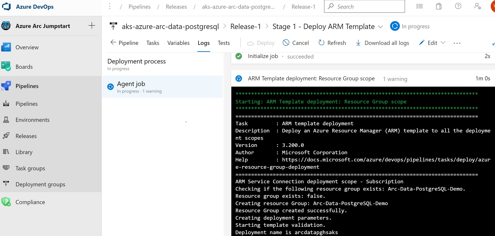

## Deploy Azure PostgreSQL on AKS using Azure DevOps Release Pipeline

The following Jumpstart scenario will guide you on how to use [Azure DevOps (ADO) Release pipelines](https://docs.microsoft.com/azure/devops/pipelines/release/?view=azure-devops) to deploy a "Ready to Go" environment so you can start using Azure Arc-enabled data services with Azure PostgreSQL on [Azure Kubernetes Service (AKS)](https://docs.microsoft.com/azure/aks/intro-kubernetes) cluster using [Azure ARM Template](https://docs.microsoft.com/azure/azure-resource-manager/templates/overview).

By the end of this scenario, you will have an Azure DevOps Release pipeline to deploy AKS cluster with an Azure Arc Data Controller ([in "Directly Connected" mode](https://docs.microsoft.com/azure/azure-arc/data/connectivity), Azure PostgreSQL with a sample database and a Microsoft Windows Server 2022 (Datacenter) Azure VM, installed & pre-configured with all the required tools needed to work with Azure Arc Data Services.

> **NOTE: Currently, Azure Arc-enabled data services with PostgreSQL is in [public preview](https://docs.microsoft.com/azure/azure-arc/data/release-notes)**.

> **NOTE: The following scenario is focusing the Azure DevOps Release pipeline creation. Once the pipeline has been created and the environment deployment has finished, the automation flow and next steps are as [described on in the main bootstrap scenario](https://azurearcjumpstart.io/azure_arc_jumpstart/azure_arc_data/aks/aks_postgresql_arm_template/)**

## Prerequisites

- [Azure DevOps account](https://azure.microsoft.com/services/devops/) set up with your organization and ready for project creation.
  - (Optional) [Create new Azure DevOps organization](https://docs.microsoft.com/azure/devops/organizations/accounts/create-organization?view=azure-devops).
  - (Optional) [Create new Azure DevOps project](https://docs.microsoft.com/azure/devops/organizations/projects/create-project?view=azure-devops&tabs=preview-page).

- [Install or update Azure CLI to version 2.49.0 and above](https://docs.microsoft.com/cli/azure/install-azure-cli?view=azure-cli-latest). Use the below command to check your current installed version.

  ```shell
  az --version
  ```

- [Generate a new SSH key pair](https://docs.microsoft.com/azure/virtual-machines/linux/create-ssh-keys-detailed) or use an existing one (Windows 10 and above now comes with a built-in ssh client).

  ```shell
  ssh-keygen -t rsa -b 4096
  ```

  To retrieve the SSH public key after it's been created, depending on your environment, use one of the below methods:
  - In Linux, use the `cat ~/.ssh/id_rsa.pub` command.
  - In Windows (CMD/PowerShell), use the SSH public key file that by default, is located in the _`C:\Users\WINUSER/.ssh/id_rsa.pub`_ folder.

  SSH public key example output:

  ```shell
  ssh-rsa o1djFhyNe5NXyYk7XVF7wOBAAABgQDO/QPJ6IZHujkGRhiI+6s1ngK8V4OK+iBAa15GRQqd7scWgQ1RUSFAAKUxHn2TJPx/Z/IU60aUVmAq/OV9w0RMrZhQkGQz8CHRXc28S156VMPxjk/gRtrVZXfoXMr86W1nRnyZdVwojy2++sqZeP/2c5GoeRbv06NfmHTHYKyXdn0lPALC6i3OLilFEnm46Wo+azmxDuxwi66RNr9iBi6WdIn/zv7tdeE34VAutmsgPMpynt1+vCgChbdZR7uxwi66RNr9iPdMR7gjx3W7dikQEo1djFhyNe5rrejrgjerggjkXyYk7XVF7wOk0t8KYdXvLlIyYyUCk1cOD2P48ArqgfRxPIwepgW78znYuwiEDss6g0qrFKBcl8vtiJE5Vog/EIZP04XpmaVKmAWNCCGFJereRKNFIl7QfSj3ZLT2ZXkXaoLoaMhA71ko6bKBuSq0G5YaMq3stCfyVVSlHs7nzhYsX6aDU6LwM/BTO1c= user@pc
  ```

- Create Azure service principal (SP)

    To be able to complete the scenario and its related automation, Azure service principal assigned with the “Contributor” role is required. To create it, login to your Azure account run the below command (this can also be done in [Azure Cloud Shell](https://shell.azure.com/)).

    ```shell
    az login
    subscriptionId=$(az account show --query id --output tsv)
    az ad sp create-for-rbac -n "<Unique SP Name>" --role "Contributor" --scopes /subscriptions/$subscriptionId
    az ad sp create-for-rbac -n "<Unique SP Name>" --role "Security admin" --scopes /subscriptions/$subscriptionId
    az ad sp create-for-rbac -n "<Unique SP Name>" --role "Security reader" --scopes /subscriptions/$subscriptionId
    az ad sp create-for-rbac -n "<Unique SP Name>" --role "Monitoring Metrics Publisher" --scopes /subscriptions/$subscriptionId
    ```

    For example:

    ```shell
    az login
    subscriptionId=$(az account show --query id --output tsv)
    az ad sp create-for-rbac -n "JumpstartArcDataSvc" --role "Contributor" --scopes /subscriptions/$subscriptionId
    az ad sp create-for-rbac -n "JumpstartArcDataSvc" --role "Security admin" --scopes /subscriptions/$subscriptionId
    az ad sp create-for-rbac -n "JumpstartArcDataSvc" --role "Security reader" --scopes /subscriptions/$subscriptionId
    az ad sp create-for-rbac -n "JumpstartArcDataSvc" --role "Monitoring Metrics Publisher" --scopes /subscriptions/$subscriptionId
    ```

    Output should look like this:

    ```json
    {
    "appId": "XXXXXXXXXXXXXXXXXXXXXXXXXXXX",
    "displayName": "JumpstartArcDataSvc",
    "password": "XXXXXXXXXXXXXXXXXXXXXXXXXXXX",
    "tenant": "XXXXXXXXXXXXXXXXXXXXXXXXXXXX"
    }
    ```

    > **NOTE: If you create multiple subsequent role assignments on the same service principal, your client secret (password) will be destroyed and recreated each time. Therefore, make sure you grab the correct password**.

    > **NOTE: The Jumpstart scenarios are designed with as much ease of use in-mind and adhering to security-related best practices whenever possible. It is optional but highly recommended to scope the service principal to a specific [Azure subscription and resource group](https://docs.microsoft.com/cli/azure/ad/sp?view=azure-cli-latest) as well considering using a [less privileged service principal account](https://docs.microsoft.com/azure/role-based-access-control/best-practices)**

## Deployment

In this scenario, you will create a new Release pipeline to deploy the environment ARM template for this Jumpstart scenario.

- In a new or an existing ADO project, start the process of creating a new release pipeline.

    

    

- To create the pipeline, we will be using an empty job template and give it a name (once done click the X button).

    

    

- Create a new task for the stage you have just created. This task will be the one for deploying the ARM template.

    

    

- Click on the new task to start it's configuration.

    

- When deploying an ARM template, the Azure Resource Manager connection and subscription must be provided.

    

  > **NOTE: For new ADO project, you will be asked to click the authorization button**

    

- Provide the Azure resource group and location where all the resources will be deployed. Make sure to validate if the service is [currently available in your Azure region](https://azure.microsoft.com/global-infrastructure/services/?products=azure-arc).

    

- As mentioned, the task will deployed the existing ARM template for deploying Azure Arc-enabled data services with PostgreSQL that in the Azure Arc Jumpstart GitHub repository.

  - Change the Template location to "URL of the file"

  - Copy the raw URLs for both the [template](https://raw.githubusercontent.com/microsoft/azure_arc/main/azure_arc_data_jumpstart/aks/arm_template/postgres_hs/azuredeploy.json) and the [parameters](https://raw.githubusercontent.com/microsoft/azure_arc/main/azure_arc_data_jumpstart/aks/arm_template/postgres_hs/azuredeploy.parameters.json) json files and paste it in it's the proper field.

  - The deployment ARM template requires you provide parameters values. Click on the _Edit Override template parameters_ to add your parameters values.

    

  - _`sshRSAPublicKey`_ - Your ssh public key
  - _`spnClientId`_ - Your Azure service principal name
  - _`spnClientSecret`_ - Your Azure service principal password
  - _`spnTenantId`_ - Your Azure tenant ID
  - _`windowsAdminUsername`_ - Client Windows VM admin username
  - _`windowsAdminPassword`_ - Client Windows VM admin password
  - _`myIpAddress`_ - Public IP address of your network
  - _`logAnalyticsWorkspaceName`_ - Unique Log Analytics workspace name
  - _`deploySQLMI`_ - SQL Managed Instance deployment (true/false)
  - _`SQLMIHA`_ - SQL Managed Instance high-availability deployment (true/false)
  - _`deployPostgreSQL`_ - PostgreSQL deployment (true/false)
  - _`clusterName`_ - AKS cluster name
  - _`bastionHostName`_ - Indicate whether to deploy bastion host to manage AKS
  - _`dnsPrefix`_ - AKS unique DNS prefix
  - _`kubernetesVersion`_ - AKS Kubernetes Version (See previous prerequisite)

    > **NOTE: Make sure that you are using the same Azure resource group name as the one you've just used in the _`azuredeploy.parameters.json`_ file**

    

    

    

    

- Provide a deployment name.

    

- Click the save button.

    

- After saving the task configuration, continue to create the release pipeline.

    

    

    

    

- Once done, click on the new release link. In this scenario, you will perform a manually triggering for the deployment. Once you do, click on the Logs button to see the progress.

    

    

    

    

- Once completed, all the deployment resources will be available in the Azure portal.

  > **NOTE: Deployment time of the Azure resources (AKS + Windows VM) can take ~25-30 minutes.**

    

    

- As mentioned, this scenario is focusing on the Azure DevOps Release pipeline creation. At this point, now that you have the Azure resources created, continue to the next steps as [described on in the main bootstrap scenario](https://azurearcjumpstart.io/azure_arc_jumpstart/azure_arc_data/aks/aks_postgresql_arm_template/#windows-login--post-deployment).
