## Perform database failover with SQL Managed Instance Availability Groups

The following README will guide you on how to explore and test Azure Arc-enabled SQL Managed Instance Availability Groups, simulate failures and DB replication. In this scenario, you will be restoring a sample database, will initiate a failover to force HA event as well as validating database replication across multiple SQL nodes in an availability group.

> **Note: This guide assumes you already deployed an Azure Arc-enabled SQL Managed Instance on Cluster API (CAPI) cluster using the Cluster API Azure Provider (CAPZ). If you haven't, the [following bootstrap Jumpstart scenario](https://azurearcjumpstart.io/azure_arc_jumpstart/azure_arc_data/cluster_api/capi_azure/arm_template/mssql_mi/) offers you a way to do so in an automated fashion. All the steps and operations described in this readme assume you used the mentioned bootstrap Jumpstart scenario and have the Client VM deployed as part of it.**

> **Note: Azure Arc-enabled SQL Managed Instance with Availability Groups is currently in [preview](https://docs.microsoft.com/en-us/azure/azure-arc/data/release-notes)**.

## Deployed Kubernetes Resources

When deploying Azure Arc-enabled SQL Managed Instance in an availability group, multiple Kubernetes resources are created to support it. The below section describes the main ones that are important to understand for this scenario.

### SQL MI Pods Replicas

Three SQL pods replicas will be deployed to assemble the availability group. These can be seen using the _`kubectl get pods -n <deployment namespace> -o wide`_ command, for example, _`kubectl get pods -n arc -o wide`_. It is also important to highlight that Kubernetes will spread the pods across the various nodes in the cluster.

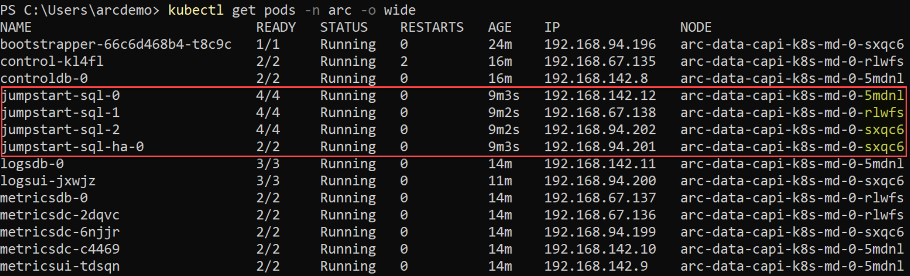

### Services & Endpoints

An external endpoint is automatically provisioned for connecting to databases within the availability group. This endpoint plays the role of the availability group listener.

In an availability group deployment, two endpoints, primary and secondary get created, both backed by a Kubernetes Service resource with a type of _LoadBalancer_.

- Using the _`az sql mi-arc show -n jumpstart-sql --k8s-namespace arc --use-k8s`_ command, validate the deployment endpoints details and the Availability Group health status.

    

    

    > **Note: Initiating the command will also deploy _az sql_ Azure CLI extension automatically.**

- Using the _`kubectl get svc -n arc`_ command, you will be able to see the _LoadBalancer_ services used by the endpoints.

    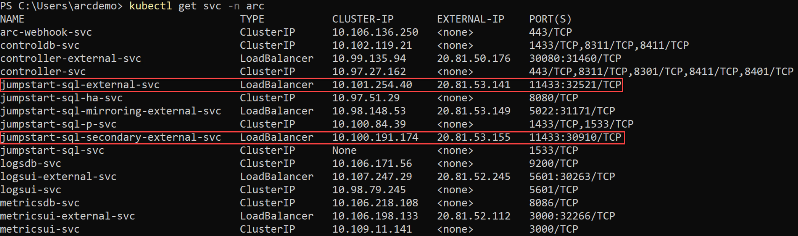

## Database Restore

In order for you to test the HA functionality and as part of the bootstrap Jumpstart scenario, the [AdventureWorks2019](https://docs.microsoft.com/en-us/sql/samples/adventureworks-install-configure?view=sql-server-ver15&tabs=ssms)_ sample database was directly restored onto the primary SQL node pod container.

## Database Replication

All databases are automatically added to the availability group, including all users (including the _AdventureWorks2019_ database you just restored) and system databases like _master_ and _msdb_. This capability provides a single-system view across the availability group replicas.

To retrieve the SQL Managed Instance endpoints, a desktop shortcut for a _SQLMI Endpoints_ text file is automatically created for you that includes both the primary and the secondary SQL endpoints.

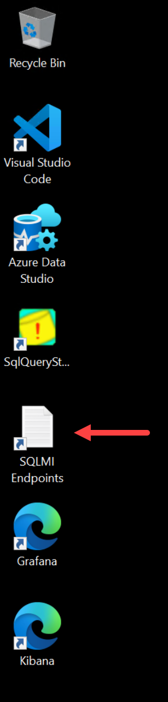

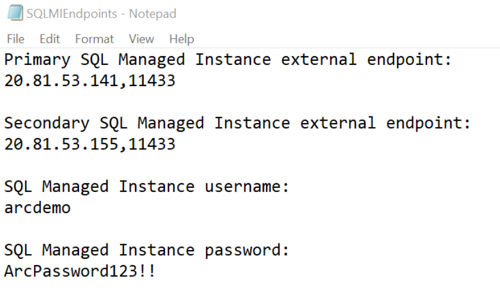

- Open Microsoft SQL Server Management Studio (SSMS) which is installed automatically for you as part of the [bootstrap Jumpstart scenario](https://azurearcjumpstart.io/azure_arc_jumpstart/azure_arc_data/day2/cluster_api/capi_azure/capi_mssql_ha/) and use the primary endpoint IP address and login to the primary DB instance using the username and password provided in the text file mentioned above.

    

    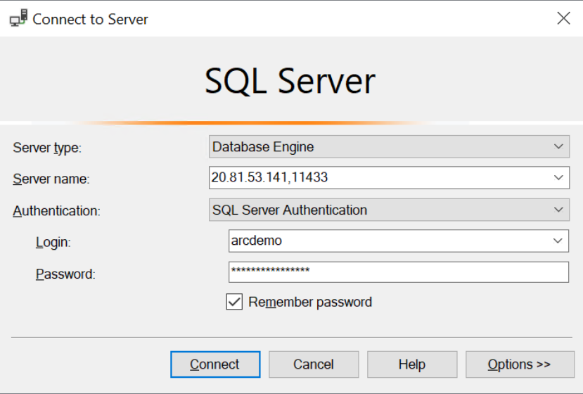

    

- Follow the same process and connect to the secondary endpoint.

    

    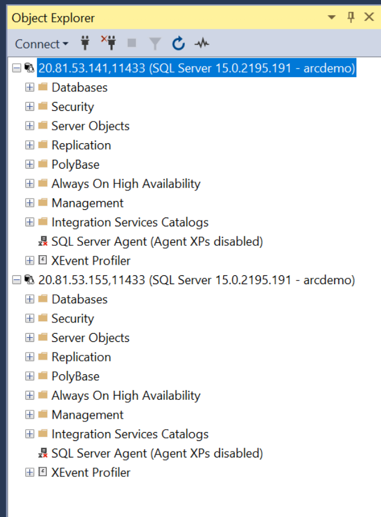

- On both endpoints, expand the "Databases" and the "Always On High Availability" sections and see how the _AdventureWorks2019_ database is already automatically replicated and is part of the availability group.

    

- To test that the DB replication is working, a simple table modification is needed. For this example, on the primary replica, expand the "Tables" section for the database, select the _"HumanResources.Employee"_ table, click on "Edit Top 200 Rows", modify one or more records and commit the changes by saving (_`Ctrl+S`_). As you can see, in this example a change was made to _"ken0"_ title and the number of vacation hours for _"rob0"_.

    

    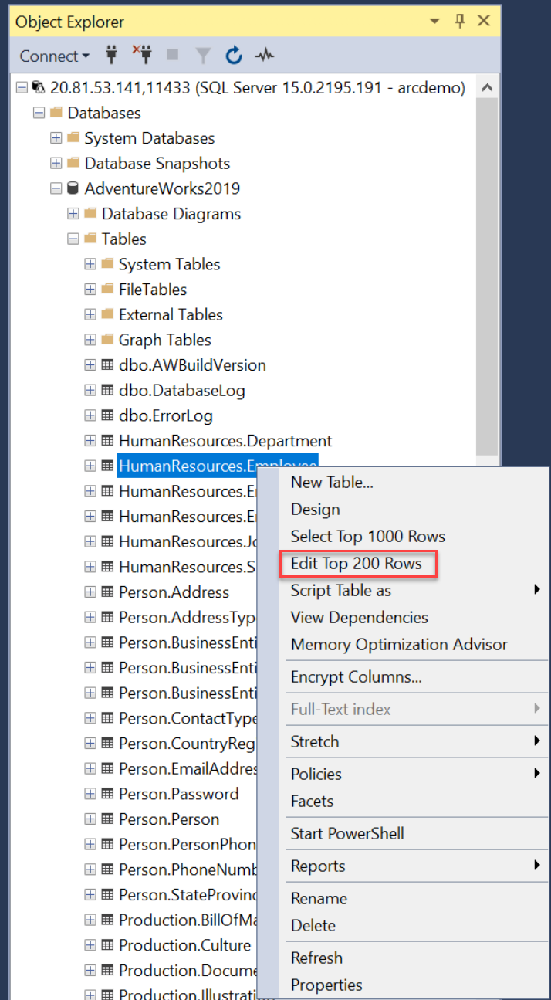

    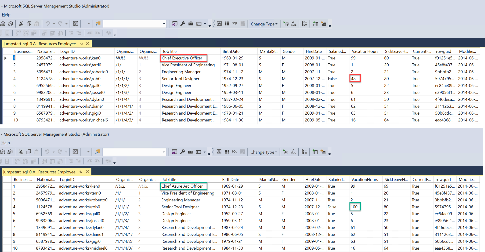

- On the secondary replica, expand the "Tables" section for the database, click on "Select Top 1000 Rows", and in the Results pane see how the table change is now replicated, showing the synchronization of the SQL instances in the availability group works as expected.

    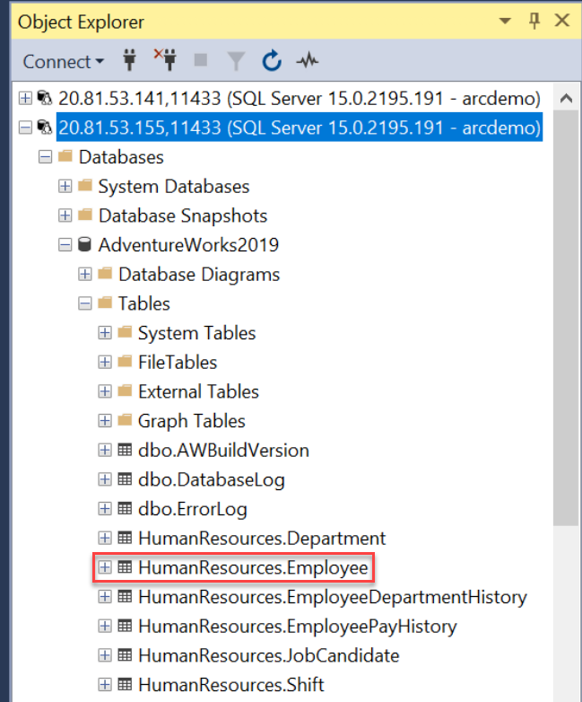

    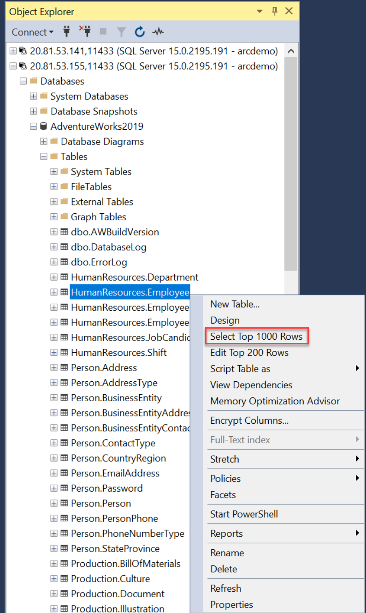

    

## Database Failover

As you already know, the availability group includes three Kubernetes replicas with a primary and two secondaries with all CRUD operations for the availability group are managed internally, including creating the availability group or joining replicas to the availability group created.

- To test that failover between the replicas, we will simulate a "crash" that will trigger an HA event and will force one of the secondary replicas to get promoted to a primary replica. Open two side-by-side PowerShell sessions. On the left side session, use the _`kubectl get pods -n arc`_ to review the deployed pods. The right-side session will be used to monitor the pods on the cluster using the _`kubectl get pods -n arc -w`_ command. As you can see, three SQL replicas with four containers each are running.

    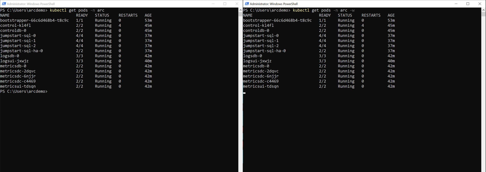

- In SSMS, you can also see that _jumpstart-sql-0_ is acting as the primary replica and _jumpstart-sql-1_ and _jumpstart-sql-2_ are the secondary. At this point, close SSMS.

    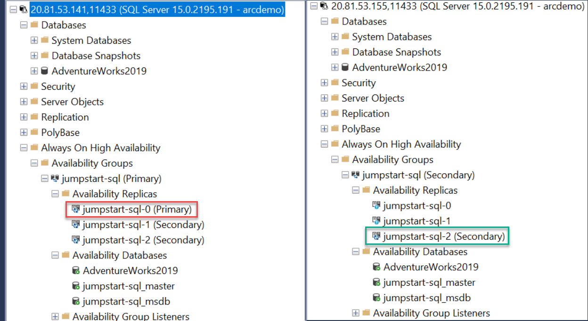

- To trigger the HA event, delete the primary replica _jumpstart-sql-0_ using the _`kubectl delete pod jumpstart-sql-0 -n arc`_ and watch how the pod gets deleted and then being deployed again due to being part of a Kubernetes _ReplicaSet_. Wait for the _jumpstart-sql-0_ pod to become ready again (and an additional few minutes for letting the availability group to recover).

    

- Re-open SSMS and connect back to previous *secondary* endpoint. You can now see that _jumpstart-sql-0_ and _jumpstart-sql-2_ are now acting as the secondary replica and _jumpstart-sql-1_ was promoted to primary. In addition, run the _`az sql mi-arc show -n jumpstart-sql --k8s-namespace arc --use-k8s`_ command again and check the health status of the availability group.

    > **Note: It might take a few minutes for the availability group to return to an healthy state.**

    

    

## Re-Validating Database Replication

- Now that we perform a successful failover, we can re-validate and make sure replication still works as expected. In SSMS, re-add the second instance.

    

- In the primary endpoint connection, repeat the process of performing a change on the _AdventureWorks2019_ database _"HumanResources.Employee"_ table and check that replication is working In the example below, you can see how new values in new rows are now replicated.

    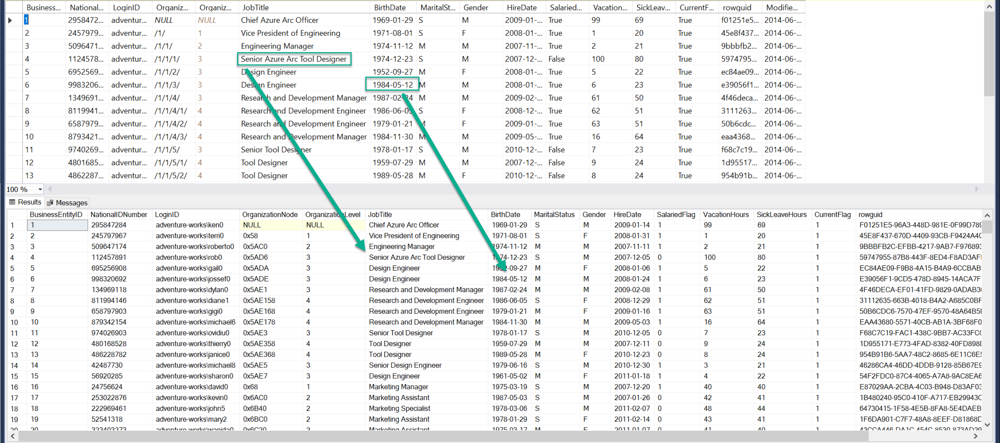
