## Deploy an Azure Arc Data Controller (Vanilla) on EKS using Terraform

The following README will guide you on how to deploy a "Ready to Go" environment so you can start using Azure Arc Data Services and deploy Azure data services on [Elastic Kubernetes Service (EKS)](https://aws.amazon.com/eks/) cluster, using [Terraform](https://www.terraform.io/).

By the end of this guide, you will have an EKS cluster deployed with an Azure Arc Data Controller and a Microsoft Windows Server 2019 (Datacenter) AWS EC2 instance VM, installed & pre-configured with all the required tools needed to work with Azure Arc Data Services.

> **Note: Currently, Azure Arc enabled data services is in [public preview](https://docs.microsoft.com/en-us/azure/azure-arc/data/release-notes)**.

## Deployment Process Overview

* Create AWS IAM Role
* Create & download AWS Key Pair
* Clone the Azure Arc Jumpstart repository
* Edit *TF_VAR* variables values
* *terraform init*
* *terraform apply*
* EKS cleanup
* *terraform destroy*

## Prerequisites

* Clone the Azure Arc Jumpstart repository

  ```shell
  git clone https://github.com/microsoft/azure_arc.git
  ```

* [Install AWS IAM Authenticator](https://docs.aws.amazon.com/eks/latest/userguide/install-aws-iam-authenticator.html)

* [Install or update Azure CLI to version 2.15.0 and above](https://docs.microsoft.com/en-us/cli/azure/install-azure-cli?view=azure-cli-latest). Use the below command to check your current installed version.

  ```shell
  az --version
  ```

* [Create a free Amazon Web Services account](https://aws.amazon.com/free/) if you don't already have one.

* [Install Terraform >=0.12](https://learn.hashicorp.com/terraform/getting-started/install.html)

* Create Azure service principal (SP)

  To be able to complete the scenario and its related automation, Azure service principal assigned with the “Contributor” role is required. To create it, login to your Azure account run the below command (this can also be done in [Azure Cloud Shell](https://shell.azure.com/)).

  ```shell
  az login
  az ad sp create-for-rbac -n "<Unique SP Name>" --role contributor
  ```

  For example:

  ```shell
  az ad sp create-for-rbac -n "http://AzureArcK8s" --role contributor
  ```

  Output should look like this

  ```json
  {
  "appId": "XXXXXXXXXXXXXXXXXXXXXXXXXXXX",
  "displayName": "AzureArcK8s",
  "name": "http://AzureArcK8s",
  "password": "XXXXXXXXXXXXXXXXXXXXXXXXXXXX",
  "tenant": "XXXXXXXXXXXXXXXXXXXXXXXXXXXX"
  }
  ```

  > **Note: It is optional but highly recommended to scope the SP to a specific [Azure subscription and resource group](https://docs.microsoft.com/en-us/cli/azure/ad/sp?view=azure-cli-latest)**

* Enable subscription for the *Microsoft.AzureArcData* resource provider for Azure Arc enabled data services. Registration is an asynchronous process, and registration may take approximately 10 minutes.

  ```shell
  az provider register --namespace Microsoft.AzureArcData
  ```

  You can monitor the registration process with the following commands:

  ```shell
  az provider show -n Microsoft.AzureArcData -o table
  ```

## Create a new AWS IAM Role & Key

Create AWS User IAM Key. An access key grants programmatic access to your resources which we will be using later on in this guide.

* Navigate to the [IAM Access page](https://console.aws.amazon.com/iam/home#/home).

    

* Select the **Users** from the side menu.

    

* Select the **User** you want to create the access key for.

    

* Select **Security credentials** of the **User** selected.

    

* Under **Access Keys** select **Create Access Keys**.

    

* In the popup window it will show you the ***Access key ID*** and ***Secret access key***. Save both of these values to configure the **Terraform plan** variables later.

    

* In order to open a RDP session to the Windows Client EC2 instance, an EC2 Key Pair is required. From the *Services* menu, click on *"EC2"*, enter the *Key Pairs* settings from the left sidebar (under the *Network & Security* section) and click on *"Create key pair"* (top-right corner) to create a new key pair.

  

  

  

* Provide a meaningful name, for example *terraform*, and click on *"Create key pair"* which will then automatically download the created *pem* file.

  

  

  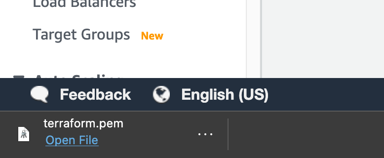

* Copy the downloaded *pem* file to where the terraform binaries are located (in your cloned repository directory).

  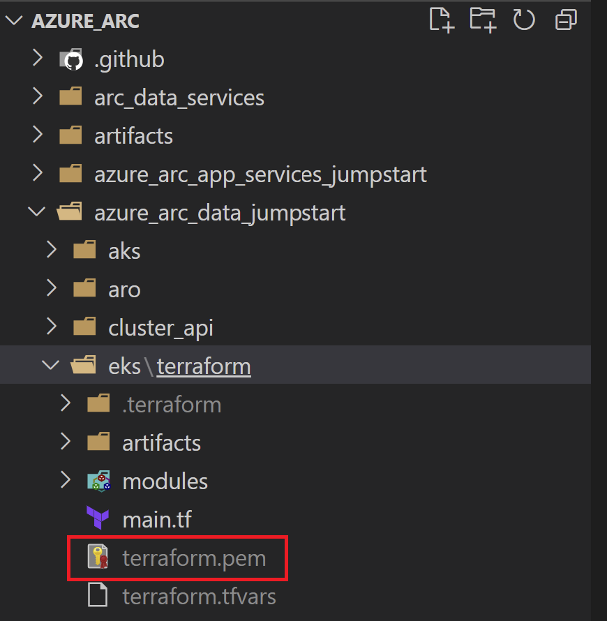

  > **Note: EC2 Key Pairs are regional.**

## Automation Flow

For you to get familiar with the automation and deployment flow, below is an explanation.

* User is editing and exporting Terraform runtime environment variables, AKA *TF_VAR* (1-time edit). The variables values are being used throughout the deployment.

* User deploys the Terraform plan which will deploy the EKS cluster and the EC2 Windows Client instance as well as an Azure resource group. The Azure resource group is required to host the Azure Arc services you will be able to deploy such as Azure SQL Managed Instance and PostgreSQL Hyperscale.

* In addition, the plan will copy the EKS *kubeconfig* file as well as the *configmap.yml* file (which is responsible for having the EKS nodes communicate with the cluster control plane) on to the Windows instance.

* As part of the Windows Server 2019 VM deployment, there are 3 scripts executions:

  1. *azure_arc.ps1* script will be created automatically as part of the Terraform plan runtime and is responsible on injecting the *TF_VAR* variables values on to the Windows instance which will then be used in both the *ClientTools* and the *LogonScript* scripts.

  2. *ClientTools.ps1* script will run at the Terraform plan runtime Runtime and will:
      * Create the *ClientTools.log* file  
      * Install the required tools – az cli, az cli Powershell module, kubernetes-cli, aws-iam-authenticator, Visual C++ Redistributable (Chocolaty packages)
      * Download Azure Data Studio & Azure Data CLI
      * Download the *DC_Cleanup* and *DC_Deploy* Powershell scripts
      * Create the logon script
      * Create the Windows schedule task to run the logon script at first login

  3. *LogonScript.ps1* script will run on user first logon to Windows and will:
      * Create the *LogonScript.log* file
      * Install Azure Data Studio & Azure Data CLI
      * Install the Azure Data Studio Azure Data CLI, Azure Arc & PostgreSQL extensions
      * Apply the *configmap.yml* file on the EKS cluster
      * Create the *azdata* config file in user Windows profile
      * Create the Azure Data Studio desktop shortcut
      * Open another Powershell session which will execute a command to watch the deployed Azure Arc Data Controller Kubernetes pods
      * Deploy the Arc Data Controller using the *TF_VAR* variables values
      * Unregister the logon script Windows schedule task so it will not run after first login

## Deployment

As mentioned, the Terraform plan will deploy an EKS cluster, the Azure Arc Data Controller on that cluster and an EC2 Windows Server 2019 Client instance.

* Before running the Terraform plan, edit the below *TF_VAR* values and export it (simply copy/paste it after you finished edit these). An example *TF_VAR* shell script file is located [here](https://github.com/microsoft/azure_arc/blob/main/azure_arc_data_jumpstart/eks/dc_vanilla/terraform/example/TF_VAR_example.sh)

  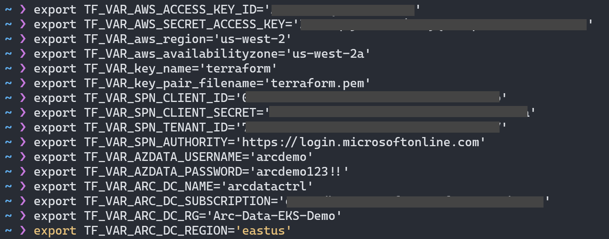

  * *export TF_VAR_AWS_ACCESS_KEY_ID*='Your AWS Access Key ID (Created in the prerequisites section)'
  * *export TF_VAR_AWS_SECRET_ACCESS_KEY*='Your AWS Secret Key (Created in the prerequisites section)'
  * *export TF_VAR_key_name*='Your AWS Key Pair name (Created in the prerequisites section)'
  * *export TF_VAR_key_pair_filename*='Your AWS Key Pair *.pem filename (Created in the prerequisites section)'
  * *export TF_VAR_aws_region*='Your AWS region where resources will get deployed' (Since key pairs are regional, make sure both AWS region and availability zone matches the ones where the key pair was created)
  * *export TF_VAR_aws_availabilityzone*='Your AWS availability zone' (Since key pairs are regional, make sure both AWS region and availability zone matches the ones where the key pair was created)
  * *export TF_VAR_SPN_CLIENT_ID*='Your Azure service principal name'
  * *export TF_VAR_SPN_CLIENT_SECRET*='Your Azure service principal password'
  * *export TF_VAR_SPN_TENANT_ID*='Your Azure tenant ID'
  * *export TF_VAR_SPN_AUTHORITY*=*https://login.microsoftonline.com* **Do not change**
  * *export TF_VAR_AZDATA_USERNAME*='Azure Arc Data Controller admin username'
  * *export TF_VAR_AZDATA_PASSWORD*='Azure Arc Data Controller admin password' (The password must be at least 8 characters long and contain characters from three of the following four sets: uppercase letters, lowercase letters, numbers, and symbols)
  * *export TF_VAR_ARC_DC_NAME*='Azure Arc Data Controller name' (The name must consist of lowercase alphanumeric characters or '-', and must start and end with a alphanumeric character. This name will be used for k8s namespace as well)
  * *export TF_VAR_ARC_DC_SUBSCRIPTION*='Azure Arc Data Controller Azure subscription ID'
  * *export TF_VAR_ARC_DC_RG*='Azure resource group where all future Azure Arc resources will be deployed'
  * *export TF_VAR_ARC_DC_REGION*='Azure location where the Azure Arc Data Controller resource will be created in Azure' (Currently, supported regions supported are eastus, eastus2, centralus, westus2, westeurope, southeastasia)

    > **Note: If you are running in a PowerShell environment, to set the Terraform environment variables, use the _Set-Item -Path env:_ prefix (see example below)**

    ```powershell
    Set-Item -Path env:TF_VAR_AWS_ACCESS_KEY_ID
    ```

* Navigate to the folder that has Terraform binaries.

  ```shell
  cd azure_arc_data_jumpstart/eks/dc_vanilla/terraform
  ```

* Run the ```terraform init``` command which is used to initialize a working directory containing Terraform configuration files and load the required Terraform providers.

  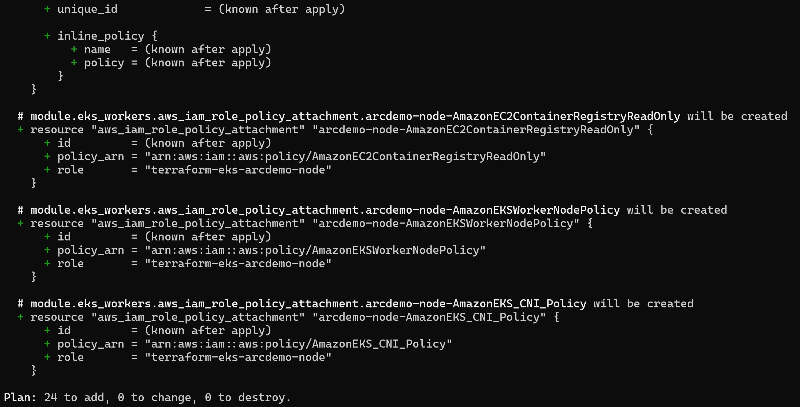

* (Optional but recommended) Run the ```terraform plan``` command to make sure everything is configured properly.

  

* Run the ```terraform apply --auto-approve``` command and wait for the plan to finish. **Runtime for deploying all the AWS resources for this plan is ~30min.**

* Once completed, the plan will output a decrypted password for your Windows Client instance. Before connecting to the Client instance, you can review the EKS cluster and the EC2 instances created. Notice how 3 instances were created; 2 EKS nodes and the Client instance.

  

  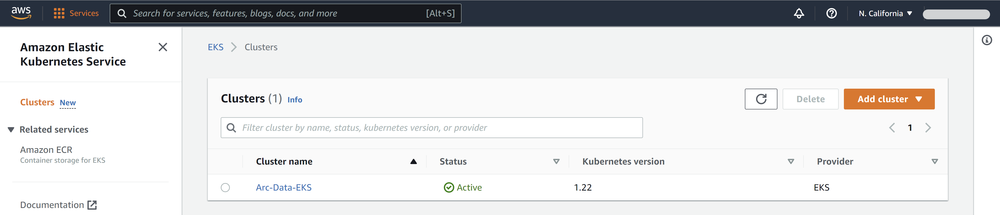

  

  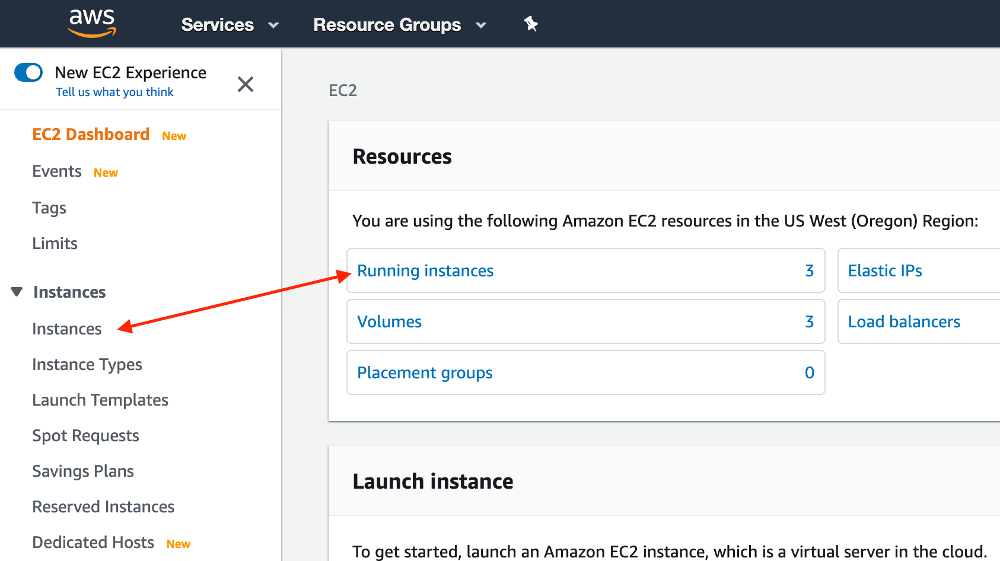

  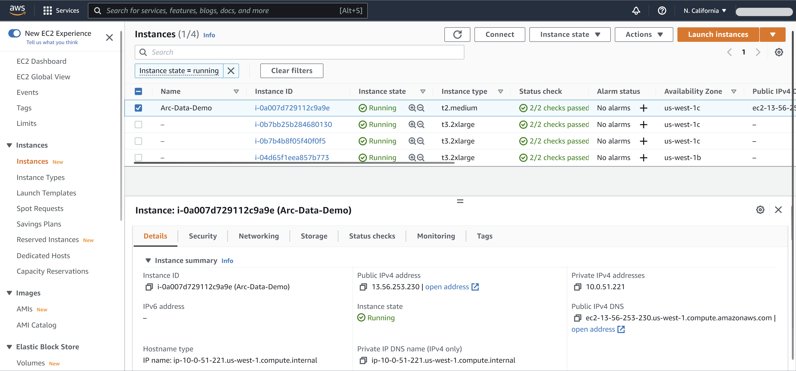

  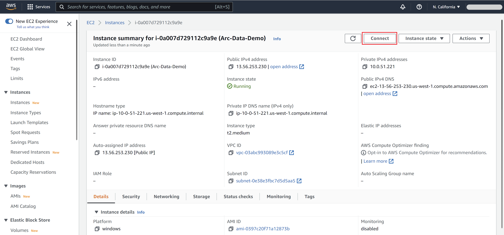

* In the Azure Portal, a new empty Azure resource group was created which will be used for Azure Arc Data Controller and the other data services you will be deploying in the future.

  

## Windows Login & Post Deployment

Now that we have both the EKS cluster and the Windows Server Client instance created, it is time to login to the Client VM.

* Select the Windows instance, click *"Connect"* and download the Remote Desktop file.

  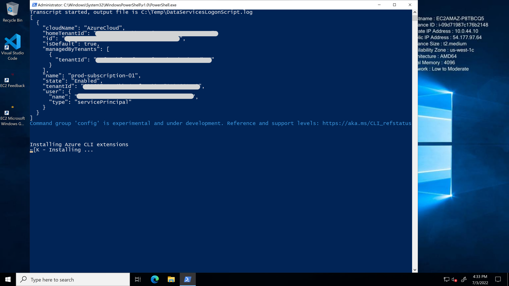

  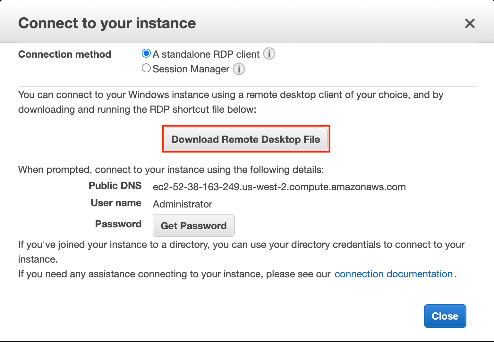

  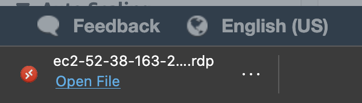

* Using the decrypted password, RDP the Windows instance. In case you need to get the password later, use the ```terraform output``` command to re-present the plan output.

* At first login, as mentioned in the "Automation Flow" section, a logon script will get executed. This script was created as part of the automated deployment process.

* Let the script to run it's course and **do not close** the PowerShell session, this will be done for you once completed. You will notice that the Azure Arc Data Controller gets deployed on the EKS cluster. **The logon script run time is approximately 10min long**.

    Once the script will finish it's run, the logon script PowerShell session will be close and the Azure Arc Data Controller will be deployed on the EKS cluster and be ready to use.

    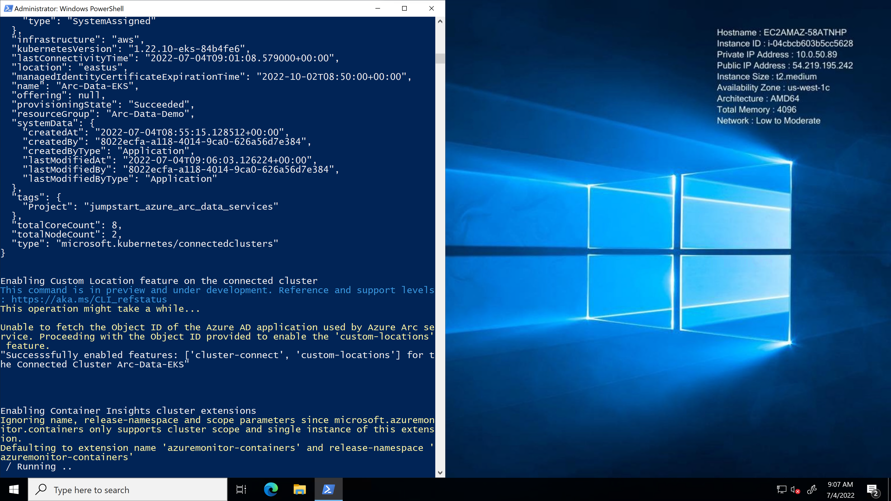

    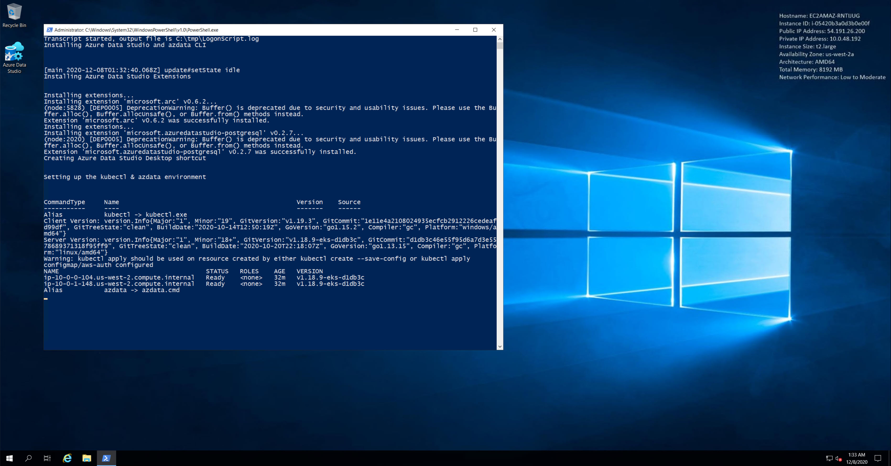

    

    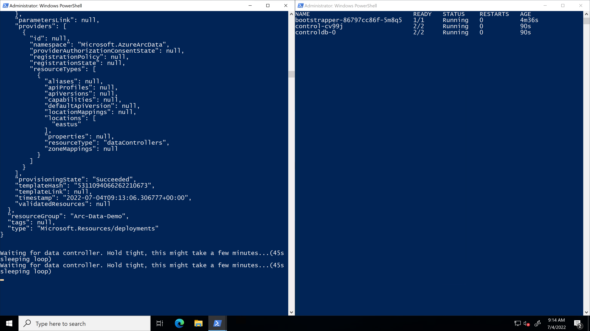

    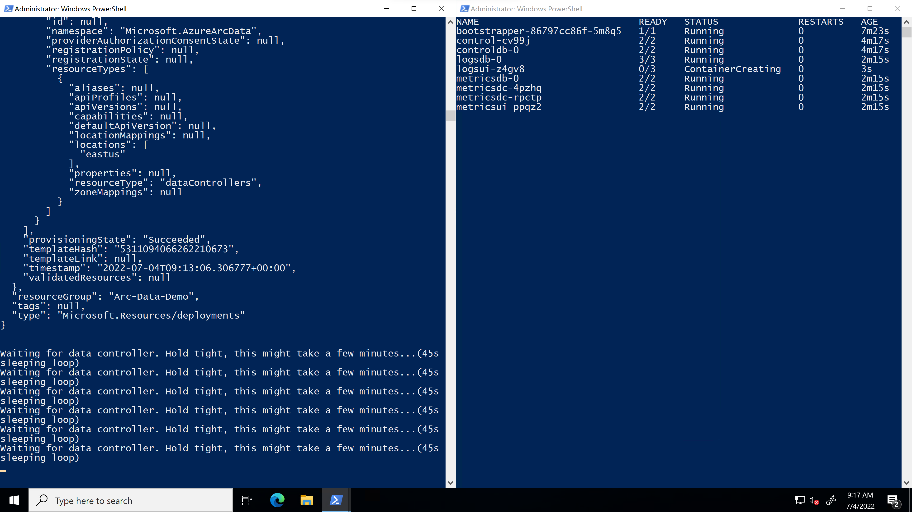

    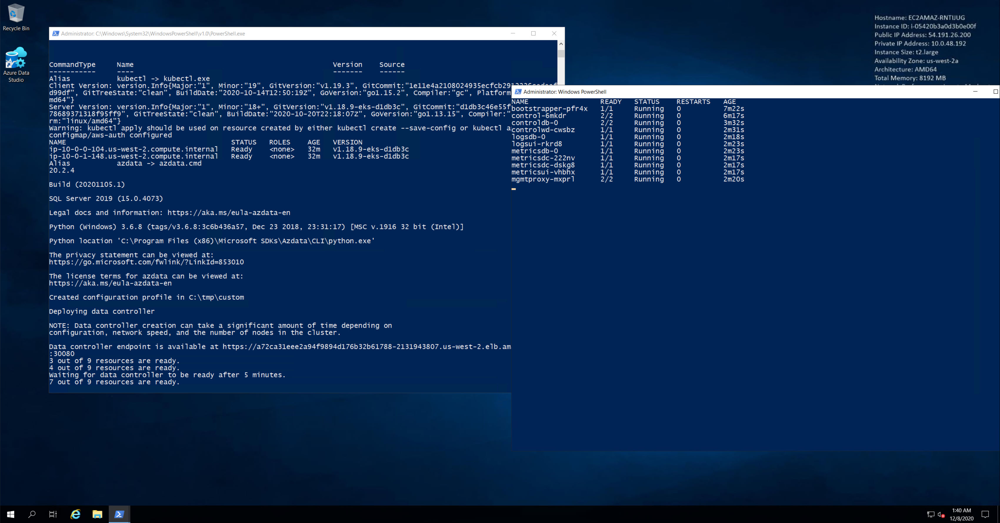

  > **Note: Currently, Azure Arc enabled data services is in [public preview](https://docs.microsoft.com/en-us/azure/azure-arc/data/release-notes) and features are subject to change. As such, the release being used in this scenario does not support the projection of Azure Arc data services resources in the Azure portal**.

    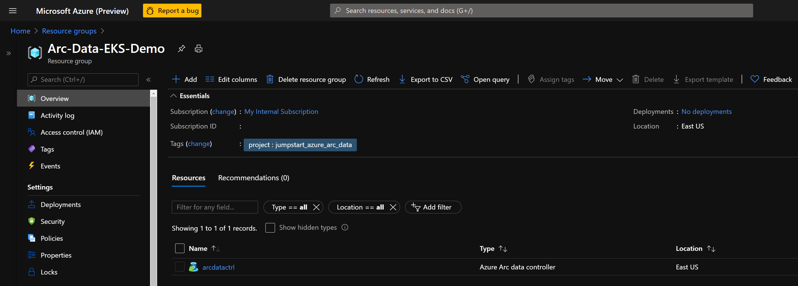

    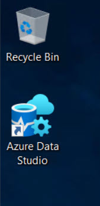

* Using PowerShell, login to the Data Controller and check it's health using the below commands.

  ```shell
  azdata login --namespace $env:ARC_DC_NAME
  azdata arc dc status show
  ```

  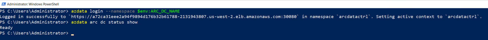

* Another tool automatically deployed is Azure Data Studio along with the *Azure Data CLI*, the *Azure Arc* and the *PostgreSQL* extensions. Using the Desktop shortcut created for you, open Azure Data Studio and click the Extensions settings to see both extensions.

  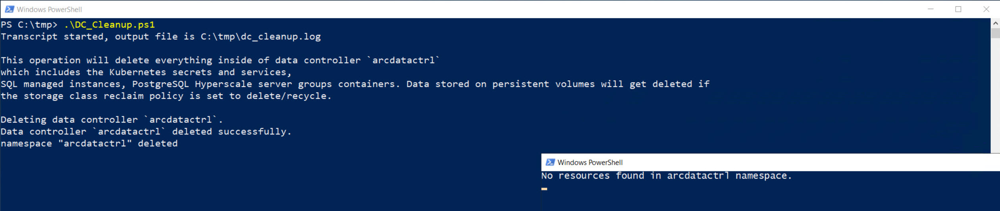

  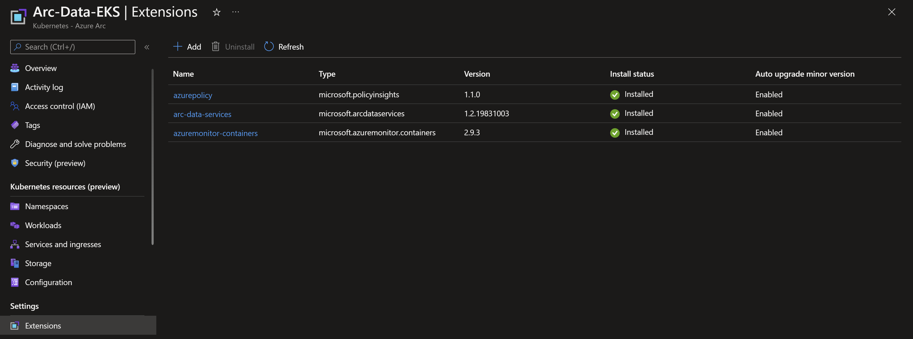

## Cleanup

* To delete the Azure Arc Data Controller and all of it's Kubernetes resources, run the *DC_Cleanup.ps1* PowerShell script located in *C:\tmp* on the Windows Client instance. At the end of it's run, the script will close all PowerShell sessions. **The Cleanup script run time is ~2-3min long**.

  

## Re-Deploy Azure Arc Data Controller

* In case you deleted the Azure Arc Data Controller from the EKS cluster, you can re-deploy it by running the *DC_Deploy.ps1* PowerShell script located in *C:\tmp* on the Windows Client instance. **The Deploy script run time is approximately ~3-4min long**.

  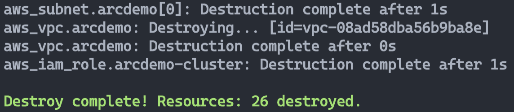

## Delete the deployment

To completely delete the environment, follow the below steps:

* on the Windows Client instance, run the *DC_Cleanup.ps1* PowerShell script.

* Run the ```terraform destroy --auto-approve``` which will delete all of the AWS resources as well as the Azure resource group. **The *terraform destroy* run time is approximately ~5-10min long**.

  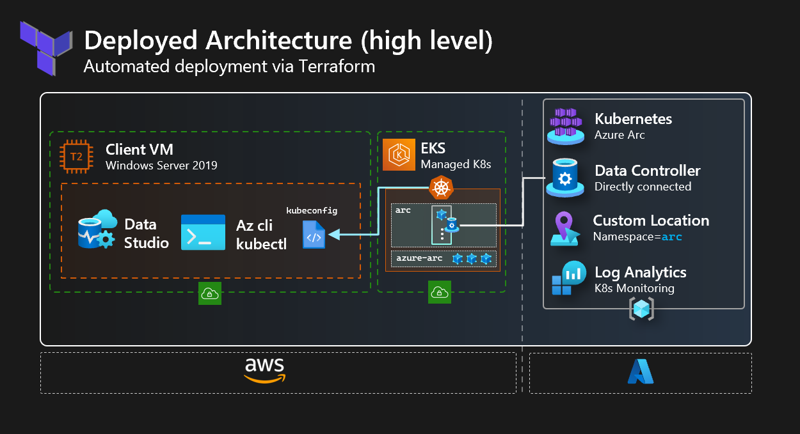
